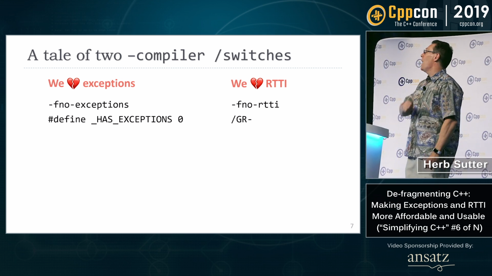
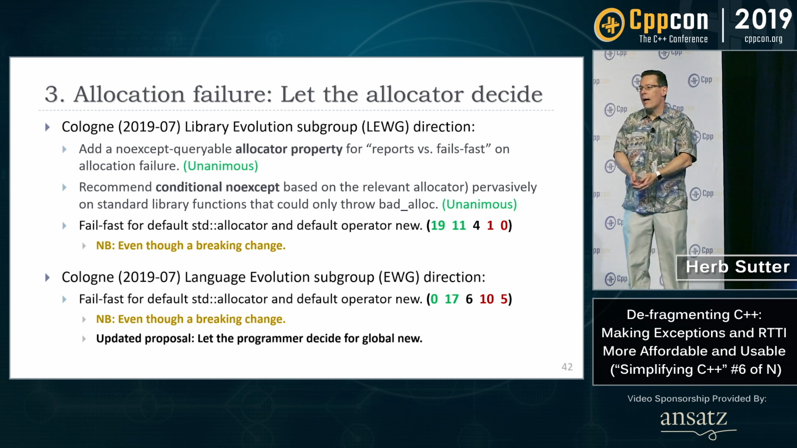
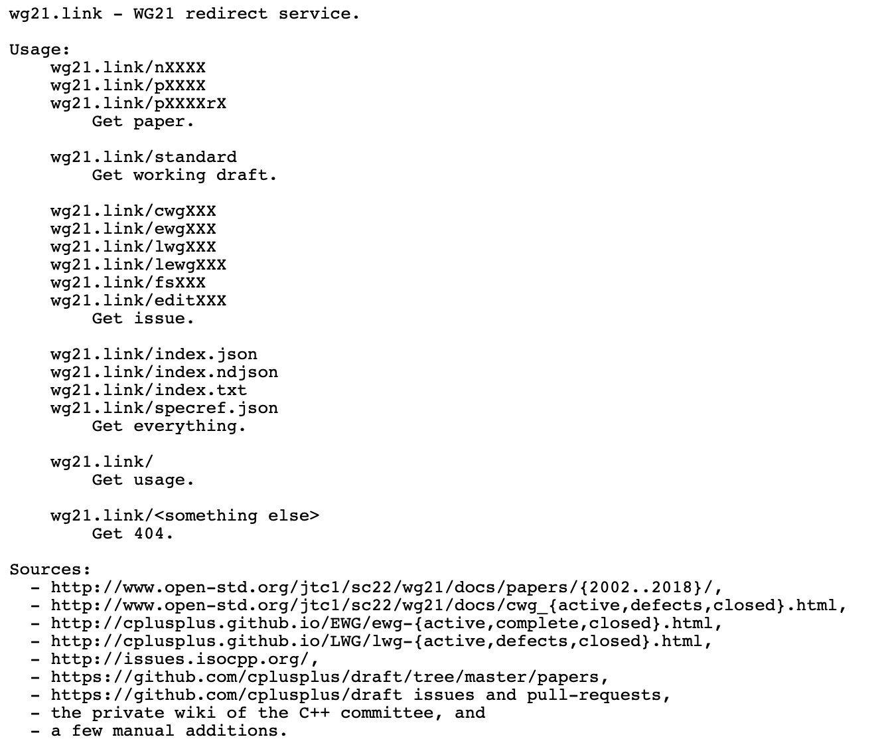

----

CppCon 2019 Trip Reports
========================

* `Matt Godbolt <https://xania.org/201909/cppcon-2019-trip-report>`_

CppCon 2019: Herb Sutter “De-fragmenting C++: Making Exceptions and RTTI More Affordable and Usable”
====================================================================================================

* Video: https://youtu.be/ARYP83yNAWk
  * Reddit: https://www.reddit.com/r/cpp/comments/d87plg/cppcon_2019_herb_sutter_defragmenting_c_making/

CppCon 2019: Herb Sutter “De-fragmenting C++: Making Exceptions and RTTI More Affordable and Usable”
====================================================================================================

CppCon 2019: Herb Sutter “De-fragmenting C++: Making Exceptions and RTTI More Affordable and Usable”
====================================================================================================

CppCon 2019: Herb Sutter “De-fragmenting C++: Making Exceptions and RTTI More Affordable and Usable”
====================================================================================================

.. image:: img/sutter-defrag-cpp19-3.png

CppCon 2019: Herb Sutter “De-fragmenting C++: Making Exceptions and RTTI More Affordable and Usable”
====================================================================================================

.. image:: img/sutter-defrag-cpp19-4.png

CppCon 2019: Herb Sutter “De-fragmenting C++: Making Exceptions and RTTI More Affordable and Usable”
====================================================================================================

.. image:: img/sutter-defrag-cpp19-5.png

CppCon 2019: Herb Sutter “De-fragmenting C++: Making Exceptions and RTTI More Affordable and Usable”
====================================================================================================

.. image:: img/sutter-defrag-cpp19-6.png

CppCon 2019: Herb Sutter “De-fragmenting C++: Making Exceptions and RTTI More Affordable and Usable”
====================================================================================================

.. image:: img/sutter-defrag-cpp19-7.png

CppCon 2019: Herb Sutter “De-fragmenting C++: Making Exceptions and RTTI More Affordable and Usable”
====================================================================================================

.. image:: img/sutter-defrag-cpp19-8.png

CppCon 2019: Herb Sutter “De-fragmenting C++: Making Exceptions and RTTI More Affordable and Usable”
====================================================================================================

.. image:: img/sutter-defrag-cpp19-9.png

CppCon 2019: Herb Sutter “De-fragmenting C++: Making Exceptions and RTTI More Affordable and Usable”
====================================================================================================

.. image:: img/sutter-defrag-cpp19-10.png

CppCon 2019: Herb Sutter “De-fragmenting C++: Making Exceptions and RTTI More Affordable and Usable”
====================================================================================================

.. image:: img/sutter-defrag-cpp19-11.png

CppCon 2019: Herb Sutter “De-fragmenting C++: Making Exceptions and RTTI More Affordable and Usable”
====================================================================================================

.. image:: img/sutter-defrag-cpp19-12.png

CppCon 2019: Herb Sutter “De-fragmenting C++: Making Exceptions and RTTI More Affordable and Usable”
====================================================================================================

CppCon 2019: Herb Sutter “De-fragmenting C++: Making Exceptions and RTTI More Affordable and Usable”
====================================================================================================

.. image:: img/sutter-defrag-cpp19-14.png

Arthur O'Dwyer "Thoughts on Herb Sutter’s CppCon keynote"
=========================================================

https://quuxplusone.github.io/blog/2019/09/24/thoughts-on-eh/

Reddit: https://www.reddit.com/r/cpp/comments/d8p08f/thoughts_on_herb_sutters_cppcon_keynote/

Twitter
=======

.. image:: img/tvaneerd-try-catch-opt.png
   :width: 90%

Cologne Trip Report
===================

https://www.silexica.com/news/iso_cpp_meeting_2019/

* `P1413, Deprecate std::aligned_storage and std::aligned_union <http://www.open-std.org/jtc1/sc22/wg21/docs/papers/2019/p1413r1.pdf>`_
* `P1609, C++ Should Support Just-in-Time Compilation <https://wg21.link/p1609>`_
* `P1727, Issues with current flat_map proposal <http://wg21.link/p1727r0>`_
* `P0443r10, A Unified Executors Proposal for C++ <http://wg21.link/p0443r10>`_
* `P1660r0, A Compromise Executor Design Sketch <http://wg21.link/p1660r0>`_
* `“C++ Tooling Ecosystem” Technical Report <https://wg21.link/P1688>`_
* `P1679r0, String Contains function <http://wg21.link/p1679r0>`_

wg21.link cheatsheet
====================

Address Sanitizer is coming to MSVC
===================================

https://www.reddit.com/r/cpp/comments/d6k7mt/address_sanitizer_is_coming_to_msvc/

Span Lite
=========

https://github.com/martinmoene/span-lite

A C++20-like span for C++98, C++11 and later in a single-file header-only library.

mdspan
======

* Implementation https://github.com/kokkos/mdspan (BSD 3-Clause)
  * Intro https://github.com/kokkos/mdspan/wiki/A-Gentle-Introduction-to-mdspan
  * r/cpp https://www.reddit.com/r/cpp/comments/cl127i/mdspan_productionquality_reference_implementation/
* Kokkos https://github.com/kokkos/kokkos
* Multi-dimensional strided array views in Magnum
  https://blog.magnum.graphics/backstage/multidimensional-strided-array-views/
* P0009R9 **mdspan**: A Non-Owning Multidimensional Array Reference http://wg21.link/p0009r9
* CppCast with Bryce Adelstein Lelbach https://cppcast.com/bryce-lelbach-mdspan/

Enums, warnings, and default
============================

https://brevzin.github.io/c++/2019/08/01/enums-default/

https://www.reddit.com/r/cpp/comments/cubah9/enum_switch_warnings/

GCC & Clang:

.. code:: bash

    -Wswitch-enum

Machine Learning with C++
=========================

`Reddit <https://www.reddit.com/r/cpp/comments/cjrrwm/machine_learning_with_cpp/>`_

* PyTorch https://pytorch.org/features -- has a pure C++ front end https://pytorch.org/cppdocs/
* TensorFlow for C++ https://www.tensorflow.org/api_docs/cc
* Shogun https://www.shogun.ml/

The sad history of Unicode printf-style format specifiers in Visual C++
=======================================================================

https://devblogs.microsoft.com/oldnewthing/20190830-00/?p=102823

* `Reddit <https://www.reddit.com/r/cpp/comments/cxi2xy/the_sad_history_of_unicode_printfstyle_format/>`_

Introducing Magnum Python Bindings
==================================

https://blog.magnum.graphics/announcements/introducing-python-bindings/

https://github.com/pybind/pybind11

Are there any memory safety libraries for C++?
==============================================

https://www.reddit.com/r/cpp/comments/d0hguz/are_there_any_memory_safety_libraries_for_c/

https://github.com/duneroadrunner/SaferCPlusPlus/

https://github.com/deplinenoise/ig-memtrace

    MemTrace is a memory debugging tool developed internally at Insomniac Games.

https://github.com/ivmai/bdwgc

    The Boehm-Demers-Weiser conservative C/C++ Garbage Collector (libgc, bdwgc, boehm-gc) https://www.hboehm.info/gc/

AnyDuck : A Value Type Erased Type
==================================

Steve Downey: https://www.sdowney.org/2019/07/anyduck-a-value-type-erased-type/

Template meta-programming: Some testing and debugging tricks
============================================================

https://cukic.co/2019/02/19/tmp-testing-and-debugging-templates/

**using** vs. **typedef**
=========================

https://www.nextptr.com/tutorial/ta1193988140/how-cplusplus-using-or-aliasdeclaration-is-better-than-typedef

Berkeley Container Library (BCL)
================================

https://github.com/berkeley-container-library/bcl

Quote
=====

Fred Brooks:

    Much of the essence of building a program is in fact the debugging of the specification.
