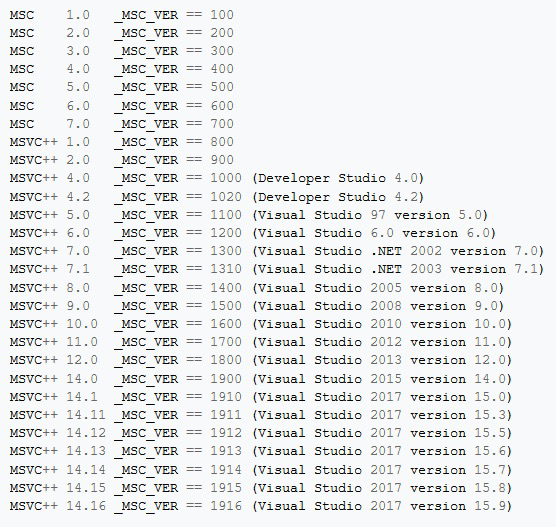

----

2019-10 Pre-Belfast Mailing
===========================

`Mailing <http://www.open-std.org/jtc1/sc22/wg21/docs/papers/2019>`_

* `Proposal of std::upto, std::indices and std::enumerate <http://www.open-std.org/jtc1/sc22/wg21/docs/papers/2019/p1894r0.pdf>`_
* `A Unified Executors Proposal for C++ <http://www.open-std.org/jtc1/sc22/wg21/docs/papers/2019/p0443r11.html>`_

https://www.reddit.com/r/cpp/comments/dhm138/wg21_the_201910_mailing_is_now_available/

* `Oh boy (RX) <https://www.reddit.com/r/cpp/comments/dhm138/wg21_the_201910_mailing_is_now_available/f3p77u9/>`_ and `doubling down <https://www.reddit.com/r/cpp/comments/dhm138/wg21_the_201910_mailing_is_now_available/f3qamcy/>`_
* `Oh boy (Graphics) <https://www.reddit.com/r/cpp/comments/dhm138/wg21_the_201910_mailing_is_now_available/f3pts6p/>`_

Eric Niebler on Executors
=========================

`Corentin <https://twitter.com/Cor3ntin/status/1186040861626437632>`_: Executors are the least
useful part of "A Unified Executors Proposal"

`Eric Niebler <https://twitter.com/ericniebler/status/1186343156326887425>`_:

It makes me happy to see the power of the Scheduler/Sender/Receiver recognized.

Much of traditional Rx assumes runtime polymorphism and garbage collection / ref counting. That's
obviously a poor fit for C++. The sender/receiver design skews toward static polymorphism w/Generic
interfaces, and explicit memory mgmt.

Eric Niebler on Executors (cont.)
=================================

The factoring of `submit` into `connect`/`start` gives more flexible ownership semantics, and aligns
the design conceptually with coroutines, making coroutines an efficient way of expressing
sender/receiver.

Once you introduce concurrency with non-overlapping scopes, the lifetime of your async operation
state no longer corresponds to a simple C++ scope. That's why explicit memory mgmt and ownership
become issues where they wouldn't be otherwise.

Eric Niebler on Executors (cont.)
=================================

One of coroutines great strengths is that they let us map async lifetime back to C++ scopes. Under
the hood, the coroutine is carved up into callbacks, and the operation state (coroutine frame) is
getting managed explicitly, but all that gets hidden from you by the coro types.

Sender/receiver is a library reification of this separation. You might argue (and some have) that we
should just drop sender/receiver and use coroutines everywhere for everything "async". That's
appealing, but goes too far. Coroutines, for all their value, come up short sometimes.

Eric Niebler on Executors (cont.)
=================================

C++ has a long sad history of giving old things new names. Map and fold would have been better than
transform and accumulate, and don't get me started on vector. Sender/receiver share some pedigree
with Observable/Observer, but they really are different beasts ... by necessity.

The intended purpose of sender/receiver is to be a base lingua franca for all C++ async libraries. I
expect end-users to interface at much higher levels of abstraction in their own code.

Coro Examples, by Arthur O'Dwyer
================================

https://quuxplusone.github.io/blog/2019/07/03/announcing-coro-examples/

https://github.com/Quuxplusone/coro

wg21.link cheatsheet
====================

.. image:: img/wg_link_cheatsheet.png
   :width: 90%

Address Sanitizer in MSVC
=========================

https://devblogs.microsoft.com/cppblog/addresssanitizer-asan-for-windows-with-msvc/

https://www.reddit.com/r/cpp/comments/d6k7mt/address_sanitizer_is_coming_to_msvc/

https://www.reddit.com/r/cpp/comments/dm1emb/addresssanitizer_asan_for_windows_with_msvc/

Are there any memory safety libraries for C++?
==============================================

https://www.reddit.com/r/cpp/comments/d0hguz/are_there_any_memory_safety_libraries_for_c/

https://github.com/duneroadrunner/SaferCPlusPlus/

https://github.com/deplinenoise/ig-memtrace

    MemTrace is a memory debugging tool developed internally at Insomniac Games.

https://github.com/ivmai/bdwgc

    The Boehm-Demers-Weiser conservative C/C++ Garbage Collector (libgc, bdwgc, boehm-gc)
    https://www.hboehm.info/gc/

MSVC versions are crazy
=======================

Pitchfork
=========

A de-facto standard C++ project layout, by Colby Pike <vectorofbool@gmail.com>

* `Reddit post 1 <https://www.reddit.com/r/cpp/comments/996q8o/prepare_thy_pitchforks_a_de_facto_standard/>`_
* `Reddit post 2 <https://www.reddit.com/r/cpp/comments/9eq46c/pitchforks_part_ii_project_layout_and_naming/>`_
* `Pitchfork GitHub repo <https://github.com/vector-of-bool/pitchfork>`_
* `Pre-paper <https://api.csswg.org/bikeshed/?force=1&url=https://raw.githubusercontent.com/vector-of-bool/pitchfork/develop/data/spec.bs>`_
* `Bloomberg BDE physical code organization <https://github.com/bloomberg/bde/wiki/Physical-Code-Organization>`_

Closing the gap: cross-language LTO between Rust and C/C++
==========================================================

http://blog.llvm.org/2019/09/closing-gap-cross-language-lto-between.html

`Reddit <https://www.reddit.com/r/cpp/comments/d6emaw/closing_the_gap_crosslanguage_lto_between_rust/>`_ descended into an irrelevant but heated discussion on the term "C/C++".

What's the difference between “STL” and “C++ Standard Library”?
===============================================================

https://stackoverflow.com/questions/5205491/whats-the-difference-between-stl-and-c-standard-library

https://www.reddit.com/r/cpp/comments/c90sxa/whats_the_difference_between_stl_and_c_standard/

    STL is a maintainer of MSVC's implementation of the C++ Standard Library.

Scapix language bridge
======================

https://www.scapix.com/introduction/

https://github.com/scapix-com/scapix

https://www.reddit.com/r/cpp/comments/cjvc1u/automatic_c_bindings_for_various_languages/

https://www.reddit.com/r/cpp/comments/ckf44x/scapix_java_link_modern_c17_jni_wrapper_library/

CURL wrappers
=============

Swish

* https://github.com/lamarrr/swish
* https://www.reddit.com/r/cpp/comments/c8q0wh/a_modern_c_17_http_client_library_for_humans/

CPR

* https://github.com/whoshuu/cpr
* https://whoshuu.github.io/cpr/

Span Lite
=========

https://github.com/martinmoene/span-lite

A C++20-like span for C++98, C++11 and later in a single-file header-only library.

mdspan
======

* Implementation https://github.com/kokkos/mdspan (BSD 3-Clause)
  * Intro https://github.com/kokkos/mdspan/wiki/A-Gentle-Introduction-to-mdspan
  * r/cpp https://www.reddit.com/r/cpp/comments/cl127i/mdspan_productionquality_reference_implementation/
* Kokkos https://github.com/kokkos/kokkos
* Multi-dimensional strided array views in Magnum
  https://blog.magnum.graphics/backstage/multidimensional-strided-array-views/
* P0009R9 **mdspan**: A Non-Owning Multidimensional Array Reference http://wg21.link/p0009r9
* CppCast with Bryce Adelstein Lelbach https://cppcast.com/bryce-lelbach-mdspan/

Enums, warnings, and default
============================

https://brevzin.github.io/c++/2019/08/01/enums-default/

https://www.reddit.com/r/cpp/comments/cubah9/enum_switch_warnings/

GCC & Clang:

.. code:: bash

    -Wswitch-enum

Machine Learning with C++
=========================

`Reddit <https://www.reddit.com/r/cpp/comments/cjrrwm/machine_learning_with_cpp/>`_

* PyTorch https://pytorch.org/features -- has a pure C++ front end https://pytorch.org/cppdocs/
* TensorFlow for C++ https://www.tensorflow.org/api_docs/cc
* Shogun https://www.shogun.ml/

The sad history of Unicode printf-style format specifiers in Visual C++
=======================================================================

https://devblogs.microsoft.com/oldnewthing/20190830-00/?p=102823

* `Reddit <https://www.reddit.com/r/cpp/comments/cxi2xy/the_sad_history_of_unicode_printfstyle_format/>`_

Introducing Magnum Python Bindings
==================================

https://blog.magnum.graphics/announcements/introducing-python-bindings/

https://github.com/pybind/pybind11

AnyDuck : A Value Type Erased Type
==================================

Steve Downey: https://www.sdowney.org/2019/07/anyduck-a-value-type-erased-type/

Template meta-programming: Some testing and debugging tricks
============================================================

https://cukic.co/2019/02/19/tmp-testing-and-debugging-templates/

**using** vs. **typedef**
=========================

https://www.nextptr.com/tutorial/ta1193988140/how-cplusplus-using-or-aliasdeclaration-is-better-than-typedef

Berkeley Container Library (BCL)
================================

https://github.com/berkeley-container-library/bcl

C++ Interview Questions
=======================

https://www.reddit.com/r/cpp/comments/d9xnce/c_interview_questions/

Quote
=====

Sturgeon's Law:

    90% of everything is crap.
