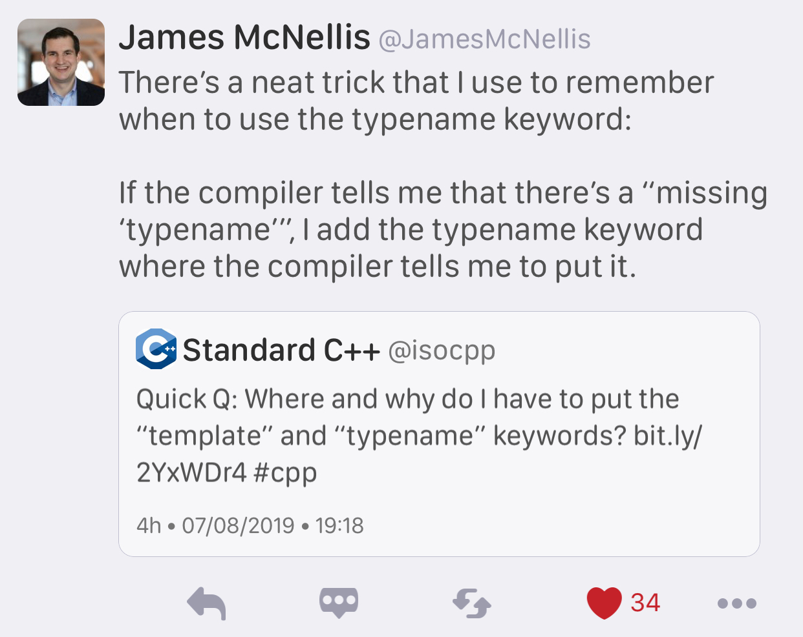

# The Case for C++

[Article](https://itnext.io/the-case-for-c-4122a5b47130)

[Reddit](https://www.reddit.com/r/cpp/comments/dnm77y/the_case_for_c/)

# ABI: Now or Never

[P1863R0](http://www.open-std.org/jtc1/sc22/wg21/docs/papers/2019/p1863r0.pdf) by Titus Winters

[Reddit](https://www.reddit.com/r/cpp/comments/dnr2e1/abi_now_or_never/)

[C++ Epochs](https://vittorioromeo.info/index/blog/fixing_cpp_with_epochs.html) won't help as they only touch syntax, not ABI.

# The Most Essential C++ Advice

[John M. Dlugosz](https://www.codeproject.com/Tips/5249485/The-Most-Essential-Cplusplus-Advice)

# Another cool MSVC flag: /d1reportTime

[Aras Pranckevičius](https://aras-p.info/blog/2019/01/21/Another-cool-MSVC-flag-d1reportTime/)

# Introducing C++ Build Insights in Visual Studio

* [VC++ Team Blog](https://devblogs.microsoft.com/cppblog/introducing-c-build-insights/)
* [Reddit](https://www.reddit.com/r/cpp/comments/ds51u0/introducing_c_build_insights_visual_c/)

# Why `T t(u)` not equivalent to `T t = u` ?

[Reddit](https://www.reddit.com/r/cpp/comments/dg4vql/why_t_tu_not_equivalent_to_t_t_u/f39cnsp/)

STL:

> C++ initialization is a mess.

Stack Overflow: [Is there a difference between copy initialization and direct initialization?](https://stackoverflow.com/questions/1051379/is-there-a-difference-between-copy-initialization-and-direct-initialization)

# Scapix language bridge

* [Intro](https://www.scapix.com/introduction/)
* [Code](https://github.com/scapix-com/scapix)
* [Reddit 1](https://www.reddit.com/r/cpp/comments/cjvc1u/automatic_c_bindings_for_various_languages/)
* [Reddit 2](https://www.reddit.com/r/cpp/comments/ckf44x/scapix_java_link_modern_c17_jni_wrapper_library/)

# CURL wrappers

## Swish

* [Code](https://github.com/lamarrr/swish)
* [Reddit](https://www.reddit.com/r/cpp/comments/c8q0wh/a_modern_c_17_http_client_library_for_humans/)

## CPR

* [Code](https://github.com/whoshuu/cpr)
* [Docs](https://whoshuu.github.io/cpr/)

# Span Lite

[Code](https://github.com/martinmoene/span-lite)

A C++20-like span for C++98, C++11 and later in a single-file header-only library.

# mdspan

* [Implementation](https://github.com/kokkos/mdspan) (BSD 3-Clause)
  * [Intro](https://github.com/kokkos/mdspan/wiki/A-Gentle-Introduction-to-mdspan)
  * [Reddit](https://www.reddit.com/r/cpp/comments/cl127i/mdspan_productionquality_reference_implementation/)
* [Kokkos](https://github.com/kokkos/kokkos)
* [Multi-dimensional strided array views in Magnum](https://blog.magnum.graphics/backstage/multidimensional-strided-array-views/)
* [P0009R9 **mdspan**: A Non-Owning Multidimensional Array Reference](http://wg21.link/p0009r9)
* [CppCast with Bryce Adelstein Lelbach](https://cppcast.com/bryce-lelbach-mdspan/)

# Enums, warnings, and default

[Barry Revzin](https://brevzin.github.io/c++/2019/08/01/enums-default/)

[Reddit](https://www.reddit.com/r/cpp/comments/cubah9/enum_switch_warnings/)

GCC & Clang: `-Wswitch-enum`

# James McNellis's `typename` trick

{width=95%}

# Quote

The Programmers' Credo:

> We do these things not because they are easy, but because we thought they were going to be easy.
