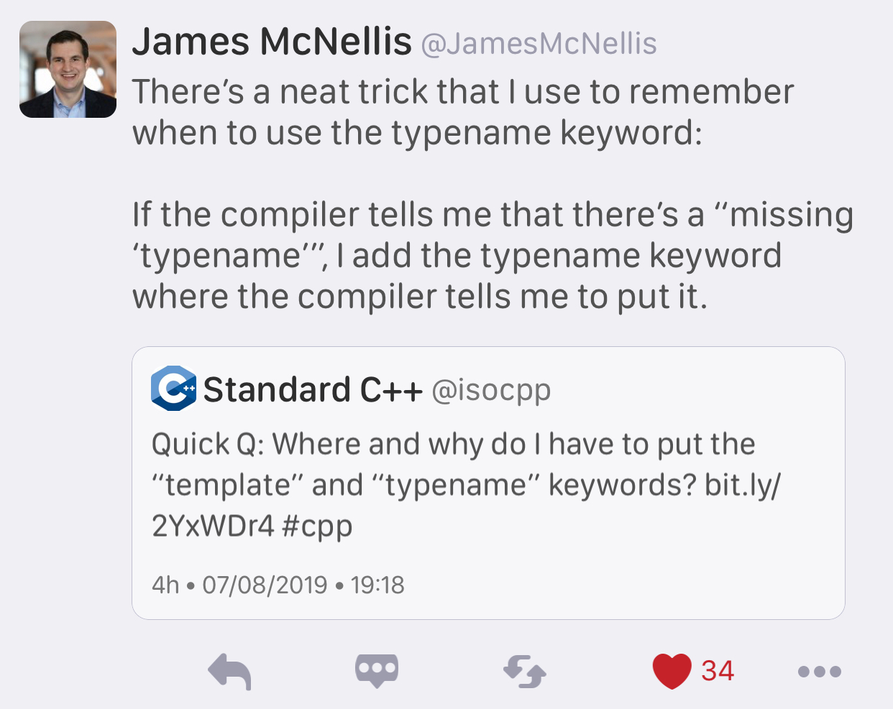

----

The Case for C++
================

https://itnext.io/the-case-for-c-4122a5b47130

https://www.reddit.com/r/cpp/comments/dnm77y/the_case_for_c/

ABI: Now or Never
=================

`P1863R0 <http://www.open-std.org/jtc1/sc22/wg21/docs/papers/2019/p1863r0.pdf>`_ by Titus Winters

https://www.reddit.com/r/cpp/comments/dnr2e1/abi_now_or_never/

`C++ Epochs <https://vittorioromeo.info/index/blog/fixing_cpp_with_epochs.html>`_ won't help as they
only touch syntax, not ABI.

The Most Essential C++ Advice
=============================

`John M. Dlugosz <https://www.codeproject.com/Tips/5249485/The-Most-Essential-Cplusplus-Advice>`_

Another cool MSVC flag: /d1reportTime
=====================================

https://aras-p.info/blog/2019/01/21/Another-cool-MSVC-flag-d1reportTime/

Introducing C++ Build Insights in Visual Studio
===============================================

* `VC++ Team Blog <https://devblogs.microsoft.com/cppblog/introducing-c-build-insights/>`_
* `Reddit <https://www.reddit.com/r/cpp/comments/ds51u0/introducing_c_build_insights_visual_c/>`_

Why `T t(u)` not equivalent to `T t = u` ?
==========================================

https://www.reddit.com/r/cpp/comments/dg4vql/why_t_tu_not_equivalent_to_t_t_u/f39cnsp/

STL:

  C++ initialization is a mess.

Also: https://stackoverflow.com/questions/1051379/is-there-a-difference-between-copy-initialization-and-direct-initialization

A Universal Async Abstraction for C++
=====================================

https://cor3ntin.github.io/posts/executors/ by Corentin Jabot

https://wg21.link/P0443R11 The Unified Executors Proposal

Scapix language bridge
======================

https://www.scapix.com/introduction/

https://github.com/scapix-com/scapix

https://www.reddit.com/r/cpp/comments/cjvc1u/automatic_c_bindings_for_various_languages/

https://www.reddit.com/r/cpp/comments/ckf44x/scapix_java_link_modern_c17_jni_wrapper_library/

CURL wrappers
=============

Swish

* https://github.com/lamarrr/swish
* https://www.reddit.com/r/cpp/comments/c8q0wh/a_modern_c_17_http_client_library_for_humans/

CPR

* https://github.com/whoshuu/cpr
* https://whoshuu.github.io/cpr/

Span Lite
=========

https://github.com/martinmoene/span-lite

A C++20-like span for C++98, C++11 and later in a single-file header-only library.

mdspan
======

* Implementation https://github.com/kokkos/mdspan (BSD 3-Clause)
  * Intro https://github.com/kokkos/mdspan/wiki/A-Gentle-Introduction-to-mdspan
  * r/cpp https://www.reddit.com/r/cpp/comments/cl127i/mdspan_productionquality_reference_implementation/
* Kokkos https://github.com/kokkos/kokkos
* Multi-dimensional strided array views in Magnum
  https://blog.magnum.graphics/backstage/multidimensional-strided-array-views/
* P0009R9 **mdspan**: A Non-Owning Multidimensional Array Reference http://wg21.link/p0009r9
* CppCast with Bryce Adelstein Lelbach https://cppcast.com/bryce-lelbach-mdspan/

Enums, warnings, and default
============================

https://brevzin.github.io/c++/2019/08/01/enums-default/

https://www.reddit.com/r/cpp/comments/cubah9/enum_switch_warnings/

GCC & Clang: ``-Wswitch-enum``

Machine Learning with C++
=========================

`Reddit <https://www.reddit.com/r/cpp/comments/cjrrwm/machine_learning_with_cpp/>`_

* PyTorch https://pytorch.org/features -- has a pure C++ front end https://pytorch.org/cppdocs/
* TensorFlow for C++ https://www.tensorflow.org/api_docs/cc
* Shogun https://www.shogun.ml/

The sad history of Unicode printf-style format specifiers in Visual C++
=======================================================================

https://devblogs.microsoft.com/oldnewthing/20190830-00/?p=102823

* `Reddit <https://www.reddit.com/r/cpp/comments/cxi2xy/the_sad_history_of_unicode_printfstyle_format/>`_

Introducing Magnum Python Bindings
==================================

https://blog.magnum.graphics/announcements/introducing-python-bindings/

https://github.com/pybind/pybind11

AnyDuck : A Value Type Erased Type
==================================

Steve Downey: https://www.sdowney.org/2019/07/anyduck-a-value-type-erased-type/

Template meta-programming: Some testing and debugging tricks
============================================================

https://cukic.co/2019/02/19/tmp-testing-and-debugging-templates/

**using** vs. **typedef**
=========================

https://www.nextptr.com/tutorial/ta1193988140/how-cplusplus-using-or-aliasdeclaration-is-better-than-typedef

Berkeley Container Library (BCL)
================================

https://github.com/berkeley-container-library/bcl

C++ Interview Questions
=======================

https://www.reddit.com/r/cpp/comments/d9xnce/c_interview_questions/

Eliminating the Static Overhead of Ranges
=========================================

`Colby Pike <https://vector-of-bool.github.io/2019/10/21/rngs-static-ovr.html>`_,
`Reddit <https://www.reddit.com/r/cpp/comments/dkxcwd/eliminating_the_static_overhead_of_ranges/>`_

Without ranges
--------------

.. code-block:: c++

    vector<string> child_names;
    for (auto& person : all_people) {
        if (person.age < 14) {
            child_names.push_back(person.name);
        }
    }

With ranges
-----------

.. code-block:: c++

    auto children_names =
        all_people
        | filter( { return person.age < 14; })
        | transform( { return person.name; })
        | to_vector;

Expression templates, ranges, and coroutines
============================================

* https://en.wikipedia.org/wiki/Expression_templates
* `We don’t need no stinking expression templates <https://gieseanw.wordpress.com/2019/10/20/we-dont-need-no-stinking-expression-templates/>`_ by Andy G
  * `Reddit <https://www.reddit.com/r/cpp/comments/dkmbud/we_dont_need_no_stinking_expression_templates/>`_

Change STL containers' size() method to return signed integer?
==============================================================

https://www.reddit.com/r/cpp/comments/dl7lcu/change_stl_containers_size_method_to_return/

Camomilla by Vittorio Romeo
===========================

A Python script that simplifies C++ compiler errors. Useful when using heavily-templated libraries.

https://github.com/SuperV1234/camomilla

Is requiring lambdas to explicitly list what they capture a good coding standard?
=================================================================================

https://www.reddit.com/r/cpp/comments/dp8p2u/is_requiring_lambdas_to_explicitly_list_what_they/

Installing GCC on Windows
=========================

* `GCC 9 <https://solarianprogrammer.com/2019/11/05/install-gcc-windows/>`_
* `GCC 8.2 by STL <https://nuwen.net/mingw.html>`_

Mermaid charts
==============

.. mermaid::

   graph LR
      A --- B
      B-->C[fa:fa-ban forbidden]
      B-->D(fa:fa-spinner);

James McNellis's typename trick
===============================

Quote
=====

The Programmers' Credo:

    We do these things not because they are easy, but because we thought they were going to be easy.
