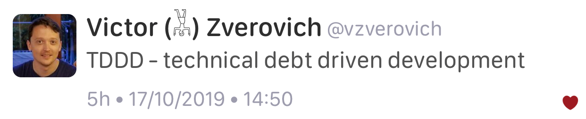

# Bjarne Stroustrup on Lex Fridman's AI Podcast

[Podcast page](https://lexfridman.com/bjarne-stroustrup/)

[YouTube](https://youtu.be/uTxRF5ag27A)

# Belfast trip reports

* [Bryce Lelbach via Reddit](https://www.reddit.com/r/cpp/comments/dtuov8/201911_belfast_iso_c_committee_trip_report/)
* [Botond Ballo](https://botondballo.wordpress.com/2019/11/15/trip-report-c-standards-meeting-in-belfast-november-2019/)
    * [Reddit](https://www.reddit.com/r/cpp/comments/dy6o1z/trip_report_c_standards_meeting_in_belfast/)
    * [Papers on GitHub](https://github.com/cplusplus/papers/issues)
* [Timur Doumler via CppCast](https://cppcast.com/timur-doumler-belfast/)
    * [Reddit](https://www.reddit.com/r/cpp/comments/dwlj4q/cppcast_belfast_trip_report/)
* [Ben Craig via Reddit](https://www.reddit.com/r/cpp/comments/dvh72f/trip_report_freestanding_errors_in_belfast/)
* [Guy Davidson](https://hatcat.com/?p=115)
    * [Reddit](https://www.reddit.com/r/cpp/comments/duc6nf/wg21_in_my_own_backyard_belfast_trip_report/)

# MinGW Distro 17.0: GCC 9.2.0 and Boost 1.71.0 for Windows

* [Stephan T. Lavavej](https://nuwen.net/mingw.html)
    * [Reddit](https://www.reddit.com/r/cpp/comments/e2nzs6/mingw_distro_170_gcc_920_and_boost_1710_for/)

> I've maintained this distro for over 14 years, and I still don't serve ads, sell anything, or accept donations.

* [GCC 9](https://solarianprogrammer.com/2019/11/05/install-gcc-windows/)


# Sourcetrail is now free and open-source software

[Blog post](https://www.sourcetrail.com/blog/open_source/)

[GitHub](https://github.com/CoatiSoftware/Sourcetrail)

[Reddit](https://www.reddit.com/r/cpp/comments/dy8a4d/sourcetrail_the_interactive_source_code_explorer/)

# When is it justified to use C++ for a project?

[Reddit (1)](https://www.reddit.com/r/cpp/comments/dy66da/when_is_it_justified_to_use_c_for_a_project/), [Reddit (2)](https://www.reddit.com/r/cpp_questions/comments/dy68hr/when_is_it_justified_to_use_c_for_a_project/)

# Is it time for a rebased Boost2 that assumes C++20 as its starting point?

[Reddit](https://www.reddit.com/r/cpp/comments/dvt6lw/is_it_time_for_a_rebased_boost2_that_assumes_c20/)

**TL;DR:** No.

# A Universal Async Abstraction for C++

[Corentin Jabot](https://cor3ntin.github.io/posts/executors/)

[P0443R11 The Unified Executors Proposal](https://wg21.link/P0443R11)

# Eliminating the Static Overhead of Ranges

[Colby Pike](https://vector-of-bool.github.io/2019/10/21/rngs-static-ovr.html) --- [Reddit](https://www.reddit.com/r/cpp/comments/dkxcwd/eliminating_the_static_overhead_of_ranges/)

## Without ranges

```cpp
vector<string> child_names;
for (auto& person : all_people) {
    if (person.age < 14) {
        child_names.push_back(person.name);
    }
}
```

## With ranges

```cpp
auto children_names =
    all_people
    | filter([](const auto& person) { return person.age < 14; })
    | transform([](const auto& person) { return person.name; })
    | to_vector;
```

# Expression templates, ranges, and coroutines

* [Wikipedia](https://en.wikipedia.org/wiki/Expression_templates)
* [We don’t need no stinking expression templates](https://gieseanw.wordpress.com/2019/10/20/we-dont-need-no-stinking-expression-templates/) by Andy G
  * [Reddit](https://www.reddit.com/r/cpp/comments/dkmbud/we_dont_need_no_stinking_expression_templates/)

# Change standard containers' `size()` method to return signed integer?

[Reddit](https://www.reddit.com/r/cpp/comments/dl7lcu/change_stl_containers_size_method_to_return/)

# Is requiring lambdas to explicitly list what they capture a good coding standard?

[Reddit](https://www.reddit.com/r/cpp/comments/dp8p2u/is_requiring_lambdas_to_explicitly_list_what_they/)

# The arrow operator (1/2)

[StackOverflow](https://stackoverflow.com/a/10678920/10154):

> The `operator->` has special semantics in the language in that, when overloaded, it reapplies itself to the result. While the rest of the operators are applied only once, `operator->` will be applied by the compiler as many times as needed to get to a raw pointer and once more to access the memory referred by that pointer.

# The arrow operator (2/2)

```cpp
struct A { void foo(); };
struct B { A* operator->(); };
struct C { B operator->(); };
struct D { C operator->(); };
int main() {
    D d;
    d->foo();
}
```

Thanks to Martin Waplington for suggesting this.

# Towards a standard unit systems library

[P1930R0](http://www.open-std.org/jtc1/sc22/wg21/docs/papers/2019/p1930r0.pdf)

[Reddit](https://www.reddit.com/r/cpp/comments/dpmsfg/towards_a_standard_unit_systems_library/)

[Robert Ramey](https://www.reddit.com/r/cpp/comments/dpmsfg/towards_a_standard_unit_systems_library/f5xh1oe?utm_source=share&utm_medium=web2x):

> The value of a paper like this would be to narrow the scope or domain of a problem to something that would be useful component in solving bigger problems. This paper does the opposite - expanding the domain to encompass the whole world of physics.

# C++ `std::string_view` for better performance: An example use case

[Article](https://www.nextptr.com/tutorial/ta1217154594/cplusplus-stdstring_view-for-better-performance-an-example-use-case)

[Reddit](https://www.reddit.com/r/cpp/comments/dosgnp/c_stdstring_view_for_better_performance_an/)

[Arthur O'Dwyer: `std::string_view` is a borrow type](https://quuxplusone.github.io/blog/2018/03/27/string-view-is-a-borrow-type/)

> Borrow types are essentially “borrowed” references to existing objects. They lack ownership; they are short-lived; they generally can do without an assignment operator. They generally appear only in function parameter lists; because they lack ownership semantics, they generally cannot be stored in data structures or returned safely from functions.

[cppreference: `std::basic_string_view` (C++17)](https://en.cppreference.com/w/cpp/string/basic_string_view)

# Scott Meyers's guideline "Make non-leaf classes abstract"

[Reddit](https://www.reddit.com/r/cpp/comments/dz26kd/should_we_reevaluate_scott_meyerss_guideline_make/)

# Empty struct size in C and C++


# Hello World with C++2a modules

[Arthur O'Dwyer](https://quuxplusone.github.io/blog/2019/11/07/modular-hello-world/)

> Here’s how to build a “Hello world” program using Clang’s implementation of C++2a Modules, as it currently stands as of November 2019.

[Reddit](https://www.reddit.com/r/cpp/comments/dtbqe9/hello_world_with_c2a_modules/)

# Beginner's Guide to Linkers

[http://www.lurklurk.org/linkers/linkers.html](http://www.lurklurk.org/linkers/linkers.html)

```bash
g++ -o test1 test1a.o test1b.o
test1a.o(.text+0x18): In function `main':
: undefined reference to `findmax(int, int)'
collect2: ld returned 1 exit status
```

> If your reaction to this is 'almost certainly missing extern "C"' then you probably already know everything in this article.

# Twitter



# Quote

Ellen Ullman:

> We build our computer (systems) the way we build our cities: over time, without a plan, on top of ruins.
