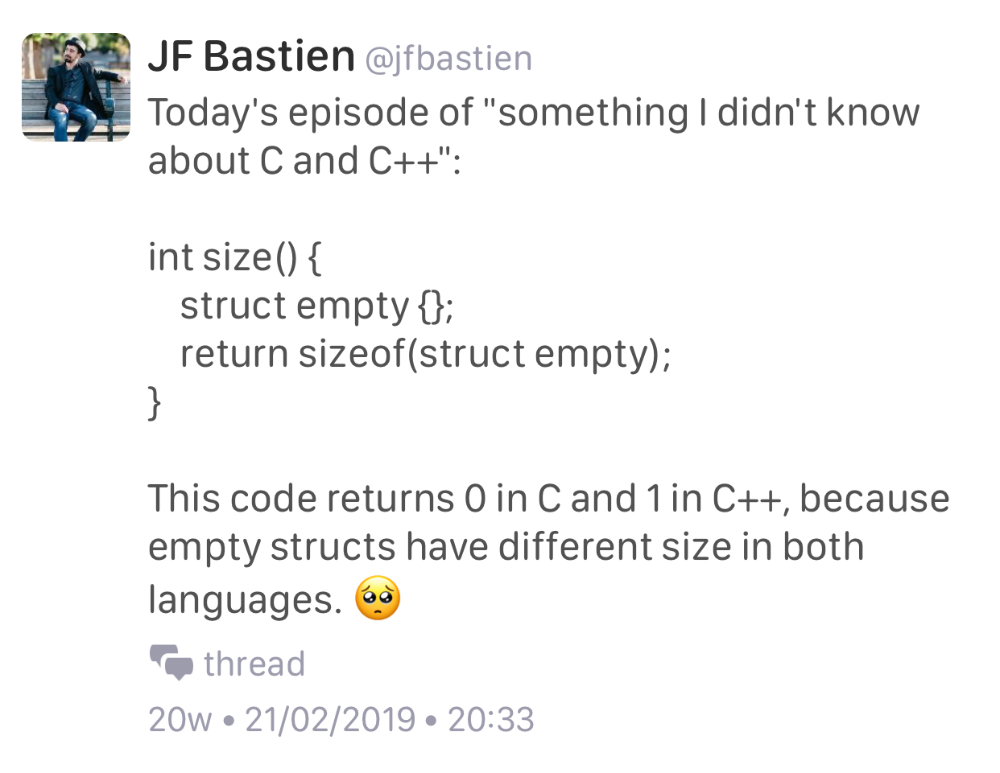

# How can you be so certain?

[Bjarne Stroustrup](http://www.open-std.org/jtc1/sc22/wg21/docs/papers/2019/p1962r0.pdf)

> We are defining a language for decades of use. A bit of humility is necessary.

[Reddit](https://www.reddit.com/r/cpp/comments/e5gpdo/how_can_you_be_so_certain_bjarne_stroustrup/)

# How can you be so certain?


# Bjarne Stroustrup on Lex Fridman's AI Podcast

[Podcast page](https://lexfridman.com/bjarne-stroustrup/)

[YouTube](https://youtu.be/uTxRF5ag27A)

# Belfast trip reports

* [Bryce Lelbach via Reddit](https://www.reddit.com/r/cpp/comments/dtuov8/201911_belfast_iso_c_committee_trip_report/)
* [Botond Ballo](https://botondballo.wordpress.com/2019/11/15/trip-report-c-standards-meeting-in-belfast-november-2019/)
    * [Reddit](https://www.reddit.com/r/cpp/comments/dy6o1z/trip_report_c_standards_meeting_in_belfast/)
    * [Papers on GitHub](https://github.com/cplusplus/papers/issues)
* [Timur Doumler via CppCast](https://cppcast.com/timur-doumler-belfast/)
    * [Reddit](https://www.reddit.com/r/cpp/comments/dwlj4q/cppcast_belfast_trip_report/)
* [Ben Craig via Reddit](https://www.reddit.com/r/cpp/comments/dvh72f/trip_report_freestanding_errors_in_belfast/)
* [Guy Davidson](https://hatcat.com/?p=115)
    * [Reddit](https://www.reddit.com/r/cpp/comments/duc6nf/wg21_in_my_own_backyard_belfast_trip_report/)

# CLion 2019.3

> A Quality-Targeted Release Focused on Performance and Some Long-Awaited Enhancements

* [Announcement](https://blog.jetbrains.com/clion/2019/11/clion-2019-3-release/)
* [Download](https://www.jetbrains.com/clion/download/)
* [Reddit](https://www.reddit.com/r/cpp/comments/e3dfeh/clion_20193_a_qualitytargeted_release_focused_on/)

# MinGW Distro 17.0: GCC 9.2.0 and Boost 1.71.0 for Windows

* [Stephan T. Lavavej](https://nuwen.net/mingw.html)
    * [Reddit](https://www.reddit.com/r/cpp/comments/e2nzs6/mingw_distro_170_gcc_920_and_boost_1710_for/)

> I've maintained this distro for over 14 years, and I still don't serve ads, sell anything, or accept donations.

* [GCC 9](https://solarianprogrammer.com/2019/11/05/install-gcc-windows/)

# Sourcetrail is now free and open-source software

[Blog post](https://www.sourcetrail.com/blog/open_source/)

[GitHub](https://github.com/CoatiSoftware/Sourcetrail)

[Reddit](https://www.reddit.com/r/cpp/comments/dy8a4d/sourcetrail_the_interactive_source_code_explorer/)

# When is it justified to use C++ for a project?

[Reddit (1)](https://www.reddit.com/r/cpp/comments/dy66da/when_is_it_justified_to_use_c_for_a_project/), [Reddit (2)](https://www.reddit.com/r/cpp_questions/comments/dy68hr/when_is_it_justified_to_use_c_for_a_project/)

# Is it time for a rebased Boost2 that assumes C++20 as its starting point?

[Reddit](https://www.reddit.com/r/cpp/comments/dvt6lw/is_it_time_for_a_rebased_boost2_that_assumes_c20/)

**TL;DR:** No.

# A Universal Async Abstraction for C++

[Corentin Jabot](https://cor3ntin.github.io/posts/executors/)

[P0443R11 The Unified Executors Proposal](https://wg21.link/P0443R11)

# Eliminating the Static Overhead of Ranges

[Colby Pike](https://vector-of-bool.github.io/2019/10/21/rngs-static-ovr.html) --- [Reddit](https://www.reddit.com/r/cpp/comments/dkxcwd/eliminating_the_static_overhead_of_ranges/)

## Without ranges

```cpp
vector<string> child_names;
for (auto& person : all_people) {
    if (person.age < 14) {
        child_names.push_back(person.name);
    }
}
```

## With ranges

```cpp
auto children_names =
    all_people
    | filter([](const auto& person) { return person.age < 14; })
    | transform([](const auto& person) { return person.name; })
    | to_vector;
```

# Expression templates, ranges, and coroutines

* [Wikipedia](https://en.wikipedia.org/wiki/Expression_templates)
* [We don’t need no stinking expression templates](https://gieseanw.wordpress.com/2019/10/20/we-dont-need-no-stinking-expression-templates/) by Andy G
  * [Reddit](https://www.reddit.com/r/cpp/comments/dkmbud/we_dont_need_no_stinking_expression_templates/)

# Change standard containers' `size()` method to return signed integer?

[Reddit](https://www.reddit.com/r/cpp/comments/dl7lcu/change_stl_containers_size_method_to_return/)

# Is requiring lambdas to explicitly list what they capture a good coding standard?

[Reddit](https://www.reddit.com/r/cpp/comments/dp8p2u/is_requiring_lambdas_to_explicitly_list_what_they/)

# The arrow operator (1/2)

[StackOverflow](https://stackoverflow.com/a/10678920/10154):

> The `operator->` has special semantics in the language in that, when overloaded, it reapplies itself to the result. While the rest of the operators are applied only once, `operator->` will be applied by the compiler as many times as needed to get to a raw pointer and once more to access the memory referred by that pointer.

# The arrow operator (2/2)

```cpp
struct A { void foo(); };
struct B { A* operator->(); };
struct C { B operator->(); };
struct D { C operator->(); };
int main() {
    D d;
    d->foo();
}
```

Thanks to Martin Waplington for suggesting this.

# Towards a standard unit systems library

[P1930R0](http://www.open-std.org/jtc1/sc22/wg21/docs/papers/2019/p1930r0.pdf)

[Reddit](https://www.reddit.com/r/cpp/comments/dpmsfg/towards_a_standard_unit_systems_library/)

[Robert Ramey](https://www.reddit.com/r/cpp/comments/dpmsfg/towards_a_standard_unit_systems_library/f5xh1oe?utm_source=share&utm_medium=web2x):

> The value of a paper like this would be to narrow the scope or domain of a problem to something that would be useful component in solving bigger problems. This paper does the opposite - expanding the domain to encompass the whole world of physics.

# C++ `std::string_view` for better performance: An example use case

[Article](https://www.nextptr.com/tutorial/ta1217154594/cplusplus-stdstring_view-for-better-performance-an-example-use-case)

[Reddit](https://www.reddit.com/r/cpp/comments/dosgnp/c_stdstring_view_for_better_performance_an/)

[Arthur O'Dwyer: `std::string_view` is a borrow type](https://quuxplusone.github.io/blog/2018/03/27/string-view-is-a-borrow-type/)

> Borrow types are essentially “borrowed” references to existing objects. They lack ownership; they are short-lived; they generally can do without an assignment operator. They generally appear only in function parameter lists; because they lack ownership semantics, they generally cannot be stored in data structures or returned safely from functions.

[cppreference: `std::basic_string_view` (C++17)](https://en.cppreference.com/w/cpp/string/basic_string_view)

# Scott Meyers's guideline "Make non-leaf classes abstract"

[Reddit](https://www.reddit.com/r/cpp/comments/dz26kd/should_we_reevaluate_scott_meyerss_guideline_make/)

# Empty struct size in C and C++



# Hello World with C++2a modules

[Arthur O'Dwyer](https://quuxplusone.github.io/blog/2019/11/07/modular-hello-world/)

> Here’s how to build a “Hello world” program using Clang’s implementation of C++2a Modules, as it currently stands as of November 2019.

[Reddit](https://www.reddit.com/r/cpp/comments/dtbqe9/hello_world_with_c2a_modules/)

# JSON Library from the makers of Boost.Beast

Vinnie Falcou:

> A survey of existing JSON libraries shows impressive diversity and features. However, no library is known to meet all of the design goals mentioned here. In particular, we know of no library that supports incremental parsing and serialization, and also supports custom allocators robustly.

[Reddit](https://www.reddit.com/r/cpp/comments/e42ovz/new_json_library_from_the_makers_of_boostbeast/) --- [GitHub](https://github.com/vinniefalco/json/) (C++11, Boost License) --- [Docs](http://vinniefalco.github.io/doc/json/index.html) --- [Benchmarks](http://vinniefalco.github.io/doc/json/json/benchmarks.html)

> This is currently NOT an official Boost library.

# Beginner's Guide to Linkers

[http://www.lurklurk.org/linkers/linkers.html](http://www.lurklurk.org/linkers/linkers.html)

```bash
g++ -o test1 test1a.o test1b.o
test1a.o(.text+0x18): In function `main':
: undefined reference to `findmax(int, int)'
collect2: ld returned 1 exit status
```

> If your reaction to this is 'almost certainly missing extern "C"' then you probably already know everything in this article.

# Twitter


# Quote

Ellen Ullman:

> We build our computer (systems) the way we build our cities: over time, without a plan, on top of ruins.
