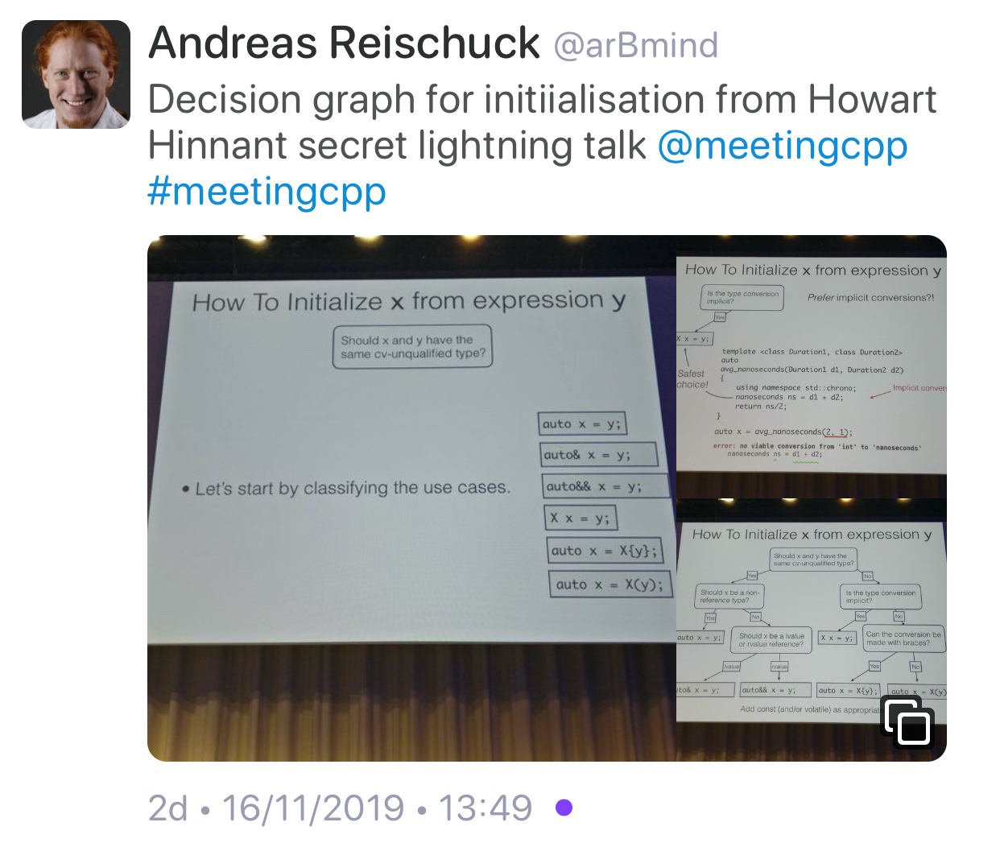

# C++ exceptions and alternatives

[Bjarne Stroustrup](http://www.open-std.org/jtc1/sc22/wg21/docs/papers/2019/p1947r0.pdf)

[Reddit](https://www.reddit.com/r/cpp/comments/e5frne/very_interesting_paper_about_exceptions/)

Niall Douglas's rebuttal: [Part 1](https://www.reddit.com/r/cpp/comments/e5frne/very_interesting_paper_about_exceptions/f9jpfvl?utm_source=share&utm_medium=web2x), [Part 2](https://www.reddit.com/r/cpp/comments/e5frne/very_interesting_paper_about_exceptions/f9jpgxk?utm_source=share&utm_medium=web2x)

## C++ Exception Optimizations. An experiment

[Gor Nishanov](http://www.open-std.org/jtc1/sc22/wg21/docs/papers/2019/p1676r0.pdf)

# A Universal Async Abstraction for C++

[Corentin Jabot](https://cor3ntin.github.io/posts/executors/)

[P0443R11 The Unified Executors Proposal](https://wg21.link/P0443R11)

# Expression templates, ranges, and coroutines

* [Wikipedia](https://en.wikipedia.org/wiki/Expression_templates)
* [We don’t need no stinking expression templates](https://gieseanw.wordpress.com/2019/10/20/we-dont-need-no-stinking-expression-templates/) by Andy G
  * [Reddit](https://www.reddit.com/r/cpp/comments/dkmbud/we_dont_need_no_stinking_expression_templates/)

# C++ coroutines, by Raymond Chen (Microsoft)

* [C++ coroutines: Getting started with awaitable objects](https://devblogs.microsoft.com/oldnewthing/20191209-00/?p=103195)
* [C++ coroutines: Constructible awaitable or function returning awaitable?](https://devblogs.microsoft.com/oldnewthing/20191210-00/?p=103197)
* [C++ coroutines: Framework interop](https://devblogs.microsoft.com/oldnewthing/20191211-00/?p=103201)

# Howard Hinnant on how to initialize things (1/4)



# Howard Hinnant on how to initialize things (2/4)


# Howard Hinnant on how to initialize things (3/4)


# Howard Hinnant on how to initialize things (4/4)


# Change standard containers' `size()` method to return signed integer?

[Reddit](https://www.reddit.com/r/cpp/comments/dl7lcu/change_stl_containers_size_method_to_return/)

# Is requiring lambdas to explicitly list what they capture a good coding standard?

[Reddit](https://www.reddit.com/r/cpp/comments/dp8p2u/is_requiring_lambdas_to_explicitly_list_what_they/)

# Towards a standard unit systems library

[P1930R0](http://www.open-std.org/jtc1/sc22/wg21/docs/papers/2019/p1930r0.pdf)

[Reddit](https://www.reddit.com/r/cpp/comments/dpmsfg/towards_a_standard_unit_systems_library/)

[Robert Ramey](https://www.reddit.com/r/cpp/comments/dpmsfg/towards_a_standard_unit_systems_library/f5xh1oe?utm_source=share&utm_medium=web2x):

> The value of a paper like this would be to narrow the scope or domain of a problem to something that would be useful component in solving bigger problems. This paper does the opposite - expanding the domain to encompass the whole world of physics.

# C++ `std::string_view` for better performance: An example use case

[Article](https://www.nextptr.com/tutorial/ta1217154594/cplusplus-stdstring_view-for-better-performance-an-example-use-case)

[Reddit](https://www.reddit.com/r/cpp/comments/dosgnp/c_stdstring_view_for_better_performance_an/)

[Arthur O'Dwyer: `std::string_view` is a borrow type](https://quuxplusone.github.io/blog/2018/03/27/string-view-is-a-borrow-type/)

> Borrow types are essentially “borrowed” references to existing objects. They lack ownership; they are short-lived; they generally can do without an assignment operator. They generally appear only in function parameter lists; because they lack ownership semantics, they generally cannot be stored in data structures or returned safely from functions.

[cppreference: `std::basic_string_view` (C++17)](https://en.cppreference.com/w/cpp/string/basic_string_view)

# Scott Meyers's guideline "Make non-leaf classes abstract"

[Reddit](https://www.reddit.com/r/cpp/comments/dz26kd/should_we_reevaluate_scott_meyerss_guideline_make/)

# Empty struct size in C and C++


# Hello World with C++2a modules

[Arthur O'Dwyer](https://quuxplusone.github.io/blog/2019/11/07/modular-hello-world/)

> Here’s how to build a “Hello world” program using Clang’s implementation of C++2a Modules, as it currently stands as of November 2019.

[Reddit](https://www.reddit.com/r/cpp/comments/dtbqe9/hello_world_with_c2a_modules/)

# JSON Library from the makers of Boost.Beast

Vinnie Falcou:

> A survey of existing JSON libraries shows impressive diversity and features. However, no library is known to meet all of the design goals mentioned here. In particular, we know of no library that supports incremental parsing and serialization, and also supports custom allocators robustly.

[Reddit](https://www.reddit.com/r/cpp/comments/e42ovz/new_json_library_from_the_makers_of_boostbeast/) --- [GitHub](https://github.com/vinniefalco/json/) (C++11, Boost License) --- [Docs](http://vinniefalco.github.io/doc/json/index.html) --- [Benchmarks](http://vinniefalco.github.io/doc/json/json/benchmarks.html)

> This is currently NOT an official Boost library.

# Beginner's Guide to Linkers

[http://www.lurklurk.org/linkers/linkers.html](http://www.lurklurk.org/linkers/linkers.html)

```bash
g++ -o test1 test1a.o test1b.o
test1a.o(.text+0x18): In function `main':
: undefined reference to `findmax(int, int)'
collect2: ld returned 1 exit status
```

> If your reaction to this is 'almost certainly missing extern "C"' then you probably already know everything in this article.

# Twitter


# Twitter


