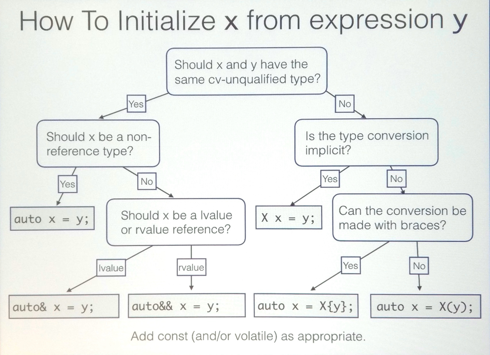
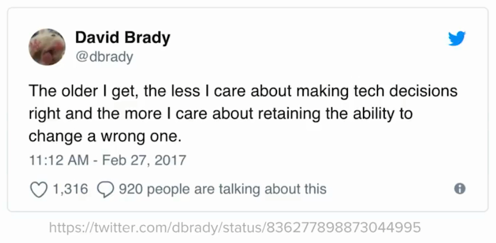
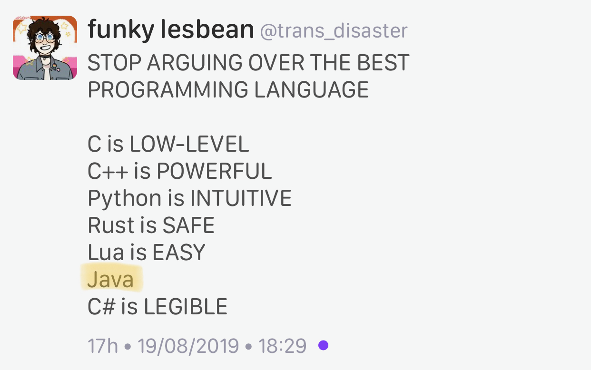

# C++ exceptions and alternatives

[Bjarne Stroustrup](http://www.open-std.org/jtc1/sc22/wg21/docs/papers/2019/p1947r0.pdf)

[Reddit](https://www.reddit.com/r/cpp/comments/e5frne/very_interesting_paper_about_exceptions/)

Niall Douglas's rebuttal: [Part 1](https://www.reddit.com/r/cpp/comments/e5frne/very_interesting_paper_about_exceptions/f9jpfvl?utm_source=share&utm_medium=web2x), [Part 2](https://www.reddit.com/r/cpp/comments/e5frne/very_interesting_paper_about_exceptions/f9jpgxk?utm_source=share&utm_medium=web2x)

## C++ Exception Optimizations. An experiment

[Gor Nishanov](http://www.open-std.org/jtc1/sc22/wg21/docs/papers/2019/p1676r0.pdf)

# A Universal Async Abstraction for C++

[Corentin Jabot](https://cor3ntin.github.io/posts/executors/)

[P0443R11 The Unified Executors Proposal](https://wg21.link/P0443R11)

# C++ coroutines, by Raymond Chen (Microsoft)

* [C++ coroutines: Getting started with awaitable objects](https://devblogs.microsoft.com/oldnewthing/20191209-00/?p=103195)
* [C++ coroutines: Constructible awaitable or function returning awaitable?](https://devblogs.microsoft.com/oldnewthing/20191210-00/?p=103197)
* [C++ coroutines: Framework interop](https://devblogs.microsoft.com/oldnewthing/20191211-00/?p=103201)

# Howard Hinnant on how to initialize things (1/4)

# Howard Hinnant on how to initialize things (2/4)

# Howard Hinnant on how to initialize things (3/4)

# Howard Hinnant on how to initialize things (4/4)

# Change standard containers' `size()` method to return signed integer?

[Reddit](https://www.reddit.com/r/cpp/comments/dl7lcu/change_stl_containers_size_method_to_return/)

# Is requiring lambdas to explicitly list what they capture a good coding standard?

[Reddit](https://www.reddit.com/r/cpp/comments/dp8p2u/is_requiring_lambdas_to_explicitly_list_what_they/)

# Empty struct size in C and C++

# Twitter

# Twitter

