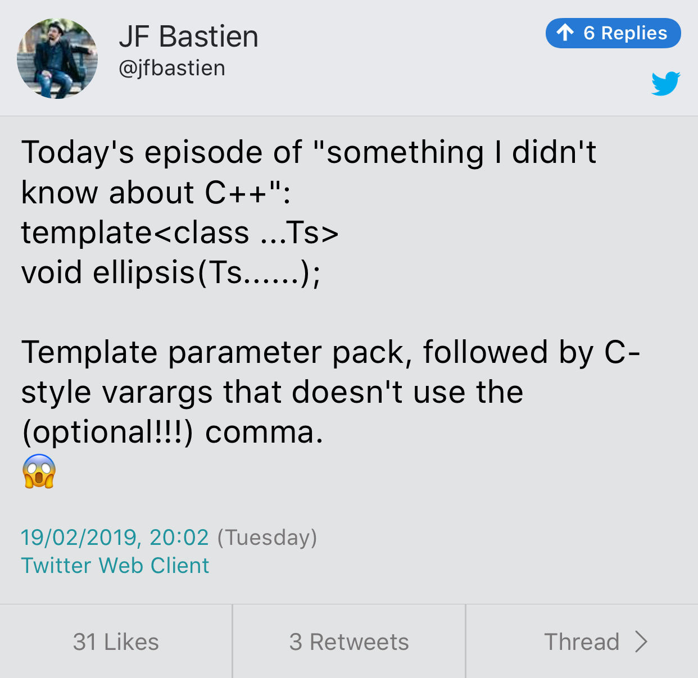
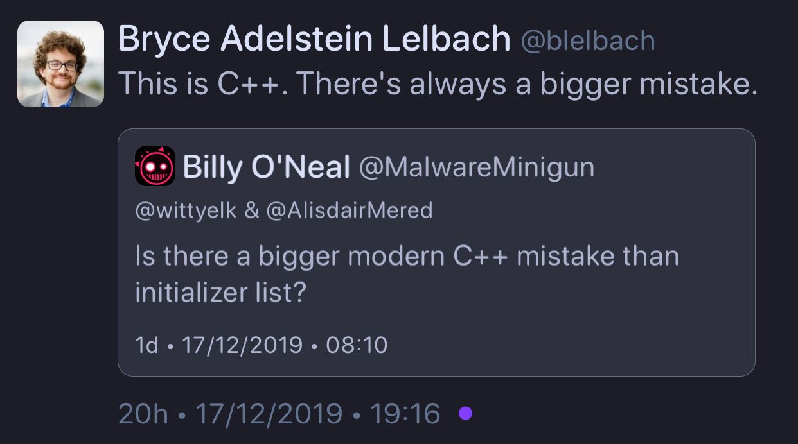

# C++ in 2019

* [B. Filipek](https://www.bfilipek.com/2019/12/cpp-status-2019.html)
* [Reddit](https://www.reddit.com/r/cpp/comments/ei0zut/c_at_the_end_of_2019/)

# CppCast: C++ 2020 News

* [Podcast](https://cppcast.com/cpp-2020-news/)

# A Study on the Effects of Exception Usage in Open-Source C++ Systems

* [PDF](https://plg.uwaterloo.ca/~migod/papers/2019/scam19.pdf)
* [Reddit](https://www.reddit.com/r/cpp/comments/ed2tpp/pdf_a_study_on_the_effects_of_exception_usage_in/)
    * [The puns, oh my](https://www.reddit.com/r/cpp/comments/ed2tpp/pdf_a_study_on_the_effects_of_exception_usage_in/fbffwp1?utm_source=share&utm_medium=web2x)

# Quick Reference for Choosing C++ Function Parameter Type

* [GitHub](https://github.com/legends2k/cpp-param-ref)
* [PDF V0.3.1](https://github.com/legends2k/cpp-param-ref/releases/download/v0.3.1/cpp_param_ref.pdf)

# Beginner's Guide to Linkers

[http://www.lurklurk.org/linkers/linkers.html](http://www.lurklurk.org/linkers/linkers.html)

```shell
g++ -o test1 test1a.o test1b.o
test1a.o(.text+0x18): In function `main':
: undefined reference to `findmax(int, int)'
collect2: ld returned 1 exit status
```

> If your reaction to this is 'almost certainly missing `extern "C"`' then you probably already know everything in this article.

# JSON Library from the makers of Boost.Beast

Vinnie Falcou:

> A survey of existing JSON libraries shows impressive diversity and features. However, no library is known to meet all of the design goals mentioned here. In particular, we know of no library that supports incremental parsing and serialization, and also supports custom allocators robustly.

[Reddit](https://www.reddit.com/r/cpp/comments/e42ovz/new_json_library_from_the_makers_of_boostbeast/) --- [GitHub](https://github.com/vinniefalco/json/) (C++11, Boost License) --- [Docs](http://vinniefalco.github.io/doc/json/index.html) --- [Benchmarks](http://vinniefalco.github.io/doc/json/json/benchmarks.html)

> This is currently NOT an official Boost library.

# Hello World with C++20 modules

[Arthur O'Dwyer](https://quuxplusone.github.io/blog/2019/11/07/modular-hello-world/)

> Here’s how to build a “Hello world” program using Clang’s implementation of C++2a Modules, as it currently stands as of November 2019.

[Reddit](https://www.reddit.com/r/cpp/comments/dtbqe9/hello_world_with_c2a_modules/)

# Scott Meyers's guideline "Make non-leaf classes abstract"

[Reddit](https://www.reddit.com/r/cpp/comments/dz26kd/should_we_reevaluate_scott_meyerss_guideline_make/)

# Towards a standard unit systems library

[P1930R0](http://www.open-std.org/jtc1/sc22/wg21/docs/papers/2019/p1930r0.pdf)

[Reddit](https://www.reddit.com/r/cpp/comments/dpmsfg/towards_a_standard_unit_systems_library/)

[Robert Ramey](https://www.reddit.com/r/cpp/comments/dpmsfg/towards_a_standard_unit_systems_library/f5xh1oe?utm_source=share&utm_medium=web2x):

> The value of a paper like this would be to narrow the scope or domain of a problem to something that would be useful component in solving bigger problems. This paper does the opposite - expanding the domain to encompass the whole world of physics.

# Boost.StaticString

* [GitHub](https://github.com/18/static_string)
* [Docs](https://18.github.io/doc/fixed_string/)
* [Reddit](https://www.reddit.com/r/cpp/comments/eb80ri/boostfixedstring_now_booststaticstring_has_been/)

# Twitter: JF Bastien

{width=60%}

# Twitter: Bryce Lelbach


