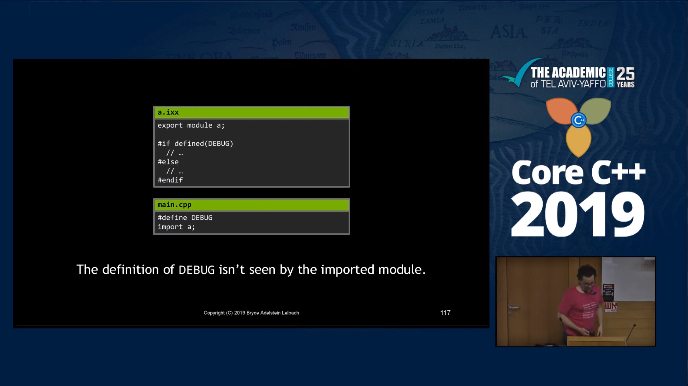

# Modules are Coming - Bryce Adelstein Lelbach

* [YouTube](https://www.youtube.com/watch?v=bDTm6y6fNSU)
* [Reddit](https://www.reddit.com/r/cpp/comments/cd11ep/modules_are_coming_core_c_2019_bryce_adelstein/)

> Modules will have a greater impact than any other feature added post-c++98.

# Modules are Coming - Bryce Adelstein Lelbach


# Modules are Coming - Bryce Adelstein Lelbach

> "Ill-formed, no diagnostics required" (IFNDR)

# Modules are Coming - Bryce Adelstein Lelbach


# Modules are Coming - Bryce Adelstein Lelbach

## Textual inclusion

```cpp
#include <foo.hpp>
#include "foo.hpp"
```

## Modular import

```cpp
import foo;
import <foo.hpp>;
import "foo.hpp";
```

# Modules are Coming - Bryce Adelstein Lelbach


# Modules are Coming - Bryce Adelstein Lelbach


# Modules are Coming - Bryce Adelstein Lelbach

Only one module declaration per translation unit:

## Interface

```cpp
export module a;
//...
export module b; // Error
```

## Implementation

```cpp
module a;
//...
module b; // Error
```

# Modules are Coming - Bryce Adelstein Lelbach

## Module unit structure

```cpp
export module ...;
import ...;
...
```

# Modules are Coming - Bryce Adelstein Lelbach

```cpp
export declaration ...
export {
    declaration ...
}
```

# Modules are Coming - Bryce Adelstein Lelbach

```cpp
export {
    void f();
    struct A;
    int i{0};
}
```

```cpp
export void f();
export struct A;
export int i{0};
```

# Modules are Coming - Bryce Adelstein Lelbach

```cpp
export template <typename T>
T square(T t) { return t*t; }

export template <typename T>
struct is_const : false_type {};

export template <typename T>
struct is_const<T const> : true_type {};
```

# Modules are Coming - Bryce Adelstein Lelbach

```cpp
export namespace foo { struct A; } // foo::A exported

namespace foo { struct B; } // foo::B not exported
```

# Modules are Coming - Bryce Adelstein Lelbach

```cpp
export typedef int int32_t;

export using unsigned uint32_t;
```

# Modules are Coming - Bryce Adelstein Lelbach

```cpp
export import a;
```

# Modules are Coming - Bryce Adelstein Lelbach


# Modules are Coming - Bryce Adelstein Lelbach


# Modules are Coming - Bryce Adelstein Lelbach


# Modules are Coming - Bryce Adelstein Lelbach

* _Visible_: in scope, can be named
* _Reachable_: in scope, not necessarily namable

# Modules are Coming - Bryce Adelstein Lelbach


# Modules are Coming - Bryce Adelstein Lelbach



# Modules are Coming - Bryce Adelstein Lelbach

## Module unit structire

```cpp
module;
#pp-directive ...;
export module ...;
import ...;
...
module : private;
...
```

# Modules are Coming - Bryce Adelstein Lelbach


# Modules are Coming - Bryce Adelstein Lelbach


# Modules are Coming - Bryce Adelstein Lelbach


# Modules are Coming - Bryce Adelstein Lelbach


# Modules are Coming - Bryce Adelstein Lelbach


# Modules are Coming - Bryce Adelstein Lelbach


# Modules are Coming - Bryce Adelstein Lelbach


# Modules are Coming - Bryce Adelstein Lelbach

* Tools can no longer rely on simple lookup mechanism (include directories and header file names) to understand C++ projects.
* Dependency scanning now requires a C++ parser, not just a C preprocessor.

# C++ `std::string_view` for better performance: An example use case

[Article](https://www.nextptr.com/tutorial/ta1217154594/cplusplus-stdstring_view-for-better-performance-an-example-use-case)

[Reddit](https://www.reddit.com/r/cpp/comments/dosgnp/c_stdstring_view_for_better_performance_an/)

[Arthur O'Dwyer: `std::string_view` is a borrow type](https://quuxplusone.github.io/blog/2018/03/27/string-view-is-a-borrow-type/)

> Borrow types are essentially “borrowed” references to existing objects. They lack ownership; they are short-lived; they generally can do without an assignment operator. They generally appear only in function parameter lists; because they lack ownership semantics, they generally cannot be stored in data structures or returned safely from functions.

[cppreference: `std::basic_string_view` (C++17)](https://en.cppreference.com/w/cpp/string/basic_string_view)

# A hidden gem: `inner_product`

* [Article](https://marcoarena.wordpress.com/2017/11/14/a-hidden-gem-inner_product/)

# A hidden gem: `inner_product`

{width=50%}

# Lingo 0.1.0: Text encoding for modern C++

* [GitHub: C++11, MIT](https://github.com/rick-de-water/Lingo)
* [Reddit](https://www.reddit.com/r/cpp/comments/ekhkk6/lingo_010_text_encoding_for_modern_c/)

# Argumentum

> Argumentum is a C++17 library for writing command-line program interfaces, inspired by Python argparse

* [GitHub: C++17, MPL](https://github.com/mmahnic/argumentum)
* [Reddit](https://www.reddit.com/r/cpp/comments/ekgdfr/argumentum_is_a_c17_library_for_writing/)

# Twitter

{width=70%}

# Twitter

{width=60%}

# Quote

Ryan Campbell:

> Commenting your code is like cleaning your bathroom -- you never want to do it, but it really does create a more pleasant experience for you and your guests.

