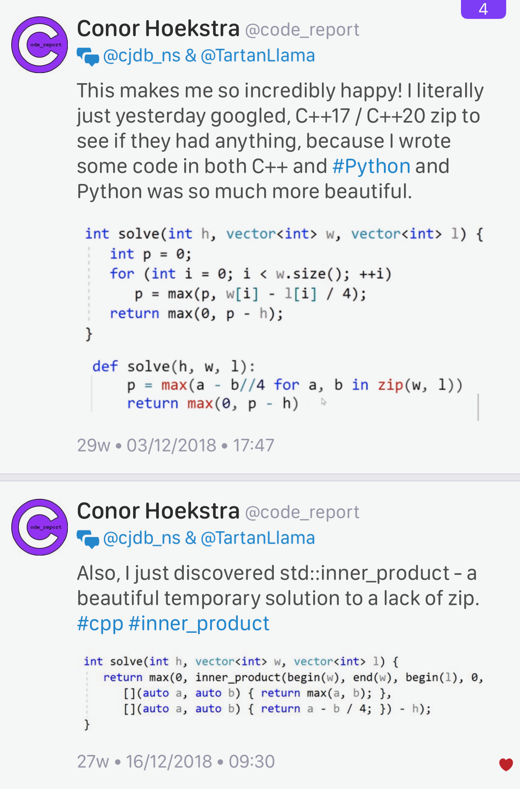

# A new decade, a new tool: **libman**

* [Colby Pike (vector-of-bool)](https://vector-of-bool.github.io/2020/01/06/new-decade.html)
* [Reddit](https://www.reddit.com/r/cpp/comments/ekwb4y/a_new_decade_a_new_tool/)
* [GitHub](https://github.com/vector-of-bool/libman)
* [Specification](https://api.csswg.org/bikeshed/?force=1&url=https://raw.githubusercontent.com/vector-of-bool/libman/develop/data/spec.bs)

**libman** is a new level of indirection between package management and build systems.

**dds** is Drop-Dead Simple build and package manager.

* [CppCon 2019: Robert Schumacher “How to Herd 1,000 Libraries”](https://youtu.be/Lb3hlLlHTrs)

# A hidden gem: `inner_product`

* [Article](https://marcoarena.wordpress.com/2017/11/14/a-hidden-gem-inner_product/)

# A hidden gem: `inner_product`

{width=50%}

# Lingo 0.1.0: Text encoding for modern C++

* [GitHub: C++11, MIT](https://github.com/rick-de-water/Lingo)
* [Reddit](https://www.reddit.com/r/cpp/comments/ekhkk6/lingo_010_text_encoding_for_modern_c/)

# Argumentum

> Argumentum is a C++17 library for writing command-line program interfaces, inspired by Python argparse

* [GitHub: C++17, MPL](https://github.com/mmahnic/argumentum)
* [Reddit](https://www.reddit.com/r/cpp/comments/ekgdfr/argumentum_is_a_c17_library_for_writing/)

# Structured Exceptions (Win32) and C++

* [Raymond Chen: How can I handle both structured exceptions and C++ exceptions potentially coming from the same source?](https://devblogs.microsoft.com/oldnewthing/20200116-00/?p=103333)
  * [Reddit](https://www.reddit.com/r/cpp/comments/epwpx3/how_can_i_handle_both_structured_exceptions_and_c/)
* [Raymond Chen: Can I throw a C++ exception from a structured exception?](https://devblogs.microsoft.com/oldnewthing/?p=96706)

# Book: C++ Move Semantics - The Complete Guide, by Nicolai Josuttis

* [Website](http://www.cppmove.com)

> Move semantics, introduced with C++11, has become a hallmark of modern C++ programming. However, it also complicates the language in many ways. Even after several years of support of move semantics experienced programmers struggle with all the details of move semantics. And style guides still don't recommend the right consequences for programming even of trivial classes.
