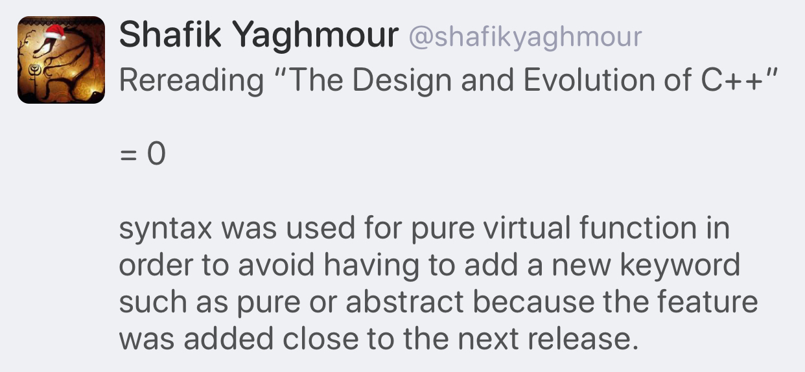
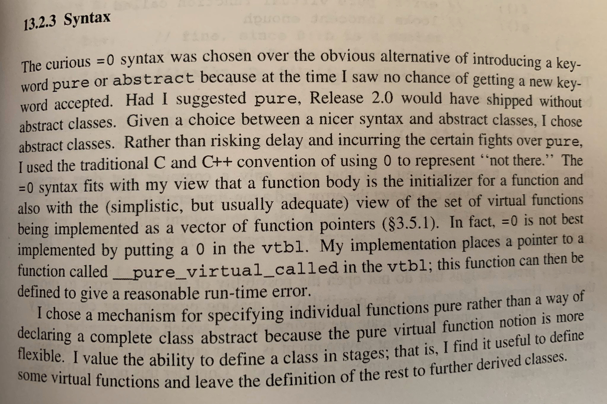

# Prague Trip Reports

* [Bryce Lelbach et al.](https://www.reddit.com/r/cpp/comments/f47x4o/202002_prague_iso_c_committee_trip_report_c20_is/)
  * 252 attendees! 23 subgroups! 9 tracks!
  * C++20 is done!
  * C++23 roadmap!
* [Herb Sutter](https://herbsutter.com/2020/02/15/trip-report-winter-iso-c-standards-meeting-prague/)

# CppCast Ep. 233: Large Scale C++ with John Lakos

* [Audio](https://cppcast.com/john-lakos-large-scale-cpp/)
* [Video](https://youtu.be/cP_kjF63WAY)

# Follow-up: Aggregates

From [CppReference](https://en.cppreference.com/w/cpp/language/aggregate_initialization): An aggregate is one of the following types:

* array type
* class type (typically, `struct` or `union`), that has
  * no private or protected *direct* (since C++17) non-static data members
  * no *user-declared constructors* (until C++11)
  * no *user-provided constructors* (explicitly defaulted or deleted constructors are allowed) (since C++11) (until C++17)
  * no *user-provided, inherited, or explicit constructors* (explicitly defaulted or deleted constructors are allowed) (since C++17) (until C++20)
  * no *user-declared or inherited constructors* (since C++20)
  * no virtual, private, or *protected* (since C++17) base classes
  * no virtual member functions
  * no *default member initializers* (since C++11) (until C++14)

# Concepts pushed to Clang master


* [Reddit](https://www.reddit.com/r/cpp/comments/esamj3/concepts_merged_to_clang_trunk/)

# [C++ coroutines] Initial implementation pushed to GCC master

* [Message](https://gcc.gnu.org/ml/gcc-patches/2020-01/msg01096.html)
* [Reddit](https://www.reddit.com/r/cpp/comments/eqrv1n/gcc_c_coroutines_initial_implementation_pushed_to/)

> This is not enabled by default (even for -std=c++2a), it needs **-fcoroutines**

# Structured Exceptions (Win32) and C++

* [Raymond Chen: How can I handle both structured exceptions and C++ exceptions potentially coming from the same source?](https://devblogs.microsoft.com/oldnewthing/20200116-00/?p=103333)
  * [Reddit](https://www.reddit.com/r/cpp/comments/epwpx3/how_can_i_handle_both_structured_exceptions_and_c/)
* [Raymond Chen: Can I throw a C++ exception from a structured exception?](https://devblogs.microsoft.com/oldnewthing/?p=96706)

# "Making new friends" idiom by Dan Saks

[Wikibooks](https://en.wikibooks.org/wiki/More_C%2B%2B_Idioms/Making_New_Friends)

> The goal is to simplify creation of friend functions for a class template.

```cpp
template<typename T>
class Foo {
   T value;
public:
   Foo(const T& t) { value = t; }
   friend ostream& operator <<(ostream& os, const Foo<T>& b)
   {
      return os << b.value;
   }
};
```

# A hidden gem: `inner_product`

* [Article](https://marcoarena.wordpress.com/2017/11/14/a-hidden-gem-inner_product/)

# A hidden gem: `inner_product`

{width=50%}

# A new decade, a new tool: **libman**

* [Colby Pike (vector-of-bool)](https://vector-of-bool.github.io/2020/01/06/new-decade.html)
* [Reddit](https://www.reddit.com/r/cpp/comments/ekwb4y/a_new_decade_a_new_tool/)
* [GitHub](https://github.com/vector-of-bool/libman)
* [Specification](https://api.csswg.org/bikeshed/?force=1&url=https://raw.githubusercontent.com/vector-of-bool/libman/develop/data/spec.bs)

**libman** is a new level of indirection between package management and build systems.

**dds** is Drop-Dead Simple build and package manager.

* [CppCon 2019: Robert Schumacher “How to Herd 1,000 Libraries”](https://youtu.be/Lb3hlLlHTrs)

# Unreal Engine Gameplay Framework Primer for C++

* [Article](http://www.tomlooman.com/ue4-gameplay-framework/)

# Twitter: Pure virtual function syntax (1/2)



# Twitter: Pure virtual function syntax (2/2)



# Move, simply

* [Herb Sutter](https://herbsutter.com/2020/02/17/move-simply/)

# Quote

Oscar Godson:

> One of the best programming skills you can have is knowing when to walk away for a while.
