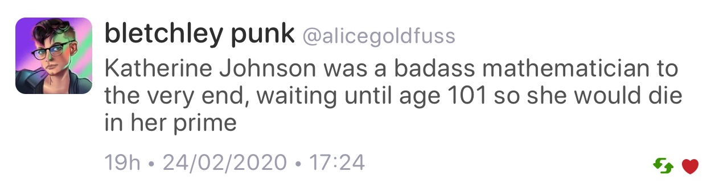

## Prague Trip Reports

* [Bryce Lelbach et al.](https://www.reddit.com/r/cpp/comments/f47x4o/202002_prague_iso_c_committee_trip_report_c20_is/)
  * 252 attendees! 23 subgroups! 9 tracks!
  * **C++20** is done!
  * **C++23** roadmap! **Standard library modules**; **library support for coroutines**; **executors**; **networking**. Also: reflection; pattern matching; contracts.
* [Herb Sutter](https://herbsutter.com/2020/02/15/trip-report-winter-iso-c-standards-meeting-prague/)
  * [Reddit](https://www.reddit.com/r/cpp/comments/f4p2nn/herb_sutters_trip_winter_iso_c_standards_meeting/)
* [CppCast with Hana Dusíková](https://cppcast.com/hana-dusikova-prague-trip-report/)
  * [YouTube](https://youtu.be/YQOqQGgQFE0)

## C++20 is here

* [Video](https://youtu.be/AvPiGstxV_g)
* [Reddit](https://www.reddit.com/r/programming/comments/f5tw69/c20_is_here/)

## Bjarne Stroustrup on C++20's significance

* [ISO C++](https://isocpp.org//blog/2020/02/bjarne-stroustrup-on-cpp20s-significance)
  * [Reddit](https://www.reddit.com/r/cpp/comments/f7h6xn/bjarne_stroustrup_on_c20s_significance/)

Quote:

* 30 years of C++ standardization.
* 40 years of C++.
* C++20 is the 6th standard, the 3rd major standard; by “major” I mean “changes the way people think.”
* This is something like the 75th meeting; I have been at about 70 of those.

## Excited about C++20

* [Reddit](https://www.reddit.com/r/cpp/comments/f62nyr/are_you_excited_about_c_20/)

[Comment](https://www.reddit.com/r/cpp/comments/f62nyr/are_you_excited_about_c_20/fi2vjbg/):

> I work in a large codebase that was originally written in C and was compiled with C++03 just a few years ago. Since then, we have upgraded through C++11, C++14 and are now using C++17.
> So far, my experience is that every upgrade has been almost exclusively a positive experience, and each version has made it easier to write safe and expressive code.

## Concepts pushed to Clang master


* [Reddit](https://www.reddit.com/r/cpp/comments/esamj3/concepts_merged_to_clang_trunk/)

## [C++ coroutines] Initial implementation pushed to GCC master

* [Message](https://gcc.gnu.org/ml/gcc-patches/2020-01/msg01096.html)
* [Reddit](https://www.reddit.com/r/cpp/comments/eqrv1n/gcc_c_coroutines_initial_implementation_pushed_to/)

> This is not enabled by default (even for **-std=c++2a**), it needs **-fcoroutines**

## How to keep up with C++ news

* [Reddit](https://www.reddit.com/r/cpp/comments/f7dz9s/those_that_started_c_before_11_how_do_you_keep_in/)
  * blog posts
  * code reviews
  * follow the C++ tag on StackOverflow
  * follow C++ conference talks
  * [cppreference.com](https://cppreference.com)
  * books
  * read proposals
  * join the commitee!
  * don't...

## CppCast Ep. 233: Large Scale C++ with John Lakos

* [Audio](https://cppcast.com/john-lakos-large-scale-cpp/)
* [Video](https://youtu.be/cP_kjF63WAY)

> There's a misunderstanding (of contracts in the C++ committee -- GD) that's not easy to appreciate if you're not a real day-to-day software engineer. That is what derailed contracts. I will fix it. I promise you, I will fix it.

## Follow-up: Aggregates

From [CppReference](https://en.cppreference.com/w/cpp/language/aggregate_initialization): An aggregate is one of the following types:

* array type
* class type (typically, `struct` or `union`), that has
  * no private or protected *direct* (since C++17) non-static data members
  * no *user-declared constructors* (until C++11)
  * no *user-provided constructors* (explicitly defaulted or deleted constructors are allowed) (since C++11) (until C++17)
  * no *user-provided, inherited, or explicit constructors* (explicitly defaulted or deleted constructors are allowed) (since C++17) (until C++20)
  * no *user-declared or inherited constructors* (since C++20)
  * no virtual, private, or *protected* (since C++17) base classes
  * no virtual member functions
  * no *default member initializers* (since C++11) (until C++14)

## Structured Exceptions (Win32) and C++

* [Raymond Chen: How can I handle both structured exceptions and C++ exceptions potentially coming from the same source?](https://devblogs.microsoft.com/oldnewthing/20200116-00/?p=103333)
  * [Reddit](https://www.reddit.com/r/cpp/comments/epwpx3/how_can_i_handle_both_structured_exceptions_and_c/)
* [Raymond Chen: Can I throw a C++ exception from a structured exception?](https://devblogs.microsoft.com/oldnewthing/?p=96706)

## "Making new friends" idiom by Dan Saks

[Wikibooks](https://en.wikibooks.org/wiki/More_C%2B%2B_Idioms/Making_New_Friends)

> The goal is to simplify creation of friend functions for a class template.

```cpp
template<typename T>
class Foo {
   T value;
public:
   Foo(const T& t) { value = t; }
   friend ostream& operator <<(ostream& os, const Foo<T>& b)
   {
      return os << b.value;
   }
};
```

## A new decade, a new tool: **libman**

* [Colby Pike (vector-of-bool)](https://vector-of-bool.github.io/2020/01/06/new-decade.html)
* [Reddit](https://www.reddit.com/r/cpp/comments/ekwb4y/a_new_decade_a_new_tool/)
* [GitHub](https://github.com/vector-of-bool/libman)
* [Specification](https://api.csswg.org/bikeshed/?force=1&url=https://raw.githubusercontent.com/vector-of-bool/libman/develop/data/spec.bs)

**libman** is a new level of indirection between package management and build systems.

**dds** is Drop-Dead Simple build and package manager.

* [CppCon 2019: Robert Schumacher “How to Herd 1,000 Libraries”](https://youtu.be/Lb3hlLlHTrs)

## A hidden gem: `inner_product` (1/2)

* [Article](https://marcoarena.wordpress.com/2017/11/14/a-hidden-gem-inner_product/)

## A hidden gem: `inner_product` (2/2)

{width=50%}

## Unreal Engine Gameplay Framework Primer for C++

* [Article](http://www.tomlooman.com/ue4-gameplay-framework/)

## Twitter: Pure virtual function syntax (1/2)


## Twitter: Pure virtual function syntax (2/2)


## Move, simply

* [Herb Sutter](https://herbsutter.com/2020/02/17/move-simply/)
  * [HackerNews](https://news.ycombinator.com/item?id=22349302)

> The state of `a` after it has been moved from is the same as the state of `a` after any other non-const operation. Move is just another non-constfunction that might (or might not) change the value of the source object.

* [*Move, even more simply* by Corentin Jabot](https://cor3ntin.github.io/posts/move/)

> In the absence of other information, do not do anything to an object on which `std::move` has been called, except assignment operator and destructor.

## The C++ Lifetime Profile: How It Plans to Make C++ Code Safer

* [Daniel Martin](https://pspdfkit.com/blog/2020/the-cpp-lifetime-profile/)

## EnTT

A header-only, tiny and easy to use library for game programming and much more written in modern C++, mainly known for its innovative entity-component-system (ECS) model.

* [GitHub](https://github.com/skypjack/entt) (C++17, MIT)
* [Reddit](https://www.reddit.com/r/programming/comments/f7twdf/entt_v330_is_out_gaming_meets_modern_c/)

## Favourite "You can do that in C++?! Neat!" moments

[Reddit](https://www.reddit.com/r/cpp/comments/f6wlbm/what_arewere_your_favourite_you_can_do_that_neat/)

[Range-for loops](https://www.reddit.com/r/cpp/comments/f6wlbm/what_arewere_your_favourite_you_can_do_that_neat/fi7oyou/), [fold expressions](https://www.reddit.com/r/cpp/comments/f6wlbm/what_arewere_your_favourite_you_can_do_that_neat/fi7o43i/), [streams](https://www.reddit.com/r/cpp/comments/f6wlbm/what_arewere_your_favourite_you_can_do_that_neat/fi87f6y/), [template definition in .cpp file](https://www.reddit.com/r/cpp/comments/f6wlbm/what_arewere_your_favourite_you_can_do_that_neat/fi87nhw/), [RAII](https://www.reddit.com/r/cpp/comments/f6wlbm/what_arewere_your_favourite_you_can_do_that_neat/fi8ssoj/), [operator overloading](https://www.reddit.com/r/cpp/comments/f6wlbm/what_arewere_your_favourite_you_can_do_that_neat/fi89ryw/), [function/constructor `try` block](https://www.reddit.com/r/cpp/comments/f6wlbm/what_arewere_your_favourite_you_can_do_that_neat/fi8h075/), [placement `new`](https://www.reddit.com/r/cpp/comments/f6wlbm/what_arewere_your_favourite_you_can_do_that_neat/fi8i7cj/), [structured bindings](https://www.reddit.com/r/cpp/comments/f6wlbm/what_arewere_your_favourite_you_can_do_that_neat/fi8odaz/), [taking address of a label](https://www.reddit.com/r/cpp/comments/f6wlbm/what_arewere_your_favourite_you_can_do_that_neat/fi7qrbv/), [variadic templates](https://www.reddit.com/r/cpp/comments/f6wlbm/what_arewere_your_favourite_you_can_do_that_neat/fi7oflw/), [overloading `operator,`](https://www.reddit.com/r/cpp/comments/f6wlbm/what_arewere_your_favourite_you_can_do_that_neat/fi93qjh/), [algorithms](https://www.reddit.com/r/cpp/comments/f6wlbm/what_arewere_your_favourite_you_can_do_that_neat/fi9fm9w/), and many more.

## Quote

Oscar Godson:

> One of the best programming skills you can have is knowing when to walk away for a while.

## Rust is better than C++20, by David Sankel

David Sankel, "We Have C++20" bloopers:

> (C++) is like Rust, but worse.

Operator:

> What's better about Rust?

David Sankel:

> I don't know, I haven't actually used Rust.

## Twitter: Katherine Johnson


