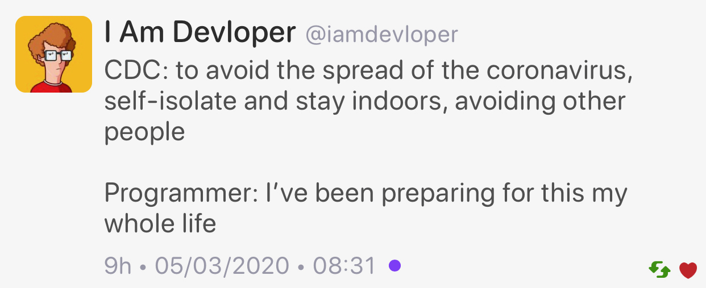

## C++ Events Affected By Coronavirus

* [Reddit](https://www.reddit.com/r/cpp/comments/fidita/c_events_affected_by_coronavirus/)
  * [Reddit: Varna ISO meeting postponed](https://www.reddit.com/r/cpp/comments/fhldku/varna_iso_meeting_postponed/)

## Trip Report: C++ Standards Meeting in Prague, February 2020

* [Botond Ballo](https://botondballo.wordpress.com/2020/03/12/trip-report-c-standards-meeting-in-prague-february-2020/)
  * [Reddit](https://www.reddit.com/r/cpp/comments/fhkeg3/trip_report_c_standards_meeting_in_prague/)

## How I Declare My class And Why

* [Howard Hinnant](http://howardhinnant.github.io/classdecl.html)
  * [Reddit](https://www.reddit.com/r/cpp/comments/f918oz/how_i_declare_my_class_and_why_howard_e_hinnant/)
  * [Coding guidelines](http://howardhinnant.github.io/coding_guidelines.html)

Order:

* data members
* destructor
* default constructor
* copy special members
* move special members
* other constructors
* other member functions

## References, simply

* [Herb Sutter](https://herbsutter.com/2020/02/23/references-simply/)
  * [Reddit](https://www.reddit.com/r/cpp/comments/f8jrfk/references_simply/)

## Dangerous elements of modern C++

* [Reddit](https://www.reddit.com/r/cpp/comments/fa9g4t/dangerous_elements_of_modern_c/)

## Coronavirus

