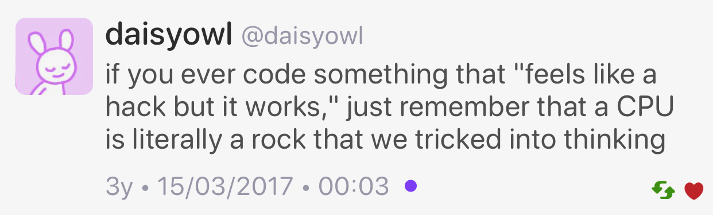

## Prague trip report

* [Timur Doumler](https://timur.audio/trip-report-february-2020-iso-c-committee-meeting-prague)
* [Reddit](https://timur.audio/trip-report-february-2020-iso-c-committee-meeting-prague)

> I personally believe that C++20 is the most important update of the standard in this language’s history.

## Post-Prague mailing

* [mailing2020-03](http://www.open-std.org/jtc1/sc22/wg21/docs/papers/2020/#mailing2020-03)
* [Reddit](https://www.reddit.com/r/cpp/comments/fnu3nu/post_prague_mailing_is_posted/)

## Include guards vs. #pragma once (1/2)

* [Microsoft](https://docs.microsoft.com/en-us/cpp/preprocessor/once?view=vs-2019)

We recommend the `#pragma once` directive for new code because it doesn't pollute the global namespace with a preprocessor symbol. It requires less typing, is less distracting, and can't cause symbol collisions, errors caused when different header files use the same preprocessor symbol as the guard value.

* [CppReference](https://en.cppreference.com/w/cpp/preprocessor/impl)

Unlike header guards, this pragma makes it impossible to erroneously use the same macro name in more than one file. OTOH, since with `#pragma once` files are excluded based on their filesystem-level identity, this can't protect against including a header twice if it exists in more than one location in a project.

## Include guards vs. #pragma once (2/2)

* [C++ Core Guidelines](https://github.com/isocpp/CppCoreGuidelines/blob/master/CppCoreGuidelines.md#note-340)

Some implementations offer vendor extensions like `#pragma once` as alternative to include guards. It is not standard and it is not portable. It injects the hosting machine's filesystem semantics into your program, in addition to locking you down to a vendor. Our recommendation is to write in ISO C++.

## Follow-up: How I Declare My class And Why, by Howard Hinnant

* [Howard Hinnant](http://howardhinnant.github.io/classdecl.html)
  * [Reddit](https://www.reddit.com/r/cpp/comments/f918oz/how_i_declare_my_class_and_why_howard_e_hinnant/)
  * [Coding guidelines](http://howardhinnant.github.io/coding_guidelines.html)

Order:

* data members
* destructor
* default constructor
* copy special members
* move special members
* other constructors
* other member functions

## Follow-up: References, simply, by Herb Sutter

* [Herb Sutter](https://herbsutter.com/2020/02/23/references-simply/)
  * [Reddit](https://www.reddit.com/r/cpp/comments/f8jrfk/references_simply/)

## What syntax changes would you make to C++ if you had the chance?

* [Reddit](https://www.reddit.com/r/cpp/comments/ftesce/what_syntax_changes_would_you_make_to_c_if_you/)

## C++ links: standard & standardization

* [GitHub](https://github.com/MattPD/cpplinks/blob/master/std.md)

## C++ links: Executables - Linking and Loading

* [GitHub](https://github.com/MattPD/cpplinks/blob/master/executables.linking_loading.md)

## C++ YouTubers

[Reddit](https://www.reddit.com/r/cpp/comments/f79ws0/cpp_youtubers/)

* [Casey Muratori aka HandmadeHero](https://www.youtube.com/user/handmadeheroarchive)
* [C++ Weekly by Jason Turner](https://www.youtube.com/user/lefticus1)
* [Jonathan Blow](https://www.youtube.com/user/jblow888)
* [TheChernoProject](https://www.youtube.com/user/TheChernoProject)
* [Bo Quian](https://www.youtube.com/channel/UCEOGtxYTB6vo6MQ-WQ9W_nQ)
* [Hopson](https://www.youtube.com/channel/UCeQhZOvNKSBRU0Mdg7V44wA)
* [OneLoneCoder](https://www.youtube.com/channel/UC-yuWVUplUJZvieEligKBkA)

## Would you pick C++ for your own pet project in 2020?

* [Reddit](https://www.reddit.com/r/cpp/comments/fmaezz/would_you_pick_c_for_your_own_pet_project_in_2020/)

## Why so many people hate C++?

* [Reddit](https://www.reddit.com/r/cpp/comments/fm5h6r/why_so_many_people_hate_c/)

> C++ gets a lot of hate because there are many really bad C++ programmers that think they're good and we're still cleaning up their messes. It's given the illusion that the language is bad because it allows them to do this. [Link](https://www.reddit.com/r/cpp/comments/fm5h6r/why_so_many_people_hate_c/fl2ripl?utm_source=share&utm_medium=web2x)

> “There are only two kinds of languages: the ones people complain about and the ones nobody uses.” -- Bjarne Stroustrup [via Tony Van Eerd](https://www.reddit.com/r/cpp/comments/fm5h6r/why_so_many_people_hate_c/fl2wve7?utm_source=share&utm_medium=web2x)

> Most of them failed to learn C++, mostly because they tried to learn from someone who didn't know C++. [Link](https://www.reddit.com/r/cpp/comments/fm5h6r/why_so_many_people_hate_c/fl2ipt4?utm_source=share&utm_medium=web2x)

## Analyze your builds programmatically with the C++ Build Insights SDK

* [MSVC Blog](https://devblogs.microsoft.com/cppblog/analyze-your-builds-programmatically-with-the-c-build-insights-sdk/)
* [Reddit](https://www.reddit.com/r/cpp/comments/fegtup/analyze_your_builds_programmatically_with_the_c/)
* [vcperf on GitHub](https://github.com/microsoft/vcperf)

## for_each vs for

* [Reddit](https://www.reddit.com/r/cpp/comments/fadeu2/for_each_vs_for/)

## TOML++

* [toml++](https://marzer.github.io/tomlplusplus/) (C++17, MIT)
* [Reddit](https://www.reddit.com/r/programming/comments/ffk4gf/toml_toml_config_parsing_and_serializing_library/)

See also: [TOML Spec V0.5.0](https://github.com/toml-lang/toml/blob/master/versions/en/toml-v0.5.0.md)

## EnTT

A header-only, tiny and easy to use library for game programming and much more written in modern C++, mainly known for its innovative entity-component-system (ECS) model.

* [GitHub](https://github.com/skypjack/entt) (C++17, MIT)
* [Reddit](https://www.reddit.com/r/programming/comments/f7twdf/entt_v330_is_out_gaming_meets_modern_c/)

## Unreal Engine Gameplay Framework Primer for C++

* [Article](http://www.tomlooman.com/ue4-gameplay-framework/)

## The C++ Lifetime Profile: How It Plans to Make C++ Code Safer

* [Daniel Martin](https://pspdfkit.com/blog/2020/the-cpp-lifetime-profile/)

## The C++ rvalue lifetime disaster, by Arno Schödl

* [Video](https://www.youtube.com/watch?v=s9vBk5CxFyY)
* [Article by Arthur O'Dwyer](https://quuxplusone.github.io/blog/2020/03/04/rvalue-lifetime-disaster/)
* [Reddit](https://www.reddit.com/r/cpp/comments/fdi5pb/thoughts_on_the_c_rvalue_lifetime_disaster/)

See also: [Abseil Tip of the Week #107: Reference Lifetime Extension](https://abseil.io/tips/107)

```cpp
std::string Foo::GetName();
const std::string& name = obj.GetName();  // Is this safe/legal?
```

## A new decade, a new tool: **libman**

* [Colby Pike (vector-of-bool)](https://vector-of-bool.github.io/2020/01/06/new-decade.html)
* [Reddit](https://www.reddit.com/r/cpp/comments/ekwb4y/a_new_decade_a_new_tool/)
* [GitHub](https://github.com/vector-of-bool/libman)
* [Specification](https://api.csswg.org/bikeshed/?force=1&url=https://raw.githubusercontent.com/vector-of-bool/libman/develop/data/spec.bs)

**libman** is a new level of indirection between package management and build systems.

**dds** is Drop-Dead Simple build and package manager.

* [CppCon 2019: Robert Schumacher “How to Herd 1,000 Libraries”](https://youtu.be/Lb3hlLlHTrs)

## "Making new friends" idiom by Dan Saks

[Wikibooks](https://en.wikibooks.org/wiki/More_C%2B%2B_Idioms/Making_New_Friends)

> The goal is to simplify creation of friend functions for a class template.

```cpp
#include <iostream>
template<typename T>
class Foo {
   T value;
public:
   Foo(const T& t) { value = t; }
   friend std::ostream& operator <<(std::ostream& os, const Foo<T>& b)
   {
      return os << b.value;
   }
};
```

## A hidden gem: `inner_product` (1/2)

* [Article](https://marcoarena.wordpress.com/2017/11/14/a-hidden-gem-inner_product/)

## A hidden gem: `inner_product` (2/2)

{width=50%}

## Structured Exceptions (Win32) and C++

* [Raymond Chen: How can I handle both structured exceptions and C++ exceptions potentially coming from the same source?](https://devblogs.microsoft.com/oldnewthing/20200116-00/?p=103333)
  * [Reddit](https://www.reddit.com/r/cpp/comments/epwpx3/how_can_i_handle_both_structured_exceptions_and_c/)
* [Raymond Chen: Can I throw a C++ exception from a structured exception?](https://devblogs.microsoft.com/oldnewthing/?p=96706)

## How to Pass Class Member Functions to STL Algorithms

* [Article by Jonathan Boccara](https://www.fluentcpp.com/2020/03/06/how-to-pass-class-member-functions-to-stl-algorithms/)
* [Reddit](https://www.reddit.com/r/cpp/comments/febn53/fluent_c_how_to_pass_class_member_functions_to/)

[STL writes](https://www.reddit.com/r/cpp/comments/febn53/fluent_c_how_to_pass_class_member_functions_to/fjn009x?utm_source=share&utm_medium=web2x):

> `mem_fn` is less typing, but lambdas are higher performance (MSVC’s optimizer can’t see through `mem_fn`’s data member) and can handle overloaded/templated member functions much more easily.

## Parameter passing, by Raymond Chen, Microsoft

* [If you plan on keeping the parameter anyway, then there’s no need to have separate `T const&` and `T&&` overloads](https://devblogs.microsoft.com/oldnewthing/20200219-00/?p=103452)
* [If you’re not keeping the parameter, then you still want to have separate `T const&` and `T&&` overloads](https://devblogs.microsoft.com/oldnewthing/20200220-00/?p=103463)
* [Reddit](https://www.reddit.com/r/cpp/comments/f73g4a/if_youre_not_keeping_the_parameter_then_you_still/)

## Modern std::byte stream IO for C++

* [Reddit](https://www.reddit.com/r/cpp/comments/fe72kp/modern_stdbyte_stream_io_for_c/)
* [Paper PDF](https://github.com/Lyberta/cpp-io/raw/master/generated/Paper.pdf)
* [Paper GitHub](https://github.com/Lyberta/cpp-io)
* [Reference implementation](https://github.com/Lyberta/cpp-io-impl)

## Doxygen and XML comments in Visual Studio

* [VS Blog](https://devblogs.microsoft.com/cppblog/doxygen-and-xml-doc-comment-support/?WT.mc_id=reddit-social-marouill)

## Book: The C++ Annotations, V11.4.0

* [C++ Annotations Version 11.4.0, by Frank B. Brokken](http://www.icce.rug.nl/documents/cplusplus)
* [Reddit 1](https://www.reddit.com/r/cpp/comments/62lqfn/the_c_annotations_a_free_gpl_uptodate_c17/)
* [Reddit 2](https://www.reddit.com/r/cpp/comments/fqkf51/the_c_annotations_a_free_gpl_uptodate_c20/)

## High performance SQLite, PostgreSQL, MySQL sync & async drivers

* [Lithium](https://github.com/matt-42/lithium/tree/master/libraries/sql)
* [Reddit](https://www.reddit.com/r/cpp/comments/fn31cp/high_performance_sqlite_postgresql_mysql_sync/)

## Twitter


