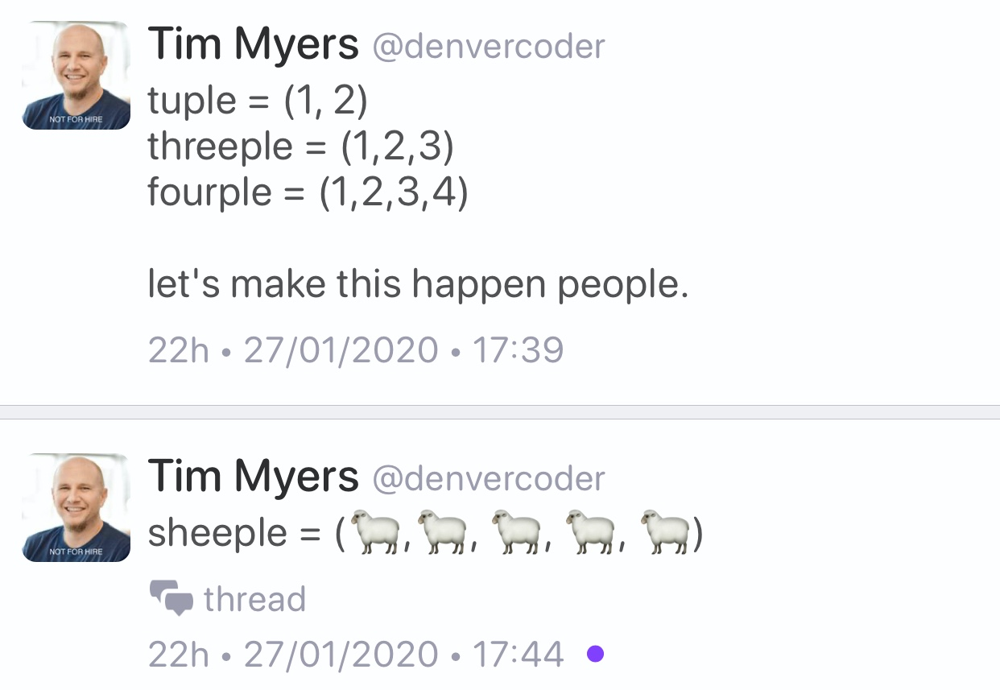

## Follow-up: How I Declare My class And Why, by Howard Hinnant

* [Howard Hinnant](http://howardhinnant.github.io/classdecl.html)
* [Reddit](https://www.reddit.com/r/cpp/comments/f918oz/how_i_declare_my_class_and_why_howard_e_hinnant/)
* [Coding guidelines](http://howardhinnant.github.io/coding_guidelines.html)

Order:

* data members
* destructor
* default constructor
* copy special members
* move special members
* other constructors
* other member functions

## Follow-up: References, simply, by Herb Sutter

* [Herb Sutter](https://herbsutter.com/2020/02/23/references-simply/)
* [Reddit](https://www.reddit.com/r/cpp/comments/f8jrfk/references_simply/)

## Welcome back to C++ - Modern C++

* [Microsoft](https://docs.microsoft.com/en-us/cpp/cpp/welcome-back-to-cpp-modern-cpp?view=vs-2019)
* [Reddit](https://www.reddit.com/r/programming/comments/g002s9/welcome_back_to_c/)

## Epic 10-hour C++ port of Doom

* [YouTube video by Jason Turner](https://youtu.be/0dkzLdqH9V4)

## Elements C++ GUI library, by Joel de Guzman

* [Home](http://cycfi.github.io/elements/)
* [GitHub](https://github.com/cycfi/elements) (C++17, MIT)

## {fmt} V6.2.0

* [GitHub](https://github.com/fmtlib/fmt/releases/tag/6.2.0)
* [Reddit](https://www.reddit.com/r/cpp/comments/fvyixl/fmt_62_released_with_improved_error_reporting/)

## Continuable V4.0

C++14 asynchronous allocation aware futures (supporting then, exception handling, coroutines and connections), by Denis Blank

* [GitHub](https://github.com/Naios/continuable) (C++14, MIT)
* [Docs](https://naios.github.io/continuable/)
* [Reddit](https://www.reddit.com/r/cpp/comments/fw1dhx/continuable_40_released_zero_cost_futures_now/)

## IceCream-Cpp

Sweet and creamy print debugging. C++ flavored, by Renato Garcia

* [GitHub](https://github.com/renatoGarcia/icecream-cpp)
* [Reddit](https://www.reddit.com/r/cpp/comments/fun91l/icecreamcpp_a_c_helper_library_to_print_debugging/)

## The C++ Lifetime Profile: How It Plans to Make C++ Code Safer

* [Daniel Martin](https://pspdfkit.com/blog/2020/the-cpp-lifetime-profile/)

## The C++ rvalue lifetime disaster, by Arno Schödl

* [Video](https://www.youtube.com/watch?v=s9vBk5CxFyY)
* [Article by Arthur O'Dwyer](https://quuxplusone.github.io/blog/2020/03/04/rvalue-lifetime-disaster/)
* [Reddit](https://www.reddit.com/r/cpp/comments/fdi5pb/thoughts_on_the_c_rvalue_lifetime_disaster/)

See also: [Abseil Tip of the Week #107: Reference Lifetime Extension](https://abseil.io/tips/107)

```cpp
std::string Foo::GetName();
const std::string& name = obj.GetName();  // Is this safe/legal?
```

## A new decade, a new tool: **libman**

* [Colby Pike (vector-of-bool)](https://vector-of-bool.github.io/2020/01/06/new-decade.html)
* [Reddit](https://www.reddit.com/r/cpp/comments/ekwb4y/a_new_decade_a_new_tool/)
* [GitHub](https://github.com/vector-of-bool/libman)
* [Specification](https://api.csswg.org/bikeshed/?force=1&url=https://raw.githubusercontent.com/vector-of-bool/libman/develop/data/spec.bs)

**libman** is a new level of indirection between package management and build systems.

**dds** is Drop-Dead Simple build and package manager.

* [CppCon 2019: Robert Schumacher “How to Herd 1,000 Libraries”](https://youtu.be/Lb3hlLlHTrs)

## "Making new friends" idiom by Dan Saks

[Wikibooks](https://en.wikibooks.org/wiki/More_C%2B%2B_Idioms/Making_New_Friends)

> The goal is to simplify creation of friend functions for a class template.

```cpp
#include <iostream>
template<typename T>
class Foo {
   T value;
public:
   Foo(const T& t) { value = t; }
   friend std::ostream& operator <<(std::ostream& os, const Foo<T>& b)
   {
      return os << b.value;
   }
};
```

## A hidden gem: `inner_product` (1/2)

* [Article](https://marcoarena.wordpress.com/2017/11/14/a-hidden-gem-inner_product/)

## A hidden gem: `inner_product` (2/2)

{width=50%}

## Structured Exceptions (Win32) and C++

* [Raymond Chen: How can I handle both structured exceptions and C++ exceptions potentially coming from the same source?](https://devblogs.microsoft.com/oldnewthing/20200116-00/?p=103333)
  * [Reddit](https://www.reddit.com/r/cpp/comments/epwpx3/how_can_i_handle_both_structured_exceptions_and_c/)
* [Raymond Chen: Can I throw a C++ exception from a structured exception?](https://devblogs.microsoft.com/oldnewthing/?p=96706)

## How to Pass Class Member Functions to STL Algorithms

* [Article by Jonathan Boccara](https://www.fluentcpp.com/2020/03/06/how-to-pass-class-member-functions-to-stl-algorithms/)
* [Reddit](https://www.reddit.com/r/cpp/comments/febn53/fluent_c_how_to_pass_class_member_functions_to/)

[STL writes](https://www.reddit.com/r/cpp/comments/febn53/fluent_c_how_to_pass_class_member_functions_to/fjn009x?utm_source=share&utm_medium=web2x):

> `mem_fn` is less typing, but lambdas are higher performance (MSVC’s optimizer can’t see through `mem_fn`’s data member) and can handle overloaded/templated member functions much more easily.

## Parameter passing, by Raymond Chen, Microsoft

* [If you plan on keeping the parameter anyway, then there’s no need to have separate `T const&` and `T&&` overloads](https://devblogs.microsoft.com/oldnewthing/20200219-00/?p=103452)
* [If you’re not keeping the parameter, then you still want to have separate `T const&` and `T&&` overloads](https://devblogs.microsoft.com/oldnewthing/20200220-00/?p=103463)
* [Reddit](https://www.reddit.com/r/cpp/comments/f73g4a/if_youre_not_keeping_the_parameter_then_you_still/)

## Modern std::byte stream IO for C++

* [Reddit](https://www.reddit.com/r/cpp/comments/fe72kp/modern_stdbyte_stream_io_for_c/)
* [Paper PDF](https://github.com/Lyberta/cpp-io/raw/master/generated/Paper.pdf)
* [Paper GitHub](https://github.com/Lyberta/cpp-io)
* [Reference implementation](https://github.com/Lyberta/cpp-io-impl)

## Book: The C++ Annotations, V11.4.0

* [C++ Annotations Version 11.4.0, by Frank B. Brokken](http://www.icce.rug.nl/documents/cplusplus)
* [Reddit 1](https://www.reddit.com/r/cpp/comments/62lqfn/the_c_annotations_a_free_gpl_uptodate_c17/)
* [Reddit 2](https://www.reddit.com/r/cpp/comments/fqkf51/the_c_annotations_a_free_gpl_uptodate_c20/)

## High performance SQLite, PostgreSQL, MySQL sync & async drivers

* [Lithium](https://github.com/matt-42/lithium/tree/master/libraries/sql)
* [Reddit](https://www.reddit.com/r/cpp/comments/fn31cp/high_performance_sqlite_postgresql_mysql_sync/)

## Format specifiers for C++ in the Visual Studio debugger

* [Microsoft](https://docs.microsoft.com/en-us/visualstudio/debugger/format-specifiers-in-cpp?view=vs-2019)

## Twitter


