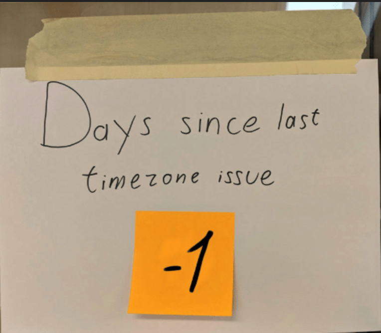
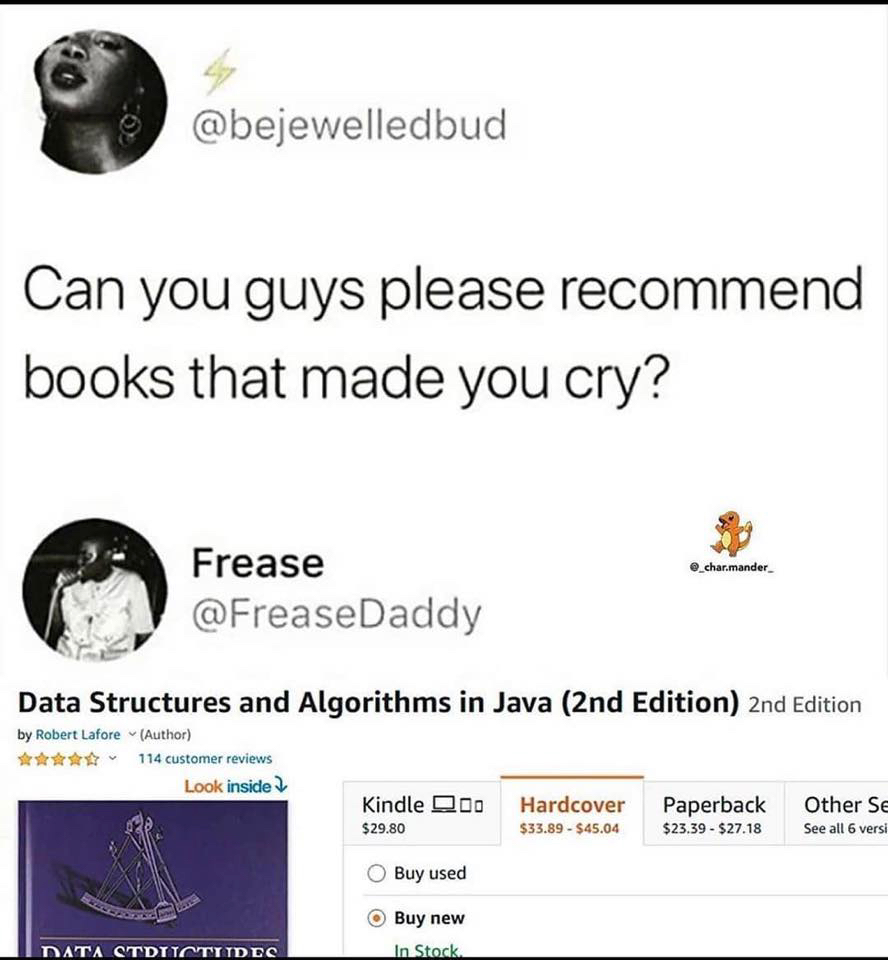

## The New York ISO C++ meeting is postponed

* [Herb Sutter](https://herbsutter.com/2020/05/20/the-new-york-iso-c-meeting-is-postponed/)

> We had already postponed the Varna meeting originally planned for June 1-6, and earlier today INCITS (the U.S. national body) announced that it was banning all face-to-face standards meetings for the rest of the year, so we are also postponing the New York meeting previously planned for November 9-14.

## AMA with Bjarne Stroustrup

* ["Ask Me Anything" with Bjarne Stroustrup](https://pldi20.sigplan.org/details/pldi-2020-ask-me-anything/4/-Ask-Me-Anything-with-Bjarne-Stroustrup)
  * [Webinar: Wed 17 Jun 2020 12:30 - 13:00](https://pldi20.sigplan.org/room/pldi-2020-venue-ama-webinar)
  * [Reddit](https://www.reddit.com/r/cpp/comments/gjxcjn/ask_me_anything_with_bjarne_stroustrup_pldi_2020/)

## mailing2020-05

* [mailing2020-05](http://www.open-std.org/jtc1/sc22/wg21/docs/papers/2020/#mailing2020-05)
  * [Reddit](https://www.reddit.com/r/cpp/comments/glwito/202005_c_standard_mailing/)

Select papers:

* [P2145R0 Evolving C++ Remotely](http://www.open-std.org/jtc1/sc22/wg21/docs/papers/2020/p2145r0.html)
* [P1861R1 Secure Networking in C++ (LEWG)](http://www.open-std.org/jtc1/sc22/wg21/docs/papers/2020/p1861r1.html)
* [P1985R2 Universal Template Parameters (EWGI)](http://www.open-std.org/jtc1/sc22/wg21/docs/papers/2020/p1985r1.pdf)
* [P2128R1 Multidimensional subscript operator (EWGI)](http://www.open-std.org/jtc1/sc22/wg21/docs/papers/2020/p2128r1.pdf)

## mailing2020-05

Select papers:

* [P2159R0 An Unbounded Decimal Floating-Point Type (LEWGI)](http://www.open-std.org/jtc1/sc22/wg21/docs/papers/2020/p2159r0.html)
* [P2163R0 Native Tuples in C++ (LEWG)](http://www.open-std.org/jtc1/sc22/wg21/docs/papers/2020/p2163r0.pdf): `<int, char> n1 = {1, 'x'};`
* [P2169R0 A nice placeholder with no name (EWG)](http://www.open-std.org/jtc1/sc22/wg21/docs/papers/2020/p2169r0.pdf): `auto[x, y, _] = f();`
* [P2172R0 What do we want from a modularized Standard Library? (LEWG)](http://www.open-std.org/jtc1/sc22/wg21/docs/papers/2020/p2172r0.pdf) "It is worth asking ourselves whether modularizing the standard library is the best use of our time."
* [P2142R1 Allow . operator to operate on pointers (EWGI)](http://www.open-std.org/jtc1/sc22/wg21/docs/papers/2020/p2142r1.pdf) -- _WHAT_.

## Goals and priorities for C++

* [P2137R0](http://www.open-std.org/jtc1/sc22/wg21/docs/papers/2020/p2137r0.html)

> This paper describes the goals and priorities which the authors believe make C++ an especially effective programming language for our use cases. That said, our experience, use cases, and needs are clearly not those of every user. We aren’t pushing to directly build consensus on these points. Rather, this is presented as a vehicle to advertise our needs from C++ as a high-performance systems language.

* [C++ proposal dismisses backward compatibility](https://www.infoworld.com/article/3535795/c-plus-plus-proposal-dismisses-backward-compatibility.html)
* [What If C++ Abandoned Backward Compatibility?](https://robert.ocallahan.org/2020/03/what-if-c-abandoned-backward.html)
* [Reddit 1](https://www.reddit.com/r/programming/comments/gnn6l3/c_proposal_dismisses_backward_compatibility/)
* [Reddit 2](https://www.reddit.com/r/compsci/comments/gnn6qj/c_proposal_dismisses_backward_compatibility/)

## Game developers vs. Modern C++

* [Vittorio Romeo - Modern C++ gamedev - thoughts & misconceptions](https://vittorioromeo.info/index/blog/gamedev_modern_cpp_thoughts.html)
  * [Reddit](https://www.reddit.com/r/cpp/comments/gkrquo/modern_c_gamedev_thoughts_misconceptions/)
  * [HackerNews](https://news.ycombinator.com/item?id=23202120)
* [unique_ptr - seven calls to dereference - why is this needed?](https://old.reddit.com/r/cpp/comments/b0sq6p/unique_ptr_seven_calls_to_dereference_why_is_this/)
* [Lightweight but still STL-compatible unique pointer](https://blog.magnum.graphics/backstage/lightweight-stl-compatible-unique-pointer/)

## IDEs and Text Editors for Writing C++ Code on a Large Scale

* [Daniel Martin (PSPDFKit)](https://pspdfkit.com/blog/2020/ide-text-editors-cpp-large-scale/)
  * [Reddit](https://www.reddit.com/r/cpp/comments/gnaoop/ides_and_text_editors_for_writing_c_code_on_a/)

## Let's unravel the secrets behind C++17's structured bindings

* [Jean Guegant](https://jguegant.github.io/blogs/tech/structured-bindings.html)
  * [Reddit](https://www.reddit.com/r/cpp/comments/glnx3w/lets_unravel_the_secrets_behind_c17s_structured/)

## Starting C++ today with a strong Java background

* [Reddit](https://www.reddit.com/r/cpp/comments/gkizd4/starting_c_today_with_a_strong_java_background/)

## The C++ preprocessor doesn’t understand anything about C++, and certainly not templates

* [Raymond Chen](https://devblogs.microsoft.com/oldnewthing/20200508-52/?p=103735)
  * [Reddit](https://www.reddit.com/r/cpp/comments/ggeer7/the_c_preprocessor_doesnt_understand_anything/)

## How to modify a key in C++17 with `std::map::extract`

## Release: spdlog V1.6.0

* [GitHub](https://github.com/gabime/spdlog) (Header-only, MIT, C++11)
  * [V1.6.0 ](https://github.com/gabime/spdlog/releases/tag/v1.6.0)
  * [Reddit](https://www.reddit.com/r/cpp/comments/gk99fk/spdlog_160_released/)

## Release: Catch2 V3.0.0-preview2

* [GitHub](https://github.com/catchorg/Catch2/releases/tag/v3.0.0-preview2)
  * [Reddit: Catch2 now uses statically compiled library as its distribution model](https://www.reddit.com/r/cpp/comments/gjp548/catch2_v300_preview2_catch2_now_uses_statically/)

## Quote

Titus Winters:

> Software engineering is programming integrated over time.

## Twitter

## Twitter

