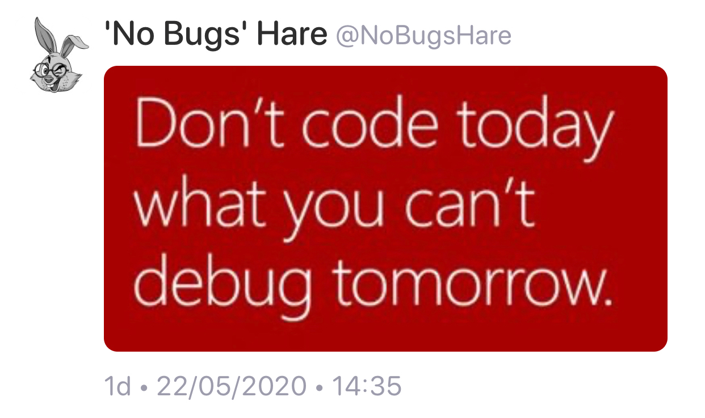

## What computer and software is used by the Falcon 9

* [Stack Overflow](https://space.stackexchange.com/a/9446)

The flight software is written in C/C++ and runs in the x86 environment.

They use Chromium and JavaScript for the Dragon 2 flight interface. The actual flight computers still run on C++.

* [Falcon 9 and Crew Dragon launch video (YouTube)](https://youtu.be/won6Ap9JnVw)

## C++20: The Unspoken Features

* [Michele Caini](https://humanreadablemag.com/issues/3/articles/cpp20-the-unspoken-features)
  * [Reddit](https://www.reddit.com/r/cpp/comments/gr3cjm/c20_the_unspoken_features/)

## Nifty Fold Expression Tricks

* [Jonathan Müller](https://foonathan.net/2020/05/fold-tricks/#content)
  * [Reddit](https://www.reddit.com/r/cpp/comments/gdvqiq/nifty_fold_expression_tricks/)

## Rvalue Ranges and Views in C++20

* [Tristan Brindle](https://tristanbrindle.com/posts/rvalue-ranges-and-views)
  * [Reddit](https://www.reddit.com/r/cpp/comments/ginnrf/rvalue_ranges_and_views_in_c20/)

## Enforcing locking with C++ nonmovable types

* [Jussi Pakkanen](https://nibblestew.blogspot.com/2020/05/enforcing-locking-with-c-nonmovable.html)
  * [Reddit](https://www.reddit.com/r/cpp/comments/ghr35m/enforcing_locking_with_c_nonmovable_types/)

## Starting C++ today with a strong Java background

* [Reddit](https://www.reddit.com/r/cpp/comments/gkizd4/starting_c_today_with_a_strong_java_background/)

## The C++ preprocessor doesn’t understand anything about C++, and certainly not templates

* [Raymond Chen](https://devblogs.microsoft.com/oldnewthing/20200508-52/?p=103735)
  * [Reddit](https://www.reddit.com/r/cpp/comments/ggeer7/the_c_preprocessor_doesnt_understand_anything/)

## How to modify a key in C++17 with `std::map::extract`

## Release: spdlog V1.6.0

* [GitHub](https://github.com/gabime/spdlog) (Header-only, MIT, C++11)
  * [V1.6.0 ](https://github.com/gabime/spdlog/releases/tag/v1.6.0)
  * [Reddit](https://www.reddit.com/r/cpp/comments/gk99fk/spdlog_160_released/)

## Release: Catch2 V3.0.0-preview2

* [GitHub](https://github.com/catchorg/Catch2/releases/tag/v3.0.0-preview2)
  * [Reddit: Catch2 now uses statically compiled library as its distribution model](https://www.reddit.com/r/cpp/comments/gjp548/catch2_v300_preview2_catch2_now_uses_statically/)

## Twitter

