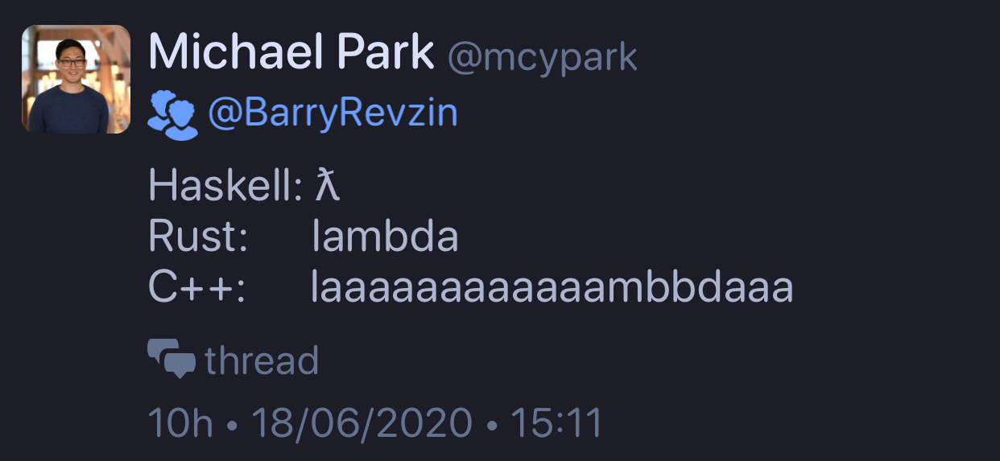
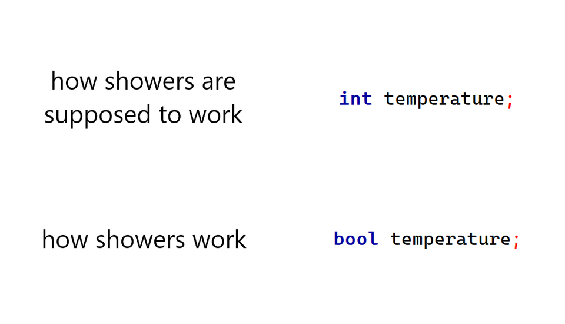

## In a hypothetical situation, backwards compatibility is no longer an issue in C++. What would you change about the core language or the standard library?

* [Reddit](https://www.reddit.com/r/cpp/comments/hf99xw/in_a_hypothetical_situation_backwards/)
  * Rust gets mentioned!

## C++11 Guide: A Practical Guide for the Everyday Programmer

* [Stuart Wheaton](https://stuartwheaton.com/blog/2020-06-14-c++11-guide/)
  * [Reddit](https://www.reddit.com/r/cpp/comments/h9qi9v/c11_guide_a_practical_guide_for_the_everyday/)

> [C++**11** posted on June 14, **2020**?](https://www.reddit.com/r/cpp/comments/h9qi9v/c11_guide_a_practical_guide_for_the_everyday/fuzpqnn?utm_source=share&utm_medium=web2x)

## Illustrative Boost 1.73 epoch report

* [Report](https://github.com/joaquintides/boost_epoch/blob/master/epoch_report.md)
  * [Reddit](https://www.reddit.com/r/cpp/comments/h84v7r/boost_epoch_proposal_illustrative_boost_173_epoch/)

## std::polymorphic_value + Duck Typing = Type Erasure, by Jonathan Müller

* [Article](https://foonathan.net/2020/01/type-erasure/)
  * [Reddit](https://www.reddit.com/r/cpp/comments/eq4b0h/stdpolymorphic_value_duck_typing_type_erasure/)
* [polymorphic_value (GitHub)](https://github.com/jbcoe/polymorphic_value/)
* [Better Code: Runtime Polymorphism - Sean Parent](https://youtu.be/QGcVXgEVMJg)

## Type Erasure by Andrzej

* [Part 1](https://akrzemi1.wordpress.com/2013/11/18/type-erasure-part-i/)
* [Part 2](https://akrzemi1.wordpress.com/2013/12/06/type-erasure-part-ii/)
* [Part 3](https://akrzemi1.wordpress.com/2013/12/11/type-erasure-part-iii/)
* [Part 4](https://akrzemi1.wordpress.com/2014/01/13/type-erasure-part-iv/)

## Type Erasure with Merged Concepts

* [Post by Andreas Herrmann](https://aherrmann.github.io/programming/2014/10/19/type-erasure-with-merged-concepts/)

## On the Tension Between Object-Oriented and Generic Programming in C++, and What Type Erasure Can Do About It

* [Article by Thomas Becker](https://www.artima.com/cppsource/type_erasure.html)

## Modern C++ Template

* [Filip Dutescu (GitHub)](https://github.com/filipdutescu/modern-cpp-template)
  * [Reddit](https://www.reddit.com/r/cpp/comments/gt0pz1/i_made_a_project_template_for_modern_c_projects/)

A template for modern C++ projects using CMake, clang-format and unit testing

## Runtime Polymorphism with `std::variant` and `std::visit`

* [Bartek Filipek](https://www.bfilipek.com/2020/04/variant-virtual-polymorphism.html)
  * [Reddit](https://www.reddit.com/r/cpp/comments/fvtf4j/runtime_polymorphism_with_stdvariant_and_stdvisit/)

## Cefal: library of functional typeclasses using C++20 concepts

* [GitHub](https://github.com/dkormalev/cefal) (C++20, BSD-3-Clause)
  * [Reddit](https://www.reddit.com/r/cpp/comments/g7mluk/cefal_library_of_functional_typeclasses_using_c20/)

## C++ Lambdas, Threads, std::async and Parallel Algorithms

* [B. Filipek](https://www.bfilipek.com/2020/05/lambdas-async.html?m=1)
  * [Reddit](https://www.reddit.com/r/cpp/comments/gufsdu/c_lambdas_threads_stdasync_and_parallel_algorithms/)

## Taskflow

Modern C++ Parallel Task Programming

* [Home](https://taskflow.github.io/#/)
* [GitHub](https://github.com/taskflow/)
* [Taskflow 2.5 announcement on Reddit](https://www.reddit.com/r/cpp/comments/gvbfix/taskflow_v250_released_with_a_new_visualization/)
* [Taskflow - C++ Parallel Tasking System, by Manoj Rao](http://www.mycpu.org/c++-taskflow/)

## The Darkest Pipeline - Multithreaded pipelines for modern C++

* [GitHub](https://github.com/JoelFilho/TDP)
  * [Reddit](https://www.reddit.com/r/cpp/comments/gmvlmu/the_darkest_pipeline_tdp_a_c17_library_for/)
    (Header-only, C++17, Boost Licence)

## C++ based Rest web server for large scale production environment

* [Reddit](https://www.reddit.com/r/cpp/comments/hftn0w/c_based_rest_web_server_for_large_scale/)
* [C++ libraries for restful micro services development](https://www.reddit.com/r/cpp/comments/gt0iol/c_libraries_for_restful_micro_services_development/fsa94kc/)

## Testing a Modern C++ workflow by coding a base85 decoder from scratch

* [German Diago Gomez](https://medium.com/@germandiagogomez/testing-a-modern-c-workflow-by-coding-a-base85-decoder-from-scratch-c6cde64984a9)
  * Emacs
  * Meson
  * C++20
* [Tom's Data Onion](https://www.tomdalling.com/toms-data-onion/)

## An Introduction to Parallel Computing in C++ (2016)

* [Notes](https://www.cs.cmu.edu/~15210/pasl.html)

The goal of these notes is to introduce the reader to the following.

1. Parallel computing in imperative programming languages and C++ in particular, and
2. Real-world performance and efficiency concerns in writing parallel software and techniques for dealing with them.

## Lambda Lambda Lambda

* [Barry Revzin](https://brevzin.github.io/c++/2020/06/18/lambda-lambda-lambda/)
  * [Reddit](https://brevzin.github.io/c++/2020/06/18/lambda-lambda-lambda/)

## The importance of choosing the right data type

