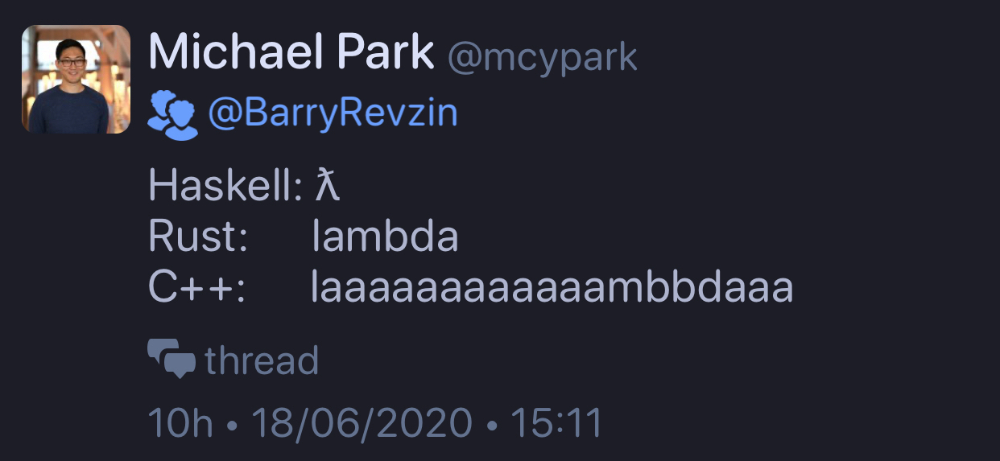
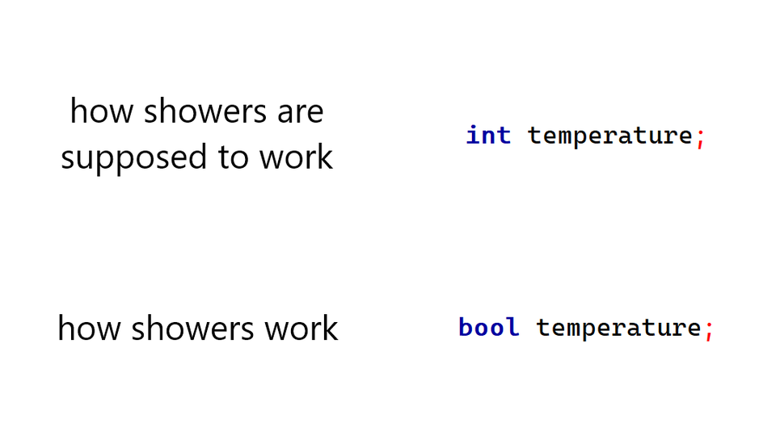

## June mailing

* [mailing2020-06](http://www.open-std.org/jtc1/sc22/wg21/docs/papers/2020/#mailing2020-06)
  * [Reddit](https://www.reddit.com/r/cpp/comments/hazwo1/june_2020_c_standard_mailing/?utm_source=share&utm_medium=web2x)

### Select papers

* [P2184R0 HOPL: Thriving in a Crowded and Changing World: C++ 2006–2020](http://www.open-std.org/jtc1/sc22/wg21/docs/papers/2020/p2184r0.pdf)
* [P2164R1 `views::enumerate`](http://www.open-std.org/jtc1/sc22/wg21/docs/papers/2020/p2164r1.pdf)
* [P2093R0 Formatted output](http://www.open-std.org/jtc1/sc22/wg21/docs/papers/2020/p2093r0.html)

C++20                                           Proposed
----------------------------------------------- ---------------------------------
`std::cout << std::format("Hello, {}!", name);` `std::print("Hello, {}!", name);`

## Best online data structures /algorithms c++ courses?

* [Reddit](https://www.reddit.com/r/cpp/comments/hj4hql/best_online_data_structures_algorithms_c_courses/)

### Links

* [Coursera: Algorithms, Part I (Prinston University)](https://www.coursera.org/learn/algorithms-part1)
* [Book: Competitive Programmer’s Handbook, by Antti Laaksonen, 2018](https://cses.fi/book/book.pdf)

## C++ is brilliant

* [Reddit](https://www.reddit.com/r/cpp/comments/hmj4s5/c_is_brilliant/)

## What is the "difficult" part of C++?

* [Reddit](https://www.reddit.com/r/cpp/comments/hlittq/what_is_the_difficult_part_of_c/)

> C++ is kind of like quantum physics: the more you understand it the less you understand it. [#](https://www.reddit.com/r/cpp/comments/hlittq/what_is_the_difficult_part_of_c/fwzdp88?utm_source=share&utm_medium=web2x)

## In a hypothetical situation, backwards compatibility is no longer an issue in C++. What would you change about the core language or the standard library?

* [Reddit](https://www.reddit.com/r/cpp/comments/hf99xw/in_a_hypothetical_situation_backwards/)
  * Rust gets mentioned!

## C++ is too slow to compile

* [Reddit](https://www.reddit.com/r/cpp/comments/hj66pd/c_is_too_slow_to_compile_can_you_share_all_your/?utm_source=share&utm_medium=web2x)

### Tools

* [Build time profiler for Clang](https://aras-p.info/blog/2019/01/16/time-trace-timeline-flame-chart-profiler-for-Clang/)
* [Clang Build Analyzer](https://github.com/aras-p/ClangBuildAnalyzer)

## Microsoft: Rust Is the Industry’s ‘Best Chance’ at Safe Systems Programming

* [Microsoft](https://thenewstack.io/microsoft-rust-is-the-industrys-best-chance-at-safe-systems-programming/)
  * [Reddit](https://www.reddit.com/r/cpp/comments/h77a0z/microsoft_rust_is_the_industrys_best_chance_at/?utm_source=share&utm_medium=web2x)

> Rust is a great language. Like C++, it trusts the programmer, and like Java, it doesn't trust the programmer. [#](https://www.reddit.com/r/cpp/comments/h77a0z/microsoft_rust_is_the_industrys_best_chance_at/fupyse1?utm_source=share&utm_medium=web2x)

* [CXX — safe FFI between Rust and C++](https://github.com/dtolnay/cxx)

## C++11 Guide: A Practical Guide for the Everyday Programmer

* [Stuart Wheaton](https://stuartwheaton.com/blog/2020-06-14-c++11-guide/)
  * [Reddit](https://www.reddit.com/r/cpp/comments/h9qi9v/c11_guide_a_practical_guide_for_the_everyday/)

> [C++**11** posted on June 14, **2020**?](https://www.reddit.com/r/cpp/comments/h9qi9v/c11_guide_a_practical_guide_for_the_everyday/fuzpqnn?utm_source=share&utm_medium=web2x)

## Illustrative Boost 1.73 epoch report

* [Report](https://github.com/joaquintides/boost_epoch/blob/master/epoch_report.md)
  * [Reddit](https://www.reddit.com/r/cpp/comments/h84v7r/boost_epoch_proposal_illustrative_boost_173_epoch/)

## Hiding C++ template parameter packs in a tuple

* [Raymond Chen](https://devblogs.microsoft.com/oldnewthing/20200529-00/?p=103810)

## std::chrono cheatsheet

* [Gist](https://gist.github.com/mortie/bf21c9d2d53b83f3be1b45b76845f090)
  * [Reddit](https://www.reddit.com/r/cpp/comments/e97i6f/i_made_a_cheat_sheet_for_stdchrono_because_i_have/)
* [Howard Hinnant's date library](https://github.com/HowardHinnant/date)

## std::polymorphic_value + Duck Typing = Type Erasure, by Jonathan Müller

* [Article](https://foonathan.net/2020/01/type-erasure/)
  * [Reddit](https://www.reddit.com/r/cpp/comments/eq4b0h/stdpolymorphic_value_duck_typing_type_erasure/)
* [polymorphic_value (GitHub)](https://github.com/jbcoe/polymorphic_value/)
* [Better Code: Runtime Polymorphism - Sean Parent](https://youtu.be/QGcVXgEVMJg)

## Modern C++ Template

* [Filip Dutescu (GitHub)](https://github.com/filipdutescu/modern-cpp-template)
  * [Reddit](https://www.reddit.com/r/cpp/comments/gt0pz1/i_made_a_project_template_for_modern_c_projects/)

A template for modern C++ projects using CMake, clang-format and unit testing

## Quick reference of C++ value categories

* [Part 1](https://habr.com/ru/post/479342/)
* [Part 2](https://habr.com/ru/post/479358/)

## Runtime Polymorphism with `std::variant` and `std::visit`

* [Bartek Filipek](https://www.bfilipek.com/2020/04/variant-virtual-polymorphism.html)
  * [Reddit](https://www.reddit.com/r/cpp/comments/fvtf4j/runtime_polymorphism_with_stdvariant_and_stdvisit/)

## Cefal: library of functional typeclasses using C++20 concepts

* [GitHub](https://github.com/dkormalev/cefal) (C++20, BSD-3-Clause)
  * [Reddit](https://www.reddit.com/r/cpp/comments/g7mluk/cefal_library_of_functional_typeclasses_using_c20/)

## C++ Lambdas, Threads, std::async and Parallel Algorithms

* [B. Filipek](https://www.bfilipek.com/2020/05/lambdas-async.html?m=1)
  * [Reddit](https://www.reddit.com/r/cpp/comments/gufsdu/c_lambdas_threads_stdasync_and_parallel_algorithms/)

## Taskflow

Modern C++ Parallel Task Programming

* [Home](https://taskflow.github.io/#/)
* [GitHub](https://github.com/taskflow/)
* [Taskflow 2.5 announcement on Reddit](https://www.reddit.com/r/cpp/comments/gvbfix/taskflow_v250_released_with_a_new_visualization/)
* [Taskflow - C++ Parallel Tasking System, by Manoj Rao](http://www.mycpu.org/c++-taskflow/)

## Library: NameOf

* [GitHub](https://github.com/Neargye/nameof) (C++17, header-only, MIT)

## The Darkest Pipeline - Multithreaded pipelines for modern C++

* [GitHub](https://github.com/JoelFilho/TDP)
  * [Reddit](https://www.reddit.com/r/cpp/comments/gmvlmu/the_darkest_pipeline_tdp_a_c17_library_for/)
    (Header-only, C++17, Boost Licence)

## C++ based Rest web server for large scale production environment

* [Reddit](https://www.reddit.com/r/cpp/comments/hftn0w/c_based_rest_web_server_for_large_scale/)
* [C++ libraries for restful micro services development](https://www.reddit.com/r/cpp/comments/gt0iol/c_libraries_for_restful_micro_services_development/fsa94kc/)

## Testing a Modern C++ workflow by coding a base85 decoder from scratch

* [German Diago Gomez](https://medium.com/@germandiagogomez/testing-a-modern-c-workflow-by-coding-a-base85-decoder-from-scratch-c6cde64984a9)
  * Emacs
  * Meson
  * C++20
* [Tom's Data Onion](https://www.tomdalling.com/toms-data-onion/)

## An Introduction to Parallel Computing in C++ (2016)

* [Notes](https://www.cs.cmu.edu/~15210/pasl.html)

The goal of these notes is to introduce the reader to the following.

1. Parallel computing in imperative programming languages and C++ in particular, and
2. Real-world performance and efficiency concerns in writing parallel software and techniques for dealing with them.

## Lambda Lambda Lambda

* [Barry Revzin](https://brevzin.github.io/c++/2020/06/18/lambda-lambda-lambda/)
  * [Reddit](https://brevzin.github.io/c++/2020/06/18/lambda-lambda-lambda/)

## C++ STL by Example

* [Douglas Schmidt, YouTube playlist](https://www.youtube.com/playlist?list=PLZ9NgFYEMxp5oH3mrr4IlFBn03rjS-gN1)
  * [Reddit](https://www.reddit.com/r/cpp/comments/hb5uvb/youtube_playlist_c_stl_by_example_by_professor/)

## Quote

Colin Yates @yatesco:

> The biggest lie in Software Engineering is that it is about computers and not people.

## The importance of choosing the right data type

