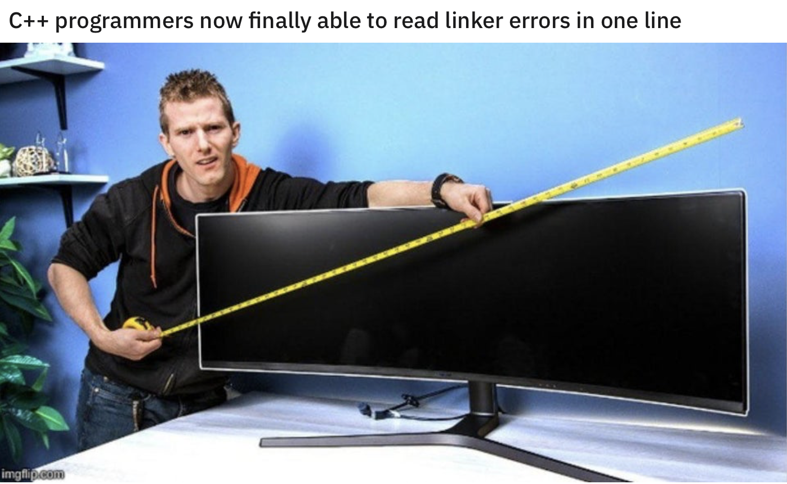

## NVIDIA HPC SDK

* [Announcement](https://developer.nvidia.com/hpc-sdk)

> The NVIDIA HPC SDK C, C++, and Fortran compilers support GPU acceleration of HPC modeling and simulation applications with standard C++ and Fortran, OpenACC® directives, and CUDA®. <...> With support for NVIDIA GPUs and Arm, OpenPOWER, or x86-64 CPUs running Linux, the HPC SDK provides the tools you need to build NVIDIA GPU-accelerated HPC applications.

* [Accelerating Standard C++ with GPUs Using `stdpar`](https://developer.nvidia.com/blog/accelerating-standard-c-with-gpus-using-stdpar/)

## Wide screen for C++

