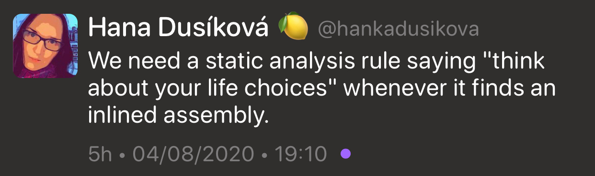

## CppCon 2020

* [Program](https://cppcon.org/program2020/)

## C++20 approved, C++23 meetings and schedule update

* [Herb Sutter](https://herbsutter.com/2020/09/06/c20-approved-c23-meetings-and-schedule-update/)
  * [Reddit](https://www.reddit.com/r/cpp/comments/inw0ez/c20_approved_c23_meetings_and_schedule_update/)

## C++ is now the fastest-growing programming language

* [TechRepublic](https://www.techrepublic.com/article/c-is-now-the-fastest-growing-programming-language/)
  * [Reddit](https://www.reddit.com/r/cpp/comments/ip9i8h/c_is_now_the_fastestgrowing_programming_language/)

## The Rust && C++ LDN *Virtual* Talks

* [Meetup](https://www.meetup.com/CppLondon/events/273113055/)
  * [Reddit](https://www.reddit.com/r/cpp/comments/iq0y0m/c_london_joins_with_rust_london_to_deliver/)

## Throwing Out the Kitchen Sink - Output Ranges

* [JeanHeyd 'ThePhD' Meneide](https://thephd.github.io/output-ranges)
  * [Reddit](https://www.reddit.com/r/cpp/comments/iaesk7/throwing_out_the_kitchen_sink_output_ranges/)

## Designing an ideal class in C++

* [Anupam Mazumdar via Medium](https://medium.com/a-devs-life/designing-an-ideal-class-in-c-d205516c03ab)
  * [Reddit](https://www.reddit.com/r/cpp/comments/icijxj/writing_ideal_class_definition_in_c/)
  * [See also: C++11: The Rule of the Big Five](https://www.feabhas.com/sites/default/files/2016-06/Rule%20of%20the%20Big%20Five.pdf)
  * [See also: How I Declare My class And Why, by Howard Hinnant](https://howardhinnant.github.io/classdecl.html)

## Here I Stand, Free - Allocators and an Inclusive STL

* [JeanHeyd "ThePhD" Meneide](https://thephd.github.io/freestanding-noexcept-allocators-vector-memory-hole)
  * [Reddit](https://www.reddit.com/r/cpp/comments/idtnn7/here_i_stand_free_allocators_and_an_inclusive_stl/)

## Standard library development made easy with C++20

* [Corentin Jabot](https://cor3ntin.github.io/posts/tuple/)
  * [Reddit](https://www.reddit.com/r/cpp/comments/ifotxd/standard_library_development_made_easy_with_c20/)

## Matplot++

* [GitHub](https://github.com/alandefreitas/matplotplusplus/blob/master/documentation/README.md#alternatives-for-data-visualization-in-c)
  * [Reddit](https://www.reddit.com/r/cpp/comments/iikdwq/matplot_a_c_graphics_library_for_data/)

## A Buffers Library for C++20

* [Colby Pike](https://vector-of-bool.github.io/2020/08/29/buffers-1.html)

## Why I like C++ attributes

* [Marius Bancila](https://mariusbancila.ro/blog/2020/08/30/why-i-like-cpp-attributes/)

## Crypto3

* [Home page](https://crypto3.nil.foundation/projects/crypto3/)
* [Boost mailing list announcement](https://lists.boost.org/Archives/boost//2020/09/249672.php)
* [GitHub](https://github.com/nilfoundation/crypto3)
* [Reddit](https://www.reddit.com/r/cpp/comments/ikxgs5/nil_crypto3_conceptbased_pure_c_cryptography/)

## C++ STL-Like Algorithm Libraries

* [Conor Hoekstra](https://codereport.github.io/CppSTLLikeLibraries/)

## Recursive lambdas in C++

* [Philip Trettner](https://artificial-mind.net/blog/2020/09/12/recursive-lambdas)

## Introduction to modern CMake for beginners

* [Internal Pointers Blog](https://internalpointers.com/post/modern-cmake-beginner-introduction)
  * [Reddit](https://www.reddit.com/r/programming/comments/iq2bt6/introduction_to_modern_cmake_for_beginners/)

## Twitter

