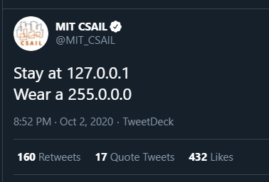

## r/cpp status update

[Reddit](https://www.reddit.com/r/cpp/comments/j8t9fu/rcpp_status_update/)

WHAT.

## September 2020 mailing

[September 2020 mailing](http://www.open-std.org/jtc1/sc22/wg21/docs/papers/2020/#mailing2020-09)

### Select papers

* [P2216R0 `std::format` improvements](http://www.open-std.org/jtc1/sc22/wg21/docs/papers/2020/p2216r0.html)
* [P2218R0 More flexible `optional::value_or()`](http://www.open-std.org/jtc1/sc22/wg21/docs/papers/2020/p2218r0.pdf)
* [P2219R0 Executors Issues Needing Resolution](http://www.open-std.org/jtc1/sc22/wg21/docs/papers/2020/p2219r0.pdf)

## New C++ features in GCC 10

[RedHat](https://developers.redhat.com/blog/2020/09/24/new-c-features-in-gcc-10/) :: [Reddit](https://www.reddit.com/r/cpp/comments/iyvgge/new_c_features_in_gcc_10/)

* Concepts
* Coroutines
* Unevaluated inline-assembly in `constexpr` functions
* Warning on deprecated comma expression in array subscript expressions
* Static structured bindings
* `constinit`
* Deprecated `volatile`
* Conversions to arrays of unknown bound
* `constexpr` `new` and `dynamic_cast`
* The `[[nodiscard]]` attribute now supports an optional argument
* CTAD extensions
* Parenthesized initialization of aggregates
* **Modules are not yet supported, aiming for C++11**

## Do you enforce Core Guidelines and/or use the Guidelines Support Library (GSL)?

[Reddit](https://www.reddit.com/r/cpp/comments/j3752j/do_you_enforce_core_guidelines_andor_use_the/)

* [C++ Core Guidelines](https://isocpp.github.io/CppCoreGuidelines/CppCoreGuidelines)
* [Microsoft GSL](https://github.com/microsoft/GSL)
* [GSL-Lite](https://github.com/gsl-lite/gsl-lite)
* [How to use the Core Guidelines checker in Visual Studio](https://docs.microsoft.com/en-us/cpp/code-quality/using-the-cpp-core-guidelines-checkers?view=vs-2019)
* [Reddit comment on VS2019 checker usage](https://www.reddit.com/r/cpp/comments/j3752j/do_you_enforce_core_guidelines_andor_use_the/g7c7tsv/)
* [Thoughts on applying static analysis to a large code base (Reddit)](https://www.reddit.com/r/cpp/comments/e2r14c/thoughts_on_applying_static_analysis_to_a_large/)
  * [Thread on `[]` vs. `at()`, started by STL himself](https://www.reddit.com/r/cpp/comments/e2r14c/thoughts_on_applying_static_analysis_to_a_large/f8xdoet/)

## CppCon2020

* [Videos](https://www.youtube.com/playlist?list=PLHTh1InhhwT6VxYHtoWIvOup9gz0p95Qr)
* [Presentation materials (GitHub)](https://github.com/CppCon/CppCon2020)

## The Little Things: Speeding up C++ compilation

[Article by Martin Hořeňovský](https://codingnest.com/the-little-things-speeding-up-c-compilation/)

* [Reddit](https://www.reddit.com/r/cpp/comments/iwkcxp/some_sourcelevel_techniques_for_speeding_up_c/)
* [HackerNews](https://news.ycombinator.com/item?id=24537231)

### Techniques

* Include less
* Forward declarations (_hmmm_ -- _GD_)
* Explicit outlining
* Hidden friends
* Link less
* Extern template
* **Modules** (_not mentioned..._ -- _GD_)

### Tools

* [Include What You Use (IWYU)](https://include-what-you-use.org/)
* [Ninja](https://ninja-build.org)
* [LLD](https://lld.llvm.org)

## std::list::sort() vs. std::sort()

[Reddit](https://www.reddit.com/r/cpp/comments/j3fjh8/stdlistsort_vs_stdsort/)

* [Answer](https://www.reddit.com/r/cpp/comments/j3fjh8/stdlistsort_vs_stdsort/g7bvx7d/)

Scott Meyers, [Effective STL](https://www.aristeia.com/books.html):

> Item 44: Prefer member functions to algorithms with the same name.

## The Defold game engine code style

[Article](https://defold.com/2020/05/31/The-Defold-engine-code-style/)

### Code style

* C-like C++
* No classes (_huh?_ -- _GD_)
* No exceptions
* No STL
  * Custom containers
* Data ownership tracking
* C++98

(_It's the end of 2020, by the way. -- GD_)

## Should I use C++ exceptions?

[Reddit](https://www.reddit.com/r/cpp/comments/ikv9kv/should_i_use_c_exceptions/)

## C++17 Zero allocation Coroutine/[Resumable function] library

[GitHub](https://github.com/seppeon/SCoro)

This does not use C++20 coroutines. It is a managed state machine style coroutine library, a modern take on [Duff's device](https://en.wikipedia.org/wiki/Duff%27s_device).

[Reddit](https://www.reddit.com/r/cpp/comments/ikhlvw/c17_zero_allocation_coroutineresumable_function/)

> I do not buy any of these anti-coroutine arguments (maybe except for the fact that HALO can fail in some situations -- but that is an engineering problem in the compiler). [=>](https://www.reddit.com/r/cpp/comments/ikhlvw/c17_zero_allocation_coroutineresumable_function/g3kt9se?utm_source=share&utm_medium=web2x&context=3)

Later, same author on Reddit: [C++20 coroutines, opinions?](https://www.reddit.com/r/cpp/comments/j1xhgv/c20_coroutines_opinions/) And yes, [Rust gets mentioned](https://www.reddit.com/r/cpp/comments/j1xhgv/c20_coroutines_opinions/g72puhx/).

## A Buffers Library for C++20

[Colby Pike](https://vector-of-bool.github.io/2020/08/29/buffers-1.html)

## Unpopular opinion: It's ok to derive from STL types/classes

[Reddit](https://www.reddit.com/r/cpp/comments/ipk90u/unpopular_opinion_its_ok_to_derive_from_stl/)

## 6 Efficient Things You Can Do to Refactor a C++ Project

[B. Filipek](https://www.bfilipek.com/2020/08/6things-refactor.html)

1. Update the Compiler and Set Correct C++ Standard Conformance
2. Fix Code With Deprecated or Removed C++ Features
3. Start Adding Unit Tests
4. Decouple or Extract Classes
5. Extract Non-member Functions
6. Reduce the Global State

* [GitHub](https://github.com/fenbf/ViAlg-Update)
* [Reddit](https://www.reddit.com/r/cpp/comments/ijtoez/6_efficient_things_you_can_do_to_refactor_a_c/)

## Why do all guides use #using namespace std if it's supposedly really bad practice?

[Reddit](https://www.reddit.com/r/cpp/comments/iihj9s/why_do_all_guides_use_using_namespace_std_if_its/)

## C/C++: 70x faster file embeds using string literals

[Article](https://mort.coffee/home/fast-cpp-embeds/)

* [GitHub](https://github.com/mortie/strliteral)
* [Reddit](https://old.reddit.com/r/cpp/comments/i2x3go/70x_faster_file_embeds_using_string_literals/)

## Why I like C++ attributes

[Marius Bancila](https://mariusbancila.ro/blog/2020/08/30/why-i-like-cpp-attributes/)

## C++ STL-Like Algorithm Libraries

[Conor Hoekstra](https://codereport.github.io/CppSTLLikeLibraries/)

## Library: Libcu++ - the NVIDIA Standard Library

[GitHub](https://github.com/NVIDIA/libcudacxx)

* [Reddit](https://www.reddit.com/r/programming/comments/ivq9c8/libcu_nvidia_c_standard_library/)

## Recursive lambdas in C++

[Philip Trettner](https://artificial-mind.net/blog/2020/09/12/recursive-lambdas)

## id Tech -- Game engines written in C++

[Engines and games](https://www.mycplus.com/featured-articles/id-tech-game-engines/)

* [Reddit](https://www.reddit.com/r/programming/comments/iogbon/id_tech_series_of_game_engines_written_in_cc/)

### Fabien Sanglard's game engine code reviews

* [Quake](https://fabiensanglard.net/quakeSource/index.php)
* [Quake 2](https://fabiensanglard.net/quake2/index.php)
* [Quake 3](https://fabiensanglard.net/quake3/index.php)
* [Doom 3](https://fabiensanglard.net/doom3/index.php)

### See also

[Doom Eternal study](https://simoncoenen.com/blog/programming/graphics/DoomEternalStudy.html)

## Named Parameters in C++20

[Peter Dimov](https://pdimov.github.io/blog/2020/09/07/named-parameters-in-c20/)

* [Reddit](https://www.reddit.com/r/cpp/comments/iny133/named_parameters_in_c20_peter_dimov/)

## C++ in Visual Studio Code reaches version 1.0

[Julia Reid](https://devblogs.microsoft.com/cppblog/c-in-visual-studio-code-reaches-version-1-0/)

* [Reddit](https://www.reddit.com/r/cpp/comments/ista1w/c_in_visual_studio_code_reaches_version_10_c_team/)

## Book: C++ Best Practices by Jason Turner

[LeanPub](https://leanpub.com/cppbestpractices) (min. $9.99)

## C++ Talk Index

[Website](https://cpptalksindex.xyz)

* [Reddit](https://www.reddit.com/r/cpp/comments/j5s6lw/an_index_for_c_conferences/)

## vcpkg: Accelerate your team development environment with binary caching and manifests

[Microsoft](https://devblogs.microsoft.com/cppblog/vcpkg-accelerate-your-team-development-environment-with-binary-caching-and-manifests/)

* [Reddit](https://www.reddit.com/r/cpp/comments/ix090v/vcpkg_accelerate_your_team_development/)

### Related

[Why is it such an abysmal pain to use libraries in C++ compared to pretty much anything else?](https://www.reddit.com/r/cpp/comments/ix9n1u/why_is_it_such_an_abysmal_pain_to_use_libraries/)

## The terrible **size_t**

[Reddit](https://www.reddit.com/r/cpp/comments/iu5spw/is_size_t_really_this_terrible/)

## juCi++: a lightweight, cross-platform IDE

* [GitLab](https://gitlab.com/cppit/jucipp)
* [Installation guide](https://gitlab.com/cppit/jucipp/-/blob/master/docs/install.md)

{width=70%}

## Library: cpp-lazy

[GitHub](https://github.com/MarcDirven/cpp-lazy)

Cpp-lazy is a fast and easy lazy evaluation library for C++14/17/20.

Lazy evaluation is an evaluation strategy which holds the evaluation of an expression until its value is needed. In this library, all the iterators are lazy evaluated.

This library is not a replacement for `ranges::v3` but rather a (smaller) alternative.

## Library: Crypto3

* [Home page](https://crypto3.nil.foundation/projects/crypto3/)
* [Boost mailing list announcement](https://lists.boost.org/Archives/boost//2020/09/249672.php)
* [GitHub](https://github.com/nilfoundation/crypto3)
* [Reddit](https://www.reddit.com/r/cpp/comments/ikxgs5/nil_crypto3_conceptbased_pure_c_cryptography/)

## Library: AAA - Auxiliary Arithmetic Algorithms

* [GitHub](https://github.com/mabur/aaa) (MIT)
* [Docs](http://mabur.github.io/aaa/documentation/html/index.html)

## C#-like events in C++

[Reddit](https://www.reddit.com/r/cpp/comments/j2dfmi/clike_events_in_c/)

(Unrelated: [Variable name prefixes](https://www.reddit.com/r/cpp/comments/j2dfmi/clike_events_in_c/g75e65w/))

* [Code on Pastebin](https://pastebin.com/RjK6nLgM)
* [Signal-Slot library benchmarks](https://github.com/NoAvailableAlias/signal-slot-benchmarks/blob/master/results/benchmarks_msvc/README.md)
* [Boost.Signals2](https://www.boost.org/doc/libs/1_61_0/doc/html/signals2.html)

## Uses of immediately invoked function expressions (IIFE) in C++

* [Erik Rigtorp](https://rigtorp.se/iife/)
* [Jonathan Müller](https://foonathan.net/2020/10/iife-metaprogramming/)

## COVID-19 Public Service Announcement

