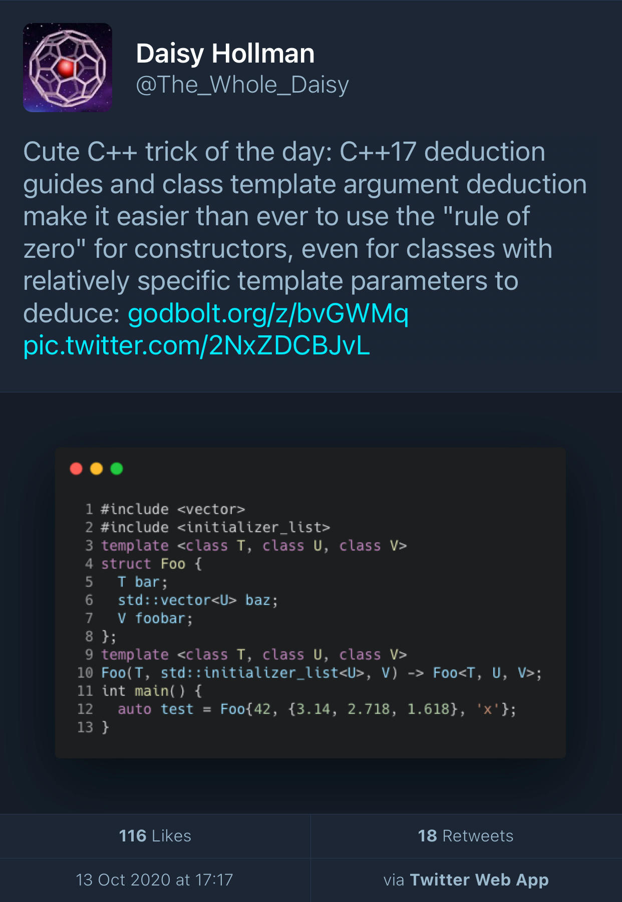
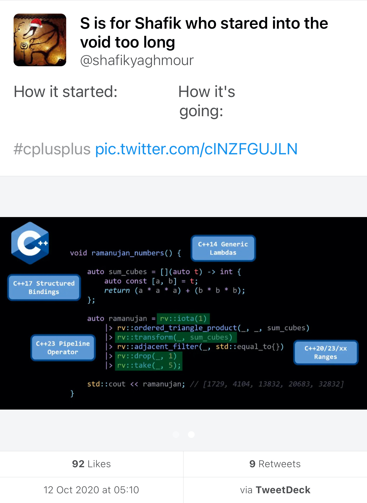
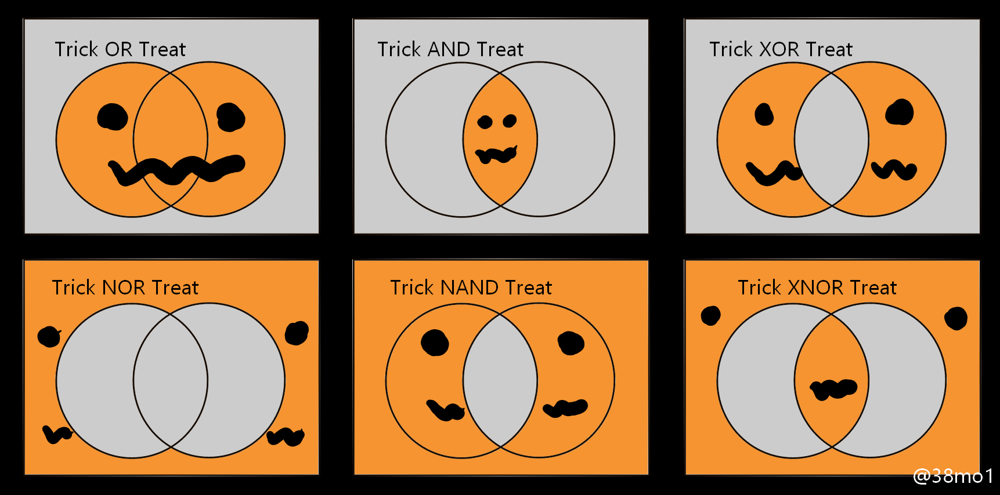

## mailing2020-10

* [mailing2020-10](http://www.open-std.org/jtc1/sc22/wg21/docs/papers/2020/#mailing2020-10)
  * [Reddit](https://www.reddit.com/r/cpp/comments/jf4wsw/202010_c_committee_mailing/)

### Select papers

* [P1206R1 `ranges::to`: A function to convert any range to a container](http://www.open-std.org/jtc1/sc22/wg21/docs/papers/2019/p1206r1.pdf)
* [P2214R0 A Plan for C++23 Ranges](http://www.open-std.org/jtc1/sc22/wg21/docs/papers/2020/p2214r0.html)
* [P2226R0 A proposal for an idiom to move from an object and reset it to its default constructed state](http://www.open-std.org/jtc1/sc22/wg21/docs/papers/2020/p2226r0.html)
* [P2237R0 Metaprogramming](http://www.open-std.org/jtc1/sc22/wg21/docs/papers/2020/p2237r0.pdf)

## Named Parameters in C++20

[Peter Dimov](https://pdimov.github.io/blog/2020/09/07/named-parameters-in-c20/)

* [Reddit](https://www.reddit.com/r/cpp/comments/iny133/named_parameters_in_c20_peter_dimov/)

## C++ in Visual Studio Code reaches version 1.0

[Julia Reid](https://devblogs.microsoft.com/cppblog/c-in-visual-studio-code-reaches-version-1-0/)

* [Reddit](https://www.reddit.com/r/cpp/comments/ista1w/c_in_visual_studio_code_reaches_version_10_c_team/)

## C++ Talk Index

[Website](https://cpptalksindex.xyz)

* [Reddit](https://www.reddit.com/r/cpp/comments/j5s6lw/an_index_for_c_conferences/)

## The terrible **size_t**

[Reddit](https://www.reddit.com/r/cpp/comments/iu5spw/is_size_t_really_this_terrible/)

## juCi++: a lightweight, cross-platform IDE

* [GitLab](https://gitlab.com/cppit/jucipp)
* [Installation guide](https://gitlab.com/cppit/jucipp/-/blob/master/docs/install.md)

{width=70%}

## Library: cpp-lazy

[GitHub](https://github.com/MarcDirven/cpp-lazy)

Cpp-lazy is a fast and easy lazy evaluation library for C++14/17/20.

Lazy evaluation is an evaluation strategy which holds the evaluation of an expression until its value is needed. In this library, all the iterators are lazy evaluated.

This library is not a replacement for `ranges::v3` but rather a (smaller) alternative.

## Library: Crypto3

* [Home page](https://crypto3.nil.foundation/projects/crypto3/)
* [Boost mailing list announcement](https://lists.boost.org/Archives/boost//2020/09/249672.php)
* [GitHub](https://github.com/nilfoundation/crypto3)
* [Reddit](https://www.reddit.com/r/cpp/comments/ikxgs5/nil_crypto3_conceptbased_pure_c_cryptography/)

## Library: AAA - Auxiliary Arithmetic Algorithms

* [GitHub](https://github.com/mabur/aaa) (MIT)
* [Docs](http://mabur.github.io/aaa/documentation/html/index.html)

## Daisy Hollman's deduction trick

{width=50%}

## How it started/How it's going

{width=50%}|{width=50%}

## Halloween logic

