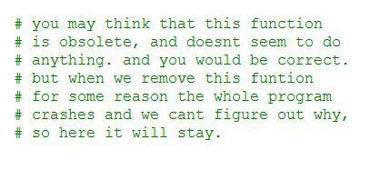

## Firsts in 2020 (or, A little dose of good news)

* [Herb Sutter](https://herbsutter.com/2020/12/30/firsts-in-2020-or-a-little-dose-of-good-news/)
  * [Reddit](https://www.reddit.com/r/cpp/comments/knt1n3/firsts_in_2020_or_a_little_dose_of_good_news_herb/)

## C++20 ISO standard published

* [ISO](https://www.iso.org/standard/79358.html)
  * [Reddit](https://www.reddit.com/r/cpp/comments/kdrwya/c20_published_isoiec_148822020/)

## C++ at the end of 2020

* [B. Filipek](https://www.cppstories.com/2020/12/cpp-status-2020/)
  * [Reddit](https://www.reddit.com/r/programming/comments/kogx01/c_at_the_end_of_2020/)

## B. Stroustrup on The Continuing Evolution of C++

* [Video on IDA](https://ida.dk/viden-og-netvaerk/videoer-fra-ida/stroustrup-on-the-continuing-evolution-of-cplusplus)
  * [Reddit](https://www.reddit.com/r/cpp/comments/jxmuzk/stroustrup_on_the_continuing_evolution_of_c/)

## No Diagnostic Required podcast from JetBrains

* [Twitter: ndr_cpp](https://twitter.com/ndr_cpp)
* [YouTube: nodiagnosticrequired](https://www.youtube.com/channel/UCJZdS1wIqASD1MVrJyX8M2Q?mkt_tok=eyJpIjoiTTJNM09HUmhOR1JsWXpNdyIsInQiOiJ5eU9wWUphbzRvcWhTYStPc2huWmxlMzREaDNKRllEU2h3TEY1QlJmTDRHa1RSc0ZMNEtaMlkxU1BlN2w3Mm9GTmdcL3lvVVhiMGNlOGtcL3hCaEJIUkJxYkJISW9ZSVJkQTNsNytsRVpRbGZHZE1sRW9KUVEyZmtkbHBSdjlWaVh1In0%3D)

## Concepts appreciation thread

* [Reddit](https://www.reddit.com/r/cpp/comments/kka4o7/concepts_appreciation_thread_i_dont_have_any/)

## C++ executors

* [Reddit](https://www.reddit.com/r/cpp/comments/jw1kyr/c_executors/)
  * [CppCon 2019: Eric Niebler, David Hollman “A Unifying Abstraction for Async in C++”](https://www.youtube.com/watch?v=tF-Nz4aRWAM&feature=youtu.be)
  * [A Unified Executors Proposal for C++ | P0443R14](http://www.open-std.org/jtc1/sc22/wg21/docs/papers/2020/p0443r14.html)
  * [libunifex (Facebook)](https://github.com/facebookexperimental/libunifex)

## Do you use C++ in your day job? If so, what did it take to get there?

* [Reddit](https://www.reddit.com/r/cpp/comments/kmpdlm/do_you_use_c_in_your_day_job_if_so_what_did_it/)

## Easily currying functions in C++

* [Reddit](https://www.reddit.com/r/cpp/comments/k32fx4/easily_currying_functions_in_c/)

```cpp
// Existing, non-curried function
auto f(int a, int b, int c) noexcept -> int {
    return a * b * c;
}

auto g = fn::curry(f); // g is the curried form of f

int main() {
    return g(2)(5)(10); // returns 100
}
```

## C++ and passing by value

* [Matt Godbolt](https://xania.org/202101/cpp-by-value-args)
  * [Reddit](https://www.reddit.com/r/cpp/comments/kphzqt/c_and_passing_by_value/)

## Cheerp 2.6 rc1: C++ compiled for the Web

* [Carlo Piovesan](https://medium.com/leaningtech/cheerp-2-6-rc1-the-cpp-compiler-for-the-web-8873be6601b1)

## repr: return printable value

* [GitHub](https://github.com/p-ranav/repr)
  * [Reddit](https://www.reddit.com/r/cpp/comments/jzgzoz/repr_for_c_return_printable_string_representation/)

## The problem with C

* [Corentin Jabot](https://cor3ntin.github.io/posts/c/)
  * [Reddit](https://np.reddit.com/r/cpp/comments/ik3o10/the_problem_with_c/)
  * [Reddit](https://www.reddit.com/r/cpp/comments/k8pxo1/a_very_nice_summary_of_the_philosophical_and/)

## Turbo Vision

A modern port of Turbo Vision 2.0, the classical framework for text-based user interfaces. Now cross-platform and with Unicode support.

* [GitHub](https://github.com/magiblot/tvision)
  * [Reddit](https://www.reddit.com/r/commandline/comments/kcn4xw/a_modern_cross_platform_port_of_borland_turbo/)

{width=70%}

## Fold expressions work inside constraints

* [Reddit](https://www.reddit.com/r/cpp/comments/kd77ee/fold_expressions_work_inside_constraints/)

```cpp
template <template <typename> class FooT, typename... T>
requires (... && Bar<FooT<T>>) struct Baz {};
```

Without fold expressions:

```cpp
template <template <typename> class FooT, typename... T>
requires([]() {
  std::array arr = std::array{Bar<FooT<T>>...};
  return std::reduce(arr.begin(), arr.end(), true, std::logical_and<bool>{});
}()) struct Baz {};
```

## consteval-huffman

A C++20 utility for compressing string literals at compile-time to save program space. The compressed data can be decompressed at run-time through the use of a decoder that follows `std::forward_iterator`.

* [GitHub](https://github.com/tcsullivan/consteval-huffman) (C++20, Public domain)
  * [Reddit](https://www.reddit.com/r/cpp/comments/kn1wpe/compiletime_string_compression_using_huffman/)

```cpp
auto data = "This is my string of data"_huffman;
```

## Taskflow 3.0.0

A General-purpose Parallel and Heterogeneous Task Programming System

* [Home page](https://www.amazon.co.uk/gp/product/B08291CB6J/ref=ewc_pr_img_1?smid=A1DO4Y0KEIINI5&psc=1)
  * [GitHub](https://github.com/taskflow/taskflow) (C++17, MIT)
    * [v3.0.0](https://github.com/taskflow/taskflow/releases/tag/v3.0.0)
  * [Reddit](https://www.reddit.com/r/cpp/comments/kos9mo/taskflow_v3_released_a_generalpurpose_parallel/)

## Project from scratch in C++ (for beginners)

* [Reddit](https://www.reddit.com/r/cpp/comments/kl9w8f/project_from_scratch_in_c_for_beginners/)
  * [YouTube](https://www.youtube.com/playlist?list=PLSGsTSSx2DyM8q6gM_cUVwX_da1tTYLrq)
  * [Blog](http://www.thecppdev.wordpress.com/)

## Game dev C++ vs Regular C++

* [Reddit](https://www.reddit.com/r/cpp/comments/k7uwwe/game_dev_c_vs_regular_c/)

> Some companies are stuck on the 98 standard, may God have pity on their souls, and others have weird requirements to avoid things because a manager had an issue with them 10 years ago. [=>](https://www.reddit.com/r/cpp/comments/k7uwwe/game_dev_c_vs_regular_c/geuao3j/)

## Bona - A C++20 based modern file information viewer

* [Reddit](https://www.reddit.com/r/cpp/comments/klib5n/bona_a_c20_based_modern_file_information_viewer/)

## Obsolete function will stay


