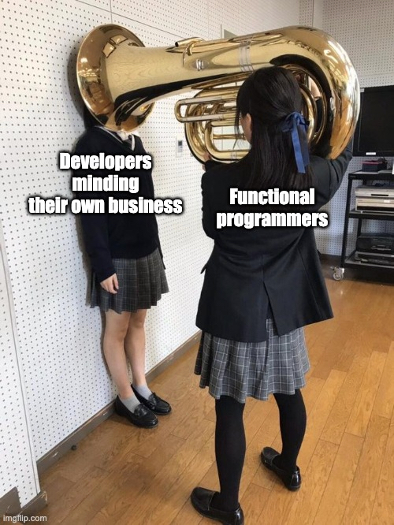

## Perhaps it's time for a more opinionated dialect of C++

* [Reddit](https://www.reddit.com/r/cpp/comments/kvdprx/perhaps_it_is_time_for_an_opinionated_dialekt_of_c/)
* [Should I litter my code with (the correct) attributes for every function, or just leave it pretty?](https://www.reddit.com/r/cpp/comments/kvpab0/should_i_litter_my_code_with_the_correct/)

## Latest C++: theory vs. reality

* [Reddit](https://www.reddit.com/r/cpp/comments/kva2w8/latest_c_theory_vs_reality/)
  * [Godot game engine C++ standard thread on GitHub](https://github.com/godotengine/godot/issues/9694)

## C++ vs Rust performance

* [Reddit /r/cpp](https://www.reddit.com/r/cpp/comments/kyhark/c_vs_rust_performance/)
  * [Reddit /r/rust](https://www.reddit.com/r/rust/comments/k7pssg/do_the_compilers_really_create_more_optimal_code/)

## If you were allowed to make breaking changes to the C++ specification, what features would you modify/replace/remove to make the language better?

* [Reddit](https://www.reddit.com/r/cpp/comments/ksb99w/if_you_were_allowed_to_make_breaking_changes_to/)

## A Year of Conference Talks from the Microsoft C++ Team

* [Sy Brand](https://devblogs.microsoft.com/cppblog/a-year-of-conference-talks-from-the-microsoft-c-team/)
  * [Reddit](https://www.reddit.com/r/cpp/comments/l4s1tg/a_year_of_conference_talks_from_the_microsoft_c/?ref=share&ref_source=link)

## C/C++ Search Extension

* [Website](https://cpp.extension.sh/)
  * [Reddit](https://www.reddit.com/r/cpp/comments/laxcbi/cc_search_extension_v020_has_bee_released/)

## Modern C++: Snippets and Examples

* [Alan Freitas](https://alandefreitas.github.io/moderncpp/)
  * [Reddit](https://www.reddit.com/r/cpp/comments/le52s3/modern_c_snippets_and_examples/?ref=share&ref_source=link)

## Modern C++ Tip of the Week

* [Quantlab](https://github.com/QuantlabFinancial/cpp_tip_of_the_week)

## INI-config

A single-header C++20 library that converts INI-formatted string literals to a key-value pair list at compile-time.

* [GitHub](https://github.com/tcsullivan/ini-config)
  * [Reddit](https://www.reddit.com/r/cpp/comments/lgt7uj/compiletime_ini_config_parsing_and_accessing_with/)

```cpp
#include "ini_config.hpp"

constexpr auto config = R"(
[Cat]
color = gray
lives = 9
)"_ini;

for (auto kvp : config) {}
for (auto kvp : config.section("Cat")) {}
config.get("Cat", "lives"); // => "9"
config.get<int>("Cat", "lives"); // => 9
config.get("Dog", "lives"); // => ""
```

## mocxx: a versatile C++ function mocking framework based on Frida, by Guardsquare

No macros! Doesn't support mocking virtual functions yet.

* [Reddit](https://www.reddit.com/r/cpp/comments/k0atyi/mocxx_a_versatile_c_function_mocking_framework/)
  * [GitHub](A versatile C++ function mocking framework. It replaces a target function with the provided implementation, and integrates well with existing testing and mocking frameworks.) (C++17, GPL-3.0)
    * [Frida - Dynamic instrumentation toolkit for developers, reverse-engineers, and security researchers](https://github.com/frida)
  * [Explanatory blog post at Guardsquare](https://tech.guardsquare.com/posts/mocxx-the-mocking-tool/)

## Compile 1 Million Lines Of C++ In ~2 Minutes With A 16 Core Ryzen 9 5950x

* [Embarcadero](https://blogs.embarcadero.com/compile-1-million-lines-of-c-in-2-minutes-with-a-16-core-ryzen-9-5950x/)
  * [Reddit](https://www.reddit.com/r/cpp/comments/kigy7l/compile_1_million_lines_of_c_in_2_minutes_with_a/)

### Dev-C++

A fast, portable, simple, and free C/C++ IDE for Windows, built in Delphi

* [GitHub](https://github.com/Embarcadero/Dev-Cpp)

## Using std::list::splice to implement a LRU cache

* [Article on nextptr](https://www.nextptr.com/tutorial/ta1576645374/stdlist-splice-for-implementing-lru-cache)
* [`std::list::splice`](https://en.cppreference.com/w/cpp/container/list/splice)

## What should the state of a moved-from object be?

* [Raymond Chen](https://devblogs.microsoft.com/oldnewthing/20201218-00/?p=104558)
  * [Reddit](https://www.reddit.com/r/cpp/comments/kfsjr3/what_should_the_state_of_a_movedfrom_object_be/)

## Reducing Memory Consumption in Visual Assist

* [Blog post](https://blog.wholetomato.com/2020/12/17/technical-deep-dive-reducing-memory-consumption-in-visual-assist-build-2393/)
  * [Reddit](https://www.reddit.com/r/cpp/comments/kgpw63/technical_deep_dive_reducing_memory_consumption/)

## dont_deduce<T>

* [artificial::mind](https://artificial-mind.net/blog/2020/09/26/dont-deduce)
  * [Reddit](https://www.reddit.com/r/cpp/comments/j0pgxh/controlling_template_argument_deduction_via_dont/)

### C++11

```cpp
template <class T> struct foo_t { using type = T; };
template <class T> using foo = typename foo_t<T>::type;
```

### C++20

```cpp
template <typename T>
auto operator+(
  vec3<T> const& a,
  std::convertible_to<T> auto const& b
) -> vec3<T>;
```

## Writing a custom iterator in modern C++ (C++17)

* [Article](https://www.internalpointers.com/post/writing-custom-iterators-modern-cpp)
  * [Reddit](https://www.reddit.com/r/programming/comments/kfl04g/writing_a_custom_iterator_in_modern_c/)

## C++ for Swift developers

* [Sidharth Juyal](https://whackylabs.com/swift/cpp/languages/2021/01/03/cpp-for-swift-devs/)
  * [Reddit](https://www.reddit.com/r/swift/comments/kpnp1m/c_for_swift_developers/)

### Wrapping C++ for use in Swift

* [Reddit](https://www.reddit.com/r/iOSProgramming/comments/jxqv74/looking_for_good_examples_of_wrapping_c/)

## Tracy Profiler

A real time, nanosecond resolution, remote telemetry, hybrid frame and sampling profiler for games and other applications.

Tracy supports profiling CPU (C, C++11, Lua), GPU (OpenGL, Vulkan, OpenCL, Direct3D 12), memory, locks, context switches, per-frame screenshots and more.

* [GitHub](https://github.com/wolfpld/tracy)

## Functional programmers

{width=50%}
