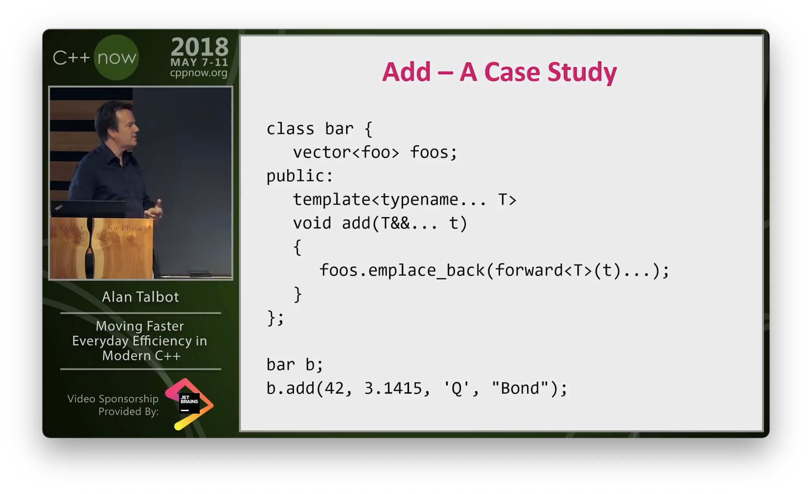

## Library: VirtualMultiArray

Multi graphics card based C++ virtual array implementation that uses OpenCL just for the data transfers on PCIe bridge.

* [GitHub](https://github.com/tugrul512bit/VirtualMultiArray)
* [Wiki](https://github.com/tugrul512bit/VirtualMultiArray/wiki/How-it-works)
* [Reddit](https://www.reddit.com/r/cpp/comments/leq0tm/a_c_virtualarray_that_uses_graphics_cards_as/?ref=share&ref_source=link)

## Library: Reference Views

**rviews** (reference views) is a header-only C++17 library that allows viewing an STL container via another STL container with lvalue semantics. E.g. you could view a list as it would be a vector, or even as it would be a map, or even both.

```cpp
std::list<char> data{'a', 'b', 'c'};
vector_view view{data};
std::cout << view[0] << std::endl; // a
std::cout << view[1] << std::endl; // b
std::cout << view[2] << std::endl; // c
```

* [GitHub](https://github.com/vzelen/rviews)
  * [Reddit](https://www.reddit.com/r/cpp/comments/la0mq3/reference_views_headeronly_library_view_vector_as/?ref=share&ref_source=link)
  * [See also: Vista](https://github.com/breese/vista)
  * [See also: Boost flat_map](https://www.boost.org/doc/libs/1_75_0/doc/html/container/non_standard_containers.html#container.non_standard_containers.flat_xxx)

## Library: Asio-chan

This library provides golang-inspired channel types to be used with ASIO awaitable coroutines. Channels allow bidirectional message passing and synchronization between coroutines.

* [GitHub](https://github.com/MiSo1289/asiochan) (C++20, MIT)
  * [Reddit](https://www.reddit.com/r/cpp/comments/lgsgdz/limited_golike_channel_implementation_with_asios/)

## Moving Faster: Everyday Efficiency in Modern C++

* [C++Now 2018, YouTube](https://youtu.be/LFv7XwgsdLY)
  * [Reddit](https://www.reddit.com/r/cpp/comments/l5hxba/moving_faster_everyday_efficiency_in_modern_c/?ref=share&ref_source=link)



## Why no standard library support for command line parsing?

* [Reddit](https://www.reddit.com/r/cpp/comments/l6759u/why_no_standard_library_support_for_command_line/?ref=share&ref_source=link)
  * [P0781R0 A Modern C++ Signature for `main`](http://www.open-std.org/jtc1/sc22/wg21/docs/papers/2017/p0781r0.html)
  * TCLAP - Templatized Command Line Argument Parser: [SourceForge](http://tclap.sourceforge.net), [GitHub](https://github.com/mirror/tclap/)
  * [Gflags](https://gflags.github.io/gflags/), [GitHub](https://github.com/gflags/gflags)
  * [Cxxopts](https://github.com/jarro2783/cxxopts)
  * [CLI11](https://github.com/CLIUtils/CLI11)
  * [Boost.Program_options](https://www.boost.org/doc/libs/1_75_0/doc/html/program_options.html)
  * Quick Arg Parser: [GitHub](https://github.com/Dugy/quick_arg_parser), [Reddit](https://www.reddit.com/r/cpp/comments/l7a6uc/tired_of_unwieldy_tools_like_getopt_or_argp_try/)
  * [Lyra](https://github.com/bfgroup/Lyra)
  * [Clara](https://github.com/catchorg/Clara), [blog post by Marius Bancila](https://mariusbancila.ro/blog/2018/04/03/parsing-command-line-arguments-in-cpp-with-clara/)

```cpp
std::vector<std::string_view> args(argv, argv+argc);
```

## Number Parsing at a Gigabyte per Second

* [Daniel Lemire](https://lemire.me/blog/2021/01/29/number-parsing-at-a-gigabyte-per-second/)
  * [Paper](https://arxiv.org/pdf/2101.11408.pdf)
  * [Reddit](https://www.reddit.com/r/cpp/comments/l80uat/number_parsing_at_a_gigabyte_per_second/)
  * [fast_float (GitHub)](https://github.com/fastfloat/fast_float)
  * [The Eisel-Lemire ParseNumberF64 Algorithm](https://nigeltao.github.io/blog/2020/parse-number-f64-simple.html)
  * [Go Systems talk (YouTube)](https://www.youtube.com/watch?v=AVXgvlMeIm4)

## std::jthread and cooperative cancellation with stop token

* [Article on Nextptr](https://www.nextptr.com/tutorial/ta1588653702/stdjthread-and-cooperative-cancellation-with-stop-token)
  * [Reddit](https://www.reddit.com/r/cpp/comments/la35ec/stdjthread_and_cooperative_cancellation_with_stop/?ref=share&ref_source=link)

## Time Travel Debugging for C/C++

* [Article](https://pspdfkit.com/blog/2021/time-travel-debugging-for-c/)
  * [Reddit](https://www.reddit.com/r/cpp/comments/laxdxy/time_travel_debugging_for_cc/)

## Abbreviated Function Templates and Constrained Auto

* [Sy Brand, Microsoft](https://devblogs.microsoft.com/cppblog/abbreviated-function-templates-and-constrained-auto/)
  * [Reddit](https://www.reddit.com/r/cpp/comments/lcwfzx/abbreviated_function_templates_and_constrained/)

## Library: C++20 container concepts

This library aims to provide general purpose concepts that are not available in the C++20 concepts library, most notably container concepts.

* [GitHub](https://github.com/MiSo1289/more_concepts)
  * [Reddit](https://www.reddit.com/r/cpp/comments/l9pt7n/a_c20_container_concepts_library/?ref=share&ref_source=link)

## Coderrect Scanner

A fast static analysis tool for detecting race conditions in C++ code. Supports pthreads, `std::thread`, OpenMP, and more.

* [Home Page](https://coderrect.com/download/)
  * [Reddit](https://www.reddit.com/r/cpp/comments/l7z6s9/a_fast_static_analysis_tool_for_detecting_race/?ref=share&ref_source=link)

## Library: Fixed math (header-only, MIT)

* [Reddit](https://www.reddit.com/r/cpp/comments/l0uz1y/fixed_math_header_only_library_with_mit_licence/?ref=share&ref_source=link)
  * [GitHub](https://github.com/arturbac/fixed_math) (C++17, MIT)

## Scientific computing in C++

* [Reddit](https://www.reddit.com/r/cpp/comments/ll3mdw/c20_coroutines_sketching_a_minimal_async_framework/)

### Libraries

* [Eigen](http://eigen.tuxfamily.org/index.php?title=Main_Page)
* [Blaze](https://bitbucket.org/blaze-lib/blaze/wiki/browse/)
* [Boost uBLAS](https://www.boost.org/doc/libs/1_75_0/libs/numeric/ublas/doc/index.html)
* [PETSc](https://www.mcs.anl.gov/petsc/)

## Documenting C++ code

* [Reddit](https://www.reddit.com/r/cpp/comments/kzvnyx/how_do_you_document_your_c_code/?ref=share&ref_source=link)
  * [Doxygen](https://www.doxygen.nl/index.html), [Sphinx](https://www.sphinx-doc.org/en/master/) + [Breathe](https://github.com/michaeljones/breathe) => [{fmt}](https://fmt.dev/latest/index.html)
  * [Standardese](https://github.com/standardese/standardese)
  * [clang-doc](https://clang.llvm.org/extra/clang-doc.html)
  * [hdoc](https://hdoc.io/)
  * [Adobe Hyde](https://github.com/adobe/hyde)

## CMake and the Future of C++ Package Management

* [Borislav Stanimirov](https://ibob.github.io/blog/2020/01/13/cmake-package-management/)
  * [Reddit](https://www.reddit.com/r/cpp/comments/kwpkcw/cmake_and_the_future_of_c_package_management/?ref=share&ref_source=link)

## Motivating examples of coroutines

* [Reddit](https://www.reddit.com/r/cpp/comments/l4lcar/do_people_have_some_motivating_examples_for/?ref=share&ref_source=link)
* [Previously: Reddit](https://www.reddit.com/r/cpp/comments/j6pi07/other_than_generators_what_do_coroutines_solve/?ref=share&ref_source=link)

## The perils of the accidental C++ conversion constructor

* [Raymond Chen](https://devblogs.microsoft.com/oldnewthing/20210115-00/?p=104719)
  * [Reddit](https://www.reddit.com/r/cpp/comments/ky691b/the_perils_of_the_accidental_c_conversion/)

> No one hates C++ more than the people who love C++. [#](https://www.reddit.com/r/cpp/comments/ky691b/the_perils_of_the_accidental_c_conversion/gjfbed4/)

## Making Win32 APIs More Accessible to More Languages

* [Microsoft](https://blogs.windows.com/windowsdeveloper/2021/01/21/making-win32-apis-more-accessible-to-more-languages/)
  * [C++/WinRT](https://github.com/microsoft/cppwinrt)

## C++ and game engines

* [Reddit](https://www.reddit.com/r/cpp/comments/l1vfz5/c_and_game_engines/)

> Hey, I started out with C++ 3 months ago and really love it. I already have some experience in Unity, but I'd like to use C++. Is there any engine you would recommend me to try out? I know about Unreal Engine but I can't find any good tutorials for how to use C++ with Unreal Engine. Is there any other option or a tutorial series or anything you could recommend me?

## Game developers, what compiler optimization setting do you use?

* [Reddit](https://www.reddit.com/r/cpp/comments/kyeid1/game_developers_what_compiler_optimization/?ref=share&ref_source=link)

## EnTT 3.6.0

Gaming meets modern C++ - a fast and reliable entity component system (ECS) and much more.

* [Announcement on Reddit](https://www.reddit.com/r/gamedev/comments/kttqxm/entt_v360_is_out_gaming_meets_modern_c/)
  * [GitHub](https://github.com/skypjack/entt) (C++17, MIT)

## Better CMake

* [Videos by Jefferson Amstutz](https://www.youtube.com/playlist?list=PL8i3OhJb4FNV10aIZ8oF0AA46HgA2ed8g)

## Solving differential equations with LLVM

Heyoka is a C++ library for the integration of ordinary differential equations (ODEs) via Taylor’s method. Notable features include:

* support for both double-precision and extended-precision floating-point types (80-bit and 28-bit),
* the ability to maintain machine precision accuracy over tens of billions of timesteps, batch mode integration to harness the power of modern SIMD instruction sets,
* a high-performance implementation of Taylor’s method based on automatic differentiation techniques and aggressive just-in-time compilation via LLVM.

### Links

* [GitHub](https://github.com/bluescarni/heyoka) (C++17, MPL-2.0)
  * [Docs](https://bluescarni.github.io/heyoka/)
  * [Reddit](https://www.reddit.com/r/cpp/comments/lkcjki/solving_differential_equations_with_llvm/?ref=share&ref_source=link)

## TTauri: modern retained-mode GUI library in C++20

* [GitHub](https://github.com/ttauri-project/ttauri)
  * [Reddit](https://www.reddit.com/r/cpp/comments/llq4z7/ttauri_modern_retainedmode_gui_library_in_c20/)

## C++20 Coroutines: sketching a minimal async framework

* [Jeremy Ong](https://www.jeremyong.com/cpp/2021/01/04/cpp20-coroutines-a-minimal-async-framework/)
  * [Reddit](https://www.reddit.com/r/cpp/comments/ll3mdw/c20_coroutines_sketching_a_minimal_async_framework/)

## C++ Performance Trap #1: Constant-size std::vector

* [Scott Wolchok](https://wolchok.org/posts/cxx-trap-1-constant-size-vector/)
  * [Reddit](https://www.reddit.com/r/cpp/comments/kyc6f9/c_performance_trap_1_constantsize_stdvector/)
  * [Software optimization resources, by Agner](https://www.agner.org/optimize/#manuals)

## C++ Performance Trap #2: Unnecessary std::function

* [Scott Wolchok](https://wolchok.org/posts/cxx-trap-2-std-function/)
  * [Reddit](https://www.reddit.com/r/cpp/comments/kzvjgn/c_performance_trap_2_unnecessary_stdfunction/?ref=share&ref_source=link)

## Inlining and Compiler Optimizations

* [Scott Wolchok](https://wolchok.org/posts/inlining-and-compiler-optimizations/)
  * [Reddit](https://www.reddit.com/r/cpp/comments/l3r8o4/inlining_and_compiler_optimizations/?ref=share&ref_source=link)

## Library: Cli

A cross-platform header only C++14 library for interactive command line interfaces (Cisco style).

* [GitHub](https://github.com/daniele77/cli)
