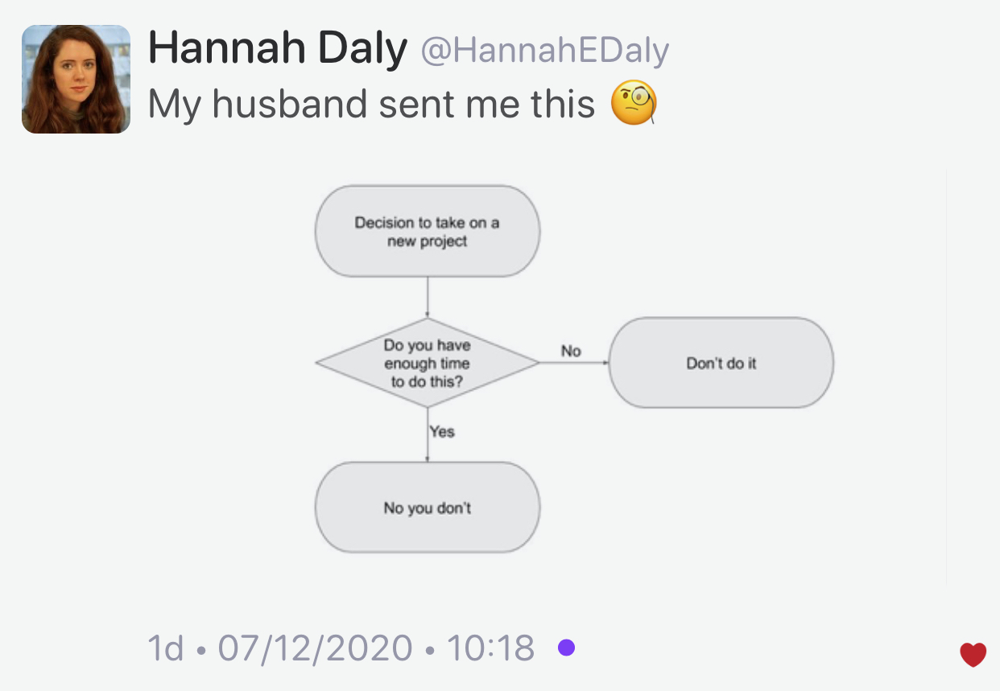

## The perils of the accidental C++ conversion constructor

* [Raymond Chen](https://devblogs.microsoft.com/oldnewthing/20210115-00/?p=104719)
  * [Reddit](https://www.reddit.com/r/cpp/comments/ky691b/the_perils_of_the_accidental_c_conversion/)

> No one hates C++ more than the people who love C++. [#](https://www.reddit.com/r/cpp/comments/ky691b/the_perils_of_the_accidental_c_conversion/gjfbed4/)

## Making Win32 APIs More Accessible to More Languages

* [Microsoft](https://blogs.windows.com/windowsdeveloper/2021/01/21/making-win32-apis-more-accessible-to-more-languages/)
  * [C++/WinRT](https://github.com/microsoft/cppwinrt)

## C++ and game engines

* [Reddit](https://www.reddit.com/r/cpp/comments/l1vfz5/c_and_game_engines/)

> Hey, I started out with C++ 3 months ago and really love it. I already have some experience in Unity, but I'd like to use C++. Is there any engine you would recommend me to try out? I know about Unreal Engine but I can't find any good tutorials for how to use C++ with Unreal Engine. Is there any other option or a tutorial series or anything you could recommend me?

## Game developers, what compiler optimization setting do you use?

* [Reddit](https://www.reddit.com/r/cpp/comments/kyeid1/game_developers_what_compiler_optimization/?ref=share&ref_source=link)

## EnTT 3.6.0

Gaming meets modern C++ - a fast and reliable entity component system (ECS) and much more.

* [Announcement on Reddit](https://www.reddit.com/r/gamedev/comments/kttqxm/entt_v360_is_out_gaming_meets_modern_c/)
  * [GitHub](https://github.com/skypjack/entt) (C++17, MIT)

## Better CMake

* [Videos by Jefferson Amstutz](https://www.youtube.com/playlist?list=PL8i3OhJb4FNV10aIZ8oF0AA46HgA2ed8g)

## Solving differential equations with LLVM

Heyoka is a C++ library for the integration of ordinary differential equations (ODEs) via Taylor’s method. Notable features include:

* support for both double-precision and extended-precision floating-point types (80-bit and 28-bit),
* the ability to maintain machine precision accuracy over tens of billions of timesteps, batch mode integration to harness the power of modern SIMD instruction sets,
* a high-performance implementation of Taylor’s method based on automatic differentiation techniques and aggressive just-in-time compilation via LLVM.

### Links

* [GitHub](https://github.com/bluescarni/heyoka) (C++17, MPL-2.0)
  * [Docs](https://bluescarni.github.io/heyoka/)
  * [Reddit](https://www.reddit.com/r/cpp/comments/lkcjki/solving_differential_equations_with_llvm/?ref=share&ref_source=link)

## TTauri: modern retained-mode GUI library in C++20

* [GitHub](https://github.com/ttauri-project/ttauri)
  * [Reddit](https://www.reddit.com/r/cpp/comments/llq4z7/ttauri_modern_retainedmode_gui_library_in_c20/)

## C++20 Coroutines: sketching a minimal async framework

* [Jeremy Ong](https://www.jeremyong.com/cpp/2021/01/04/cpp20-coroutines-a-minimal-async-framework/)
  * [Reddit](https://www.reddit.com/r/cpp/comments/ll3mdw/c20_coroutines_sketching_a_minimal_async_framework/)

## C++ Performance Trap #1: Constant-size std::vector

* [Scott Wolchok](https://wolchok.org/posts/cxx-trap-1-constant-size-vector/)
  * [Reddit](https://www.reddit.com/r/cpp/comments/kyc6f9/c_performance_trap_1_constantsize_stdvector/)
  * [Software optimization resources, by Agner](https://www.agner.org/optimize/#manuals)

## C++ Performance Trap #2: Unnecessary std::function

* [Scott Wolchok](https://wolchok.org/posts/cxx-trap-2-std-function/)
  * [Reddit](https://www.reddit.com/r/cpp/comments/kzvjgn/c_performance_trap_2_unnecessary_stdfunction/?ref=share&ref_source=link)

## Inlining and Compiler Optimizations

* [Scott Wolchok](https://wolchok.org/posts/inlining-and-compiler-optimizations/)
  * [Reddit](https://www.reddit.com/r/cpp/comments/l3r8o4/inlining_and_compiler_optimizations/?ref=share&ref_source=link)

## Library: Cli

A cross-platform header only C++14 library for interactive command line interfaces (Cisco style).

* [GitHub](https://github.com/daniele77/cli)

## Introduction to Lua in C++ with Sol2

* [Hristo Stamenov](https://thatonegamedev.com/cpp/introduction-to-lua-in-c-with-sol2/)

## Book erratum: Professional C++ by Marc Gregoire

* [Reddit](https://www.reddit.com/r/cpp/comments/ltwbsj/professional_c_5th_ed_and_statement_about_rvo_and/)

> Statements of the form return object; trigger return value optimization (RVO) if object is a local variable, a parameter to the function, or a temporary value. Furthermore, if object is a local variable, named return value optimization (NRVO) can kick in.

* [cppreference: Copy elision](https://en.cppreference.com/w/cpp/language/copy_elision)

## Free Windows 10 development virtual machines for HyperV, Parallels, VirtualBox, and VMWare

* [Scott Hanselman](https://www.hanselman.com/blog/free-windows-10-development-virtual-machines-for-hyperv-parallels-virtualbox-and-vmware)
* [Virtual machine downloads at Microsoft](https://developer.microsoft.com/en-us/windows/downloads/virtual-machines/?WT.mc_id=-blog-scottha)
* [Free developer tools for Windows 10](https://developer.microsoft.com/en-us/windows/downloads?WT.mc_id=-blog-scottha)

## New project flowchart

