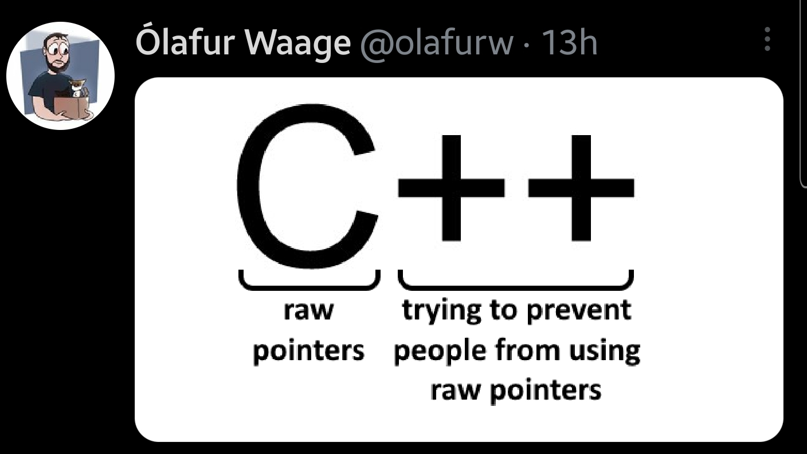

## WG21 April Mailing

The [April mailing](http://www.open-std.org/jtc1/sc22/wg21/docs/papers/2021/#mailing2021-04) is out. Here is what caught my attention.

### [P0323R10: `std::expected`](http://www.open-std.org/jtc1/sc22/wg21/docs/papers/2021/p0323r10.html)

This paper progresses to revision 10. It's an alternative error handling mechanism for when you cannot (or don't want to) use exceptions, but are OK with checking function return values.

Reddit [thread](https://www.reddit.com/r/cpp/comments/mxzu3h/wg21_aka_c_standard_committee_april_2021_mailing/gvsouet/) about this proposal has the usual topics:

* ["We need static deterministic exceptions"](https://www.reddit.com/r/cpp/comments/mxzu3h/wg21_aka_c_standard_committee_april_2021_mailing/gvtvh5a/) referencing the "Herbceptions" [proposal](http://www.open-std.org/jtc1/sc22/wg21/docs/papers/2019/p0709r4.pdf)
* ["We don't need another error handling method"](https://www.reddit.com/r/cpp/comments/mxzu3h/wg21_aka_c_standard_committee_april_2021_mailing/gvx9rpf/), mentioning Bjarne's paper criticising Herb Sutter's proposal
* ["Exceptions introduce invisible control flow"](https://www.reddit.com/r/cpp/comments/mxzu3h/wg21_aka_c_standard_committee_april_2021_mailing/gw108uf/) -- and so presumably we must handle everything manually and explicitly
* ["Herbceptions is the ideal solution but the committee has shown that it is both incapable of and unwilling to dedicate time to more important larger issues before C++29, as Bryce Lelbach said"](https://www.reddit.com/r/cpp/comments/mxzu3h/wg21_aka_c_standard_committee_april_2021_mailing/gvtw3g9/)
  * Didn't say that, says [Bryce Lelbach](https://www.reddit.com/r/cpp/comments/mxzu3h/wg21_aka_c_standard_committee_april_2021_mailing/gvua34x/): "I never said 'C++23 and C++26 are expected to be minor releases'", 
  * I did say something like that, says [Niall Douglas](https://www.reddit.com/r/cpp/comments/mxzu3h/wg21_aka_c_standard_committee_april_2021_mailing/gvx823v/): "Because the lack of face to face meetings has so severely impacted early stage proposals, you won't see the true effects of covid on the C++ feature pipeline until 26 or 29".

### [PP0447R13: Introduction of `std::colony` to the standard library](http://www.open-std.org/jtc1/sc22/wg21/docs/papers/2021/p0447r13.html)

Also, `std::colony` is probably getting renamed to `std::hive` -- see [P2332R0](http://www.open-std.org/jtc1/sc22/wg21/docs/papers/2021/p2332r0.html).

> Colony is a formalisation, extension and optimization of what is typically known as a 'bucket array' container <...> you have multiple memory blocks of elements, and a boolean token for each element which denotes whether or not that element is 'active' or 'erased', commonly known as a skipfield. If it is 'erased', it is skipped over during iteration. When all elements in a block are erased, the block is removed, so that iteration does not lose performance by having to skip empty blocks. If an insertion occurs when all the blocks are full, a new memory block is allocated.

> <...> Because a skipfield is used, no reallocation of elements is necessary upon erasure. Because the structure uses multiple memory blocks, insertions to a full container also do not trigger reallocations. This means that element memory locations stay stable and iterators stay valid regardless of erasure/insertion.

### [P1169R1: Static `operator()`](http://www.open-std.org/jtc1/sc22/wg21/docs/papers/2021/p1169r1.html)

> The proposal is to just allow the ability to make the call operator a static member function, instead of requiring it to be a non-static member function.

This would enable getting rid of hidden `this` parameter when calls to function objects are not inlined. Cases like this are happening more often as Ranges work progresses.

### [P1847R4: Make declaration order layout mandated](http://www.open-std.org/jtc1/sc22/wg21/docs/papers/2021/p1847r4.pdf)

The proposal is to remove the ability of implementations to reorder class member _layout_ according to their access control, to follow the established industry practice and avoid problems with ABI. I must admit I didn't even know this possibility existed.

### [P1967R4: Preprocessor `#embed` - binary resource inclusion](http://www.open-std.org/jtc1/sc22/wg21/docs/papers/2021/p1967r3.html)

This is a C-compatible way of including binary resources into programs, based on a new preprocessor directive, `#embed`.

```cpp
/* default is unsigned char */
const unsigned char icon_display_data[] = {
    #embed "art.png"
};
```

The author is Jean-Heyd Meneide, who previously was pushing for a C++ feature called `std::embed`. A redditor [writes](https://www.reddit.com/r/cpp/comments/mxzu3h/wg21_aka_c_standard_committee_april_2021_mailing/gvz6n43/):

> I think the author has decided that it would be helpful to get some implementation experience with `#embed` because the progress with `std::embed` has been very slow and the feedback from LEWG has not always been as helpful as it could have been.

### [P2342R0: For a Few Punctuators More](http://www.open-std.org/jtc1/sc22/wg21/docs/papers/2021/p2342r0.pdf)

This paper by Corentin Jabot proposes that the dollar sign '$', the backtick '`', and the at symbol '@' could be used as C++ tokens for any proposal that might need them in the future. It was prompted by the proposal of the dollar sign for reflection and its subsequent rejection out of the fear to break code or tools. Corentin writes:

> It seems increasingly difficult to find syntaxes for new features that are both distinct, easily readable, and terse.

The paper doesn't propose any changes to the standard but simply tries to convince the committee that having an option of using the above punctuators makes sense for any new features of C++. The author analyses the current usage of the punctuators in C++ and other languages, to see if there is a potential conflict.

### [P2350R0: `constexpr class`](http://www.open-std.org/jtc1/sc22/wg21/docs/papers/2021/p2350r0.pdf)

Andreas Fertig proposes to allow `constexpr` in the class head, much like `final`. It would declare that all member functions,including special member functions, in this class are implicitly `constexpr`. The author writes:

> This reduces the noise resulting from entirely `constexpr`-classes as we have it now.

I'm not sure about this. Comparing to `final` doesn't seem fair, as `final` doesn't change functions in the class itself, whereas if this proposal is accepted it will become more difficult to see whether a clas member function is `constexpr`, as you would have to look at the class declaration first. Maybe in this case a little additional verbosity actually good and makes things clearer?

### [P2360R0: Extend *init-statement* to allow *alias-declaration*](http://www.open-std.org/jtc1/sc22/wg21/docs/papers/2021/p2360r0.html)

Jens Maurer noticed an inconsistency in the fact that since C++20 it is valid to include `typedef`s in *init-expression* within `if`, `switch`, and range-`for`, but not *alias-declarations*, which are otherwise preferred over `typedef`s.

In C++20 you can do this:

```cpp
for (typedef int T; T e : v)
    /* something */;
```

The author proposes that the following should be valid too:

```cpp
for (using T = int; T e : v)
    /* something */;
```

## JF Bastien

I mentioned JF Bastien the last time and said he was no longer at Apple. Turns out, he is at [Woven Planet](https://www.woven-planet.global/) which is a subsidiary of Toyota working on self-driving cars. Recently they acquired Lyft's self-driving car unit, [Level 5](https://global.toyota/en/newsroom/corporate/35244091.html). Good luck to JF Bastien in his new role.

## Visual Studio 2019 16.10 Preview 3

Microsoft have released [Preview 3](https://github.com/microsoft/STL/wiki/Changelog#expected-in-vs-2019-1610-preview-3) of Visual Studio 2019 Version 16.10 (which is entirely too many version numbers). The main highlight is the included Standard Library (or STL, as they still call it) is C++20 feature complete. They have a nice progress chart of STL features to be implemented, and as you can see [there is nothing left to do for C++20](https://microsoft.github.io/STL/). Reddit seems [impressed](https://www.reddit.com/r/cpp/comments/mz8rkr/msvcs_stl_is_c20_feature_complete_for_vs_2019/).

## GCC 11.1 Released

The [release notes](https://gcc.gnu.org/pipermail/gcc/2021-April/235922.html) list the following major changes:

* switching the default debugging format to DWARF 5
* switching the default C++ language version to `-std=gnu++17`
* great progress in the C++20 language support, both on the compiler and library sides
* experimental C++23 support

## SIMD for C++ developers

Konstantin, who owns one of the coolest domain names a C++ developer could think of, const.me, wrote a [document](http://const.me/articles/simd/simd.pdf) explaining SIMD (Single-Instruction-Multiple-Data) programming. He starts with the following motivation:

> I’ve noticed many programmers I’m working with aren’t familiar with SIMD. I don’t want to stop writing vectorized code, the performance is just too good. Instead I’m writing this article hoping to educate people.

Konstantin explains how to use intrinsic compiler SIMD functions to achieve maximum performance without relying on compiler to vectorise your code.

A redditor [comments](https://www.reddit.com/r/cpp/comments/mzqn0v/simd_for_c_developers_pdf/gw8h4ql/):

> Programming SIMD with intrinsics is like programming in assembler.

From personal experience, code full of intrinsics may be faster that compiler-optimized version, but can be a nightmare to support. Before deciding to use them in production, it is probably wise to benchmark your code against a proof-of-concept version that uses intrinsics, and decide if the performance gain is significant enough to warrant potentially increased support efforts, especially if not all team members are comfortable with using intrinsics.

To help the compiler, you can use data-oriented programming techniques, arranging your data structures in a way that simplifies parallelization. These techniques are especially popular in game development.

The [Reddit thread](https://www.reddit.com/r/cpp/comments/mzqn0v/simd_for_c_developers_pdf/) points to an [interesting compiler](https://ispc.github.io/) from Intel:

> `ispc` is a compiler for a variant of the C programming language, with extensions for "single program, multiple data" (SPMD) programming. Under the SPMD model, the programmer writes a program that generally appears to be a regular serial program, though the execution model is actually that a number of program instances execute in parallel on the hardware.

> ispc is an open source compiler with a BSD license. It uses the remarkable LLVM Compiler Infrastructure for back-end code generation and optimization and is hosted on github. On CPU it supports Windows, Mac, and Linux, with both x86 and x86-64 targets. It currently supports the SSE2, SSE4, AVX1, AVX2, AVX512, and Xeon Phi "Knight's Corner" instruction sets. On GPU ispc supports Intel(R) Processor Graphics Gen9 and later on Linux platform.

I wonder how the generated code performs on AMD CPUs and GPUs.

## How C++ Resolves a Function Call

Canadian programmer Jeff Preshing ([@preshing](https://twitter.com/preshing)) posted an [article](https://preshing.com/20210315/how-cpp-resolves-a-function-call/) about how C++ resolves a function call, which has a nice diagram based on the C++ standard. He then explains in detail what happens at each step of the diagram:

* name lookup
  * member name lookup
  * qualified name lookup
  * unqualified name lookup (with its own [set of rules](https://en.cppreference.com/w/cpp/language/unqualified_lookup))
    * argument-dependent lookup
* handling of function templates
* overload resolution
* [tie-breakers](https://en.cppreference.com/w/cpp/language/overload_resolution#Best_viable_function)

This is a really good explanation that should be bookmarked and revisited more than once.

The [Reddit thread](https://www.reddit.com/r/cpp/comments/m5jpwz/how_c_resolves_a_function_call/) has more useful links, including ADL articles.

### ADL

* [cppreference](https://en.cppreference.com/w/cpp/language/adl)
* [Arthur O'Dwyer](https://quuxplusone.github.io/blog/2019/04/26/what-is-adl/)
* [Abseil Tip #49](https://abseil.io/tips/49)

## Don’t blindly prefer `emplace_back` to `push_back`

[Arthur O'Dwyer](https://quuxplusone.github.io/blog/2021/03/03/push-back-emplace-back/) writes:

> Even a decade after C++11 was released, I still sometimes see programmers assume that `emplace_back` is somehow related to move semantics. <...> `emplace_back` was added to the language at the same time as `std::move` — just like lambdas were added at the same time as `std::function` — but that doesn’t make them the same thing.

`emplace_back` constructs a container element in place, given constructor arguments. You can also move an element into its place in the container, but in this case `push_back` can also be used.

Arthur O'Dwyer then concludes:

> I recommend sticking with `push_back` for day-to-day use. You should definitely use `emplace_back` when you need its particular set of skills — for example, `emplace_back` is your only option when dealing with a `deque<mutex>` or other non-movable type — but `push_back` is the appropriate default.

He explains that using `std::embed` requires more work from the compiler, because

> `push_back` is an overload set of two non-template member functions. `emplace_back` is a single variadic template. <...> When you call `push_back`, the compiler must do overload resolution, but that’s all. When you call `emplace_back`, the compiler must do template type deduction, followed by overload resolution, followed by function template instantiation and code generation.

In the [Reddit thread](https://www.reddit.com/r/cpp/comments/lx7hej/dont_blindly_prefer_emplace_back_to_push_back/), a redditor nicely [summarised](https://www.reddit.com/r/cpp/comments/lx7hej/dont_blindly_prefer_emplace_back_to_push_back/gplomqr/) the article:

> tl;dr: understand what `emplace_back` does before you use it

Scott Meyers [gets a mention](https://www.reddit.com/r/cpp/comments/lx7hej/dont_blindly_prefer_emplace_back_to_push_back/gplg4ko/), which evolves into a sub-thread discussing his retirement from C++.

Another redditor [mentions](https://www.reddit.com/r/cpp/comments/lx7hej/dont_blindly_prefer_emplace_back_to_push_back/gpln1by/) [the emplace-new antipattern](http://kayari.org/cxx/antipatterns.html#emplace-new).

## C++ Antipatterns

Speaking of antipatterns, let's take a look at the [Kayari website](http://kayari.org/cxx/antipatterns.html) I just mentioned, which lists a few C++ antipatterns. The author writes:

> This page documents some common mistakes that I see again and again in bug reports and requests for help on sites like StackOverflow.

The list includes:

* [Reading from an `istream` without checking the result](http://kayari.org/cxx/antipatterns.html#istream-check)
* [Testing for `istream.eof()` in a loop](http://kayari.org/cxx/antipatterns.html#istream-eof)
* [Locking and unlocking a `std::mutex`](http://kayari.org/cxx/antipatterns.html#locking-mutex)
* [Inserting into a container of smart pointers with `emplace_back(new X)`](http://kayari.org/cxx/antipatterns.html#emplace-new), just mentioned above
* [Defining "less than" and other orderings correctly](http://kayari.org/cxx/antipatterns.html#strict-weak-order)
* [Dynamically allocating `std::thread` objects](http://kayari.org/cxx/antipatterns.html#std-thread-alloc); note that the thread starts immediately after creation, so if you want to defer it you can use `std::optional<std::thread>`.
* [Using `std::bind` when constructing `std::thread` objects](http://kayari.org/cxx/antipatterns.html#std-thread-bind)
* [Using `std::string("")` to create empty `std::string` objects](http://kayari.org/cxx/antipatterns.html#empty-string)

## Twitter

[Ólafur Waage](https://twitter.com/olafurw) [tweeted](https://i.redd.it/lpyz75l3tuu61.jpg):


