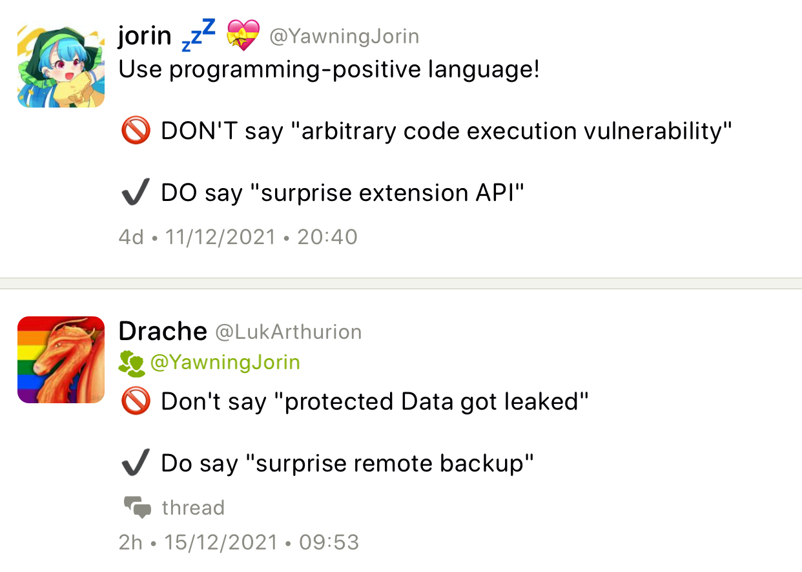

## Why do you like C++?

An amusing [thread](https://www.reddit.com/r/cpp/comments/scri8u/why_do_you_like_c/) on Reddit.

Some replies:

> I like it because it does what I ask it to do.
>
> And also because it does not do things I didn't ask it to do [#](https://www.reddit.com/r/cpp/comments/scri8u/why_do_you_like_c/hu8ewp0/)
>
> Philosophy: "Programmers should be free to pick their own programming style, and that style should be fully supported by C++." [#](https://www.reddit.com/r/cpp/comments/scri8u/why_do_you_like_c/hu8axvr/)
>
> I like it because it makes you say “wtf why?” at compile time rather than runtime. [#](https://www.reddit.com/r/cpp/comments/scri8u/why_do_you_like_c/hu8z8ux/)
>
> I don't like C++ except for a singular reason - my employer pays me well for writing C++. [#](https://www.reddit.com/r/cpp/comments/scri8u/why_do_you_like_c/hu9lcwn/)

## 2021-01 ISO C++ mailing

[Mailing](http://www.open-std.org/jtc1/sc22/wg21/docs/papers/2022/#mailing2022-01), [Reddit](https://www.reddit.com/r/cpp/comments/sa68c1/iso_c_january_2022_mailing_available/)

Let's look at some pape-e-e-ers!

### Direction for C++

[P2000](https://wg21.link/p2000)

The latest update to this paper moves goalposts for C++23 and C++26, admitting that reflection and pattern matching are now targeted for C++26. Contracts look optimistic for C++26 too, but you know how it is with contracts, so...

### Request for re-inclusion of `std::hive` proposal in C++23

[P2523](https://wg21.link/p2523)

> This is a brief rebuttal to the removal of [P0447](https://wg21.link/p0447) from the C++23 agenda and a request for its reinstatement after discussion within SG14. In the view of the SG14 committee, this paper has had significant investigation, insight and input over the years from both SG14 and LEWG members and can be considered 'mature' in the sense that the broad strokes will not change.

This paper lists issues raised during LEWG discussion and addresses them (there is a new revision of [P0447R18](https://wg21.link/P0447R18)). The author, Matthew Bentley, finishes with this:

> In summary, we request that hive be put back on the agenda for C++23. There are other papers which are much longer but have had considerably less oversight, which are now in progress for C++23, and we consider this egregious.

A quick update: Bryce Lelbach [replied to this on GitHub](https://github.com/cplusplus/papers/issues/1178#issuecomment-1027121338):

> We're a week away from C++23 design freeze. We can't consider adding more things to the plan for C++23.

So `std::hive` is not going to make it to C++23 in the end. I hope the author doesn't get discouraged by this.

### Scalable Reflection

[P1240R2](https://wg21.link/P1240R2)

A new revision of the reflection paper, nice! This revision was harmonized with other papers in this area and adopted syntax proposed in [P2320](https://wg21.link/P2320), replacing `reflexpr` with `^`:

```cpp
meta::info r1 = ^int;  // reflects the type-id int
meta::info r2 = ^x;    // reflects the id-expression x
meta::info r2 = ^f(x); // reflects the call f(x)
```

A notable change is replacement of the term _reification_ with _splicing_ (at the very least it's easier to pronounce, IMHO), which is _turning reflections into ordinary C++ source constructs_.

> Earlier versions of this paper were more exploratory in nature; this version uses experience with implementations based on earlier versions to narrow down a first set of metaprogramming features that are primarily aimed at providing reflection facilities (with splicing and ordinary template instantiation handling generative programming). However, additional facilities (particularly, for code injection) have been explored along with this proposal and we are not confident that they can be added incrementally on top of this proposal.
>
> The first and most complete is a fork of Clang by Lock3 Software (by, among others, Andrew and Wyatt, authors of this paper). It includes a large portion of the capabilities presented here, albeit not always with the exact syntax or interfaces proposed. In addition to these capabilities, Lock3’s implementation supports expansion statements and injection primitives (including “fragment” support). Lock3 is currently not maintaining this implementation, however.
>
> The second is based on the EDG front end (by Faisal and Daveed) and is less complete: It implements the reflection operator and most single splicers (but not the pack splicers; see below), and a few meta-library interfaces. It does not currently implement features in other proposals like expansion statements or injection primitives.

### Abbreviated Parameters

[P2424](https://wg21.link/p2424)

> This paper suggests alternative way of declaring parameter lists, one that let us omit parameter types.

_WHAAAAAAT?_

> If a parameter list starts with double parentheses `((`, then all single identifiers are not types, but variables instead

```cpp
// lambda:
[]((a, b)) { return a < b; }
// function:
auto less_than((a, b)) { return a < b; }
```

The paper also talks about omitting parameters altogether and leaving just commas.

Really not sure about this one. C++ can be hard to read as is, let's maybe not make it harder?

### `std::breakpoint`

[P2514](https://wg21.link/p2514)

This paper proposed a new library function `std::breakpoint` that stops program execution under debugger. Compiler-specific functions like that exist already: `__debugbreak` in MSVC, `__builtin_trap` in GCC and `__builtin_debugtrap` in Clang. On Windows you can use the Win32 API function `DebugBreakpoint`. It would be a useful function to have in the Standard library for when using IDE or a debugger UI to set a breakpoint is difficult.

### `std::is_debugger_present`

[P2515](https://wg21.link/P2515)

> This paper proposes a new function, `std::is_debugger_present`, that checks if a program is being debugged to aid in software development.

The first thing that comes to mind as a use case is not to allow a protected program to run under debugger, to prevent software copy protection or licensing code from being cracked.

### Contract support -- working paper

[P2521](https://wg21.link/P2521)

OK, so this paper doesn't propose anything new. Is its purpose to revive the effort, or to be the driving paper for contracts?

> We propose that there are two modes that a translation unit can be translated in:
>
> * **No_eval**: compiler checks the validity of expressions in contract annotations, but the annotations have no effect on the generated binary.
> * **Eval_and_abort**: each contract annotation is checked at runtime. The check evaluates the corresponding predicate; if the result equals false, the program is stopped an error return value.

Many think this is unacceptable: if a program cannot possibly terminate, these modes mean it cannot use contracts, or any libraries that use contracts (and that would include STL).

I guess we'll see how it goes and if it gets into C++26.

## What's up with modules?

From [Reddit](https://www.reddit.com/r/cpp/comments/s99ljm/modules_status/):

> I know MSVC allegedly has a feature-complete support for C++20 modules, but that doesn't mean much for cross-platform projects. There isn't much related discussion for CMake and GCC (not here, not on stackoverflow, nowhere), and from the little there is, I gather that it's mostly in such an early experimental phase that no one encourages using the feature. The MSVC team communicated their plans and status regularly, even joining the discussion on this sub, but other teams are eerily silent. Have users lost interest in modules? Have compiler devs/build system devs lost interest, or did they run into major problems?

Niall Douglas [replies](https://www.reddit.com/r/cpp/comments/s99ljm/modules_status/htmbt81/):

> <...> the real blocker for most people is cmake build support I think. And they're blocked on the compilers emitting the right Modules build metadata so they can implement cmake build support. It'll come eventually, maybe a year or two more.

Gabriel Dos Reis [says](https://www.reddit.com/r/cpp/comments/s99ljm/modules_status/htmfyxo/):

> Interests in C++ Modules are stronger than ever. We need indeed widespread build system support, e.g. in CMake. The SG15 Tooling Study Group has adopted a format for specifying source level dependencies (useful outside module uses), also implemented in MSVC. I would love to see more progress in GCC and Clang for the benefit of the C++ community at large.

The proposal for the common dependency specification is [P1689 Format for describing dependencies of source files](https://wg21.link/P1689)

Looks like MSVC is ahead of all the big compilers in module support, but it's not all roses either. This redditor [says](https://www.reddit.com/r/cpp/comments/s99ljm/modules_status/hto7nen/):

> Visual C++ has huge amount of bugs in module implementation. At least BOOST aware projects couldn't be ported on modules. For example I have 3 module bugs in Visual Studio bug tracker:
>
> * [https://developercommunity.visualstudio.com/t/Internal-Compiler-error-In-Project-With/1557697](https://developercommunity.visualstudio.com/t/Internal-Compiler-error-In-Project-With/1557697)
> * [https://developercommunity.visualstudio.com/t/Couldnt-Use-Eric-Niebler-Ranges-V3-Impl/1560676](https://developercommunity.visualstudio.com/t/Couldnt-Use-Eric-Niebler-Ranges-V3-Impl/1560676)
> * [https://developercommunity.visualstudio.com/t/Couldnt-Use-boostphoenix-Library-After/1560697](https://developercommunity.visualstudio.com/t/Couldnt-Use-boostphoenix-Library-After/1560697)
>
> and they are about 3 month is investigation status. So you can becalm yourself MSVC modules are not OK now.

From the [replies](https://www.reddit.com/r/cpp/comments/s99ljm/modules_status/htq02dq/):

> Same, I tried porting 4 cpps in real codebase to modules, got ICE in 3 of them

Some more [bugs](https://www.reddit.com/r/cpp/comments/s99ljm/modules_status/hu0efbv/):

> [https://developercommunity.visualstudio.com/t/warning-C4005:-Outptr:-macro-redefinit/1546919](https://developercommunity.visualstudio.com/t/warning-C4005:-Outptr:-macro-redefinit/1546919) I'd add this one. But I can confirm - modules are not usable in msvc 2022 :(

And [more](https://www.reddit.com/r/cpp/comments/s99ljm/modules_status/htsaqud/):

> Yep, from my coding exercises I would add the following issues:
>
> * `_Out` macros and other stuff when Windows headers get imported
> * Precompiled headers cannot be enabled in projects that use modules, lots of coffee time when using C++/WinRT with its pile of template magic generated out of IDL files.
> * IntelliSense
> * Pressing F12 on a module symbol might just kill VS
>
> Currently there is no plan how to import stuff that depend on several macros to control their behavior (e.g. `_ITERATOR_DEBUG_LEVEL`)
However, it is still the best experience versus GCC or even clang that apparently is still stuck with classical Apple/Google modules (from what I understand from existing docs).

Say you are starting a new cross-platform project. You are choosing a build system. What are your options if you want it to support C++20 modules?

* [CMake](https://gitlab.kitware.com/cmake/cmake/-/issues/18355) --- in development, waiting for compiler support.
* [build2](https://build2.org/blog/build2-cxx20-modules-gcc.xhtml) --- full support for modules with GCC announced in February 2021.
* [Meson](https://github.com/mesonbuild/meson/issues/4314) --- at the design discussion stage.
* [Bazel](https://github.com/bazelbuild/bazel/issues/4005) --- at the design discussion stage, some experiments taking place.
* [Premake](https://github.com/premake/premake-core/issues/1719) --- Supports MSVC modules, there is a [proposal](https://github.com/premake/premake-core/issues/1735) for GCC support.
* [Xmake](https://tboox.org/2021/10/30/xmake-update-v2.5.9/) --- full support for modules with MSVC/GCC/Clang (see [examples](https://github.com/xmake-io/xmake/tree/master/tests/projects/c%2B%2B/modules)). _What?!_ I haven't tried this, but it just sounds too good to be true. What is Xmake anyway? Watch this space...

## GSL 4.0.0 released

Microsoft's [Guideline](https://github.com/isocpp/CppCoreGuidelines) Support Library [has hit version 4.0.0](https://devblogs.microsoft.com/cppblog/gsl-4-0-0-is-available-now/). The code is on [GitHub](https://github.com/microsoft/GSL). It is cross-platform, requires C++14, and is distributed under MIT Licence. You can install it by downloading from GitHub, or by using Microsoft's C++ package manager, [vcpkg](https://github.com/Microsoft/vcpkg). It even has a custom debug visualizer for Visual Studio users.

## `const` all the things?

Arthur O'Dwyer wrote [this article](https://quuxplusone.github.io/blog/2022/01/23/dont-const-all-the-things/) on his blog. In it he lists places where he uses `const` and where he doesn't:

`const`:

> In function signatures: passing by `const` reference, `const` member functions

No `const`:

> In function signatures: passing by value
> Data members: never `const`
> > <...> the point of making a class with private members is to preserve invariants among those members. “This never changes” is just one possible invariant. Some people hear “never changes” and think it sounds a bit like `const`, so they slap const on that data member; but you shouldn’t lose sight of the fact that the way we preserve invariants in C++ isn’t with `const`, it’s with `private`.
> Return types: never `const`

Rarely `const`:

> Local variables (_I tend to disagree_)

[Reddit thread](https://www.reddit.com/r/cpp/comments/sbcjek/const_all_the_things/). A few redditors think that locals should be as `const` as possible.

This is [another Reddit thread](https://old.reddit.com/r/cpp/comments/s823vk/declaring_all_variables_local_to_a_function_as/) on making local variables `const`, and most commenters there agree with that.

## Best CPU vs GPU: 879 GB/s Reductions in C++

[This article](https://unum.cloud/post/2022-01-27-accumulate/) iterates through various methods to speed up calculations in C++ using vectorization and parallelization on CPU and GPU. The author provides code snippets that add 1GB floating numbers together and their throughput data. Let's see what are the results.

* Plain C++ and STL: around 5.2--5.3 GB/s
* SIMD AVX2 using intrinsics: 17--22 GB/s
* [OpenMP](https://www.openmp.org): 5.4 GB/s
* Parallel STL based on Intel [Threading Building Blocks](https://www.intel.com/content/www/us/en/developer/tools/oneapi/onetbb.html#gs.nt77ec) (TBB): 80--87 GB/s
* SIMD + Threads: 89 GB/s
* [CUDA](https://www.nvidia.com/en-gb/geforce/technologies/cuda/): 817 GB/s
* [Thrust](https://thrust.github.io): 743 GB/s (nice code!)

```cpp
thrust::reduce(numbers.begin(), numbers.end(), float(0), thrust::plus<float>());
```

* [CUB](https://docs.nvidia.com/cuda/cub/index.html): 879 GB/s

This is from Thrust home page:

> Thrust is a parallel algorithms library which resembles the C++ Standard Template Library (STL). Thrust’s high-level interface greatly enhances programmer productivity while enabling performance portability between GPUs and multicore CPUs. Interoperability with established technologies (such as CUDA, TBB, and OpenMP) facilitates integration with existing software.

Of all the above, based on the presented code snippets, I would choose Thrust.

## Twitter: be positive!


