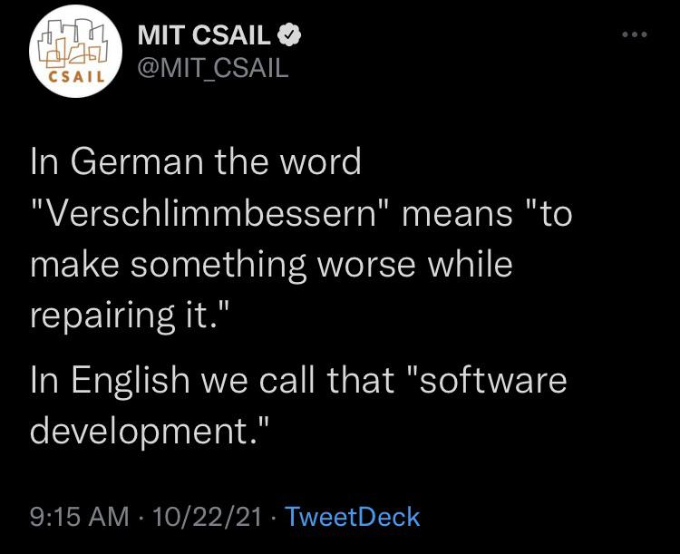

## C++23 Update

### Standard library modules are in

The paper [P2412](https://wg21.link/P2412) Standard library modules `std` and `std.compat` were unanimously approved for C++23. See [notes on GitHub](https://github.com/cplusplus/papers/issues/1115#issuecomment-1044968164). Hooray!

### Senders/receivers (`std::execution`) are out

There was no consensus for sending [P2300](https://wg21.link/P2300) to LWG for inclusion in C++23. The [GitHub page](https://github.com/cplusplus/papers/issues/1054#issuecomment-1041721767) for the paper has been tagged `C++26`. Six votes against and 11 strongly against, oh my. The comment says:

> There is sustained strong opposition against including such a large proposal into C++23 at such a late stage. It is also unclear whether we would be able to complete wording review in the limited time we have available. Timing is a major factor in the lack of consensus. The overall design still has strong support.

Vinnie Falco [posted](https://www.reddit.com/r/cpp/comments/st9bjm/p2300_senderreceiver_is_dead_in_the_water_for_c23/) on Reddit:

> P2300 (Sender/Receiver) is DEAD in the water for C++23 !!! Personally I prefer the executors and networking solution offered by Networking TS which is based on Asio and Boost.Asio, over the ad-hoc design of Sender/Receiver

Is he... gloating? Nooo, can't be. Not Vinnie Falco.

Redditor epicar [writes](https://www.reddit.com/r/cpp/comments/st9bjm/p2300_senderreceiver_is_dead_in_the_water_for_c23/hx2mw9y/):

> i do think the P2300 design has promise. but c++ standardization isn't where you start designing something like this. you release it as a library, get other people involved, and let it grow and stabilize over a few years. once it gains momentum, then you can take what you've learned and talk about standardizing it. it's unfortunate that so much time was spent on this proposal at the expense of other stuff

Facebook has been running [libunifex](https://github.com/facebookexperimental/libunifex) for a while now, but this is what another redditor [says](https://www.reddit.com/r/cpp/comments/st9bjm/p2300_senderreceiver_is_dead_in_the_water_for_c23/hx32zc2/) about it:

> When I initially started playing with libunifex, I just got stuck. The documentation is incomprehensibly dense, the examples are meaningless and the code looks like a different programming language. Only after seeing Eric Niebler's cppcon talk last year, did I gain enough understanding to actually be able to write some code that compiled and did something remotely related to what I was aiming for. In doing so, I found out that this design really seems to force you to write nasty template code that becomes an utter mess of boilerplate if you don't want to expose all implementation details in your header files.

Eric Niebler [responds](https://www.reddit.com/r/cpp/comments/st9bjm/p2300_senderreceiver_is_dead_in_the_water_for_c23/hx3qtq9/):

> Time is tight, documentation is hard. I haven't found a good solution to this problem yet. At least you found my talk useful. I've been meaning to turn it into a series of blog posts, which might help somewhat.

One redditor angrily [addresses](https://www.reddit.com/r/cpp/comments/st9bjm/p2300_senderreceiver_is_dead_in_the_water_for_c23/hx2zsbt/) the above note about Senders & Receivers being designed in the committee:

> S&R was not started by the committee at all, that's bullshit propaganda from the opponents to this paper.

Eric Niebler [clarifies](https://www.reddit.com/r/cpp/comments/st9bjm/p2300_senderreceiver_is_dead_in_the_water_for_c23/hx3xlch/):

> S&R started life within Facebook as a generic solution for safe, efficient, composable concurrency. It is used in many of FB's mobile apps, where size and speed matter.

He then [says](https://www.reddit.com/r/cpp/comments/st9bjm/p2300_senderreceiver_is_dead_in_the_water_for_c23/hx3rylc/):

> Those in favor of forwarding for C++23 outnumbered those against by more than 2-to-1. That technically is consensus by the Committee's own rule of thumb for such things. The chairs make the final call though, and they felt that waiting was the better option. I'm disappointed, but I see the vote as a strong endorsement of the direction of P2300.
>
> Although it's foolish to make predictions when it comes to WG21, I'll do it anyway: I'm confident that sender/receiver will be in C++26, probably very early in the cycle.

Then the discussion goes into the usual hot topics like ABI, the committee, what should and should not be in the standard. A separate thread goes into comparison of ASIO and S&R, with clearly defined sides, and I think there is a consensus that S&R is a better design. Also, ASIO is a poor fit for resource-constrained platforms, while S&R works on the smallest microcontrollers.

There is an interesting example of S&R pipelines being optimized away on [Godbolt](https://godbolt.org/z/h4vWd9cxM).

A redditor [asks](https://www.reddit.com/r/cpp/comments/st9bjm/p2300_senderreceiver_is_dead_in_the_water_for_c23/hx3lq9v/):

> Can you please provide an example of something the S&R proposal can do (or even is proposed to do) that cannot be done in ASIO now/today?

Steve Downey [replies](https://www.reddit.com/r/cpp/comments/st9bjm/p2300_senderreceiver_is_dead_in_the_water_for_c23/hx4stqw/):

> The one that is brought up, repeatedly, is heterogeneous operations, ones that move between CPU and GPU, in particular in the face of cancellation. This wasn't a concern for ASIO when it was written. It's a base concept for S/R. I'll also say that it's straightforward to make lazy become eager, just as it is to make async be sync. The other way round is a challenging open problem.

The S&R proposal [P2300](https://wg21.link/P2300/github) is now tagged `C++26` and I hope it gets there.

### `std::expected`

[P0323R11](https://wg21.link/P0323R11) `std::expected` is in C++23.

> We consider `expected<T, E>` as a supplement to `optional<T>`, expressing why an expected value isn’t contained in the object.

A standard alternative to function return codes is now in the standard. This will end C++ error handling debates once and for all.

### `std::function_ref`

[P0792R8](https://wg21.link/P0792R8) `std::function_ref` is in C++23. It's a non-owning equivalent of `std::function` that is more efficient and optimization-friendly.

## What happened to `std::hive`?

A [post](https://www.reddit.com/r/cpp/comments/smy0pz/regarding_what_happened_to_p0447_why/) on Reddit discusses the situation around the `std::hive` proposal, [P0447](https://wg21.link/P0447), which didn't make it into C++23 despite supposedly being ready. The poster makes statis with the following:

> [P0447R18](https://wg21.link/P0447R18) `std::hive` is a simple container that is visualized as a chain of blocks --- storing and erasing elements efficiently, and guarantees iterator stability since nothing is moved around <...> the proposal is literally the most revisioned P paper in C++ history <...> --- with 19 revisions. The reason for such a high number of revisions can be seen from the fact that, in the current state, half of the proposal is the Appendix that deals with all kinds of questions that LEWG and SG14 threw at the author. The actual design + wording is fairly small-scaled.

The poster continues:

> <...> the last formal talk on the proposal in a subgroup is way back in Kona (2019-02, by LEWGI). <...> Around some time in 2021-10, LEWG backlogged and was forced to use all their available telecon and EP space to talk about things that are prioritized for C++23 - Ranges, Executors, `std::generator`, `mdspan`. P0447 is silently dropped from the schedule, and never recovered. And it obviously missed the train. <...> Throughout the whole of 2021, P0447 is the only paper that is originally scheduled but never really discussed at the end.

He then says:

> There is no one to blame in this situation. Committee and groups are doing great jobs (and a great salute to LEWG and other subgroups --- everyone makes tremendous efforts to land a lot of proposals on track for C++23), and `std::hive` is by no means one of the priorities <...> The author is also doing a great job --- constantly producing revisions <...> and answering all the issues in great detail. <...> Yet everyone is doing the right thing, something still went wrong --- a perfectly good proposal, matured, and with plenty of time, simply get ignored and missed the train. Many of us even hesitated to submit our own proposal just because of what happened to P0447 --- your heavy investment in your proposal can just be ignored for years. Don't take me wrong --- I will never blame the committee for this, both the committee and the author are doing the right thing. So what went wrong?

The poster concludes:

> I think solving the problem raised is crucial for maintaining people's interest in writing new proposals or participating in C++ standardization in general.

The thread has some interesting takes on this. David Goldblatt [writes](https://www.reddit.com/r/cpp/comments/smy0pz/regarding_what_happened_to_p0447_why/hvzmcjt/):

> There's sort of a question of "what should go in the standard library" that LEWG has never formalized an answer to. <...> `std::hive` seems to be in a sort of situation where nobody but the author really cares that much whether or not it gets standardized, so it's easy for the people in the room to take any excuse to not bother with it and focus on something else. So `std::hive` goes through like 20 revisions for mostly minor details. <...> I think the author is sort of misreading the dynamic as "people don't understand the point of this data structure because it's uncommon". I think it's more "people understand but are not convinced".

Billy O'Neal writes:

> The advantage of putting things into `std::` is that they are available everywhere; a corollary of that is that anything that goes into `std::` must be possible to be made available everywhere. This is part of where the ABI restrictions come from. This is why I (personally, not MS) still oppose networking in the standard. Not because I have a problem with the ASIO design <...>, but because any responsible networking needs TLS, and we don't believe we can get TLS that meets `std`'s requirements.
>
> Given that it's a container, there's no reason `std::hive` can't go into `std::`. But anyone who cares about its performance sensitive nature will be better served by something not in `std::` without `std::`'s very strong ABI compat[ibility] requirements.

Redditor Solokiller [writes](https://www.reddit.com/r/cpp/comments/smy0pz/regarding_what_happened_to_p0447_why/hvzrbwt/):

> I'd agree with restricting what's in the standard library if the standard actually had some kind of formalized library/package management but it doesn't.

With that, the discussion descends into package management, with shout-outs to other languages like Rust, Python, [Zig](https://ziglang.org).

Grafikrobot [writes](https://www.reddit.com/r/cpp/comments/smy0pz/regarding_what_happened_to_p0447_why/hw0j1fe/):

> Every time `std::hive` has been discussed in SG14, the low latency sub-group, it's been high priority and something that is widely used in that context.

Jonathan Müller (@foonathan) [writes](https://www.reddit.com/r/cpp/comments/smy0pz/regarding_what_happened_to_p0447_why/hvzmpvq/):

> LWG is still severely backlogged. Quoting the minutes from the most recent Admin telecon <...>: "LWG continues to meet weekly and has made some good progress. But we still have a huge backlog of papers, some left over from before C++20 was published, and many new ones. There is no chance we will review them all for C++23." So even if LEWG decided to approve the paper, I would have been surprised if LWG didn't have time to review it. All the "high-priority" stuff has a lot of wording that they need to go through.

Vinnie Falco didn't miss an opportunity to make a snarky [comment](https://www.reddit.com/r/cpp/comments/smy0pz/regarding_what_happened_to_p0447_why/hw0pgp5/) regarding the time the committee spent on [P2300](https://wg21.link/P2300) and was quickly downvoted into oblivion.

There are some more radical ideas in the thread. Redditor lenkite1 [writes](https://www.reddit.com/r/cpp/comments/smy0pz/regarding_what_happened_to_p0447_why/hw0mukq/):

> I believe the 3 year time-gap is too much for C++ standardisation. Have a yearly train. That will also increase motivation considerably for paper authors.

Steve Downey [replies](https://www.reddit.com/r/cpp/comments/smy0pz/regarding_what_happened_to_p0447_why/hw4v413/):

> There is no way to turn the ISO crank faster than 3 years, you get eaten by the overhead. <...> Getting the C++ Standard out of ISO would be a very tall order.

So, to conclude, hopefully `std::hive` makes it into C++26. In the meantime there is [`plf::colony`](https://www.plflib.org/colony.htm), which `std::hive` is based on.

## February C++ Standard Committee Mailing

[Mailing](http://www.open-std.org/jtc1/sc22/wg21/docs/papers/2022/#mailing2022-02)

This time there is quite a few papers at version 0. The work on C++26 is starting, now that C++23 reached feature freeze. It'll be great, now that we've been told the pandemic is over! (_Just kidding_)

### [P2536R0](https://wg21.link/P2536R0) Distributing C++ Module Libraries with dependencies JSON files

This paper proposes to include a JSON file describing module dependencies alongside module BMI files when distributing pre-built module libraries.

### [P2544R0](https://wg21.link/P2544R0) C++ exceptions are becoming more and more problematic

This paper argues that exceptions are incompatible with modern multicore systems, provides benchmarks of various error handling methods for a multithreaded program that randomly produces errors (i.e. an artificial pessimistic case), and proposes several ways of "fixing" exceptions: `std::expected`, `boost::LEAF`, Herb Sutter's "throwing values" proposal ([P0709](https://wg21.link/P0709)), and fixing traditional exceptions (which requires an ABI break). In the Reddit [thread](https://www.reddit.com/r/cpp/comments/syz49p/p2544r0_c_exceptions_are_becoming_more_and_more/) Billy O'Neal says:

> The problem described there is generally about how operating systems deal with dynamic libraries and the metadata needed to unwind a stack correctly. Nothing the C++ implementation can do on its own can meaningfully fix that.

Another poster [says](https://www.reddit.com/r/cpp/comments/syz49p/p2544r0_c_exceptions_are_becoming_more_and_more/hy1mh8w/):

> Saying that exceptions are slow when you throw them thousands of times per second is completely uninteresting; The community (hopefully) knows not to do that. If you're using exceptions for heavy duty input validation you're gonna have a bad time. Exceptions remain free for the non-throwing case, and you should use them appropriately if it makes your code easier to maintain.

And [another](https://www.reddit.com/r/cpp/comments/syz49p/p2544r0_c_exceptions_are_becoming_more_and_more/hy1b406/):

> So the paper basically says that handling a gazillion exceptions simultaneously could be slow? Wow, that's a revelation. We otta do something ASAP.

### [P2546R0](https://wg21.link/P2546R0) Debugging Support

This paper combines previous separate proposals for `std::breakpoint` and `std::is_debugger_present`, and adds `std::breakpoint_if_debugging`.

### [P2547R0](https://wg21.link/P2547R0) Language support for customisable functions

This paper proposes to add customization points in the form of namespace-scope virtual functions, which can be pure, and can have default implementations.

> A customisable function prototype creates a name that identifies an empty object that can be passed around by-value. This object represents the overload-set of all overloads of that function and so can be passed to higher-order functions without having to wrap it in a lambda.

This is an interesting new language-level alternative to `tag_invoke` customization point objects (see [P1895](https://wg21.link/P1895) by Lewis Baker, Eric Niebler and Kirk Shoop) that would replace it in S&R [P2300](https://wg21.link/2300).

## C++ Cheat Sheets

Hacking C++ has an [entire page](https://hackingcpp.com/cpp/cheat_sheets.html) full of C++ cheatsheets, and they look amazing. The diagrams explaining various concepts, algorithms and containers are very well done. Definitely one for bookmarks. Or maybe even for bulk downloading of all the cheatsheets, in case the website disappears, or the internet is down due to a storm, or there is a war but you still need C++. Wow, this suddenly got dark somehow.

## Rui Ueyama tweets about `mold`

Rui Ueyama [tweeted](https://twitter.com/rui314/status/1494879178478727168):

> mold 1.1 is going to be awesome. It will be the first version to support RISC-V and LTO (link-time optimization).

Amazing progress of a super-fast linker. Can't wait to adopt it!

## Swift and C++ interoperability workgroup announcement

We discussed [Swift C++ Interoperability Manifesto](https://github.com/apple/swift/blob/main/docs/CppInteroperabilityManifesto.md) previously. There is a new development in this area: the creation of a [workgroup](https://forums.swift.org/t/swift-and-c-interoperability-workgroup-announcement/54998) dedicated to C++ and Swift bi-directional API level interoperability.

> Over the past few years there has been a huge amount of interest in bidirectional interoperability between Swift and C++. <...> the Swift compiler is now able to import and use some C++ APIs, including C++ standard library types like `std::string` and `std::vector`. <...> To advance the interoperability support between Swift and C++, we are announcing the formation of the Swift and C++ interoperability workgroup as part of the Swift project.

This is very welcome news. There are many tasks for which C++ is better suited (like working with memory or system APIs), and to be able to use C++ in a Swift program, especially with two-way access, will be really helpful. It also shows that no matter how focussed Apple is on Swift, they must have realised that C++ isn't going anywhere and there needs to be a way for Swift to use it.

## Which standard C++ library elements should I avoid?

A redditor [asks](https://www.reddit.com/r/cpp/comments/sa080z/which_standard_c_library_elements_should_i_avoid/):

> I'm aware that due to ABI backward compatibility and historical reasons there are parts of standard library that shouldn't be used. I've seen people complaining and warning about regular expresions/unordered containers since they are (apparently) horrendously slow. What about the other stuff? What else is advised to be ignored?

The most sensible advice seems to be to avoid nothing and measure performance. However, many redditors concur that `std::regex` is very slow and shouldn't be used. Apparently `boost::regex` is about 10 times faster, and there is also much anticipated [compile-time regular expressions](https://github.com/hanickadot/compile-time-regular-expressions) (CTRE) by Hana Dusíková that you can with C++17 and C++20.

According to a Microsoft STL [developer](https://www.reddit.com/r/cpp/comments/sa080z/which_standard_c_library_elements_should_i_avoid/htswq66/):

> `std::regex` is bad and you should forget it exists.

Regarding `std::map` versus `std::unordered_map`, opinions [differ](https://www.reddit.com/r/cpp/comments/sa080z/which_standard_c_library_elements_should_i_avoid/htr0rrv/). Some say that `map` is slow and you should use `unordered_map` unless you need ordering. Others point out that `unordered_map` has more requirements for the element type (hashing). I liked this [quote](https://www.reddit.com/r/cpp/comments/sa080z/which_standard_c_library_elements_should_i_avoid/htsbqkw/) by **mark_99**:

> `unordered_map` is never very slow under any of the possible use cases.

A link was posted to a [set of benchmarks](https://tessil.github.io/2016/08/29/benchmark-hopscotch-map.html) for the most common hash map implementations, which show that `std::unordered_map` is indeed slow compared to other hash maps.

Anotehr redditor [says](https://www.reddit.com/r/cpp/comments/sa080z/which_standard_c_library_elements_should_i_avoid/htrbeti/) not to use iostreams, as they are slow and add too much bloat to the binary, which is especially important in the embedded space. The **{fmt}** library is much faster, has very small code size, and is easy to work with.

To speed up maths this redditor [says](https://www.reddit.com/r/cpp/comments/sa080z/which_standard_c_library_elements_should_i_avoid/htqyit7/):

> If you don't rely on it disable math-`errno` on your compiler. The C standard mandates that otherwise single instruction operations like `sqrt` return their errors as `errno` value, which can result in half a page of cleanup instructions for every instruction of actual work.

A redditor [says](https://www.reddit.com/r/cpp/comments/sa080z/which_standard_c_library_elements_should_i_avoid/htqn6ib/):

> I don't use `thread` anymore, just `jthread`.

Remember the proposal to make `<random>` usable, which didn't make it into C++23? A redditor [writes](https://www.reddit.com/r/cpp/comments/sa080z/which_standard_c_library_elements_should_i_avoid/htshwlg/):

> `<random>` is suboptimal and worth avoiding, because all of the generators provided are slow or have poor statistical qualities, and its generally difficult to use correctly.

There are also discussions of `std::list` vs. `std::vector` which you can read yourself.

## I don’t know which container to use

A related article by Chloé Lourseyre on the _Belay C++_ blog goes into details of container selection given a task and requirements.

> As far as containers go in C++, since `std::vector` is well suited for most cases (with the occasional `std::map` when you need key-value association), it’s become easy to forget that there are other types of containers. Each container has its strength and weaknesses <...>.

The author presents two matrices illustrating container properties, one for sequence containers and another for associative containers. She also shows Joe Gibson's data structure selection flowchart.

> Vectors are the most understandable structure because it is quite close to the plain-old arrays. Most C++ users aren’t experts, and `std::vector` is the container they know how to use best. We shouldn’t make mundane code any more difficult to read and understand. Of course, as soon as you have special needs, you should use the most appropriate container, but that doesn’t happen very often.

Chloé reminds us that optimization should not be the first consideration. Only after you measure the performance you should start thinking of choosing a faster data structure. She provides her own flowchart that works like a preliminary step before referring to Joe Gibson's flowchart for more granular selection. Her flowchart advises to use `std::vector` and `std::map` by default. There is a footnote clarifying use of unordered containers:

> Unfortunately, the presented flowchart lacks any `unordered_` associative containers. But you can think of it like this: "Values need to be ordered? Yes -> `map/set` ; No -> `unordered_map/unordered_set`".

There is a short Reddit [thread](https://www.reddit.com/r/cpp/comments/simufv/i_dont_know_which_container_to_use_and_at_this/) discussing the article. The [first reply](https://www.reddit.com/r/cpp/comments/simufv/i_dont_know_which_container_to_use_and_at_this/hv9m1c6/) is:

> Almost always vector.

Regarding maps, a redditor [says](https://www.reddit.com/r/cpp/comments/simufv/i_dont_know_which_container_to_use_and_at_this/hv9ox91/):

> (Almost) Never. Use. `std::map`. If you think you need `std::map`, you really want `std::unordered_map`.

I'm looking forward to `std::hive` in C++26.

## Standard pronunciation

A redditor writes:

> How do you read a code like this: `std::vector<int>`? Like is it "std colon colon vector int"?

Most redditors in the discussion don't pronounce `::` and say simply "standard vector of int". Some go to the trouble of saying "Es tee dee vector int". Or [even](https://www.reddit.com/r/cpp/comments/snpvne/how_do_you_readpronounce_the_scope_resolution/hw56eiw/):

> Es tee dee four dots without lines in the shape of a square left, vector unfinished acute triangle facing east, int, unfinished acute triangle facing west

This is a pretty unique [take](https://www.reddit.com/r/cpp/comments/snpvne/how_do_you_readpronounce_the_scope_resolution/hw48q0i/):

> The teacher of the first CS classes I took once gave us vocal sound effects to use for punctuation. (Just for fun, we didn't actually say these in class.) I think some of them might have been:
>
> * . "ptt"
> * , "puh"
> * -> "whoosh"
> * ! "Whoop Ptt"
> * ( upward "wssh"
> * ) downward "wssh"

There is also this curiosity from PHP if you are not sure how to pronounce `::` --- apparently in PHP it is [officially called](https://www.reddit.com/r/cpp/comments/snpvne/how_do_you_readpronounce_the_scope_resolution/hw4azfu/) "Paamayim Nekudotayim".

> The name "Paamayim Nekudotayim" was introduced in the Israeli-developed Zend Engine 0.5 used in PHP 3. Although it has been confusing to many developers who do not speak Hebrew, it is still being used in PHP 7, as in this sample error message:

```bash
$ php -r ::
Parse error: syntax error, unexpected T_PAAMAYIM_NEKUDOTAYIM
```

A redditor [replies](https://www.reddit.com/r/cpp/comments/snpvne/how_do_you_readpronounce_the_scope_resolution/hw50et7/):

> Wait, it isn't even spelled correctly?

To which another one [responds](https://www.reddit.com/r/cpp/comments/snpvne/how_do_you_readpronounce_the_scope_resolution/hw6ajsy/):

> It's php. What did you expect

(_Can we please have some Danish keywords in C++, just so that I could hear people try to pronounce them?_)

Some people pronounce `std::` as "stud", including [STL](https://www.reddit.com/r/cpp/comments/snpvne/how_do_you_readpronounce_the_scope_resolution/hw4hu3x/). [This](https://www.reddit.com/r/cpp/comments/snpvne/how_do_you_readpronounce_the_scope_resolution/hwa0751/) could be a good approach:

> If I'm reading out loud, it will be: stood vector of int. If I'm dictating, it will be: es, tee, dee, colon, colon, vector, opening angle bracket, int, closing angle bracket.

How do you pronounce it?

## Using C++20 modules with Bazel

Apparently Bazel does support modules, and [this article](https://buildingblock.ai/cpp20-modules-bazel) shows how to set them up using Clang. Bookmarking this for future reference.

Looking at the build definition file, it strikes me as pretty verbose and very detailed, with all the compiler flags specified manually. But what if you don't want to spend too much time on that and just use sane defaults? Check our [xmake](https://xmake.io), which I'm happily using for my toy project!

## C++ IDE poll

A redditor [asks](https://www.reddit.com/r/cpp/comments/srq6ek/what_is_your_favourite_ide_for_c/): "What is your favourite C++ IDE?"

Here are the results of the [poll](https://www.reddit.com/poll/srq6ek) so far:

| Votes | IDE                  |
| ----- | -------------------- |
| 2.0K  | VSCode               |
| 1.9K  | Visual Studio        |
| 1.1K  | CLion (gets my vote) |
| 803   | Vim                  |
| 192   | Code::Blocks         |
| 709   | Other                |

Some points from the following discussion:

* Visual Studio is better than VSCode, but VSCode is free and cross-platform. There is a free Visual Studio Community Edition, but it is also Windows only, and [Visual Studio for Mac](https://visualstudio.microsoft.com/vs/mac/) is a misleading name as it doesn't support C++.
* QT Creator is an excellent and free cross-platform IDE even if you don't use QT.
* KDevelop is another great free IDE.
* Emacs absence [didn't go unnoticed](https://www.reddit.com/r/cpp/comments/srq6ek/what_is_your_favourite_ide_for_c/hwu3ytv/), but the [reply](https://www.reddit.com/r/cpp/comments/srq6ek/what_is_your_favourite_ide_for_c/hwv3zy2/) was:

> > They are asking about favorite IDE's, not favorite operating systems.

* People [remember](https://www.reddit.com/r/cpp/comments/srq6ek/what_is_your_favourite_ide_for_c/hwulj7o/) Borland C++ fondly. Nobody mentions the successor, C++ Builder, probably because it's not very good and is Windows-only and very expensive.
* Some even use Eclipse CDT (_shudder_)

I use Visual Studio on Windows, and CLion everywhere.

## Twitter


H
