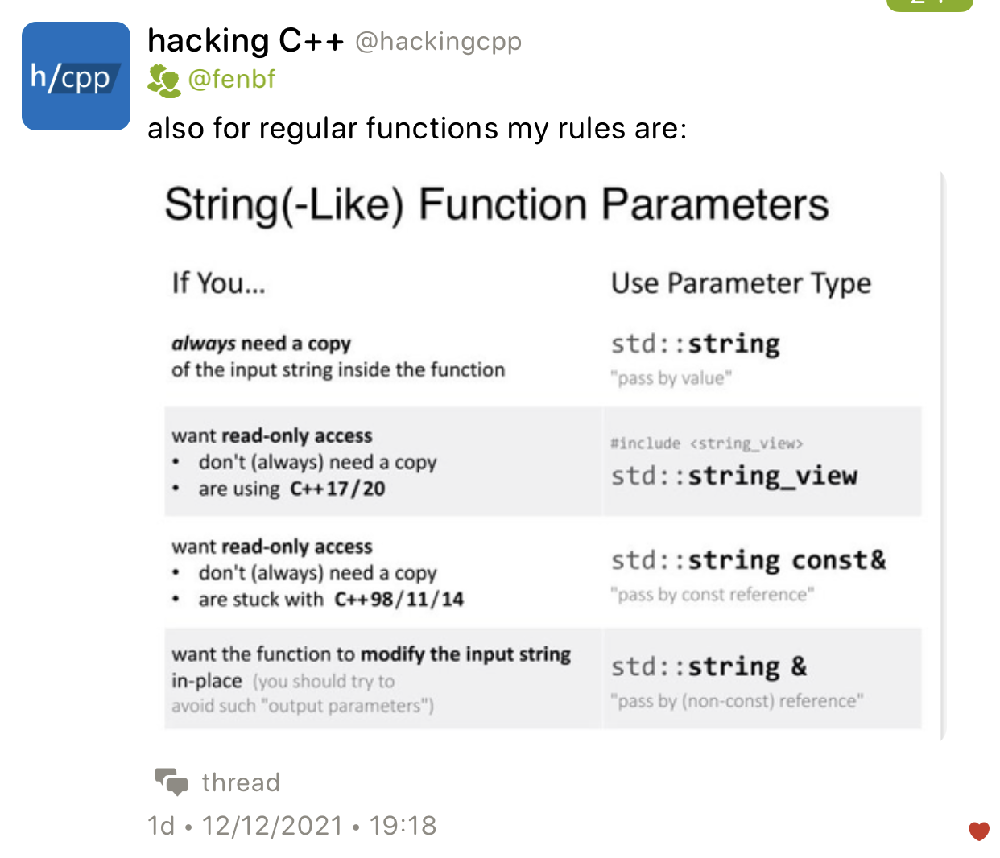
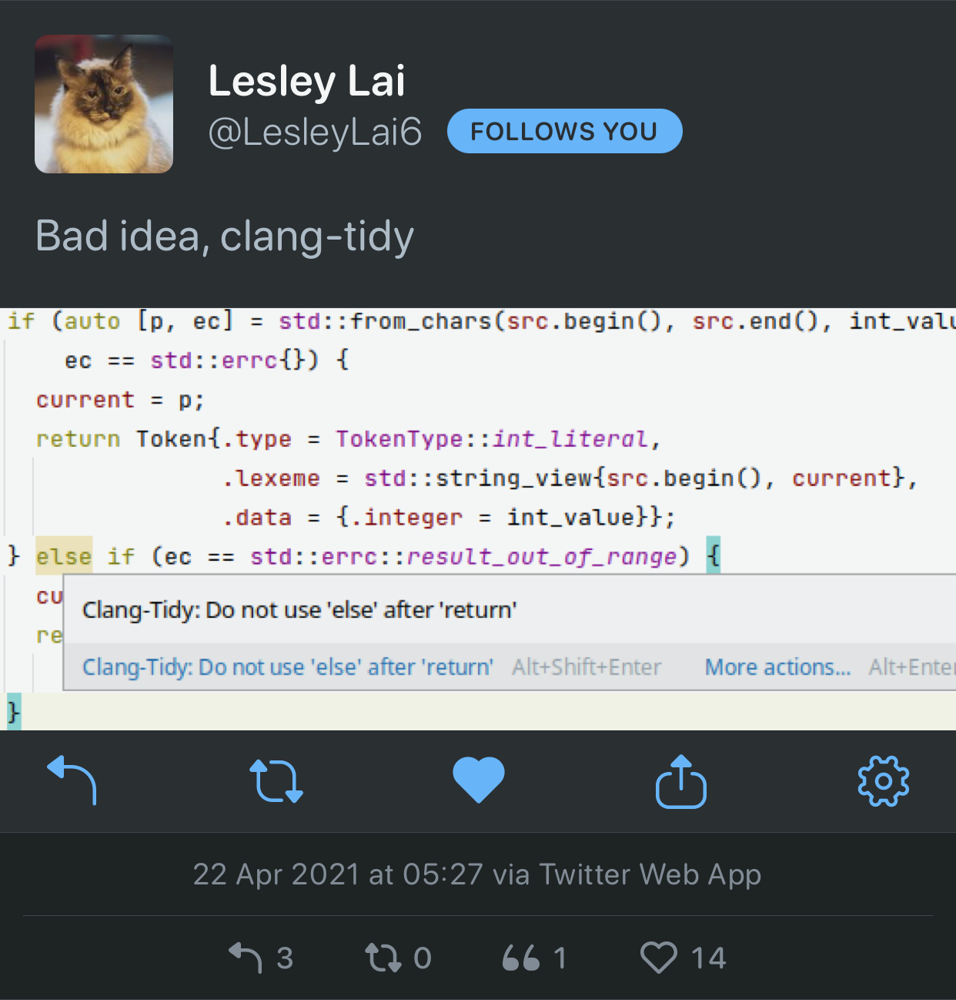
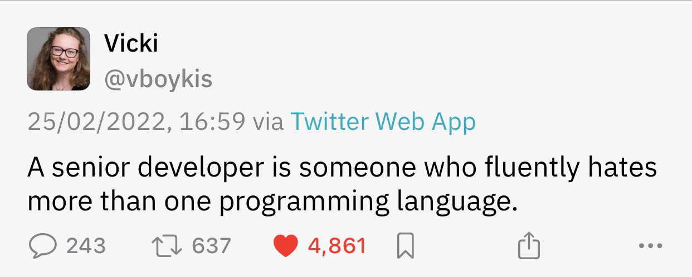
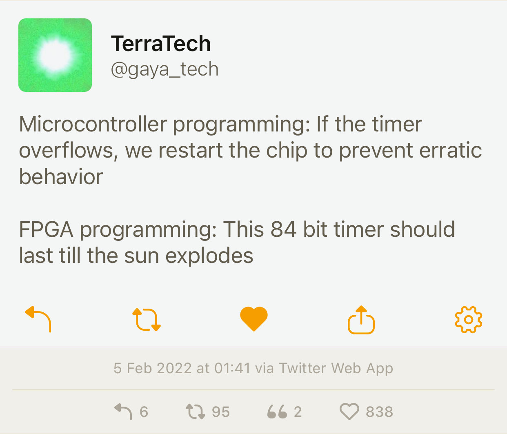

## War

Discussing C++ while a war in Europe is raging feels surreal. I'm with the people of Ukraine who are experiencing this unspeakable tragedy. I hope they prevail, and I hope the Russian war criminals will be brought to justice. My parents are in Lithuania, and I'm very worried.

## P2300 is headed to C++26

[P2300](https://wg21.link/P2300) `std::execution` is headed to C++26. The latest poll with the question "Advance P2300R5 to electronic polling to send it to LWG for C++26" resulted in strong consensus with just a single neutral vote and no votes against. You probably remember that on its way to C++23 the paper was met with strong objections from quite a few people. Maybe the latest poll reflects the fact that C++26 is a loo-o-o-ng way away and the paper can be ready in time. Or maybe not all committee members were notified of the poll, which I guess is one way of solving the problem.

## Modern C++ Course from Bonn U

There is a decent Modern C++ course from Bonn University on YouTube, [check it out](https://youtube.com/playlist?list=PLgnQpQtFTOGR50iIOtO36nK6aNPtVq98C).

## Mold 1.1.1 released

Rui Ueyama [released version 1.1.1](https://www.phoronix.com/scan.php?page=news_item&px=Mold-1.1.1-Released) of his new fast linker mold. This version adds new LTO options for lld compatibility and reduces memory usage by ~6%, consuming less memory than GNU Gold or Clang lld.

## String-like parameter cheatsheet



When using the pass-by-value + move idiom in constructors, be extra careful not to use the passed parameter after it has been moved-from.

## Specializations of variable templates can have different type

Eric Niebler [tweets](https://twitter.com/ericniebler/status/1501710180442013697):

> Specializations of a variable template can have different types. Huh. #TIL #CPP

Hana Dusíková replies:

> It's exactly [the] same as specialization of [a] template based on type


Corentin Jabot [follows up](https://twitter.com/Cor3ntin/status/1501856666995806208):

> One of the things that's currently bending my mind is that you can have a template variable which is a generic lambda

```cpp
template <class>
auto x = []<class>{};
```

## Secure coding practices

Amir Kirsh posted an article on the IncrediBuild blog called [_Top 10 secure C++ coding practices_](https://www.incredibuild.com/blog/top-10-secure-c-coding-practices). In it he gives an overview of what security is and how a C++ programmer can make their code more robust to avoid vulnerabilities. He starts with the following:

> Understand that there are no safety nets provided by the compiler or runtime while coding in C++.
C++ compiler generates the code the programmer asked it to generate, without adding any safety checks. While coding in C# or Java, for example, incorrect array access would lead to a runtime exception, whereas in C++ this leads to incorrect memory access or memory corruption in case of writing. Incorrect or sloppy coding can lead to overflows (stack, heap, and buffer overflows) which can easily be used for an attack.

Some of the advice from the author:

- Don’t misuse APIs. Don’t rely on undocumented behaviour. Don’t use APIs that are established to be vulnerable.
- Validate input.
- Take advantage of type safety. Don't intentionally bypass type checking.
- Be careful of arithmetic overflows and underflows. (*Ah yes, the infamous `size_t`*)
- Handle exceptions and errors carefully.
    - Don't leak sensitive information including error codes, stack traces, user IDs etc.
- Initialize variables.
- Security by obscurity is no security.
- Don't implement your own cryptography.
- Be careful with random numbers. Use the new C++11 random generators (*but not like that -- see [P0205](https://wg21.link/p0205r0)*).
    - [Don't use uninitialized variables as a random number generator](https://stackoverflow.com/q/31739792) (_What?_)
- Use C++ secure coding standard to complement your C++ coding standard, like [SEI Cert C++](https://resources.sei.cmu.edu/downloads/secure-coding/assets/sei-cert-cpp-coding-standard-2016-v01.pdf).
- Use the right tools to detect security issues: static code analysers, sanitizers.

The related [Reddit thread](https://www.reddit.com/r/cpp/comments/tejt3s/list_of_recommended_secure_c_coding_practices/) has an interesting [discussion](https://www.reddit.com/r/cpp/comments/tejt3s/list_of_recommended_secure_c_coding_practices/i0qcsx2/) on using `at()` vs. `[]`. I didn't know that in some cases the compiler can optimize away bounds checks in `at()`. Of course, a better solution is to use range-`for` loops or even better, ranges and algorithms.

## An interesting clang-tidy bug

Lesley Lai [tweeted](https://twitter.com/lesleylai6/status/1385087735002664961):



If we applied the fix, the second `if` wouldn't compile because `ec` was declared in the first `if` init statement.

## Twitter

Vicki Boykis (@vboykis) [tweets](https://twitter.com/vboykis/status/1497254926673711107):



TerraTech (@gaya_tech) on embedded programming:


