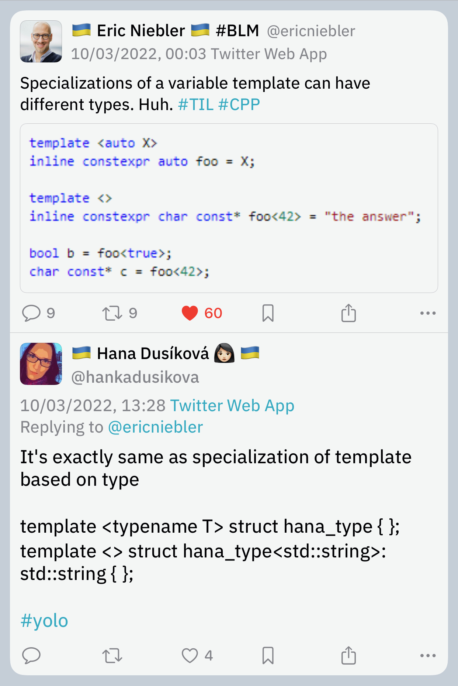
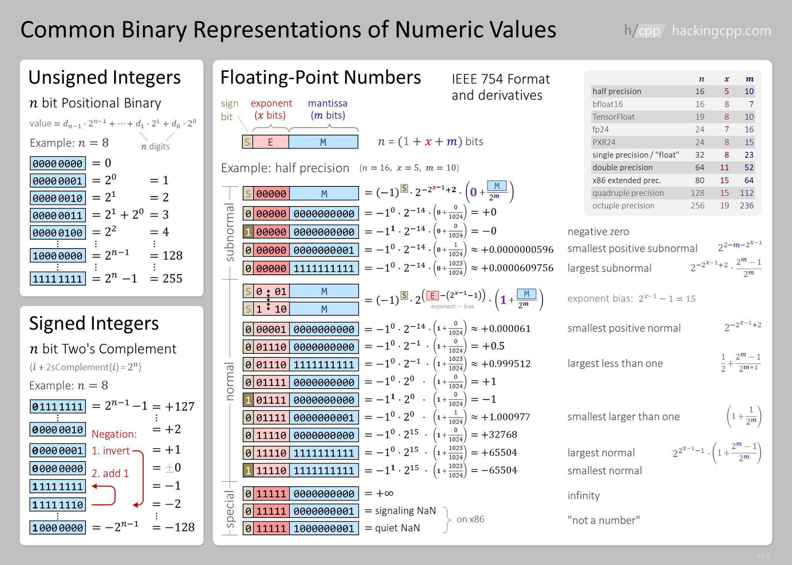

## War

Discussing C++ while a war in Europe is raging feels surreal. I'm with the people of Ukraine who are experiencing this great tragedy, I hope they prevail, and I hope the Russian war criminals will be brought to justice. My parents are in Lithuania, and I'm very worried about the future.

## P2300 is headed to C++26

[P2300](https://wg21.link/P2300) `std::execution` is headed to C++26. The latest poll with the question "Advance P2300R5 to electronic polling to send it to LWG for C++26" resulted in strong consensus with just a single neutral vote and no votes against. You probably remember that on its way to C++23 the paper was met with strong objections from quite a few people. Maybe the latest poll reflects the fact that C++26 is a loo-o-o-ng way away and the paper can be ready in time.

## Modern C++ Course from Bonn U

There is a decent Modern C++ course from Bonn University on YouTube, [check it out](https://youtube.com/playlist?list=PLgnQpQtFTOGR50iIOtO36nK6aNPtVq98C).

## Mold 1.1.1 released

Rui Ueyama [released version 1.1.1](https://www.phoronix.com/scan.php?page=news_item&px=Mold-1.1.1-Released) of his new fast linker mold. This version adds new LTO options for lld compatibility and reduces memory usage by ~6%, consuming less memory than GNU Gold or Clang lld.

## String-like parameter cheatsheet


## Specializations of variable templates can have different type

Eric Niebler [tweets](https://twitter.com/ericniebler/status/1501710180442013697):

> Specializations of a variable template can have different types. Huh. #TIL #CPP

Hana Dusíková replies:

> It's exactly [the] same as specialization of [a] template based on type



Corentin Jabot [follows up](https://twitter.com/Cor3ntin/status/1501856666995806208):

> One of the things that's currently bending my mind is that you can have a template variable which is a generic lambda

```cpp
template <class>
auto x = []<class>{};
```

## Secure coding practices

Amir Kirsh posted an article on the IncrediBuild blog called [_Top 10 secure C++ coding practices_](https://www.incredibuild.com/blog/top-10-secure-c-coding-practices). In it he gives an overview of what security is and how a C++ programmer can make their code more robust to avoid vulnerabilities. He starts with the following:

> Understand that there are no safety nets provided by the compiler or runtime while coding in C++.
C++ compiler generates the code the programmer asked it to generate, without adding any safety checks. While coding in C# or Java, for example, incorrect array access would lead to a runtime exception, whereas in C++ this leads to incorrect memory access or memory corruption in case of writing. Incorrect or sloppy coding can lead to overflows (stack, heap, and buffer overflows) which can easily be used for an attack.

Some of the advice from the author:

- Don’t misuse APIs. Don’t rely on undocumented behavior. Don’t use APIs that are established to be vulnerable.
- Validate input.
- Take advantage of type safety. Don't intentionally bypass type checking.
- Be careful of arithmetic overflows and underflows. (*Ah yes, the infamous `size_t`*)
- Handle exceptions and errors carefully.
    - Don't leak sensitive information including error codes, stack traces, user IDs etc.
- Initialize variables.
- Security by obscurity is no security.
- Don't implement your own cryptography.
- Be careful with random numbers. Use the new C++11 random generators (*but not like that -- see [P0205](https://wg21.link/p0205r0)*).
    - [Don't use uninitialized variables as a random number generator](https://stackoverflow.com/q/31739792) (_What?_)
- Use C++ secure coding standard to complement your C++ coding standard, like [SEI Cert C++](https://resources.sei.cmu.edu/downloads/secure-coding/assets/sei-cert-cpp-coding-standard-2016-v01.pdf).
- Use the right tools to detect security issues: static code analysers, sanitizers.

The related [Reddit thread](https://www.reddit.com/r/cpp/comments/tejt3s/list_of_recommended_secure_c_coding_practices/) has an interesting [discussion](https://www.reddit.com/r/cpp/comments/tejt3s/list_of_recommended_secure_c_coding_practices/i0qcsx2/) on using `at()` vs. `[]`. I didn't know that in some cases the compiler can optimize away bounds checks in `at()`. Of course, a better solution is to use range-`for` loops or even better, ranges and algorithms.

## Comparing Floating-Point Numbers Is Tricky

This is an old [article](https://bitbashing.io/comparing-floats.html) from 2017 but it's still useful and provides a good illustration of the problems with machine representation of floating-point (FP) numbers.

Good things to remember:

- Floats cannot store arbitrary real numbers, or even arbitrary rational numbers.
- Since the equations are exponential, the distance on the number line between adjacent values increases (exponentially!) as you move away from zero.

Over the course of the article the author develops and improves a function to compare two FP numbers. He starts with this code which I've seen many times in our codebases, and explains why it's wrong:

```cpp
bool almostEqual(float a, float b)
{
    return fabs(a - b) <= FLT_EPSILON;
}
```

> We would hope that we’re done here, but we would be wrong. A look at the language standards reveals that `FLT_EPSILON` is equal to the difference between 1.0 and the value that follows it. But as we noted before, float values aren’t equidistant! For values smaller than 1, `FLT_EPSILON` quickly becomes too large to be useful. For values greater than 2, `FLT_EPSILON` is smaller than the distance between adjacent values, so `fabs(a - b) <= FLT_EPSILON` will always be `false`.

Boost has FP comparison API but the author explains how it is also not quite correct. He then arrives at ULPs:

> It would be nice to define comparisons in terms of something more concrete than arbitrary thresholds. Ideally, we would like to know the number of possible floating-point values---sometimes called _units of least precision_, or ULPs---between inputs. If I have some value `a`, and another value `b` is only two or three ULPs away, we can probably consider them equal, assuming some rounding error. Most importantly, this is true regardless of the distance between `a` and `b` on the number line.

The author emphasises the fact that ULPs don't work for comparing values close to zero, but this can be handled as a special case.

The main takeaways from the article are:

When comparing floating-point values, remember:

- `FLT_EPSILON...` isn't float epsilon, except in the ranges `[-2, -1]` and `[1, 2]`. The distance between adjacent values depends on the values in question.
- When comparing to some known value---especially zero or values near it---use a fixed epsilon value that makes sense for your calculations.
- When comparing non-zero values, some ULPs-based comparison is probably the best choice.
- When values could be anywhere on the number line, some hybrid of the two is needed. Choose epsilons carefully based on expected outputs.

This article was adapted from Bruce Davison's article [_Comparing Floating Point Numbers, 2012 Edition_](https://randomascii.wordpress.com/2012/02/25/comparing-floating-point-numbers-2012-edition/).

The GoogleTest macro [`ASSERT_NEAR`](https://developer.ibm.com/articles/au-googletestingframework/#list9) uses a combination of ULPs- and epsilon-based comparisons and is the best way to compare FP values in tests against an epsilon difference.

David Goldberg's article [_What Every Computer Scientist Should Know About Floating-Point Arithmetic_](https://www.itu.dk/~sestoft/bachelor/IEEE754_article.pdf) is a required reading for all programmers. A web-based version is [here](https://docs.oracle.com/cd/E19957-01/806-3568/ncg_goldberg.html).

The corresponding Reddit thread is [here](https://www.reddit.com/r/cpp/comments/tavh14/comparing_floatingpoint_numbers_is_tricky/).

A related article by John D. Cook, [_Floating point numbers are a leaky abstraction_](https://www.johndcook.com/blog/2009/04/06/numbers-are-a-leaky-abstraction/), points out a few cases when FP numbers don't behave as expected:

> Floating point numbers, the computer representations of real numbers,  are leaky abstractions. They work remarkably well: you can usually pretend that a floating point type is a mathematical real number. But sometimes you can’t. The abstraction leaks, though not very often.

### Herbie

[Herbie](https://herbie.uwplse.org) is a mind-blowing tool that simplifies arithmetic expressions to avoid FP issues.

> `sqrt(x+1) - sqrt(x) -> 1/(sqrt(x+1) + sqrt(x))`
>
> Herbie detects inaccurate expressions and finds more accurate replacements. The [left] expression is inaccurate when `x > 1`; Herbie's replacement, [right], is accurate for all `x`.

Herbie can be installed locally or used from the [web demo page](https://herbie.uwplse.org/demo/). It is programmed in [Racket](https://racket-lang.org) which looks like a Lisp-like language.

### Binary number representation cheatsheet

[Source](https://hackingcpp.com/cpp/std/numeric_limits.png)



## Xmake package management

This [article](https://github.com/xmake-io/xmake/wiki/Xmake-and-Cplusplus--Package-Management) describes package management in CMake using Vcpkg and Conan and compares it to what's available in Xmake. It also introduces Xmake's standalone package manager Xrepo. I'm still amazed at the quality and capabilities of Xmake. We lament about how difficult it is to bootstrap a C++ project, we have entire tools that create CMake project templates, but here it is, an easy to use and amazingly capable build system, and nobody seems to know about it. CMake is the standard, but teaching it to students is akin to starting C++ course by explaining pointers. Xmake could be an ideal student-friendly introduction to build systems at least for their toy projects, to avoid scaring them away before they even start learning C++.

## A replacement for `std::vector<bool>`

Martin Hořeňovský [tweeted](https://mobile.twitter.com/horenmar_ctu/status/1484982737106784259):


There is also a [StackOverflow question](https://stackoverflow.com/questions/15273964/work-around-for-vectorbool-use-basic-stringbool) about that. It seems like the idea might work but you shouldn't do it. Some replies:

- "Can somebody get people like this away from the keyboard, before they hurt themselves?" --- [Jan Wilmans](https://mobile.twitter.com/janwilmans/status/1485379774860210183)
- "Somehow I equally love and hate this tweet." -- [Michail Caisse](https://mobile.twitter.com/MichaelCaisse/status/1484985164195241996)

## An interesting clang-tidy bug

Lesley Lai [tweeted](https://twitter.com/lesleylai6/status/1385087735002664961):


If we applied the fix, the second `if` wouldn't compile because `ec` was declared in the first `if` init statement.

## `nft_ptr`

Non-fungible tokens, or NFTs, are a scam built on the blockchain technology. There are many articles explaining this latest high-tech planet-destroying pyramid scheme, so I'm not going to do that here. Instead let me tell you about this excellent project that highlights the craziness from the C++ point of view. Behold `nft_ptr`: "C++ `std::unique_ptr` that represents each object as an NFT on the Ethereum blockchain."

```cpp
auto ptr1 = make_nft<Cow>();
nft_ptr<Animal> ptr2;
ptr2 = std::move(ptr1);
```

> This transfers the Non-Fungible Token `0x7faa4bc09c90`, representing the Cow's memory address, from `ptr1` (OpenSea, Etherscan) to `ptr2` (OpenSea, Etherscan).

It works, and is completely bonkers. I especially like the **Why** section:

- C++ memory management is hard to understand, opaque, and not secure.
- As we all know, adding blockchain to a problem _automatically_ makes it simple, transparent, and cryptographically secure.
- Thus, we extend `std::unique_ptr`, the most popular C++ smart pointer used for memory management, with blockchain support.
- Written in Rust for the hipster cred.
- Made with [love] by a Blockchain Expert who wrote like 100 lines of Solidity in 2017 (which didn't work).

The **Performance** section doesn't disappoint either:

> `nft_ptr` has negligible performance overhead compared to `std::unique_ptr`, as shown by this benchmark on our example program:
>
> - `std::unique_ptr` - 0.005 seconds
> - `nft_ptr` - 3 minutes

The project is very thorough and even has a link to a [whitepaper](https://github.com/zhuowei/nft_ptr/blob/main/white_paper.pdf)! It's indeed a white paper.

## More Twitter, to keep our spirits up

Vicki Boykis (@vboykis) [tweets](https://twitter.com/vboykis/status/1497254926673711107):


Molly Struve (@molly_struve):


TerraTech (@gaya_tech) on embedded programming:


An incorrect, apparently, exam answer to the question about phases of software development:


And finally, from Patricia Aas (@pati_gallardo):


## Quote


