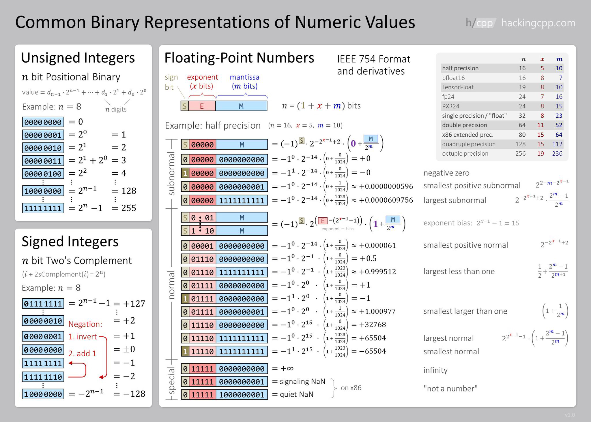
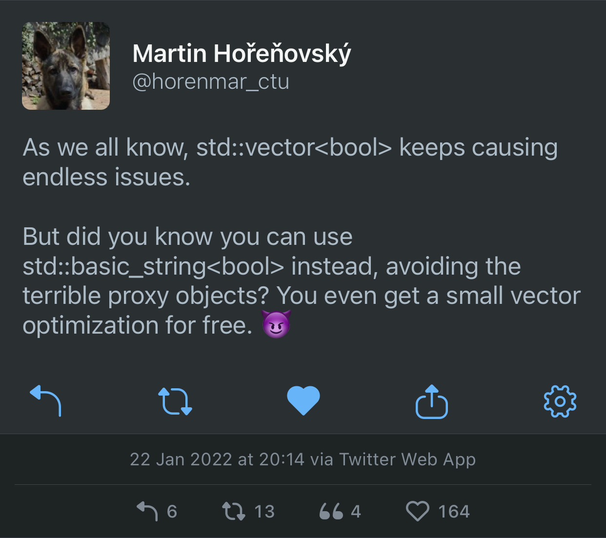
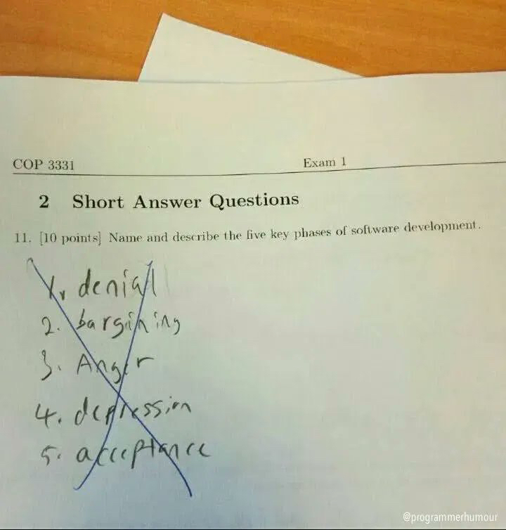

## Qt Creator 7

Qt Creator 7 has been [released](https://www.qt.io/blog/qt-creator-7-released) (see also [Reddit thread](https://www.reddit.com/r/cpp/comments/tkvq13/qt_creator_7_released/)). Even if you don't use Qt, this is a great general-purpose C++ IDE, which is now based on [Clangd](https://clangd.llvm.org), the Clang daemon, using [Language Server Protocol (LSP)](https://microsoft.github.io/language-server-protocol/).

## Debugging with GDB

The Incredibuild Blog has another interesting and useful article, [_A step-by-step crash course in C++ debugging without IDE – empowering the terminal by using GDB!_](https://www.incredibuild.com/blog/a-step-by-step-crash-course-in-c-debugging-without-ide), written by Adam Segoli Schubert. It covers the basics of GDB command-line interface and its Text User Interface (TUI) mode.

[The Reddit thread](https://www.reddit.com/r/programming/comments/tot2mg/a_stepbystep_crash_course_in_c_debugging_without/) participants seem to have trouble understanding why in the era of ubiquitous C++ IDEs would anyone want to use a terminal-based debugger. Lucky people, they must never have had to inspect a crash dump over an SSH connection to a Linux server.

## March committee mailing

The March committee mailing contains some existing papers with new revisions, and some new papers. Let's have a look at some of them.

### [P0009](https://wg21.link/P0009) `std::mdspan`

Revision 16 of the `std::mdspan` paper contains major wording revisions based on LWG feedback.

> This paper proposes adding to the C++ Standard Library a multidimensional array view, `mdspan`, along with classes, class templates, and constants for describing and creating multidimensional array views. It also proposes adding the `submdspan` function that “slices” (returns an `mdspan` that views a subset of) an existing `mdspan`.

At this point why not make a bet on which revision of this paper gets into C++26. I say 21.

### [P1684](https://wg21.link/P1684) `std::mdarray`

A companion to [P0009](https://wg21.link/P0009), this paper proposes an owning equivalent of `mdspan`.

### [P2558](https://wg21.link/P2558) Add @, $, and ` to the basic character set

Steve Downey wrote this paper, in which he says:

> WG14, the C Standardization committee, is adopting [N2701](http://www.open-std.org/jtc1/sc22/wg21/docs/papers/2022/p2558r0.html#ref-CN2701) for C23. This will add U+0024 $ DOLLAR SIGN, U+0040 @ COMMERCIAL AT, and U+0060 ` GRAVE ACCENT to the basic source character set. C++ should adopt the same characters for C++26.

Previously, Corentin Jabot discussed the usage of these characters in other programming languages in [P2342](https://wg21.link/P2342) _For a Few Punctuators More_.

### [P2565](https://wg21.link/P2565) Supporting User-Defined Attributes

Bret Brown of Bloomberg proposes to add support for user-defined attributes. At the moment compilers warn you if they encounter an unknown attribute, and at the same time they are allowed to define compiler-specific attributes, like  `[[clang::no_sanitize("undefined")]]`. Because of this cross-platform libraries often have to resort to dances with macros to support code that depends on a vendor-specific attribute.

The author proposes to keep the 'unknown attribute' warning, but allow a new syntax for user-defined attributes:

```cpp
[[extern gnu::access(...)]];
```

The author chose the `extern` keyword for this because, I guess, this keyword has too few meanings in C++ and could use one more.

Since attributes are built into compilers, it's not clear how one would define a custom attribute.

## Minimum viable declarative GUI in C++

Jean-Michaël Celerier wrote an [article](https://ossia.io/posts/minimum-viable/) that introduces a minimal declarative C++ GUI library. Like, really minimal, where declaring a struct is enough to define a user interface. Later this declaration is included in another 'magical' file which produces the declared UI. The resulting interface can be rendered by Qt via QML or another backend, like [Nuklear](https://github.com/Immediate-Mode-UI/Nuklear) (a C-based immediate mode UI engine).

An example UI declaration is on [GitHub](https://github.com/celtera/avendish/blob/main/examples/Ui.hpp).

In the [Reddit thread](https://www.reddit.com/r/cpp/comments/tkcmze/minimum_viable_declarative_gui_in_c/), people are generally impressed, but not when they discover all the macros the author had to add to improve the syntax.

Also, the code is under GPLv3, so be careful not to remember any of it or you'll have to open-source your brain.

## Comparing Floating-Point Numbers Is Tricky

This is an old [article](https://bitbashing.io/comparing-floats.html) from 2017 but it's still useful and provides a good illustration of the problems with machine representation of floating-point (FP) numbers.

Good things to remember:

- Floats cannot store arbitrary real numbers, or even arbitrary rational numbers.
- Since the equations are exponential, the distance on the number line between adjacent values increases (exponentially!) as you move away from zero.

Over the course of the article the author develops and improves a function to compare two FP numbers. He starts with this code which I've seen many times in our codebases, and explains why it's wrong:

```cpp
bool almostEqual(float a, float b)
{
    return fabs(a - b) <= FLT_EPSILON;
}
```

> We would hope that we’re done here, but we would be wrong. A look at the language standards reveals that `FLT_EPSILON` is equal to the difference between 1.0 and the value that follows it. But as we noted before, float values aren’t equidistant! For values smaller than 1, `FLT_EPSILON` quickly becomes too large to be useful. For values greater than 2, `FLT_EPSILON` is smaller than the distance between adjacent values, so `fabs(a - b) <= FLT_EPSILON` will always be `false`.

Boost has FP comparison API but the author explains how it is also not quite correct. He then arrives at ULPs:

> It would be nice to define comparisons in terms of something more concrete than arbitrary thresholds. Ideally, we would like to know the number of possible floating-point values---sometimes called _units of least precision_, or ULPs---between inputs. If I have some value `a`, and another value `b` is only two or three ULPs away, we can probably consider them equal, assuming some rounding error. Most importantly, this is true regardless of the distance between `a` and `b` on the number line.

The author emphasises the fact that ULPs don't work for comparing values close to zero, but this can be handled as a special case.

The main takeaways from the article are:

When comparing floating-point values, remember:

- `FLT_EPSILON...` isn't float epsilon, except in the ranges `[-2, -1]` and `[1, 2]`. The distance between adjacent values depends on the values in question.
- When comparing to some known value---especially zero or values near it---use a fixed epsilon value that makes sense for your calculations.
- When comparing non-zero values, some ULPs-based comparison is probably the best choice.
- When values could be anywhere on the number line, some hybrid of the two is needed. Choose epsilons carefully based on expected outputs.

This article was adapted from Bruce Davison's article [_Comparing Floating Point Numbers, 2012 Edition_](https://randomascii.wordpress.com/2012/02/25/comparing-floating-point-numbers-2012-edition/).

The GoogleTest macro [`ASSERT_NEAR`](https://developer.ibm.com/articles/au-googletestingframework/#list9) uses a combination of ULPs- and epsilon-based comparisons and is the best way to compare FP values in tests against an epsilon difference.

David Goldberg's article [_What Every Computer Scientist Should Know About Floating-Point Arithmetic_](https://www.itu.dk/~sestoft/bachelor/IEEE754_article.pdf) is a required reading for all programmers. A web-based version is [here](https://docs.oracle.com/cd/E19957-01/806-3568/ncg_goldberg.html).

The corresponding Reddit thread is [here](https://www.reddit.com/r/cpp/comments/tavh14/comparing_floatingpoint_numbers_is_tricky/).

A related article by John D. Cook, [_Floating point numbers are a leaky abstraction_](https://www.johndcook.com/blog/2009/04/06/numbers-are-a-leaky-abstraction/), points out a few cases when FP numbers don't behave as expected:

> Floating point numbers, the computer representations of real numbers, are leaky abstractions. They work remarkably well: you can usually pretend that a floating point type is a mathematical real number. But sometimes you can’t. The abstraction leaks, though not very often.

### Herbie

[Herbie](https://herbie.uwplse.org) is a neat tool that simplifies arithmetic expressions to avoid FP issues.

> `sqrt(x+1)-sqrt(x)` -> `1/(sqrt(x+1)+sqrt(x))`
>
> Herbie detects inaccurate expressions and finds more accurate replacements. The [left] expression is inaccurate when `x > 1`; Herbie's replacement, [right], is accurate for all `x`.

Herbie can be installed locally or used from the [web demo page](https://herbie.uwplse.org/demo/). It is programmed in [Racket](https://racket-lang.org) which looks like a Lisp-like language.

### Binary number representation cheatsheet

[Source](https://hackingcpp.com/cpp/std/numeric_limits.png)



## Xmake package management

This [article](https://github.com/xmake-io/xmake/wiki/Xmake-and-Cplusplus--Package-Management) describes package management in CMake using Vcpkg and Conan and compares it to what's available in [Xmake](https://xmake.io). It also introduces Xmake's standalone package manager Xrepo. I'm still amazed at the quality and capabilities of Xmake. We lament about how difficult it is to bootstrap a C++ project, we have entire tools that boostrap CMake projects, but here it is, an easy to use and amazingly capable build system, and nobody seems to know about it. CMake is the de-facto standard, but teaching it to students is akin to starting a modern C++ course by explaining pointers. Xmake could be an ideal student-friendly introduction to build systems at least for their toy projects, to avoid scaring them away before they even start learning C++.

## Unlib: a lightweight, header-only, dependency-free C++14 library for ISO units

The author **sbi** from Berlin wrote [yet another physical units library](https://github.com/gitsbi/unlib) that supports SI (ISO) units and requires C++14. It's header-only and comes under Boost Licence.

> A minimal, header-only, C++14-compatible SI unit library, providing quantities that behave like arithmetic types and feature physical dimensions (e.g. power), scaling (e.g. kilo), and tagging of units. If your code has to deal with physical units, you can use this library so that the compiler checks your usage of dimensions and your formulas at compile-time.

The library features user-defined literals:

```cpp
using namespace unlib::literals;

unlib::newton<double> force = 1._kg * 9.81_m_per_s2;

unlib::second<int> s = 1_h;
std::cout << s; // prints 3600
```

It allows deriving units from the basic set:

```cpp
using electrical_charge = unlib::mul_dimension_t<unlib::current, unlib::time>;
```

There is also support for ratios and creation of scaled quantities from basic ones:

```cpp
using milligram = unlib::milli<unlib::gram>;
using  kilogram = unlib::kilo<unlib::gram>;
using       ton = unlib::kilo<kilogram>;
```

The library supports tags for when different quantities which must not be confused are represented by the same physical unit.

Unit conversions are supported by various casts.

> There are four different kind of casts available:
>
> * `value_cast` allows casting between units with different value types, e.g., seconds in `int` vs. seconds in `long long`.
> * `scale_cast` allows casting between units with different scales, e.g., seconds and minutes.
> * `tag_cast` allows casting between units with different tags, e.g., active and reactive power.
> * `quantity_cast` allows casting between units where value types, scales, and tags might be different.

### Similar work

* [units](https://github.com/mpusz/units) by Mateusz Pusz, which is a subject of standardization effort (see [P1935](https://wg21.link/P1935)) --- requires C++20, uses Concepts, comes under MIT Licence. This library uses literals but also allows you to specify units as multipliers: `static_assert(1 * h == 3600 * s);`
* [Boost.Units](https://www.boost.org/doc/libs/1_78_0/doc/html/boost_units.html) by Matthias C. Schabel and Steven Watanabe, implements dimensional analysis in a general and extensible manner, treating it as a generic compile-time metaprogramming problem. It uses [Boost.MPL](https://www.boost.org/doc/libs/1_78_0/libs/mpl/doc/index.html) and is slow to compile, but allows you to define your own unit systems.
* [units](https://github.com/nholthaus/units) by Nic Holthaus is a compile-time, header-only, dimensional analysis and unit conversion library built on C++14 with no dependencies. It comes under MIT Licence. Each unit has its own type, literals are supported, and unit conversions and manipulations are very fast and efficient.

## A replacement for `std::vector<bool>`

Martin Hořeňovský [tweeted](https://mobile.twitter.com/horenmar_ctu/status/1484982737106784259):



There is also a [StackOverflow question](https://stackoverflow.com/questions/15273964/work-around-for-vectorbool-use-basic-stringbool) about that. It seems like the idea might work but you shouldn't do it. Some replies:

- _Can somebody get people like this away from the keyboard, before they hurt themselves?_ --- [Jan Wilmans](https://mobile.twitter.com/janwilmans/status/1485379774860210183)
- _Somehow I equally love and hate this tweet._ --- [Michail Caisse](https://mobile.twitter.com/MichaelCaisse/status/1484985164195241996)

## `nft_ptr`

Non-fungible tokens, or NFTs, are a scam built on the blockchain technology. There are many articles explaining this latest high-tech planet-destroying pyramid scheme, so I'm not going to do that here. Instead let me tell you about this excellent project that highlights the craziness from the C++ point of view. Behold `nft_ptr`: "C++ `std::unique_ptr` that represents each object as an NFT on the Ethereum blockchain."

```cpp
auto ptr1 = make_nft<Cow>();
nft_ptr<Animal> ptr2;
ptr2 = std::move(ptr1);
```

> This transfers the Non-Fungible Token `0x7faa4bc09c90`, representing the Cow's memory address, from `ptr1` (OpenSea, Etherscan) to `ptr2` (OpenSea, Etherscan).

It works, and is completely bonkers. I especially like the **Why** section:

- C++ memory management is hard to understand, opaque, and not secure.
- As we all know, adding blockchain to a problem _automatically_ makes it simple, transparent, and cryptographically secure.
- Thus, we extend `std::unique_ptr`, the most popular C++ smart pointer used for memory management, with blockchain support.
- Written in Rust for the hipster cred.
- Made with _love_ by a Blockchain Expert who wrote like 100 lines of Solidity in 2017 (which didn't work).

The **Performance** section doesn't disappoint either:

> `nft_ptr` has negligible performance overhead compared to `std::unique_ptr`, as shown by this benchmark on our example program:
>
> - `std::unique_ptr` - 0.005 seconds
> - `nft_ptr` - 3 minutes

The project is very thorough and even has a link to a [whitepaper](https://github.com/zhuowei/nft_ptr/blob/main/white_paper.pdf)! It's indeed a white paper.

## C++ and Rust interoperability

An article was published on the [Tetrane blog](https://blog.tetrane.com/2022/Rust-Cxx-interop.html) describing the current state of Rust and C++ interoperability. The article explains all the available options in detail, including code snippets, but for a short summary let's read a [comment](https://www.reddit.com/r/cpp/comments/tka2an/a_tour_of_rust_c_interoperability/i1pmxow/) on the Reddit [thread](https://www.reddit.com/r/cpp/comments/tka2an/a_tour_of_rust_c_interoperability/) by the original poster:

> The post proposes 3 approaches based on 3 available libraries in the Rust ecosystem:
>
> - **bindgen**: Start from the C or C++ headers of a C/C++ library and generate Rust code that exposes functions able to call the C/C++ library. Then you can just link with this library (statically or dynamically) and call its functions! It is automatic, but it doesn't attempt to reconcile the differences of concepts between C++ and Rust, and more importantly, it doesn't attempt to translate what C++ and Rust have in common (iterators, vectors, `string`, `unique_ptr`, `shared_ptr`, ...), so it is best suited for very "C-like" libraries.
>
> - **cpp** uses Rust's macro system to let you write C++ inline inside of your Rust. The C++ snippets are then compiled by a C++ compiler, and the Rust code to call them using the C ABI is generated. Since the C++ snippets are C++, you can directly call other C++ libs from the C++ snippets. However the boundary between C++ and Rust remains somewhat low-level with this solution (it has native understanding of `unique_ptr`s but that's pretty much it).
>
> - **cxx**: uses Rust's macro system to let you declare a special Rust module containing items (types, functions) to be either shared (understood by both C++ and Rust, and passed by value between the languages) or opaquely exposed from one language to the other (you'll need to manipulate the type behind a pointer when on the other language). This approach is nice because it pre-binds for you some C++/Rust standard types (vectors, strings) and concept (exceptions and Rust's `Result` type).
>
> At the basic levels, all three libraries are built upon the C ABI/API, since it is the common language that both Rust and C++ understand. In cxx however you don't really see the use of the basic C API since some higher-level concepts are translated between C++ and Rust.

I read that Microsoft is exploring Rust for some of their code bases, wonder what they'll use if they need C++ interop.

## Twitter

Molly Struve (@molly_struve):


## Exam

An incorrect, apparently, exam answer to the question about phases of software development:


