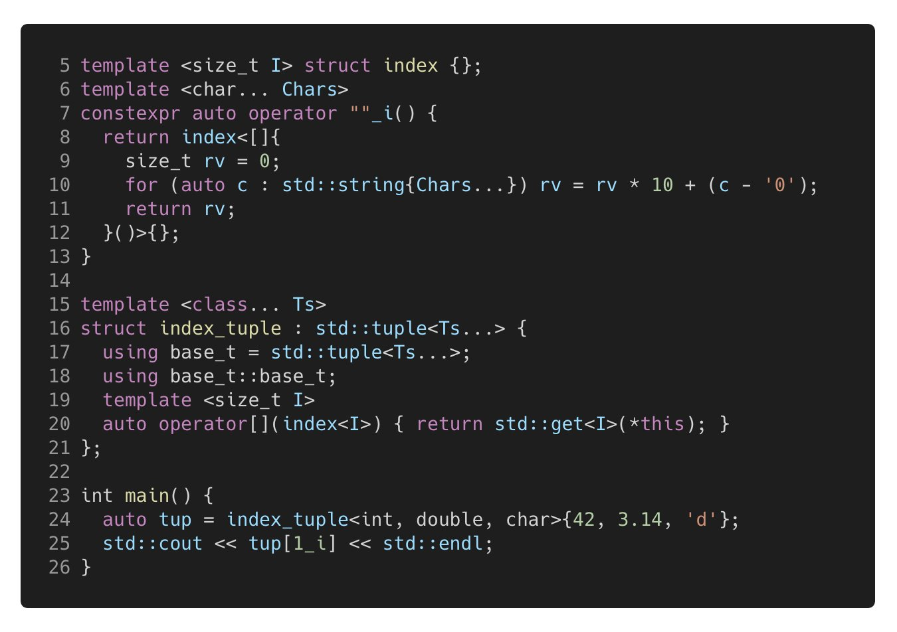
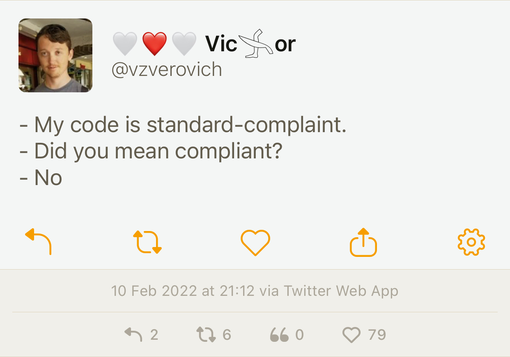
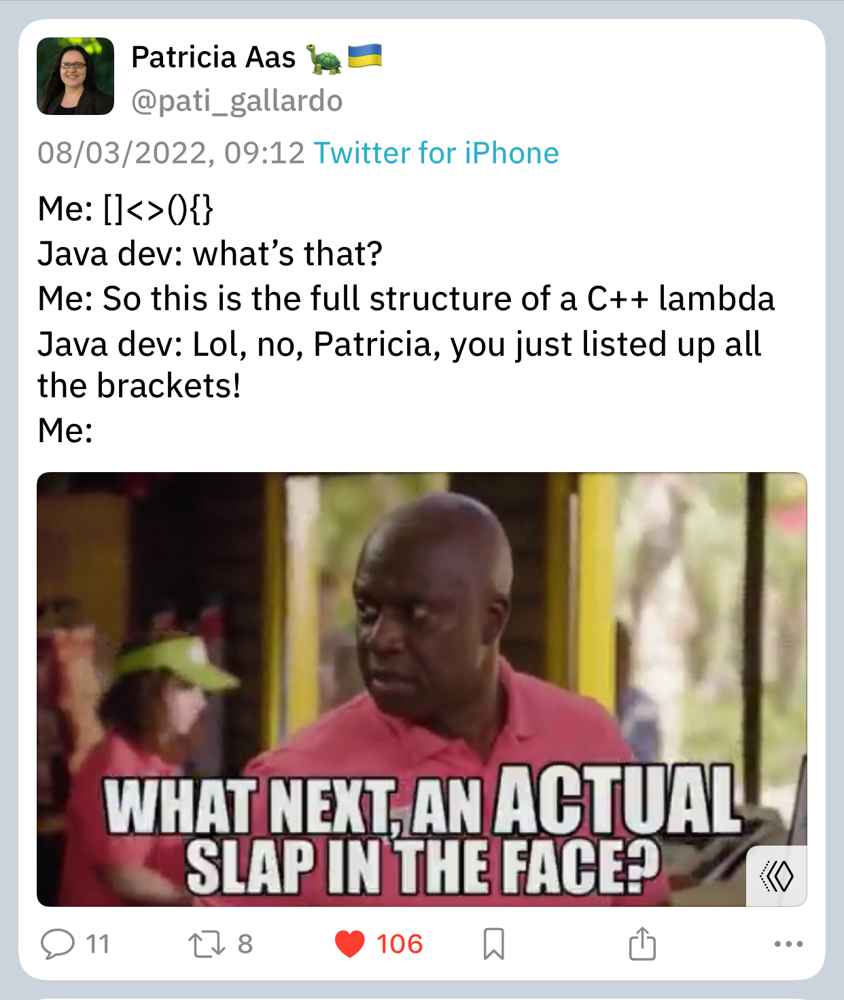
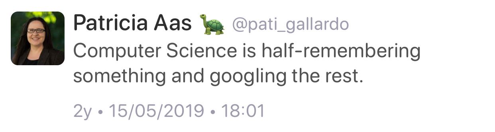

## Follow-up: Float Toy

[[Ivor Hewitt]{.smallcaps}](https://twitter.com/ivor_hewitt) pointed me to a cool website called [Float Toy](https://evanw.github.io/float-toy/). It allows you to visualise the binary representation of floating-point numbers of various sizes. You can toggle individual bits in sign, exponent and mantissa parts and see how it affects the represented value.

## C++ and Rust interoperability

An article was published on the [Tetrane blog](https://blog.tetrane.com/2022/Rust-Cxx-interop.html) describing the current state of Rust and C++ interoperability. The article explains all the available options in detail, including code snippets, but for a short summary let's read a [comment](https://www.reddit.com/r/cpp/comments/tka2an/a_tour_of_rust_c_interoperability/i1pmxow/) on the Reddit [thread](https://www.reddit.com/r/cpp/comments/tka2an/a_tour_of_rust_c_interoperability/) by the original poster:

> The post proposes 3 approaches based on 3 available libraries in the Rust ecosystem:
>
> **bindgen**
> : Start from the C or C++ headers of a C/C++ library and generate Rust code that exposes functions able to call the C/C++ library. Then you can just link with this library (statically or dynamically) and call its functions! It is automatic, but it doesn't attempt to reconcile the differences of concepts between C++ and Rust, and more importantly, it doesn't attempt to translate what C++ and Rust have in common (iterators, vectors, `string`, `unique_ptr`, `shared_ptr`, ...), so it is best suited for very "C-like" libraries.
>
> **cpp**
> : Uses Rust's macro system to let you write C++ inline inside of your Rust. The C++ snippets are then compiled by a C++ compiler, and the Rust code to call them using the C ABI is generated. Since the C++ snippets are C++, you can directly call other C++ libs from the C++ snippets. However the boundary between C++ and Rust remains somewhat low-level with this solution (it has native understanding of `unique_ptr`s but that's pretty much it).
>
> **cxx**
> : Uses Rust's macro system to let you declare a special Rust module containing items (types, functions) to be either shared (understood by both C++ and Rust, and passed by value between the languages) or opaquely exposed from one language to the other (you'll need to manipulate the type behind a pointer when on the other language). This approach is nice because it pre-binds for you some C++/Rust standard types (vectors, strings) and concept (exceptions and Rust's `Result` type).
>
> At the basic levels, all three libraries are built upon the C ABI/API, since it is the common language that both Rust and C++ understand. In cxx however you don't really see the use of the basic C API since some higher-level concepts are translated between C++ and Rust.

I read that Microsoft is [exploring](https://cloudblogs.microsoft.com/opensource/2021/02/08/microsoft-joins-rust-foundation/) Rust for some of their code bases, wonder what they'll use if they need C++ interop.

## Minimum viable declarative GUI in C++

[Jean-Michaël Celerier]{.smallcaps} wrote an [article](https://ossia.io/posts/minimum-viable/) that introduces a minimal declarative C++ GUI library. Like, really minimal, where declaring a struct is enough to define a user interface. Later this declaration is included in another 'magical' file which produces the declared UI. The resulting interface can be rendered by Qt via QML or another backend, like [Nuklear](https://github.com/Immediate-Mode-UI/Nuklear) (a C-based immediate mode UI engine).

An example UI declaration is on [GitHub](https://github.com/celtera/avendish/blob/main/examples/Ui.hpp).

In the [Reddit thread](https://www.reddit.com/r/cpp/comments/tkcmze/minimum_viable_declarative_gui_in_c/), people are generally impressed, but not when they discover all the macros the author had to add to improve the syntax.

Also, the code is under GPLv3, so be careful not to remember any of it or you'll have to open-source your brain.

## ULID: Universally Unique Lexicographically Sortable Identifier

[ULID](https://github.com/ulid/spec) is a replacement for [UUID](https://en.wikipedia.org/wiki/Universally_unique_identifier) that is human-readable and lexicographically sortable. It is encoded in 26-character string (as opposed to 36-character UUID), uses base32 encoding for readability (no ambiguous characters), and doesn't use special characters, which makes it URL-safe.

Implementations exist in many languages, including an [MIT-licensed C++ version](https://github.com/suyash/ulid).

Next time you need a UUID in your software, see if ULID is a better fit for your needs.

## C++ for mathematicians

A redditor [asks](https://www.reddit.com/r/cpp/comments/tuk9lp/c_for_mathematicians/) what are good books about mathematical programming in C++. Some suggestions from the thread:

* [Numerical Recipes](http://numerical.recipes) -- you can read the [ebook](http://numerical.recipes/book) for free online, including source code.
* [What Every Computer Scientist Should Know About Floating-Point Arithmetic](https://pages.cs.wisc.edu/%7Edavid/courses/cs552/S12/handouts/goldberg-floating-point.pdf) by David Goldberg is a classic article I mentioned many times.
* [Object-Oriented Programming for Scientific Computing (University of Heidelberg)](https://conan.iwr.uni-heidelberg.de/teaching/oopfsc_ws2021/) with [lecture notes](https://conan.iwr.uni-heidelberg.de/data/people/oklein/pdf/klein_modern_cpp.pdf) and [slides](https://conan.iwr.uni-heidelberg.de/data/teaching/oopfsc_ws2020/slides.pdf).

## Crow web framework

A redditor [writes](https://www.reddit.com/r/cpp/comments/tqzghc/a_year_and_a_half_ago_i_picked_up_an_abandoned_c/):

> A year and a half ago I picked up an abandoned C++ web Framework, Today we released v1.0.
>
> [Crow](https://crowcpp.org/) is a simple and easy to use C++ web application framework. We picked it up as an abandoned project about a year and a half ago and have been fixing, optimizing, and adding many features.

Crow is header-only, comes under BSD 3-Clause licence, uses C++11/C++14 and is pretty fast (see [benchmarks](https://github.com/ipkn/crow-benchmark)) and easy to use (it is similar to Python's Flask).

Several redditors in the thread used Crow before and were very glad to see it revived.

## Injected class names

[Raymond Chen]{.smallcaps} [writes](https://devblogs.microsoft.com/oldnewthing/20220321-00/?p=106367):

> C++ has a feature called [injected class names](https://en.cppreference.com/w/cpp/language/injected-class-name), which lets you refer to the class being defined by its plain name without needing to fully qualify it with namespaces and template parameters. You have probably been taking advantage of this feature without even realizing it.

```cpp
template<typename T>
struct Wrapper
{
    // using Wrapper = Wrapper<T>; <-- compiler-injected class name
    Wrapper() { /* constructor */ }
};
```

Base class names are also injected, unless they are inherited privately.

From [cppreference](https://en.cppreference.com/w/cpp/language/injected-class-name):

> Constructors do not have names, but the injected-class-name of the enclosing class is considered to name a constructor in constructor declarations and definitions.

In the Reddit [thread](https://www.reddit.com/r/cpp/comments/tjg7qm/injected_class_names_the_c_feature_you_didnt_even/), STL [https://www.reddit.com/r/cpp/comments/tjg7qm/injected_class_names_the_c_feature_you_didnt_even/i1k5tr9/] that:

> The injected-class-name can be used as a template-name or a type-name.

So both `Wrapper<T>` and `Wrapper` are valid in the code snippet above.

## Nvidia is building a quantum computing C++ compiler

[Bryce Lelbach]{.smallcaps} [tweets](https://twitter.com/blelbach/status/1506663964717027328):

> We're building a new C++ compiler for quantum computing.

He links to the article [_Nvidia: ‘We Are A Quantum Computing Company’_](https://www.insidequantumtechnology.com/news-archive/nvidia-we-are-a-quantum-computing-company/). From the article:

> At Nvidia’s GTC Spring event this week, the company announced that it is developing a new quantum compiler called nvq++ that targets the Quantum Intermediate Representation (QIR) specification for a low-level machine language that quantum and classical computers can use to talk to each other.

The Reddit [thread](https://www.reddit.com/r/cpp/comments/tm9qk2/nvidia_is_building_a_new_c_compiler_for_quantum/) is [brutal](https://www.reddit.com/r/cpp/comments/tm9qk2/nvidia_is_building_a_new_c_compiler_for_quantum/i1xua6r/):

> Nvidia can't even build a C++ compiler for normal computing, so I'm sure this'll go just perfect

Someone [replies](https://www.reddit.com/r/cpp/comments/tm9qk2/nvidia_is_building_a_new_c_compiler_for_quantum/i1y6m7z/):

> I have similar experience working with Nvidia - their software is known as "something to avoid at all cost" at our workplace.

The thread has many other hilarious comments, like [this one](https://www.reddit.com/r/cpp/comments/tm9qk2/nvidia_is_building_a_new_c_compiler_for_quantum/i201ied/):

> Oh man I can't wait for Josuttis' book on move semantics in a quantum C++ compiler....

And [_of course_](https://www.reddit.com/r/cpp/comments/tm9qk2/nvidia_is_building_a_new_c_compiler_for_quantum/i209e5k/):

> Genuine question, why C++ over Rust? I don't know much about QC, or really Rust or C++ that well tbf.

## C++ Show and Tell - April 2022

The C++ Show and Tell on Reddit is becoming a regular thing. Here is the [April](https://www.reddit.com/r/cpp/comments/tv4l67/c_show_and_tell_april_2022/) edition. These are my highlights of the thread:

* [Binary black hole collisions](https://www.reddit.com/r/cpp/comments/tv4l67/c_show_and_tell_april_2022/i38ql8r/) - [screenshot](https://imgur.com/a/1pGfbPZ)
* [RISC-V userspace emulator library](https://github.com/fwsGonzo/libriscv)
* [Seer - a new GUI GDB front-end](https://github.com/epasveer/seer) - [screenshot](https://raw.githubusercontent.com/epasveer/seer/main/images/mainview.png)
* [Interactive GPU CUDA raytracer](https://github.com/jan-van-bergen/GPU-Raytracer)
* [Monocle Security video surveillance system](https://www.monoclesecurity.com)
* [Black Sun - a space exploration game with an AI text chat sidekick](https://linktr.ee/blacksungame)
* [Nomenus Rex - a CLI bulk file rename utility](https://github.com/ANGulchenko/nomenus-rex)

## Library: spdlog 1.10.0

The logging library [spdlog 1.10.0](https://github.com/gabime/spdlog/releases/tag/v1.10.0) is out. Major changes are:

* `{fmt}` version bumped to 8.1.1
* Added file event handler hooks to handle after-start and before-end logging events, which allow to have 'prologue' and 'epilogue' sections in the log file.
* Added UDP logging sink.

Spdlog comes under MIT licence and can be used as a header-only or a compiled library. It is available in all major package managers, works on Linux, Windows, macOS and Android, and requires C++11.

Positive vibes in the [Reddit thread](https://www.reddit.com/r/cpp/comments/tw7sno/spdlog_version_1100/).

## Library: WxWidgets 3.1.6

One of the best cross-platform GUI libraries for C++, [WxWidgets](https://www.wxwidgets.org), has been updated to [version 3.1.6](https://github.com/wxWidgets/wxWidgets/releases/tag/v3.1.6). When asked about C++ GUI libraries most developers think of Qt. But if you want native controls and look on all supported platforms, WxWidgets is the best option. (Qt draws custom controls and therefore looks the same but also alien on all platforms).

The [code](https://github.com/wxWidgets/wxWidgets) does have a bit of MFC vibe, but the UI definitions are XML-based and can be reloaded without recompiling the program, which can be convenient. The [Hello World example](https://docs.wxwidgets.org/trunk/overview_helloworld.html) is not exactly short or simple, but it is probably an acceptable compromise for what you are getting.

The OS support range is impressive, from Windows XP to 10 (32- and 64-bit), most Linux variants using GTK+, macOS 10.10+ using Cocoa.

The [licence](https://github.com/wxWidgets/wxWidgets/blob/master/docs/licence.txt) is a modified LGPL explicitly allowing not distributing the sources of an application using the library even in the case of static linking, which is really nice.

The popular free audio editor [Audacity](https://www.audacityteam.org) uses WxWidgets.

## Using subscript operator with tuples

[Daisy Hollman]{.smallcaps} [tweets](https://twitter.com/The_Whole_Daisy/status/1508436242555301897):

> Cute C++ trick of the day: ever wished you could index into a tuple using `operator[]`? You can do that with numeric literal operator templates!

See it on [Godbolt](https://cute.godbolt.org/z/xcsP394vj) but maybe don't use it in production...



So what's going on here?

* Line 5 declares `template index` that has a `size_t` template parameter determining the index value.
* Lines 6--13 declare a user-defined literal operator `_i` which has template parameter of type `char...` that gets the actual characters in the literal. I haven't seen this before, it's different from how you normally define a user literal that takes a string. Both styles are described on [cppreference](https://en.cppreference.com/w/cpp/language/user_literal).
* Lines 8--12 produce a return value from the user literal operator, which has the type `index` and the template parameter value determined by a lambda which is immediately invoked on line 12.
* Lines 9--11 iterate through the characters in the literal and convert them to an integer using ASCII table arithmetic.
* Lines 15--21 define a custom class `index_tuple` privately derived from `std::tuple` which adds a subscript operator template on line 20 that takes a value of type `index` and deduces its size. It then uses the deduced size value to call `std::get<I>` to index into the tuple.
* Lines 24--25 demonstrate the usage of class `index_tuple` by indexing into it using its subscript operator, passing `1_i` as the index parameter.

Some interesting responses on Twitter:

* [Barry Revzin]{.smallcaps} [says](https://twitter.com/BarryRevzin/status/1508499060369637376):

> Don't need the `std::string`, can just iterate over `{Chars...}` by itself (gets deduced as an `initializer_list<char>`)

* [Philippe Payan]{.smallcaps} [says](https://twitter.com/philtherobot/status/1508793710946959361):

> The real magic to me is how "10_i" <...> turns into the `operator ""_i` with two char template values (?), namely "1" and "0", each of type char obviously. How does that happen? How is "10" broken down into "1" and "0"?

[Daisy Hollman]{.smallcaps} [replies](https://twitter.com/The_Whole_Daisy/status/1508807544713760777):

> Compilers are magic! But also, the easier answer is "because the standard says it has to."

[Philippe Payan]{.smallcaps} [follows up](https://twitter.com/philtherobot/status/1508896075612143617):

> I got it. I found it in the Standard, section 12.8 "User-defined literals", point 5. I understand this as basically: your operator is getting bytes from the source code through the non-type template list of chars. Damn!

Cool technique, I hate it.

## List of C++ videos

Hacking C++ [tweets](https://twitter.com/hackingcpp/status/1507462329776152577):

> I've started a new list of talks, tutorials, and other educational videos related to C++. It's organized by topic (e.g., generic programming, C++20, best practices, modules, CMake, ...)

The [list](https://hackingcpp.com/cpp/educational_videos.html) indexes over 700 videos and is a great educational resource.

## Twitter

[Viktor Zverovich]{.smallcaps} (@vzverovich):



[Patricia Aas]{.smallcaps} (@pati_gallardo):



[Patricia Aas]{.smallcaps} (@pati_gallardo):


