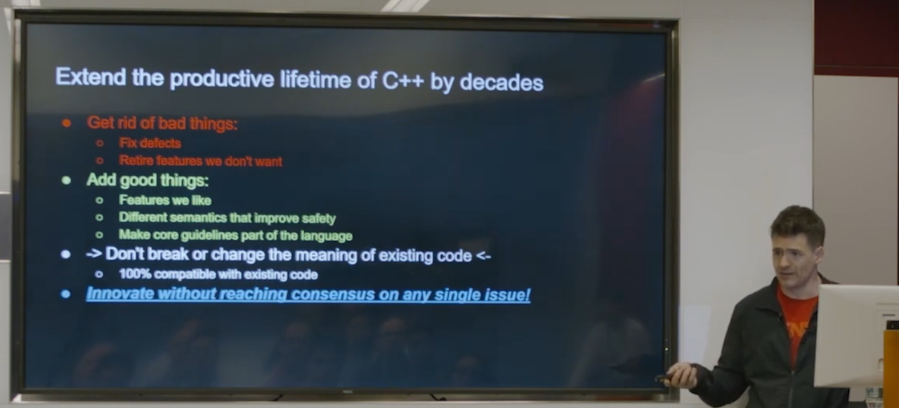
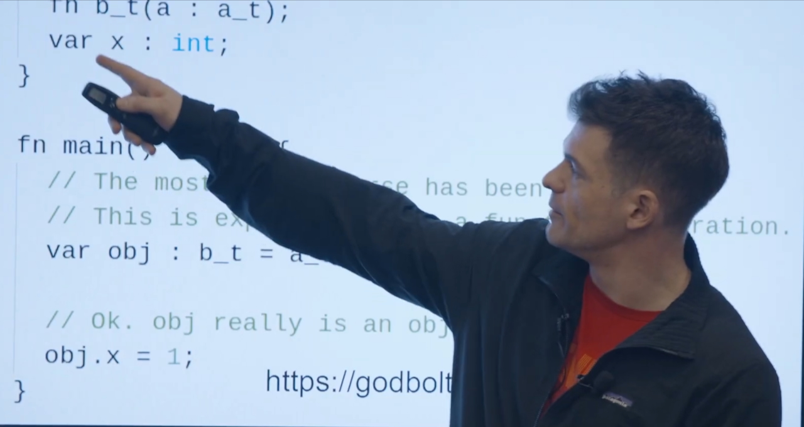
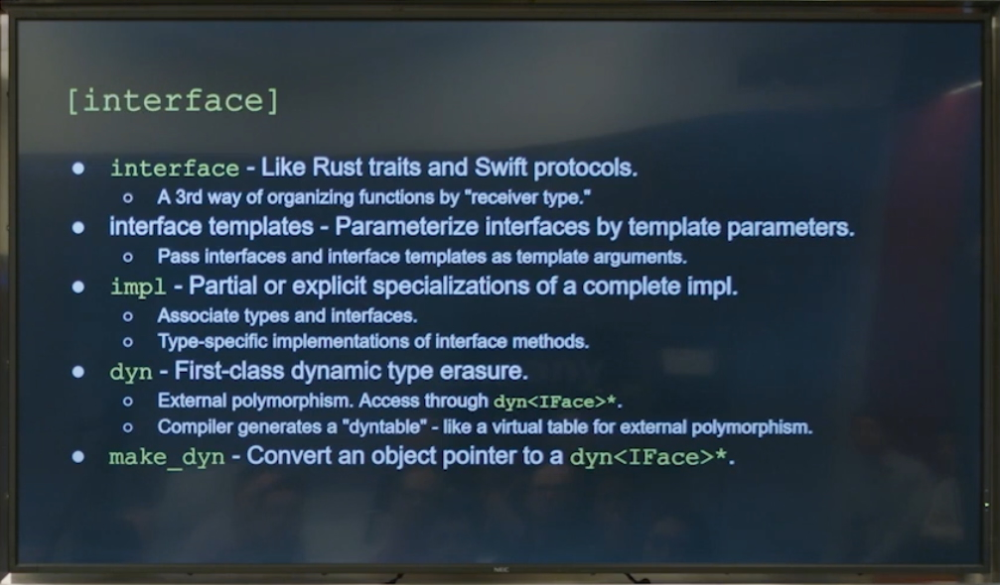
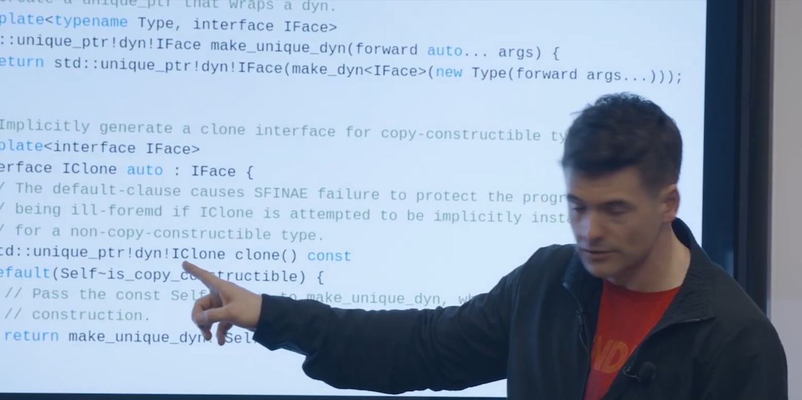
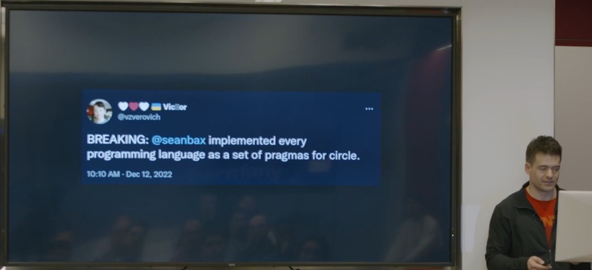
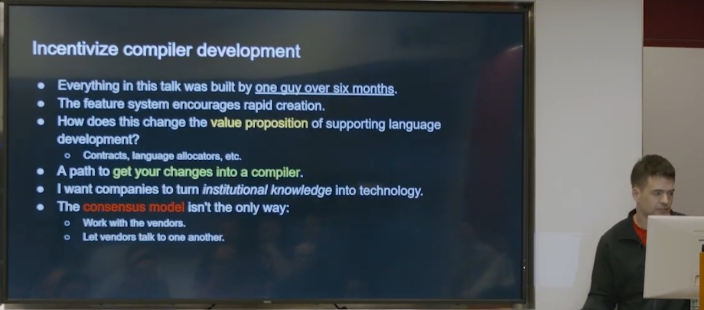
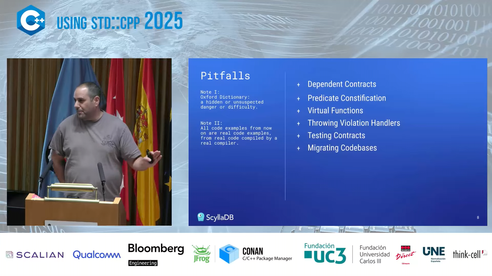
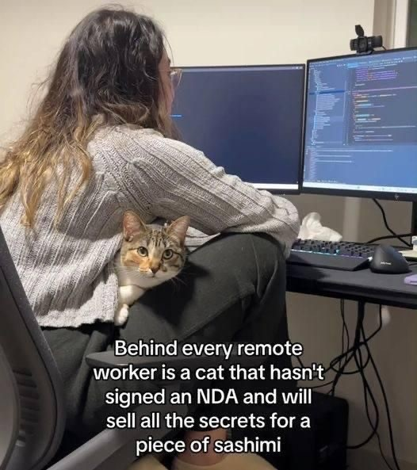

:showtitle:
:toc:
:doctype: book

= 174

== Media

=== Video

Coming soon.

=== Podcast

Coming soon.

== Why CMake sucks

* https://twdev.blog/2021/08/cmake/[Tomasz Wisniewski]
* https://lobste.rs/s/i2qnqj[Lobsters]

> The explicit configure + generate step, touched on in the article, precludes most forms of dynamic dependency generation. Making this work with C++ modules has been very painful. https://lobste.rs/c/na4lmx[↑]

Follow-ups by Tomasz Wisniewski:

* https://twdev.blog/2022/09/meson/[Intro to Meson]
* https://twdev.blog/2023/05/cppsetup/[My setup for personal C++ projects]

See also:

* https://www.reddit.com/r/cpp/comments/1avpnen/cmake_is_the_perfect_build_tool_for_c/[CMake is the perfect build tool for C++ (Reddit)]
* https://cliutils.gitlab.io/modern-cmake/[Intro to Modern CMake]
** https://news.ycombinator.com/item?id=39784784[HackerNews]
* https://www.reddit.com/r/cpp/comments/1b53rks/is_cmake_the_de_facto_standard_mandatory_to_use/[Is CMake the de facto standard mandatory to use? (Reddit)]

== Safe C++

* https://safecpp.org/draft.html[Sean Baxter's draft proposal]

> Safe C\++ is an extension of C++. It adds a robust safety model, but it's not a new language.

OH: _"Sean Baxter thinks he can add arbitrary stuff to C\++ and still call it C++"_.

https://www.reddit.com/r/cpp/comments/1lhbqua/any_news_on_safe_c/[Reddit]

=== Sean Baxter's Circle talk at Bloomberg (2023)

https://www.youtube.com/watch?v=x7fxeNqSK2k



Quotes from the talk:

> It's _easy_ to fix C++

The fix is Circle, of course.

> Each textual file has an active mask of features. Per-file, not per translation unit. Files don't inherit features. Library files (.h files): Feature mask _has no effect_ on files that include it.

https://godbolt.org/z/Kqf4xeWMn[Example (Godbolt)]

> Make a `pragma.feature` file in your source folder. List feature names/editions in the file. These features get _picked up by every file in the folder_.

This sounds like a _terrible_ idea to me. Not only the compiler has to be aware of a file system entity (and file system, for that matter), but the language used in source files may change if files get moved.

Who needs standards anyway, right?

https://godbolt.org/z/Yd3efGhGo[Example of `interface` (Godbolt)]

This looks cool, but it' not C++.

There is a Circle feature for those who _really_ dislike angle brackets, apparently.

Viktor Zverovich enters the chat:

This provides a glimpse into Sean's plan:

I'm not convinced, but I'm a nobody -- big firms like Bloomberg will surely be interested?

Sigh. If only Circle were open-sourced. Without that, betting on it is just too much risk, IMHO.

== CppCast 383: Safe, Borrow-Checked, C++

https://cppcast.com/safe-borrow-checked-cpp/

=== Any news on Safe C++?

https://www.reddit.com/r/cpp/comments/1lhbqua/any_news_on_safe_c/[Reddit]

== CrowdStrike and C++

https://www.efinancialcareers.com/news/crowdstrike-c-plus-plus-pointer[Sean Baxter enters the chat]

== Three Cool Things in C+\+26: Safety, Reflection & std::execution - Herb Sutter - C++ on Sea 2025

https://www.youtube.com/watch?v=kKbT0Vg3ISw



* Safety
** Erroneous behaviour
** Stdlib hardening
** Trivial relocation
* Reflection
* std::execution

https://www.reddit.com/r/cpp/comments/1mqxz47/three_cool_things_in_c26_safety_reflection/[Reddit]

== The Joy of C++26 Contracts - Myths, Misconceptions & Defensive Programming - Herb Sutter

https://www.youtube.com/watch?v=oitYvDe4nps



== Known pitfalls in C++26 Contracts - Ran Regev

https://www.youtube.com/watch?v=tzXu5KZGMJk



https://www.reddit.com/r/cpp/comments/1ldgg9u/known_pitfalls_in_c26_contracts_using_stdcpp_2025/[Reddit]

== How often do you create memory leak or segfault bugs with modern C++?

https://www.reddit.com/r/cpp/comments/16nfksr/how_often_do_you_create_memory_leak_or_segfault/[Reddit]

> Memory leaks - pretty much never. RAII takes care of those way too well for them to happen. The only time I may make them is if I have a resource that I simply don't know I have to cleanup.
Segfaults - I do sometimes make them, particularly during development. They are much more likely when I interface with very low level code (e.g. OS APIs or other low-level libraries), which tends to have many pointers and/or poor type safety. In high level code I make them much less commonly.
Overall, I personally don't find memory management in C++ to be too troublesome. https://www.reddit.com/r/cpp/comments/16nfksr/how_often_do_you_create_memory_leak_or_segfault/k1e2sam/[↑]

== ACCU 2025 trip report, now with AI!

https://mropert.github.io/2025/04/10/accu_2025/

== C++ Linkers and the One Definition Rule - Roger Orr - ACCU 2024

https://www.youtube.com/watch?v=HakSW8wIH8A



== Linkers, Loaders and Shared Libraries in Windows, Linux, and C++ - Ofek Shilon - CppCon 2023

https://www.youtube.com/watch?v=_enXuIxuNV4



== The existential threat against C++ and where to go from here - Helge Penne - NDC TechTown 2024

https://www.youtube.com/watch?v=gG4BJ23BFBE



TL;DR: Doom and gloom, there's no hope to make C++ safe, just use Rust, which somehow is a drop-in replacement.

* https://www.reddit.com/r/cpp/comments/1hv9osb/the_existential_threat_against_c_and_where_to_go/[Reddit 1]
* https://www.reddit.com/r/rust/comments/1hvkjvb/the_existential_threat_against_c_and_where_to_go/[Reddit 2]

> Ah, he's from Thales. They had a C++/Rust job listing open recently, for working with secure communication. Wouldn't be surprised if Thales internationally were generally moving towards Rust. https://www.reddit.com/r/rust/comments/1hvkjvb/the_existential_threat_against_c_and_where_to_go/m5uhef4/[↑]

> i've spent over three years each using C++, then Rust, and then returning to C++. Initially, i believed that borrow checking (and Rust as a whole) was a perfect solution. However, the more complex tasks i encountered, the more i realized that "memory safety" is an ideal that doesn't fully exist in practice. <...> Here's the real challenge: proving that an `unsafe` block in Rust is both safe and sound is often more difficult than using raw pointers correctly in C or C++. https://www.reddit.com/r/cpp/comments/1hv9osb/the_existential_threat_against_c_and_where_to_go/m5uem20/[↑]

== SwedenCpp Video List

https://www.swedencpp.se/videos

== Why Nobody is Using C++ Modules

https://lucisqr.substack.com/p/why-nobody-is-using-c-modules[Henrique Bucher (please leave Substack!)]

See also: https://www.reddit.com/r/cpp/comments/1mlqox5/why_is_nobody_using_c20_modules/[Reddit]

See also: https://arewemodulesyet.org/[Are We Modules Yet?]

== C++ package managers

Posted by Tomasz Wisniewski.

* https://twdev.blog/2024/08/cpp_pkgmng1/[Part 1]
* https://twdev.blog/2024/08/cpp_pkgmng2/[Part 2]

== Daniel Lemire's C+\+20 and C++23 snippets

https://lemire.me/blog/2024/11/02/having-fun-with-modern-c/

== Falsehoods programmers believe about undefined behavior

https://predr.ag/blog/falsehoods-programmers-believe-about-undefined-behavior/[Predrag Gruevski]

____
The moment your program contains UB, all bets are off.

Even if it's just one little UB.

Even if it's never executed.

Even if you don't know it's there at all.
____

Thinking of using this next time when I have to prove that my UB fix is actually necessary.

== Arithmetic Types in C++

* https://biowpn.github.io/bioweapon/2024/08/29/arithmetic-types-in-cpp.html[Bioweapon blog]
* https://www.reddit.com/r/cpp/comments/1f4x340/arithmetic_types_in_c/[Reddit]

== C++ features banned in Chromium

* https://chromium.googlesource.com/chromium/src/+/main/styleguide/c++/c++-features.md#user_defined-literals-banned[User-defined literals]
* https://chromium.googlesource.com/chromium/src/+/main/styleguide/c++/c++-features.md#exception_banned[Exceptions]
* https://chromium.googlesource.com/chromium/src/+/main/styleguide/c++/c++-features.md#std_shared_ptr-banned[`std::shared_ptr`]

https://news.ycombinator.com/item?id=46737447[HN thread]

== Boost: good or bad?

From Reddit:

https://www.reddit.com/r/cpp/comments/18pioj9/annoyed_with_overuse_of_boost_in_c_discussionsrant/[Annoyed with Overuse of Boost in C++ Discussions]

> For instance, I was recently exploring Interprocess, only to find out I needed Boost.Date, which led me to implement it myself rather than dealing with the extra dependency.

Ah yes, a date library, famously easy to implement. (OK, they used a **std::chrono** wrapper, but still.)

> And in your lack of experience, you committed a cardinal sin of programming. NEVER write your own datetime implementation unless you are prepared to dedicate a team to maintain it. Time zones are impossible, leap seconds will screw you, and numerous other pitfalls await. It's almost always a terrible idea. Use a library that gets tons of real world use and debugging. https://www.reddit.com/r/cpp/comments/18pioj9/annoyed_with_overuse_of_boost_in_c_discussionsrant/keth1qx/[↑]

> Boost is now modular you don't need to build the full Boost Set of libraries + with vcpkg it is straightforward : I don't understand why people try to reimplement sub parts of Boost in worse way. Sometime you can find better libraries than the Boost ones and that perfect, but imo Boost is the first to be tried. https://www.reddit.com/r/cpp/comments/18pioj9/annoyed_with_overuse_of_boost_in_c_discussionsrant/keq84wr/[↑]

> We here use boost extensively, both server and embedded. Honestly I don't know what all the fuss is about. It's excellent code, well maintained by top folks in the C++ world. If you don't like it, don't use it. But don't whine when other people do. https://www.reddit.com/r/cpp/comments/18pioj9/annoyed_with_overuse_of_boost_in_c_discussionsrant/keosn2x/[↑]

https://www.reddit.com/r/cpp/comments/18plb43/annoyed_with_fud_surrounding_boost_in_c/[Annoyed with FUD surrounding Boost in C++ discussions]

== Alternatives to Boost

https://www.reddit.com/r/cpp/comments/1cpwyqj/whats_your_favorite_boost_alternative/

* https://abseil.io/[Abseil] (Google)
* https://github.com/facebook/folly[Folly] (Facebook)
* https://pocoproject.org/[POCO]

== The Beman Project

== Are We Modules Yet?

https://arewemodulesyet.org/

== The C++20 Naughty and Nice List for Game Devs

https://www.jeremyong.com/c++/2023/12/24/cpp20-gamedev-naughty-nice/[Jeremy Ong]

Discussions: https://news.ycombinator.com/item?id=38760120[HN], https://lobste.rs/s/ocnwuf/c_20_naughty_nice_list_for_game_devs[Lobsters]

== Learn Modern C++

https://learnmoderncpp.com/[A self-study C++20 course] by Richard Spencer

https://github.com/cpp-tutor/learnmoderncpp-tutorial[GitHub]

== Lambdas in C++23

* https://www.sandordargo.com/blog/2022/11/23/cpp23-changes-to-lambdas[Sandor Dargo]
* https://lobste.rs/s/15awsx/c_23_how_lambdas_are_going_change[Lobsters]

== argparse 2.9 released

* https://github.com/p-ranav/argparse[GitHub]
* https://www.reddit.com/r/cpp/comments/xl05c1/argparse_v29_released_now_with_support_for/[Reddit]

== Stronk - a strong type and unit library

* https://github.com/twig-energy/stronk/[GitHub]
* https://www.reddit.com/r/cpp/comments/x1jag3/stronk_an_easy_to_customize_strong_type_library/[Reddit]

== Can you link 2 binaries compiled with 2 different C++ compilers?

https://www.reddit.com/r/cpp/comments/134gaqw/can_you_link_2_binaries_compiled_with_2_different/[Reddit]

== New C++23 features I'm excited about, by Tomasz Wisniewski

https://twdev.blog/2022/10/cpp23/[Article]

== New usability improvements in GCC15

* https://developers.redhat.com/articles/2025/04/10/6-usability-improvements-gcc-15[David Malcolm, RedHat]
* https://www.reddit.com/r/cpp/comments/1jvxxgc/6_usability_improvements_in_gcc_15/[Reddit]

== Revisiting Turbo C++

* https://hackaday.com/2023/04/08/revisiting-borland-turbo-c-and-c/[Maya Posch]
* https://www.codeproject.com/Articles/5358258/Revisiting-Borland-Turbo-C-Cplusplus-A-Great-IDE-b[Tough Developer]

See also: https://blogsystem5.substack.com/p/the-ides-we-had-30-years-ago-and[The IDEs we had 30 years ago... and we lost], discussed on https://news.ycombinator.com/item?id=38792446[HN] and https://lobste.rs/s/md9jcb/ides_we_had_30_years_ago_we_lost[Lobsters]

image::/img/turbo_c_3050.webp[]

== A visual history of Visual C++

http://www.malsmith.net/blog/visual-c-visual-history/[Article]

image::/img/msvc1.png[]

== A Year of C++ Improvements in Visual Studio, VS Code, and vcpkg

https://devblogs.microsoft.com/cppblog/a-year-of-cpp-improvements-in-visual-studio-vs-code-and-vcpkg/[Sy Brand, Microsoft]

== Book: _C++ Initialization Story_, by Bartłomiej Filipek

https://www.cppstories.com/2023/init-story-print/[Blog post]

See also: https://consteval.ca/2024/07/03/initialization/[I HAVE NO CONSTRUCTOR, AND I MUST INITIALIZE, by Evan Girardin] (Nice website banner, strong PDP-11 vibes). https://news.ycombinator.com/item?id=40880932[Discussion on HN.]

== Speeding up C++ build times

=== Blender forum: Speeding up C++ builds

https://devtalk.blender.org/t/speed-up-c-compilation/30508/11[Article]

=== Working With Jumbo/Unity Builds (Single Translation Unit)

https://austinmorlan.com/posts/unity_jumbo_build/ by Austin Morlan

=== Figma

* https://www.figma.com/blog/speeding-up-build-times/[Speeding up C++ build times]
** https://news.ycombinator.com/item?id=40178634[HN]

== Subspace

* https://suslib.cc/[Home page]
* https://github.com/chromium/subspace[GitHub]
* https://github.com/chromium/subspace/tree/main/subdoc[SubDoc]

== Accidentally hiding base virtual functions

[source,cpp]
----
#include <iostream>

struct B
{
    virtual ~B() = default;
    virtual void foo() { std::cout << "B::foo()\n"; }
    virtual void foo(int) { std::cout << "B::foo(int)\n"; }
};

struct D1 : B
{
    void foo() override { std::cout << "I::foo()\n"; }
    // ^ MSVC warning 4266: no override for foo(int); function is hidden
};

struct D2 final : D1
{
    void foo() override { std::cout << "D::foo()\n"; }
    void foo(int) override { std::cout << "D::foo(int)\n"; }
};

int main(int /*argc*/, char** /*argv*/)
{
    B b;
    b.foo();
    b.foo(0);

    D1 i;
    i.foo();
    i.foo(0);    // Does not compile: base function is hidden
    i.B::foo(0); // Call base version

    D2 d;
    d.foo();
    d.foo(0);

    return 0;
}
----

== Mastodon: preventing implicit conversions

https://mastodon.social/@ohunt/112294336934673348

Oliver Hunt:

I was today years old when I discovered you can stop implicit bool->int conversion in APIs where it causes problems by doing

[source,cpp]
----
int foo(int) {...}
int foo(bool) = delete;
----

Despite knowing this is a valid syntax it never occurred to me you could use it this way, and I did not realize you can do this for free functions O_o

== ppstep Interactive Macro Debugger

https://github.com/notfoundry/ppstep

If you need a macro debugger, maybe reconsider your approach and step back?

== On harmful overuse of std::move

https://devblogs.microsoft.com/oldnewthing/20231124-00/[Raymond Chen]

== Mastodon: Debugging

https://octodon.social/@splitbrain/112086905723468442

[quote,Andreas Gohr https://octodon.social/@splitbrain]
____
I really think debugging should be taught in school. Not for any programming language. Kids should learn how to systematically approach a problem, gather diagnostic, follow cause and effect and how to communicate the problem to others. Regardless if this is computer stuff, plumbing or social sciences.
____

== Bluesky

[quote,Funky Dynamite @sweavart.bsky.social]
____
AI company: we trained this dog to talk. It doesn't actually understand language, but it kinda sounds like it's having a conversation by mimicking the sound of human speech.

CEO: awesome, I've fired my entire staff, how quickly can it start diagnosing medical disorders
____

== Slop

https://simonwillison.net/2024/May/8/slop/

== Remote workers

devopscats via Mastodon: https://toot.cat/@devopscats/112566801377839795

> Behind every remote worker is a cat that hasn't signed an NDA and will sell all the secrets for a
piece of sashimi.

== Quote

https://mastodon.social/@programming_quotes/112572400857683147

[quote,Oscar Godson]
____
One of the best programming skills you can have is knowing when to walk away for awhile.
____
