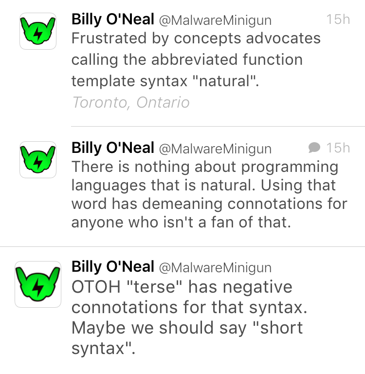
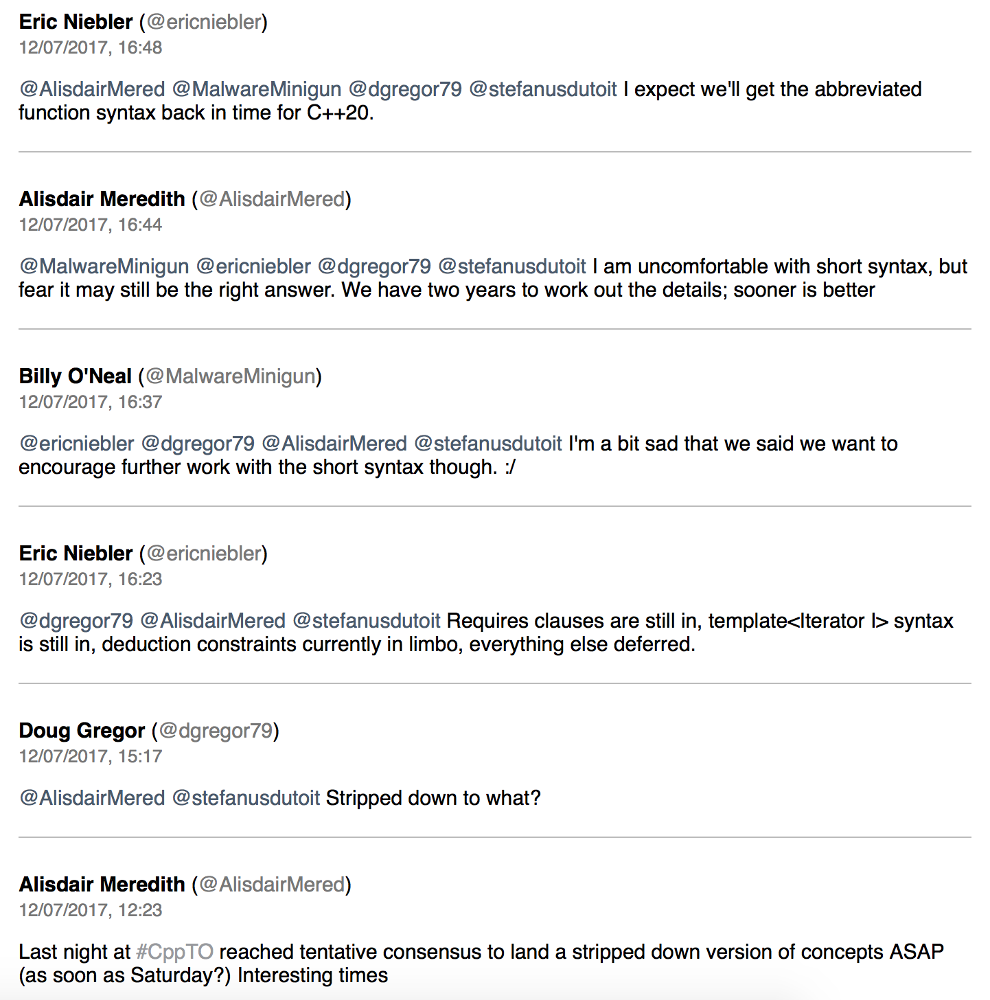
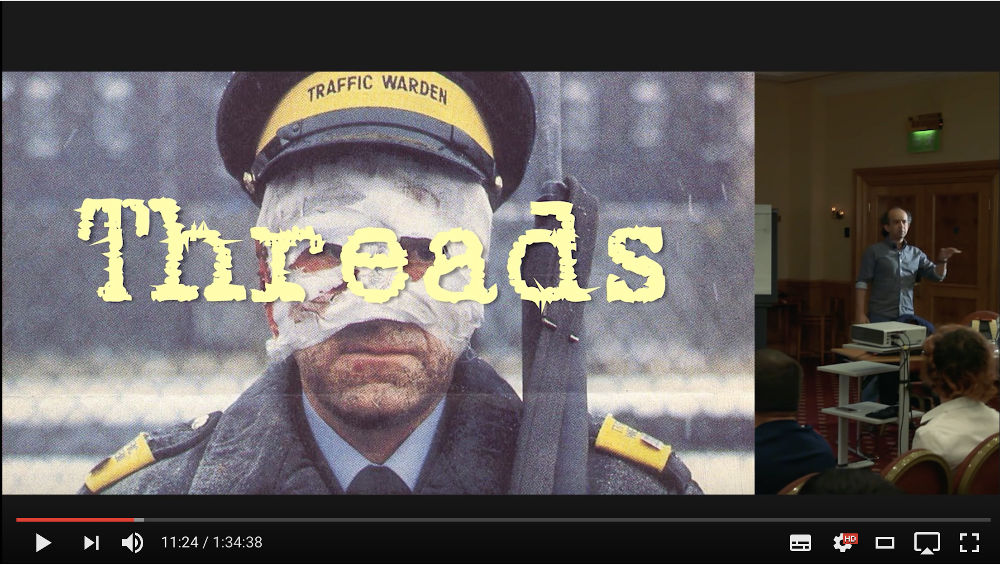

autoscale: true

# C++ Club

## 13 July 2017

---

# Toronto tweets


---

# Toronto tweets



---

# Toronto tweets



---

# Exception handling in constructors

* Function `try` block
* [https://medium.com/cpp-station/exception-handling-in-constructors-26bf4c811b46](https://medium.com/cpp-station/exception-handling-in-constructors-26bf4c811b46)

---

# Exception handling in constructors

```cpp
A::A(int& n) try : B(n), cObject(0), x(-1), y(n) {
}
catch(Exception& e) {
    //Option 1: Throw same exception
    //Option 2: Log and thrown another exception
    //Option 3: Exception thrown automatically on reaching end of handler
}
catch(AnotherException& e) {
    //Option 1: Throw same exception
    //Option 2: Log and thrown another exception
    //Option 3: Exception thrown automatically on reaching end of handler
}
```

---

# Exception handling in constructors

* Use with constructors that have initializer list that calls a user-defined constructor that can throw.
* You can replace the exception being thrown and cause some useful side effects such as log the failure.

---

# The rise of the new language MC++

[http://cppdepend.com/blog/?p=171](http://cppdepend.com/blog/?p=171)

* Folly by Facebook as a modern C++ library example
* `auto` everywhere
* `nullptr`
* `std::shared_ptr`

---

# The rise of the new language MC++

* Scoped enums
* `static_assert`
* variadic templates
* range `for` loops
* `std::initializer_list`
* `noexcept`

---

# The rise of the new language MC++

* `std::thread`
* unordered containers
* `default` and `delete` special member functions
* `override`
* lambdas
* `std::move` (doesn't move) and `std::forward` (doesn't forward)

---

# To move or not to move

[http://www.stroustrup.com/move.pdf](http://www.stroustrup.com/move.pdf)

Discusses issues with generating implicit copy and move operations.

> To have move useful, it must be implicitly generated in many cases. To minimize surprises and bugs, no move operations should be generated for classes with a user-specified copy, move, or destructor. To keep the rules consistent, the generation of copy operations should be deprecated for classes with a user-specified copy, move, or destructor.

---

# Ninja build system

* Built for speed: instant incremental builds
* Linux, Windows; optimised for big C++ projects
* Works with gyp, CMake, etc. (possibly premake)
* [https://ninja-build.org](https://ninja-build.org)
* [https://github.com/ninja-build/ninja](https://github.com/ninja-build/ninja)
* Used by Chrome, Android, LLVM

---

# Thinking Outside the Synchronisation Quadrant

## Kevlin Henney, ACCU 2017

[https://www.youtube.com/watch?v=UJrmee7o68A](https://www.youtube.com/watch?v=UJrmee7o68A)

- synchronization only needed for shared mutable data
- instead of threads why not use message passing between processes
- "processes" can be lightweight (Erlang)
- agents react to messages
- no synchronization needed within message handlers



---

# 'Meaningful' casts

## Vittorio Romeo — Meeting C++ 2015

[YouTube (12m)](https://www.youtube.com/watch?v=62c_Xm6Zh1k)

Range-checked casts

```cpp
template <typename TOut, typename TIn>
constexpr auto to_num(const TIn& x) noexcept {...}
```

```cpp
int a{10};
to_num<float>(a);
to_num<int>(-1); // OK
to_num<unsigned int>(-1); // Run-time assertion
to_num<float>(NAN); // Run-time assertion
```

Also: `from_enum`, `to_enum`, support for `std::aligned_storage_t`, casts along inheritance hierarchy, etc.

---

# C++ Rvalue references explained

By [Thomas Becker](http://thbecker.net/articles/rvalue_references/section_01.html)

Table of Contents

1. Introduction
2. Move Semantics
3. Rvalue References
4. Forcing Move Semantics
5. Is an Rvalue Reference an Rvalue?
6. Move Semantics and Compiler Optimizations
7. Perfect Forwarding: The Problem
8. Perfect Forwarding: The Solution
9. Rvalue References and Exceptions
10. The Case of the Implicit Move
11. Acknowledgments and Further Reading

---

# An Effective C++11/14 Sampler

## Scott Meyers (Going Native, 2013)

[Video (1h 15m)](https://channel9.msdn.com/Events/GoingNative/2013/An-Effective-Cpp11-14-Sampler)

* Understand `std::move` and `std::forward`
* Declare functions `noexcept` whenever possible
* Make `std::thread`s unjoinable on all paths

---

# An Effective C++11/14 Sampler

## Scott Meyers (Going Native, 2013)

```cpp
class ThreadRAII {
public:
    typedef void (std::thread::*RAIIAction)();
    ThreadRAII(std::thread&& thread, RAIIAction a)
    : t(std::move(thread)), action(a) {}
    ~ThreadRAII()
    {if (t.joinable()) (t.*action)();} // race condition?
    std::thread& get() {return t;}
private:
    RAIIAction action;
    std::thread t;
};

ThreadRAII t1(std::thread(doThisWork), &std::thread::join);
ThreadRAII t1(std::thread(doThisWork), &std::thread::detach);
```

---

# Outcome v2 is feature complete

* [Code](https://github.com/ned14/outcome)
* [Documentation](https://ned14.github.io/outcome/)
* [Reddit thread](https://www.reddit.com/r/cpp/comments/6me836/outcome_v2_is_feature_complete/)

```cpp
outcome::result<int/*, std::error_code*/>
convert(const std::string& str) noexcept;
```

Boost review feedback addressed.

---

# Undefined Behavior in 2017

by John Regehr (Professor of Computer Science, University of Utah, USA) and Pascal Cuoq

[Article](https://blog.regehr.org/archives/1520)

* Goal 1: Every UB (yes, all ~200 of them, we’ll give the list towards the end of this post) must either be documented as having some defined behavior, be diagnosed with a fatal compiler error, or else — as a last resort — have a sanitizer that detects that UB at runtime.
* Goal 2: Every UB must either be documented as having some defined behavior, be diagnosed with a fatal compiler error, or else have an optional mitigation mechanism that meets the requirements above.

---

# Presenting Code

* Use dark-on-light colour scheme
* Avoid dark backgrounds as syntax-highlighted code becomes invisible or very hard to read
* Consider effects of video compression
* Think about colour-blind developers

