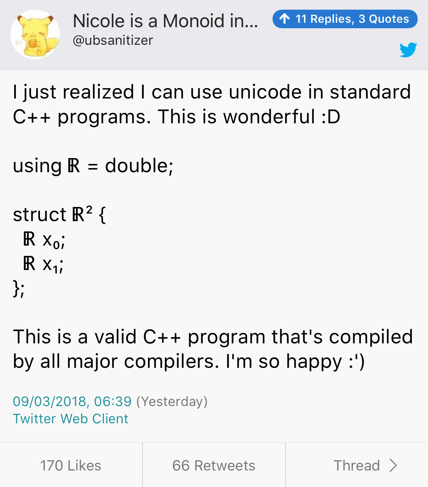

# Dependency Management for C++

* [Blog post by Hans Klabbers](http://www.klabbers.nl/c/dependency-management-for-c/)
* [Accio Dependency Manager, by Corentin](https://medium.com/@corentin.jabot/accio-dependency-manager-b1846e1caf76)

# Arno Schödl - A Practical Approach to Error Handling

* [YouTube](https://www.youtube.com/watch?v=tTz_JRJJrsc)
* [think-cell](https://www.think-cell.com/en/)
* The main product plugs into PowerPoint to provide chart auto-layout
* Patches PowerPoint code at run time (client-server architecture)
* They disassemble PowerPoint and related libraries using [IDA](https://www.hex-rays.com/products/ida/) to find entry points (working against undocumented APIs)!

# Arno Schödl - A Practical Approach to Error Handling (cont.)

* Strong exception guarantee is very hard to achieve in application code: too many state changes
* What to do on error:
    * Collect information, send report home
    * Stop further reporting, as program state is undefined
    * Despite the above, carry on and never terminate!
    * Server stops processing certain type of requests if too many threads hang
    * Reproduce error in the lab, handle reproducible errors only
* Asserts can be wrong! Don't terminate on assert, call home instead, otherwise developers will be afraid to add asserts!
* Reporting server gets 1 crash report per second on average

# An Introduction to Reflection in C++

[Blog post by Jackie Kay](http://jackieokay.com/2017/04/13/reflection1.html)

* Terminology:
    * "_Introspection_ is the ability to inspect a type and retrieve its various qualities. You might want to introspect an object’s data members, member functions, inheritance hierarchy, etc. And you might want to introspect different things at compile time and runtime."
    * "_Metaobjects_ are the result of introspection on a type: a handle containing the metadata you requested from introspection. If the reflection implementation is good, this metaobject handle should be lightweight or zero-cost at runtime."
    * "_Reification_ is a fancy word for “making something a first-class citizen”, or “making something concrete”. We will use it to mean mapping from the reflected representation of objects (metaobjects) to concrete types or identifiers."

# An Introduction to Reflection in C++ (cont.)

* "Run-time type information/identification is a controversial C++ feature, commonly reviled by performance maniacs and zero-overhead zealots. If you’ve ever used `dynamic_cast`, `typeid`, or `type_info`, you were using RTTI."
* Macros: "Hana and MPL can adapt a user-defined POD-type into an introspectible structure which tuple-like access. The code is quite formidable and verbose. That’s because there’s a separate macro case for adapting a struct of specific sizes. For example, all structs with 1 member map to a particular macro, all structs with 2 members map to the next macro, etc." Max 62 members per struct.

# An Introduction to Reflection in C++ (cont.)

* "The current pinnacle of POD introspection in C++14 is a library called **magic_get** (Precise and Flat Reflection, pre-Boost `boost::pfr`) by Antony Polukhin — [https://github.com/apolukhin/magic_get](https://github.com/apolukhin/magic_get) — C++17 implementation doesn’t use macros, just templates and structured bindings." Still, max 101 members per struct.
* Other languages: Python, Java, C#, Go

# An Introduction to Reflection in C++ (cont.)

* C++20: `reflexpr`: "The `reflexpr` proposal, by Matúš Chochlík, Axel Naumann, and David Sankel, introduces several “metaobjects” which are accessed by passing a type to the new `reflexpr` operator."
* C++20: `operator$`: "Andrew Sutton and Herb Sutter wrote _A design for static reflection_, which introduces the reflection operator, `$`, as a way of getting object metadata out of a class, namespace, etc. (Using $ has been argued out of favor because it is common in legacy code, particularly in code generation and template systems which are not necessarily valid C++ but produce C++ sources.)"
* "The fundamental design difference between these two papers is whether the result of the reflection operator is a value or a type."
* "Concepts are design prerequisite for both of the reflection papers."

# Smf RPC

*smf* is a new RPC system and code generation like gRPC, Cap'n'Proto, Apache Thrift, etc, but designed for microsecond tail latency.

* [Home page](https://senior7515.github.io/smf/)
* [Code](https://github.com/senior7515/smf)
* [Reddit](https://www.reddit.com/r/cpp/comments/807rgh/show_reditcpp_smf_cpp_community_feedback/)

Based on [Seastar](http://www.seastar-project.org/) ([code](https://github.com/scylladb/seastar)) by [ScyllaDB](https://www.scylladb.com/).

# Frozen: a header-only, `constexpr` alternative to gperf for C++14 users

Header-only library that provides zero-cost initialization for immutable containers and various algorithms.

* [Code](https://github.com/serge-sans-paille/frozen) (Apache 2.0)
* [Intro](https://blog.quarkslab.com/frozen-an-header-only-constexpr-alternative-to-gperf-for-c14-users.html)

```cpp
#include <frozen/unordered_set.h>

constexpr frozen::unordered_set<int, 3> keys = {1,2,4};

int some_user(int key) {
    return keys.count(key);
}
```

# Video: The hidden rules of world-class C++ code - Boris Schäling - Meeting C++ 2017

[Video](https://www.youtube.com/watch?v=fu6N6JbPOrI)

How we know if a code base is good or bad?

Getting rid of inheritance and virtual functions in favour of templates and value semantics.

# Video: Free your functions! - Klaus Iglberger - Meeting C++ 2017

[Video](https://www.youtube.com/watch?v=nWJHhtmWYcY)

Data should be as encapsulated as possible => free functions lead to better encapsulation than member functions.

How to test a private function?

* `friend` test function (bad)
* `#define private public` (worse)
* free function operating on data in the class (better)

# Fun with (user-defined) attributes - Jonathan Müller - Meeting C++ 2017

* [Video](https://www.youtube.com/watch?v=Pt6oeIpzue4)

Syntax:

* Simple identifiers: `[[foo]]`
* Pack expansion: `[[foo...]]`
* Multiple attributes: `[[foo, bar, baz]]`
* Arguments: `[[foo(a, "b", 3.14, +)]]`
* Namespaces: `[[foo::bar]]`
* Using declaration: `[[using foo: bar, baz]]`

# Fun with (user-defined) attributes - Jonathan Müller - Meeting C++ 2017 (cont.)

```cpp
[[noreturn]] void handle_error(std::string msg)
{
    throw std::runtime_error(std::move(msg));
}
```

# Fun with (user-defined) attributes - Jonathan Müller - Meeting C++ 2017 (cont.)

`alignas` changes generated code!

```cpp
alignas(128) char cacheline[128];
```

# Fun with (user-defined) attributes - Jonathan Müller - Meeting C++ 2017 (cont.)

```cpp
void func(int param);

[[deprecated("pass a parameter instead")]]
void func()
{
    func(0);
}
```

# Fun with (user-defined) attributes - Jonathan Müller - Meeting C++ 2017 (cont.)

```cpp
switch (selected_option)
{
    <...>
    case option::b:
        if (foo)
            log_error("option::b may not be used when foo is set");
        // otherwise b is exactly like c so continue on
        [[fallthrough]];
    case option::c:
        <...>
}
```

# Fun with (user-defined) attributes - Jonathan Müller - Meeting C++ 2017 (cont.)

```cpp
[[nodiscard]]
int error();
```

# Fun with (user-defined) attributes - Jonathan Müller - Meeting C++ 2017 (cont.)

```cpp
[[maybe_unused]]
static bool is_valid(int param);

void do_something(int a, [[maybe_unused]] int b)
{
    <...>
}
```

# Fun with (user-defined) attributes - Jonathan Müller - Meeting C++ 2017 (cont.)

Compiler-specific attributes change generated code, C++ standard ones don't (except `alignas`).

# CppCon 2017: Andrew Sutton “Meta”

* [YouTube](https://www.youtube.com/watch?v=29IqPeKL_QY)
* [P0633: Exploring the design space of metaprogramming and reflection](http://www.open-std.org/jtc1/sc22/wg21/docs/papers/2017/p0633r0.pdf)

```cpp
constexpr { // metaprogram
    for... (auto x : $x.member_variables()) {
        // do stuff with x
    }
}
```

# CppCon 2017: Andrew Sutton “Meta” (cont.)

Injection of new declarations or statements

```cpp
template<enum E>
const char* to_string(E value)
{
    switch (value) constexpr {
        for... (auto e : $E.enumerators())
            -> { case e.value(): return e.name(); } // Injection
    }
}
```

# CppCon 2017: Andrew Sutton “Meta” (cont.)

Source code literals

```cpp
auto frag = __fragment class C { // name C is optional
    int x;
    int foo() {
        return x + this->y;
    }
};
auto frag = __fragment class Node {
    Node* next;
    Node* prev;
};
auto ns = __fragment {
    case 0: return 42;
};
```

# UB will delete your null checks

* [Post](https://qinsb.blogspot.co.uk/2018/03/ub-will-delete-your-null-checks.html)

# VIM Clutch

* [GitHub](https://github.com/alevchuk/vim-clutch)

VIM Clutch is a hardware pedal for improved text editing speed for users of the magnificent VIM text editor. When the pedal is pressed down, the pedal types "i" causing VIM to go into Insert Mode. When released, it types <Esc> and you are back in Normal Mode.

# Twitter


