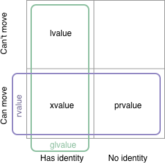
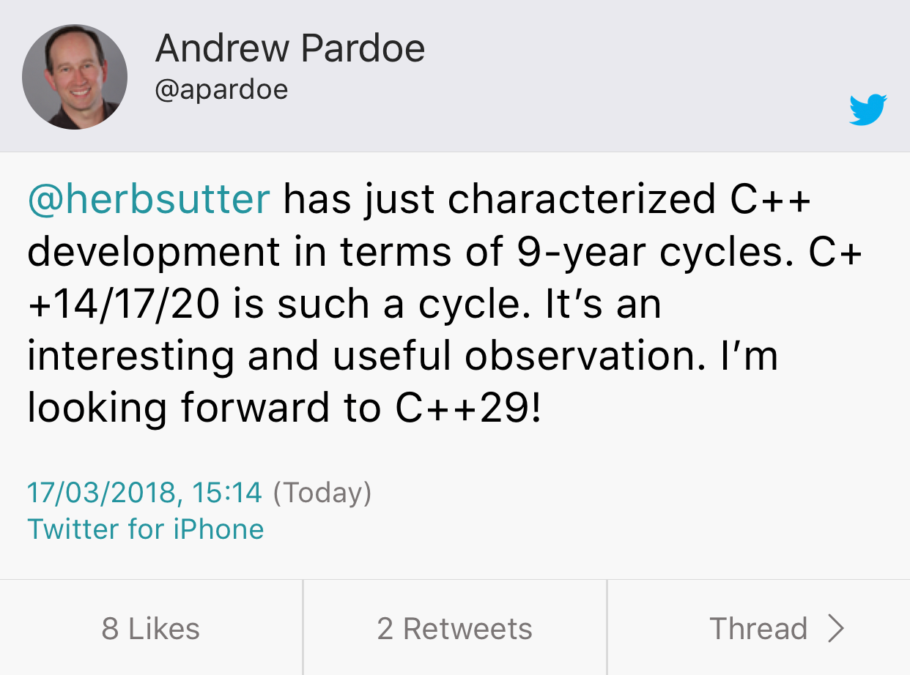
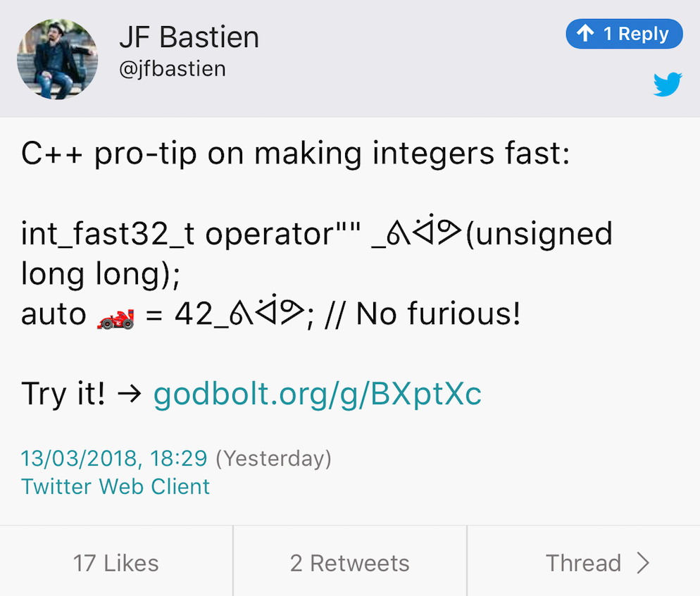

# Jacksonville C++ Standards Meeting

* Trip reports

    * [Vittorio Romeo](https://vittorioromeo.info/index/blog/mar18_iso_meeting_report.html)
    * [Guy Davidson](https://hatcat.com/?p=33)
    * [using std::cpp](https://usingstdcpp.org/2018/03/18/jacksonville18-iso-cpp-report/)
    * [CppCast with Patrice Roy](http://cppcast.com/2018/03/patrice-roy/)
    * [Botond Ballo](https://botondballo.wordpress.com/2018/03/28/trip-report-c-standards-meeting-in-jacksonville-march-2018/), [Reddit thread](https://www.reddit.com/r/cpp/comments/87sva7/trip_report_c_standards_meeting_in_jacksonville/)

* The Plan (according to Herb Sutter -- Thanks Bjarne):

    * Executors: TS in the C++20 timeframe, standard in C++23
    * Networking: C++23 (delayed by Executors)
    * Coroutines: C++20
    * Modules: Partially in C++20 with more in C++23 (blame Google)
    * Contracts: C++20
    * Reflection: TS in C++20 timeframe, standard in C++23
    * Ranges: Core in C++20, cool stuff in C++23

# Text Formatting at the ISO C++ standards meeting in Jacksonville

* [Post](http://zverovich.net/2018/03/17/text-formatting-jacksonville.html)
* [P0424R0: Reconsidering literal operator templates for strings](http://www.open-std.org/jtc1/sc22/wg21/docs/papers/2016/p0424r0.pdf)

```cpp
s = format("{}"_fmt, 42);
```

* [P0732R0: Class Types in Non-Type Template Parameters](http://www.open-std.org/jtc1/sc22/wg21/docs/papers/2018/p0732r0.pdf)

```cpp
s = format<"{}">(42);
s = format(fmt<"{}">, 42);
s = "{}"_format(42);
```

# C++ committee, please look at the big picture

[Reddit](https://www.reddit.com/r/cpp/comments/8577qc/c_committee_please_look_at_the_big_picture/)

> More disappointment as the C++ standardisation process fails to deliver what programmers need....

> There have been a lot of improvements but the whole "It must be perfect" ethos rather than 80/20 is really damaging this language and libraries.

> Maybe the precious backwards compatibility is more damaging to progress?

# Terse Concepts syntax poll

[Doodle poll](https://doodle.com/poll/dewpn58rt4uwvb7t)

Which concepts terse syntax looks promising and should be adopted by the committee?

* [Adjective syntax](https://wg21.link/p0873R1) -- 28 (Peter Sommerlad, Jonathan Müller)
* [Original syntax](https://wg21.link/P0956R0) -- 18 (Yours truly)
* [`\{\}` syntax](https://wg21.link/P0750R1) -- 8
* No terse syntax is needed -- 3 (Bryce Lelbach)
* [`auto<>` syntax](https://wg21.link/p0915R0) -- 2 (Joel Falcou)

# 28.03.2018, Distributed C++ meet-up 0x02 - Berlin && London && Stockholm

* [Blog post](http://jguegant.github.io/blogs/tech/distributed-c++-meetup.html)
* [Reddit announcement](https://www.reddit.com/r/cpp/comments/861n3o/28032018_distributed_c_meetup_0x02_berlin_london/)
* [C++ London](https://www.meetup.com/CppLondon/events/248091281/)
* [SwedenCpp](https://www.meetup.com/swedencpp/events/248092613/)
* [Berlin C++](https://www.meetup.com/berlincplusplus/events/248093069/)

# The RedMonk Programming Language Rankings: January 2018

[Rankings](https://redmonk.com/sogrady/2018/03/07/language-rankings-1-18/)

1. JavaScript
2. Java
3. Python
4. PHP
5. C#
6. C++

# GCC8 usability improvements by Red Hat

* [Article](https://developers.redhat.com/blog/2018/03/15/gcc-8-usability-improvements/)

# C++ Study Notes for interview preparation

[Web](https://encelo.github.io/notes.html)

# The Definitive C++ Book Guide and List

[StackOverflow](https://stackoverflow.com/questions/388242/the-definitive-c-book-guide-and-list)

# #pragma once has unfixable bugs. It should never be used.

[StackOverflow](https://stackoverflow.com/questions/1143936/pragma-once-vs-include-guards/34884735#34884735)

If your `#include` search path is sufficiently complicated, the compiler may be unable to tell the difference between two headers with the same basename (e.g. `a/foo.h` and `b/foo.h`), so a `#pragma once` in one of them will suppress both. It may also be unable to tell that two different relative includes (e.g. `#include "foo.h"` and `#include "../a/foo.h"`) refer to the same file, so `#pragma once` will fail to suppress a redundant include when it should have.

# #pragma once has unfixable bugs. It should never be used (cont.)

The short version of why this is unfixable is that neither the Unix nor the Windows filesystem API offer any mechanism that guarantees to tell you whether two absolute pathnames refer to the same file.

Historical note: The only reason I didn't rip `#pragma once` and `#import` out of GCC when I had the authority to do so, ~12 years ago, was Apple's system headers relying on them. In retrospect, that shouldn't have stopped me.

# Reddit Q: Monadic error handling

[Reddit](https://www.reddit.com/r/cpp/comments/81woqn/i_want_to_do_monadic_error_handling_what_is_the/)

# Detecting incorrect C++ STL usage, by Krister Walfridsson

[Post](https://kristerw.blogspot.co.uk/2018/03/detecting-incorrect-c-stl-usage.html)

```bash
g++ -O2 -D_GLIBCXX_DEBUG example.cpp
```

# Memory Tagging (aka memory coloring, memory tainting, lock and key) and how it improves C/C++ memory safety

[PDF](https://arxiv.org/ftp/arxiv/papers/1802/1802.09517.pdf)

* Every TG (tagging granularity) bytes of memory aligned by TG are associated with a tag of TS (tag size) bits. These TG bytes are called the granule.
* TS bits in the upper part of every pointer contain a tag.
* Memory allocation (e.g. malloc) chooses a tag, associates the memory chunk being
allocated with this tag, and sets this tag in the returned pointer.
* Every load and store instruction raises an exception on mismatch between the pointer and memory tags.
* The memory access and tag check do not necessarily occur atomically with respect to
each other.

# Memory Tagging (cont.)

Implementations:

* SPARC ADI: The SPARC ADI hardware extension is supported on SPARC M7/M8 CPUs running Solaris OS. There is also some indication that Linux support is in progress.
* AArch64 HWASAN (hardware-assisted ASAN): an AArch64-specific compiler-based tool.

# My favourite C++17 features, by Kacper Kołodziej

[Post](https://kacperkolodziej.com/programming/my-favourite-cpp17-language-features.html)

* Structured bindings
* Fold expressions
* `constexpr if`
* [Selection statements with initializer](http://www.open-std.org/jtc1/sc22/wg21/docs/papers/2016/p0305r1.html)
* Nested namespaces

# lvalues, rvalues, glvalues, prvalues, xvalues, help!

[Post](https://blog.knatten.org/2018/03/09/lvalues-rvalues-glvalues-prvalues-xvalues-help/)



# Floating point visually explained

* [Article](http://fabiensanglard.net/floating_point_visually_explained/)

# Twitter: C++ 9-year cycle



# Twitter: Fast integers -- [Godbolt](https://godbolt.org/g/BXptXc), [StackOverflow](https://stackoverflow.com/a/16164189/10154)



# Quote

Oscar Godson:

> One of the best programming skills you can have is knowing when to walk away for a while.
