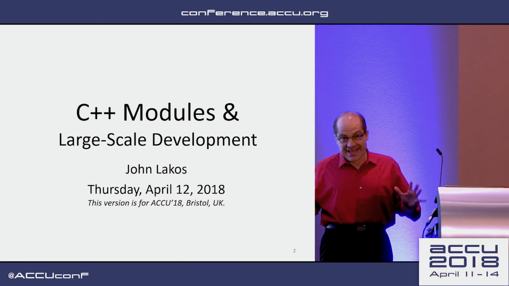
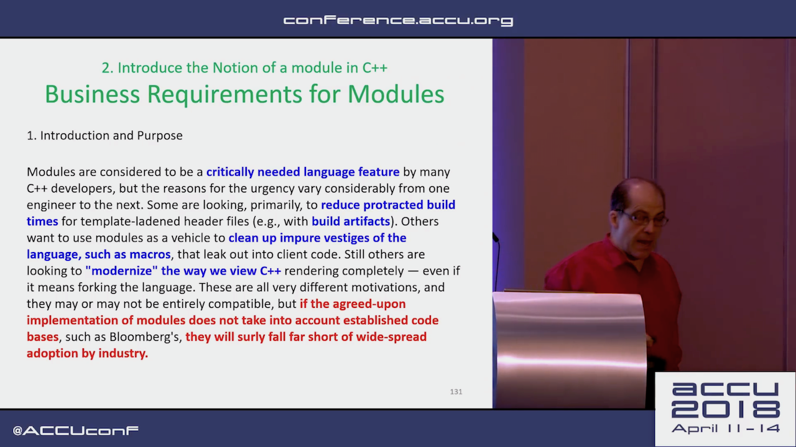
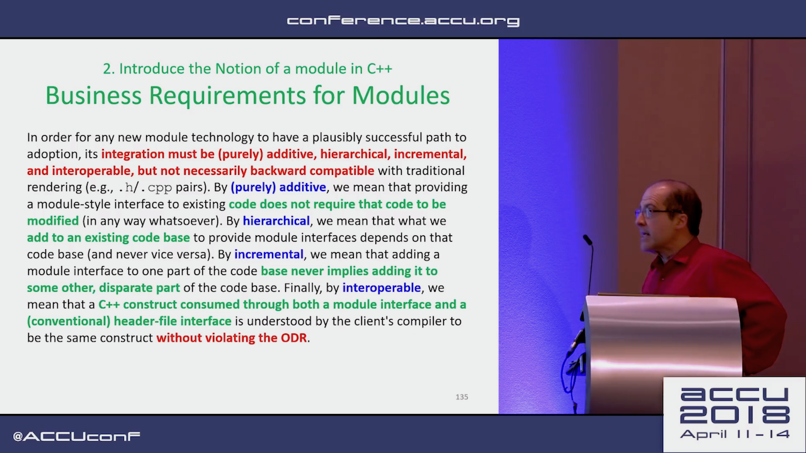
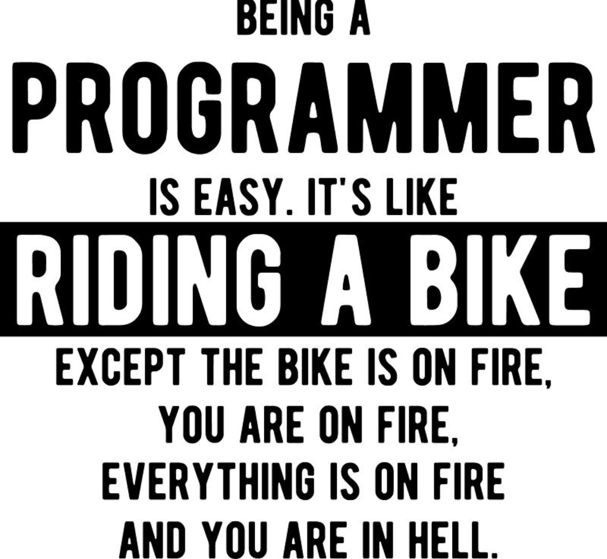

# Visual Studio 2017 version 15.7

* [Microsoft blog post](https://docs.microsoft.com/en-us/visualstudio/releasenotes/vs2017-relnotes#15.7.0)
* [MSVC Conforms to the C++ Standard](https://blogs.msdn.microsoft.com/vcblog/2018/04/26/announcing-msvc-conforms-to-the-c-standard/)
* [Reddit](https://www.reddit.com/r/cpp/comments/8hpx0q/visual_studio_157_is_out_with_c17_conformance/)

# Diet Graphics

* [p1062R0](https://api.csswg.org/bikeshed/?url=https://raw.githubusercontent.com/brycelelbach/diet_graphics/master/diet_graphics.bs&force=1)
* [Reddit](https://www.reddit.com/r/cpp/comments/8hmyzk/p1062r0_diet_graphics/)

> The proposed programmatic 2D drawing library is not a good fit for C++.

# Macros and modules

[Reddit: Really think that the macro story in Modules is doing more harm than good](https://www.reddit.com/r/cpp/comments/8j1edf/really_think_that_the_macro_story_in_modules_is/)

# Modules and macros: a reasonable compromise (?)

* [Post](https://gracicot.github.io/modules/2018/05/14/modules-macro.html)
* [Reddit: "Nope"](https://www.reddit.com/r/cpp/comments/8j61wa/modules_and_macros_a_reasonable_compromise/)

# What modules actually provide

* [Reddit](https://www.reddit.com/r/cpp/comments/8jb0nt/what_modules_can_actually_provide_and_what_not/)

# C++ Modules and Large-Scale Development - John Lakos, ACCU 2018

[Video](https://www.youtube.com/watch?v=HmI1XFEu_uY)

# C++ Modules and Large-Scale Development - John Lakos, ACCU 2018

* Bloomberg doesn't allow free functions (?!)

# C++ Modules and Large-Scale Development - John Lakos, ACCU 2018

# Must-watch C++ talks

* [Reddit thread](https://www.reddit.com/r/cpp/comments/8hww8k/talks_are_there_any_must_watch_c_talks/)
* [Matt Godbolt: What Has My Compiler Done for Me Lately? Unbolting the Compiler's Lid (CppCon 2017)](https://www.youtube.com/watch?v=bSkpMdDe4g4)

# Runtime Compiled C & C++ Solutions

[List](https://github.com/RuntimeCompiledCPlusPlus/RuntimeCompiledCPlusPlus/wiki/Alternatives)

# Boost.Text: What a C++ standard Unicode library might look like

* [GitHub](https://github.com/tzlaine/text)
* [Docs](https://tzlaine.github.io/text/doc/html/index.html)
* [Intro](https://tzlaine.github.io/text/doc/html/boost_text__proposed_/intro.html)

> C++ is one of a select few major languages with no built-in support for Unicode. If nothing else, this is an embarassment that should be remedied.

# Transwarp 1.3.0

* [Release notes](https://github.com/bloomen/transwarp/releases/tag/1.3.0)
* [GitHub](https://github.com/bloomen/transwarp) -- C++11, MIT
* [Comparison to other libraries](https://github.com/bloomen/transwarp#comparison-to-other-libraries)

*Transwarp* is a header-only C++ library for task concurrency. It enables you to free your functors from explicit threads and transparently manage dependencies. Under the hood, a directed acyclic graph is built that allows for efficient traversal and type-safe dependencies. Use *transwarp* if you want to model your dependent operations in a graph of tasks and intend to invoke the graph more than once.

# C++ Committee Pre-Rappersvil mailing

* [Mailing](http://www.open-std.org/jtc1/sc22/wg21/docs/papers/2018/#mailing2018-05)
* [Reddit thread](https://www.reddit.com/r/cpp/comments/8iqysq/c_standards_committee_papers_201805_prerapperswil/)

# P0709: Zero-overhead deterministic exceptions

* [P0709R0](http://www.open-std.org/jtc1/sc22/wg21/docs/papers/2018/p0709r0.pdf)
* [Reddit thread](https://www.reddit.com/r/cpp/comments/8iw72i/p0709_r0_zerooverhead_deterministic_exceptions/)

# Quote

