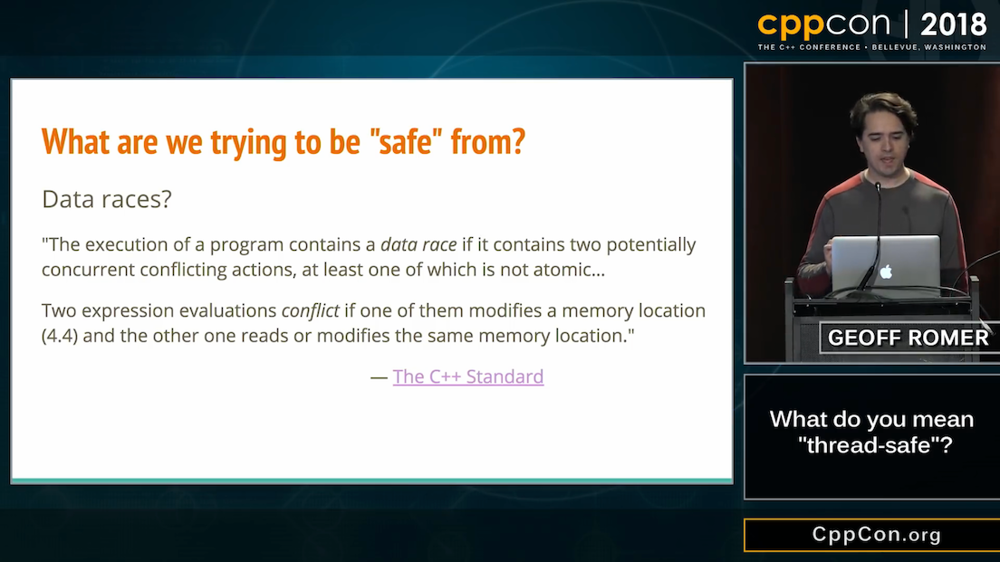
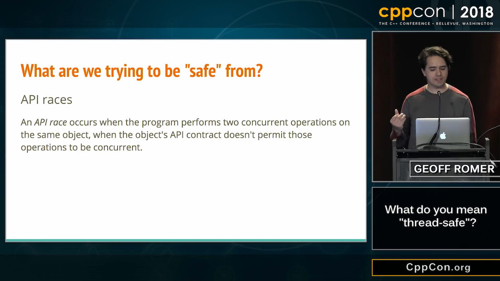
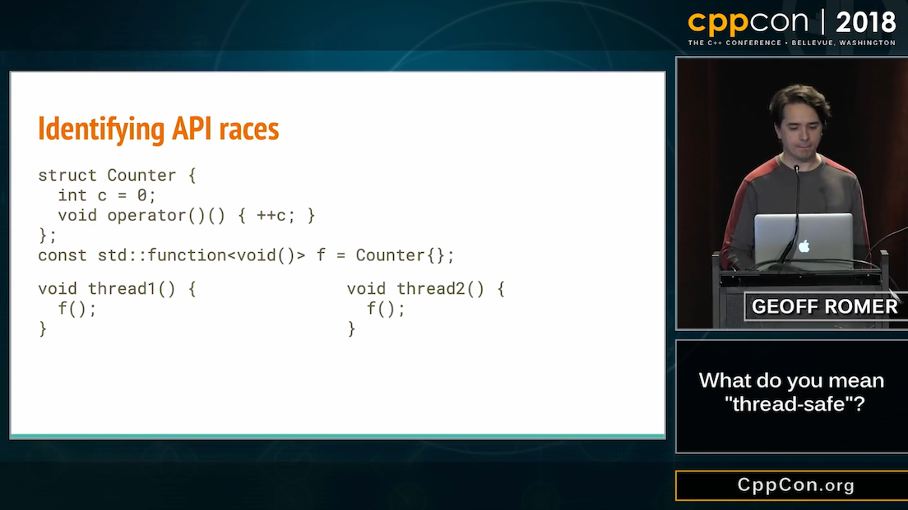
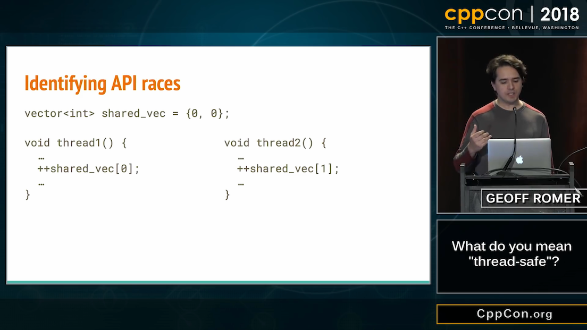

----

Avoid unsigned
--------------

* P0330R4_ Literal Suffixes for ptrdiff_t and size_t
* P1227R1_ Signed ssize() functions, unsigned size() functions
* P1428R0_ Subscripts and sizes should be signed

.. code:: c++

    template <typename C>
    constexpr int ssize(const C& c)
    {
        const size_t size = c.size();
        assert(size <= static_cast<size_t>(std::numeric_limits<int>::max()));
        return static_cast<int>(size);
    }

.. _P0330R4: http://wg21.link/P0330R4
.. _P1227R1: http://wg21.link/P1227R1
.. _P1428R0: http://wg21.link/P1428R0

Cpp.chat with Nicolai Josuttis
------------------------------

https://youtu.be/_CaP_xwfAFU

* Initialisation is broken!
* Initialiser lists are broken!
* Auto initialisation is broken!

.. image:: img/original_rage.jpg
   :width: 1500 px
   :height: 1173 px
   :scale: 10 %

CppCon 2018 - Geoff Romer - What do you mean "thread-safe"?
-----------------------------------------------------------

https://youtu.be/s5PCh_FaMfM

CppCon 2018 - Geoff Romer - What do you mean "thread-safe"?
-----------------------------------------------------------

https://youtu.be/s5PCh_FaMfM

.. image:: img/romer-threadsafe-2.png

CppCon 2018 - Geoff Romer - What do you mean "thread-safe"?
-----------------------------------------------------------

https://youtu.be/s5PCh_FaMfM

CppCon 2018 - Geoff Romer - What do you mean "thread-safe"?
-----------------------------------------------------------

https://youtu.be/s5PCh_FaMfM

.. image:: img/romer-threadsafe-4.png

CppCon 2018 - Geoff Romer - What do you mean "thread-safe"?
-----------------------------------------------------------

https://youtu.be/s5PCh_FaMfM

CppCon 2018 - Geoff Romer - What do you mean "thread-safe"?
-----------------------------------------------------------

https://youtu.be/s5PCh_FaMfM

.. image:: img/romer-threadsafe-6.png

CppCon 2018 - Geoff Romer - What do you mean "thread-safe"?
-----------------------------------------------------------

https://youtu.be/s5PCh_FaMfM

.. image:: img/romer-threadsafe-7.png

CppCon 2018 - Geoff Romer - What do you mean "thread-safe"?
-----------------------------------------------------------

https://youtu.be/s5PCh_FaMfM

CppCon 2018 - Geoff Romer - What do you mean "thread-safe"?
-----------------------------------------------------------

https://youtu.be/s5PCh_FaMfM

.. image:: img/romer-threadsafe-9.png

CppCon 2018 - Geoff Romer - What do you mean "thread-safe"?
-----------------------------------------------------------

https://youtu.be/s5PCh_FaMfM

.. image:: img/romer-threadsafe-10.png

Proper way to iterate backwards in C++
--------------------------------------

https://www.reddit.com/r/cpp/comments/947a1z/proper_way_to_do_backward_iteration_in_c/

.. code:: c++

    for (size_t i = data.size() - 1; i >= 0; --i) { ... } // Nope
    for (size_t i = data.size(); i--;) { ... } // The C way

    // C++17
    std::vector<int> vec;
    for (auto [value, idx] : reverse_index_adapter(vec)) {
        // idx = n-1, n-2, ... 0
    }

    std::for_each(vec.rbegin(), vec.rend(),  { ... }); // No index

    for (auto it = data.rbegin(); it != data.rend(); ++it) {
        auto i = std::distance(it, data.rend()) - 1;
    }

CppCon 2018 - Andreas Weis - Fixing Two-Phase Initialisation
------------------------------------------------------------

https://youtu.be/S7I66lZX_zM

Inverse two-phase initialisation

.. code:: c++

    class Foo
    {
        static expected<construction_token>
        preconstruct(Arg n_arg) noexcept
        {
            construction_token t;
            t.state = make_unique_nothrow(n_arg);
            if (!t.state) return unexpected(my_errc::error);
            return t;
        }

        Foo(construction_token&& t) noexcept
        : m_state(std::move(t.state)) {}
    };

CppCon 2018 - Andreas Weis - Fixing Two-Phase Initialisation
------------------------------------------------------------

https://youtu.be/S7I66lZX_zM

Inverse two-phase initialisation: usage

.. code:: c++

    // 1
    expected<Foo::construction_token> t1 = Foo::preconstruct(args);
    if (!t1.has_value()) { /* get out */ }
    Foo obj(std::move(*t1));

    // 2
    auto t2 = Foo::preconstruct(args);
    auto obj_ptr = std::make_shared<Foo>(std::move(*t2));

    // 3
    auto t3 = Foo::preconstruct(args);
    std::vector<Foo> objects;
    objects.emplace_back(std::move(*t3));

CppCon 2018 - Timur Doumler - I can has grammar?
------------------------------------------------

https://youtu.be/tsG95Y-C14k

.. code:: c++

    // MSVC rejects, GCC accepts, Clang accepts
    extern extern "C++" extern "C" extern "C++" int x;

    // MSVC accepts, GCC rejects, Clang accepts
    extern "C++" extern "C" extern "C++" extern int x;

CppCon 2018 - Timur Doumler - I can has grammar?
------------------------------------------------

https://youtu.be/tsG95Y-C14k

| *selection-statement:*
|     ``if constexpr``:sub:`opt` ( *init-statement*:sub:`opt` *condition* ) *statement*

.. code:: c++

    if (class foo; !ret.second) /* ... */;

    if (false; true) /* ... */;

    if (; true) /* ... */;

CppCon 2018 - Timur Doumler - I can has grammar?
------------------------------------------------

https://youtu.be/tsG95Y-C14k

Declare and initialise a variable of type "function pointer":

.. code:: c++

    auto (*fp)() -> int(&f);

CppCon 2018 - Timur Doumler - I can has grammar?
------------------------------------------------

https://youtu.be/tsG95Y-C14k

.. code:: c++

    struct foo;
    void bar(foo foo);
    void bar(foo(foo)); // vexing parse
    void bar(foo((foo))); // more vexing parse

CppCon 2018 - Timur Doumler - I can has grammar?
------------------------------------------------

https://youtu.be/tsG95Y-C14k

.. code:: c++

    class bar {};
    int bar;     // OK
    bar b;       // error
    class bar b; // OK
    class std::vector<class bar> bars; // OK

    // also acts as a forward declaration
    void foo(struct S* x);

    // weird scoping rules
    class C { void foo(struct S* x); };
    S* s;

CppCon 2018 - Timur Doumler - I can has grammar?
------------------------------------------------

https://youtu.be/tsG95Y-C14k

*pseudo-destructor-name*

.. code:: c++

    int i;
    i.~int(); // error: int is not type-name but type-specifier
    using foo = int;
    i.~foo(); // OK
    ~int();   // OK (not a destructor!)

CppCon 2018 - Timur Doumler - I can has grammar?
------------------------------------------------

https://youtu.be/tsG95Y-C14k

Alternative tokens

.. code:: c++

    struct Foo
    {
        Foo();
        compl Foo();
        Foo(const Foo bitand);
        Foo(Foo and);
    };

CppCon 2018: Matt Godbolt “The Bits Between the Bits: How We Get to main()”
---------------------------------------------------------------------------

https://youtu.be/dOfucXtyEsU

Daniele Pallastrelli - Reduce Compilation Times With **extern template**
------------------------------------------------------------------------

https://arne-mertz.de/2019/02/extern-template-reduce-compile-times/

Move smart pointers in and out functions in modern C++
------------------------------------------------------

* `Move smart pointers in and out functions in modern C++`_
  * Reddit: https://www.reddit.com/r/cpp/comments/aaux96/move_smart_pointers_in_and_out_functions_in/

.. _`Move smart pointers in and out functions in modern C++`: https://www.internalpointers.com/post/move-smart-pointers-and-out-functions-modern-c

Twitter
-------

.. image:: img/js-increment.png
