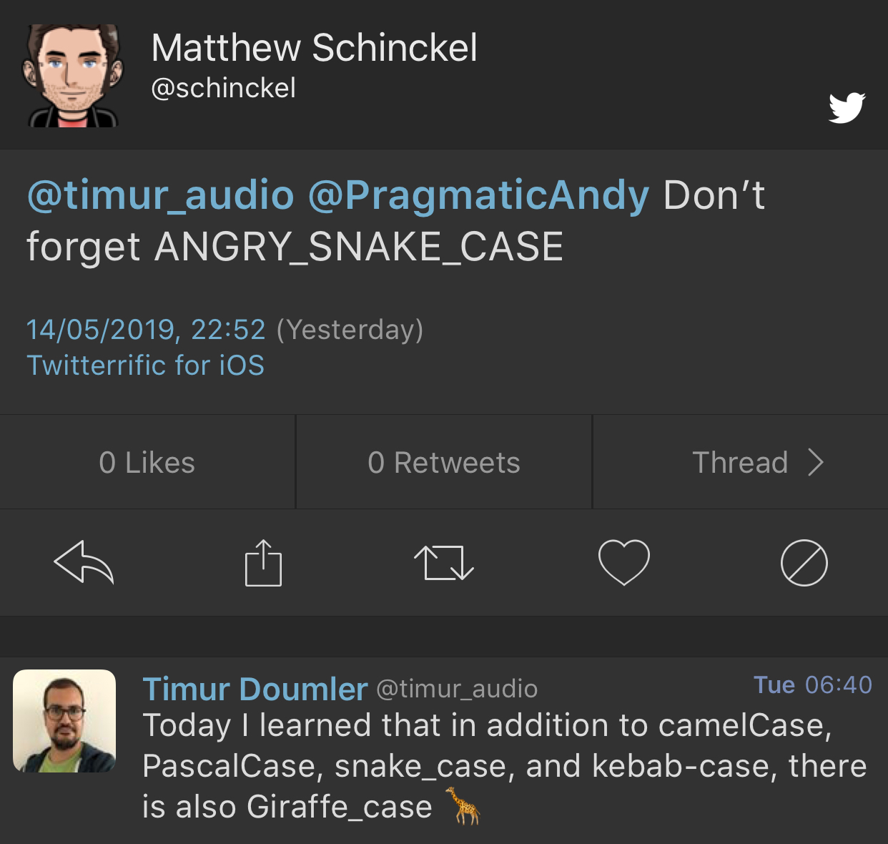
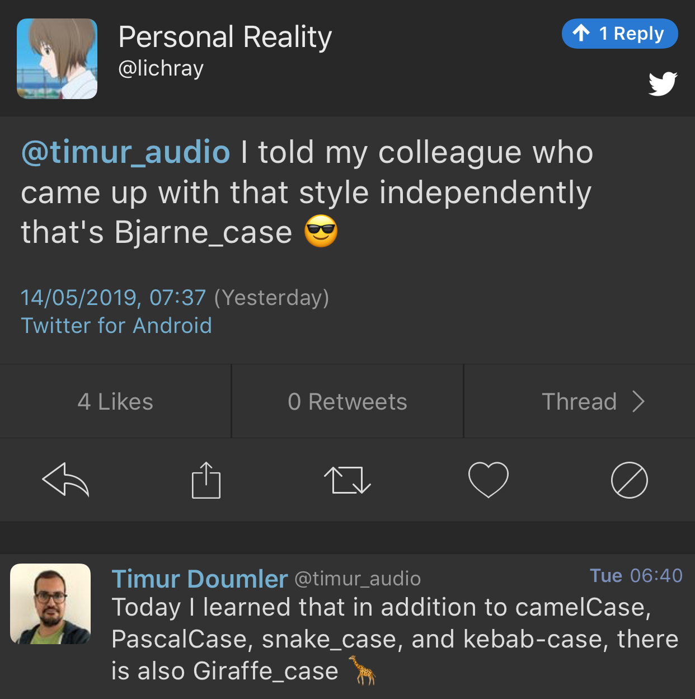

----

PyTorch and C++
---------------

* Peter Goldsborough (Facebook Research)
  * `CppCon 2017: A Tour of Deep Learning With C++ <https://www.youtube.com/watch?v=Lo1rXJdAJ7w>`_
  * `CppCon 2018: Machine Learning in C++ with PyTorch <https://www.youtube.com/watch?v=auRPXMMHJzc>`_
  * Code https://github.com/goldsborough?tab=repositories
* PyTorch docs https://pytorch.org/cppdocs
* PyTorch code https://github.com/pytorch/pytorch

Quirks in Class Template Argument Deduction (1/2)
-------------------------------------------------

Barry Revzin: https://brevzin.github.io/c++/2018/09/01/quirks-ctad/

.. code:: c++

    std::tuple<int> foo();

    std::tuple x = foo(); // tuple<tuple<int>>?
    auto y = foo();       // tuple<int>

What is the intent behind the declaration of variable ``x``?
Are we constructing a new thing (the CTAD goal) or are we using ``std::tuple``
as annotation to ensure that ``x`` is in fact a ``tuple`` (the Concepts goal)?

Quirks in Class Template Argument Deduction (2/2)
-------------------------------------------------

A clearer example:

.. code:: c++

    // The tuple case
    // unquestionably, tuple<int>
    std::tuple a(1);

    // unquestionably, tuple<tuple<int>,tuple<int>>
    std::tuple b(a, a);

    // ??
    std::tuple c(a);

**clamp_cast** -- A saturating arithmetic cast
----------------------------------------------

https://github.com/p-groarke/clamp_cast

A narrowing cast that does the right thing. clamp_cast will saturate output values at min or max if the input value would overflow / underflow.

.. code:: c++

    double ld = -42.0;
    unsigned char uc = clamp_cast<unsigned char>(ld);
    // uc == 0

    float f = 500000.f;
    char c = clamp_cast<char>(f);
    // c == 127

A pretty big list of C++ GUI libraries
--------------------------------------

Philippe M. Groarke: https://philippegroarke.com/posts/2018/c++_ui_solutions/

Reddit:

* https://www.reddit.com/r/cpp/comments/babfl5/a_pretty_big_list_of_c_gui_libraries/
* https://www.reddit.com/r/cpp/comments/9njw5n/is_there_an_easytouse_gui_library/
* https://www.reddit.com/r/cpp/comments/9q07bu/any_library_as_small_as_wxwidgets_but_as_powerful/

Modern UI in C++ https://www.reddit.com/r/cpp/comments/b3s2zq/modern_ui_in_c/

C++ Experts, what advice would you give to a new C++ developer?
---------------------------------------------------------------

https://www.reddit.com/r/cpp/comments/9s34p9/c_experts_what_advice_would_you_give_to_a_new_c/

* Exceptions don't work with MPI `# <https://www.reddit.com/r/cpp/comments/9s34p9/c_experts_what_advice_would_you_give_to_a_new_c/e8lswhe?utm_source=share&utm_medium=web2x>`_
* `Prefer composition over inheritance <https://stackoverflow.com/questions/49002/prefer-composition-over-inheritance>`_
* "Don't overuse exceptions" may not be so clear cut `# <https://www.reddit.com/r/cpp/comments/9s34p9/c_experts_what_advice_would_you_give_to_a_new_c/e8mabti?utm_source=share&utm_medium=web2x>`_ [`Measuring execution performance of C++ exceptions vs error codes <http://nibblestew.blogspot.com/2017/01/measuring-execution-performance-of-c.html>`_]
* Write unit tests for public API `# <https://www.reddit.com/r/cpp/comments/9s34p9/c_experts_what_advice_would_you_give_to_a_new_c/e8lz3ss?utm_source=share&utm_medium=web2x>`_ `# <https://www.reddit.com/r/cpp/comments/9s34p9/c_experts_what_advice_would_you_give_to_a_new_c/e8m6sr8?utm_source=share&utm_medium=web2x>`_
* Not everything needs to be a class `# <https://www.reddit.com/r/cpp/comments/9s34p9/c_experts_what_advice_would_you_give_to_a_new_c/e8m0ppp?utm_source=share&utm_medium=web2x>`_
* Consider data-oriented design `# <https://www.reddit.com/r/cpp/comments/9s34p9/c_experts_what_advice_would_you_give_to_a_new_c/e8rb8ae?utm_source=share&utm_medium=web2x>`_
* A bunch of useful tips `# <https://www.reddit.com/r/cpp/comments/9s34p9/c_experts_what_advice_would_you_give_to_a_new_c/e8mkvgs?utm_source=share&utm_medium=web2x>`_
* "Rust is a good choice!" `# <https://www.reddit.com/r/cpp/comments/9s34p9/c_experts_what_advice_would_you_give_to_a_new_c/e8s0kta?utm_source=share&utm_medium=web2x>`_ `# <https://www.reddit.com/r/cpp/comments/9s34p9/c_experts_what_advice_would_you_give_to_a_new_c/e8nq1md?utm_source=share&utm_medium=web2x>`_ *(there's always one or two)*

What are some things commonly taught in C++ that are really bad practice?
-------------------------------------------------------------------------

https://www.reddit.com/r/cpp/comments/bgdawr/what_are_some_things_commonly_taught_in_c_that/

* Using inheritance for code reuse. After a couple of years you have an unmaintainable spaghetti that goes 5 levels deep. `# <https://www.reddit.com/r/cpp/comments/bgdawr/what_are_some_things_commonly_taught_in_c_that/elka68o?utm_source=share&utm_medium=web2x>`_
* Raw pointers/new/delete without RAII, improper use of raw (C) strings and arrays `# <https://www.reddit.com/r/cpp/comments/bgdawr/what_are_some_things_commonly_taught_in_c_that/elk6q6a?utm_source=share&utm_medium=web2x>`_
* Trust the programmer. I trusted myself once, and it didn’t end well. Never again making that mistake. `# <https://www.reddit.com/r/cpp/comments/bgdawr/what_are_some_things_commonly_taught_in_c_that/elk23m0?utm_source=share&utm_medium=web2x>`_
* ``using namespace std;`` `# <https://www.reddit.com/r/cpp/comments/bgdawr/what_are_some_things_commonly_taught_in_c_that/elkfyls?utm_source=share&utm_medium=web2x>`_
* Abuse of ``protected``. Where author of base class assumes you will correctly fiddle with protected members. `# <https://www.reddit.com/r/cpp/comments/bgdawr/what_are_some_things_commonly_taught_in_c_that/elk97j4?utm_source=share&utm_medium=web2x>`_
* Single entry, single exit. `# <https://www.reddit.com/r/cpp/comments/bgdawr/what_are_some_things_commonly_taught_in_c_that/ells0vz?utm_source=share&utm_medium=web2x>`_
* Throwing exceptions (!) `# <https://www.reddit.com/r/cpp/comments/bgdawr/what_are_some_things_commonly_taught_in_c_that/elk7qdu?utm_source=share&utm_medium=web2x>`_

Same function parameters with different return type in C++17/C++20 (1/3)
------------------------------------------------------------------------

https://www.reddit.com/r/cpp/comments/aoidsi/what_is_the_solution_for_same_function_parameters/

Before:

.. code:: c++

    template<typename R>
    R foo(int i)
    { ... }

    foo<string>(1);

Same function parameters with different return type in C++17/C++20 (2/3)
------------------------------------------------------------------------

https://www.reddit.com/r/cpp/comments/aoidsi/what_is_the_solution_for_same_function_parameters/

After:

.. code:: c++

    template<class F> struct Auto : F {
        // conversion operator
        template<class T> operator T() {
            return F::template operator()<T>();
        }
    };

    template<class F> Auto(F) -> Auto<F>; // deduction guide

Same function parameters with different return type in C++17/C++20 (3/3)
------------------------------------------------------------------------

https://www.reddit.com/r/cpp/comments/aoidsi/what_is_the_solution_for_same_function_parameters/

After:

.. code:: c++

    template<class... A>
    auto fooWrapper(A&&... a) {
        return Auto{[&]<class T>() { return foo<T>(std::forward<A>(a)...); }};
    };

    template<class... A>
    auto fooWrapper(int i) {
        return Auto{[=]<class T>() { return foo<T>(i); }};
    };

    double d = fooWrapper(42);

Data alignment the C++ way
--------------------------

https://vorbrodt.blog/2019/04/06/data-alignment-the-c-way/

Before modern C++:

.. code:: c++

    struct Old
    {
        int x;
        char padding[16 - sizeof(int)];
    };

Now:

.. code:: c++

    struct alignas(16) New
    {
        int x;
    };

Modern Enums
------------

https://www.reddit.com/r/cpp/comments/b9xb3n/its_2019_we_have_the_power_of_constexpr_and/

* Static Enum https://github.com/KonanM/static_enum
* Magic Enum: Enum-to-String and String-to-Enum functions for modern C++ https://github.com/Neargye/magic_enum
* Better Enums http://aantron.github.io/better-enums/
* Wise Enum https://github.com/quicknir/wise_enum
* Meta Enum https://github.com/therocode/meta_enum

Nameof operator for modern C++
------------------------------

https://github.com/Neargye/nameof

See also: CTTI https://github.com/Manu343726/ctti

Is Microsoft/GSL still being maintained?
----------------------------------------

    It is used by the brand new Terminal App. That alone is an indication of effort.

* Code: https://github.com/microsoft/GSL
* Reddit: https://www.reddit.com/r/cpp/comments/bmmplo/is_microsoftgsl_still_being_maintained/

Twitter: identifier case
------------------------

.. image:: img/case1.png

Twitter: identifier case
------------------------

Twitter: identifier case
------------------------

