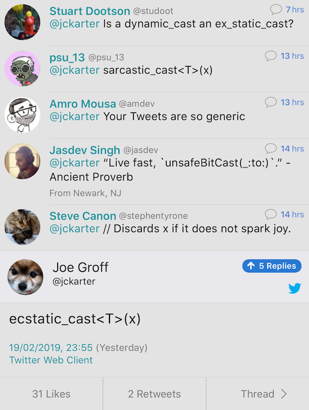

----

Concept-based interfaces, by Gianluca Delfino
---------------------------------------------

`Article <https://www.cppfiddler.com/2019/06/09/concept-based-interfaces/>`_ | `Code
<https://github.com/gianlucadelfino/cppfiddler/blob/master/conceptsInterfaces/src/main.cpp>`_ | `Godbolt
<https://godbolt.org/z/E8iHeS>`_ | `Reddit
<https://www.reddit.com/r/cpp/comments/c39asd/interfaces_with_c20_concepts/>`_

.. code:: c++

    template <typename T>
    concept Shape = requires(const T& t)
    {
        { t.area() } -> float;
    };

    template <typename T>
    struct Rectangle
    {
        Rectangle() { static_assert(Shape<T>); }
        float area() const;
        T base;
        T height;
    };

Concept-based interfaces, by Gianluca Delfino (cont.)
-----------------------------------------------------

`Alternative solution <https://www.reddit.com/r/cpp/comments/c39asd/interfaces_with_c20_concepts/erqsx1e>`_:

.. code:: c++

    template <typename T>
    concept Shape = requires(const T& t)
    {
        { t.area() } -> float;
    };

    template<class T>
    struct ModelsShape
    {
        ModelsShape() requires(Shape<T>) = default;
    };
 
    struct Circle: ModelsShape<Circle>
    {
        float area() const;
        float radius;
    };

Intel Data Parallel C++
-----------------------

* `FOSS Bytes <https://fossbytes.com/intel-developing-new-programming-language-data-parallel-c/>`_
* `Intel Announcement <https://newsroom.intel.com/news/intels-one-api-project-delivers-unified-programming-model-across-diverse-architectures/>`_
* `Reddit <https://www.reddit.com/r/cpp/comments/c4ses3/intel_announce_dpc/>`_

Part of Intel One API Project. Based on C++14 and SYCL. Open Source. Developer Beta in 2019 Q4.

Follow-up: std::function const correctness
------------------------------------------

.. code:: c++

    struct Callable {
        void operator()(){count++;}
        void operator()() const = delete;
        int count = 0;
    };

    void f()
    {
        Callable counter;
        std::function<void(void)> f = counter;
        f();
        const std::function<void(void) const> cf = counter;
        //                                    ^^
        // error: implicit instantiation of undefined template
        // 'std::__1::function<void () const>'
        //
        cf(); // Should not compile
    }

Follow-up: std::function movable callables
------------------------------------------

.. code:: c++

    void f()
    {
        std::unique_ptr<int> up;
        auto l=[up=std::move(up)](){};
        std::function<void(void)> f1=l; // Error
        std::function<void(void)> f2=std::move(l); // OK
    }

C++ pre-Cologne mailing
-----------------------

http://www.open-std.org/jtc1/sc22/wg21/docs/papers/2019/#mailing2019-06

https://www.reddit.com/r/cpp/comments/c3mup9/c_precologne_mailing/

Direction for ISO C++ (R3)
--------------------------

http://www.open-std.org/jtc1/sc22/wg21/docs/papers/2019/p0939r3.pdf

https://www.reddit.com/r/cpp/comments/c3mes0/direction_for_iso_c_r3/

Proposal: Enumerating Core Undefined Behaviour (P1705R0)
--------------------------------------------------------

http://www.open-std.org/jtc1/sc22/wg21/docs/papers/2019/p1705r0.html

https://www.reddit.com/r/cpp/comments/c4548m/a_proposal_to_enumerating_core_undefined_behavior/

bad_alloc is not out-of-memory!
-------------------------------

http://www.open-std.org/jtc1/sc22/wg21/docs/papers/2019/p1404r1.html

TL;DR: Throwing ``std::bad_alloc`` is not the same as "there is no heap space available" - in particular when dealing
with custom allocators.

In support of P1485 “Better keywords for coroutines”
----------------------------------------------------

https://quuxplusone.github.io/blog/2019/06/26/pro-p1485/

https://stackoverflow.com/a/44244451/1424877

    A function becomes a coroutine by having [a keyword such as ``co_await``, ``co_yield``, or ``co_return``] in its
    body. So [without close inspection of every line of the body] they are indistinguishable from functions.

http://www.open-std.org/jtc1/sc22/wg21/docs/papers/2019/p1485r1.html

https://www.reddit.com/r/cpp/comments/c5uu56/in_support_of_p1485_better_keywords_for_coroutines/

To boldly suggest an overall plan for C++23
-------------------------------------------

http://www.open-std.org/jtc1/sc22/wg21/docs/papers/2019/p0592r1.html

Must have:

* Library support for coroutines
* Executors
* Networking

Good to have:

* Reflection
* `Pattern matching <http://www.open-std.org/jtc1/sc22/wg21/docs/papers/2019/p1371r1.pdf>`_

Other Cologne papers
--------------------

* `P1662R0 Adding async RAII support to coroutines <http://www.open-std.org/jtc1/sc22/wg21/docs/papers/2019/p1662r0.pdf>`_
* `P1678R0 Callbacks and Composition <http://www.open-std.org/jtc1/sc22/wg21/docs/papers/2019/p1678r0.pdf>`_
  * https://github.com/ReactiveX/RxCpp
  * https://github.com/facebookresearch/pushmi
* `P1688R0 Towards a C++ Ecosystem Technical Report <http://www.open-std.org/jtc1/sc22/wg21/docs/papers/2019/p1688r0.html>`_
* `P1711R0 What to do about contracts? <http://www.open-std.org/jtc1/sc22/wg21/docs/papers/2019/p1711r0.pdf>`_
* `P1717R0 Compile­-time Metaprogramming in C++ <http://www.open-std.org/jtc1/sc22/wg21/docs/papers/2019/p1717r0.pdf>`_
* `P1729R0 Text Parsing <http://www.open-std.org/jtc1/sc22/wg21/docs/papers/2019/p1729r0.html>`_
  * https://github.com/eliaskosunen/scnlib (Apache-2.0) | `Reddit <https://www.reddit.com/r/cpp/comments/c4gyek/scnlib_scanf_for_modern_c/>`_

Twitter
-------

