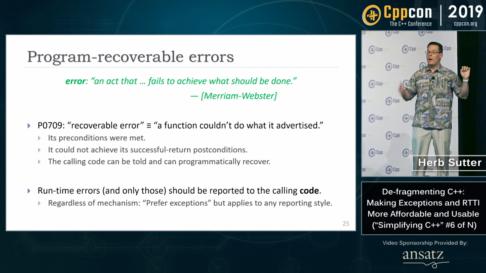
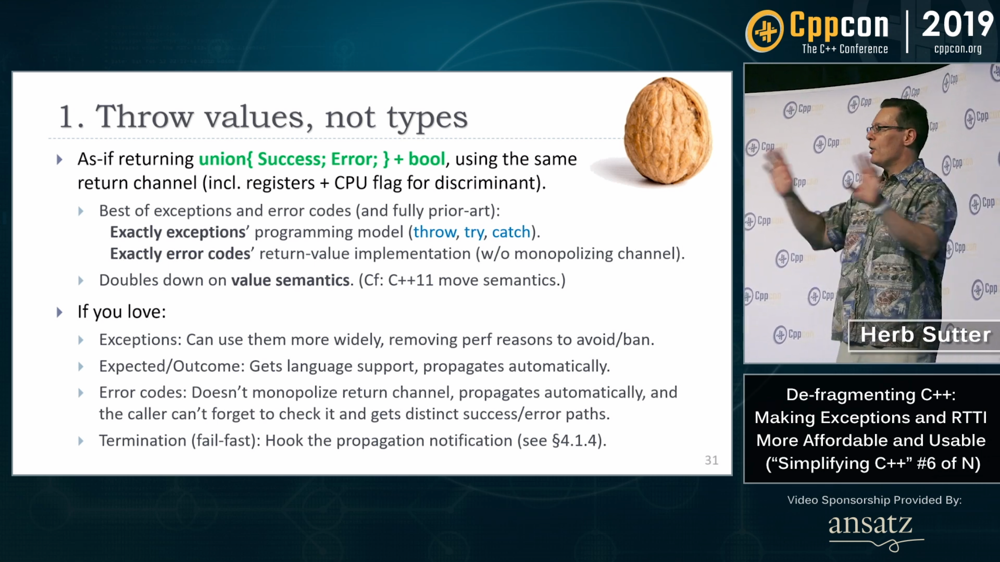
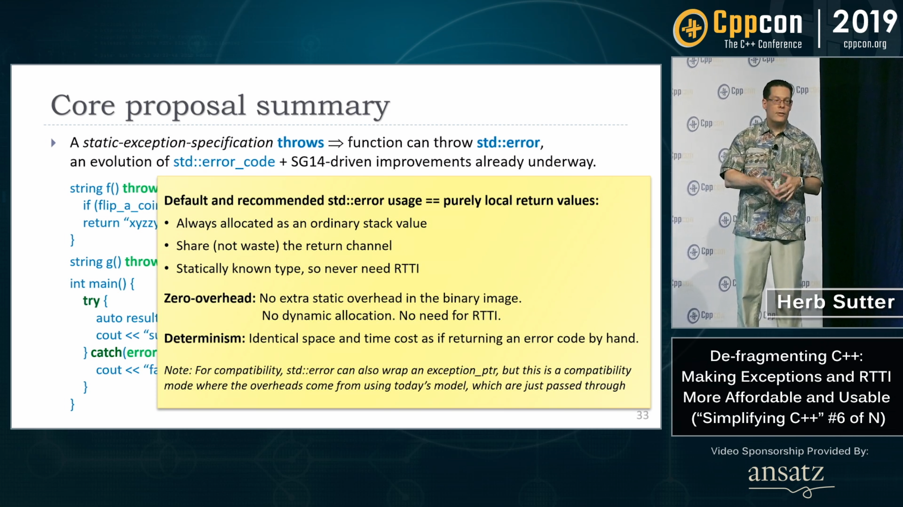

----

CppCon 2019 Trip Reports
========================

* `Matt Godbolt <https://xania.org/201909/cppcon-2019-trip-report>`_

CppCon 2019: Herb Sutter “De-fragmenting C++: Making Exceptions and RTTI More Affordable and Usable”
====================================================================================================

* Video: https://youtu.be/ARYP83yNAWk
  * Reddit: https://www.reddit.com/r/cpp/comments/d87plg/cppcon_2019_herb_sutter_defragmenting_c_making/

CppCon 2019: Herb Sutter “De-fragmenting C++: Making Exceptions and RTTI More Affordable and Usable”
====================================================================================================

.. image:: img/sutter-defrag-cpp19-1.png

CppCon 2019: Herb Sutter “De-fragmenting C++: Making Exceptions and RTTI More Affordable and Usable”
====================================================================================================

.. image:: img/sutter-defrag-cpp19-2.png

CppCon 2019: Herb Sutter “De-fragmenting C++: Making Exceptions and RTTI More Affordable and Usable”
====================================================================================================

CppCon 2019: Herb Sutter “De-fragmenting C++: Making Exceptions and RTTI More Affordable and Usable”
====================================================================================================

.. image:: img/sutter-defrag-cpp19-4.png

CppCon 2019: Herb Sutter “De-fragmenting C++: Making Exceptions and RTTI More Affordable and Usable”
====================================================================================================

.. image:: img/sutter-defrag-cpp19-5.png

CppCon 2019: Herb Sutter “De-fragmenting C++: Making Exceptions and RTTI More Affordable and Usable”
====================================================================================================

.. image:: img/sutter-defrag-cpp19-6.png

CppCon 2019: Herb Sutter “De-fragmenting C++: Making Exceptions and RTTI More Affordable and Usable”
====================================================================================================

.. image:: img/sutter-defrag-cpp19-7.png

CppCon 2019: Herb Sutter “De-fragmenting C++: Making Exceptions and RTTI More Affordable and Usable”
====================================================================================================

.. image:: img/sutter-defrag-cpp19-8.png

CppCon 2019: Herb Sutter “De-fragmenting C++: Making Exceptions and RTTI More Affordable and Usable”
====================================================================================================

CppCon 2019: Herb Sutter “De-fragmenting C++: Making Exceptions and RTTI More Affordable and Usable”
====================================================================================================

.. image:: img/sutter-defrag-cpp19-10.png

CppCon 2019: Herb Sutter “De-fragmenting C++: Making Exceptions and RTTI More Affordable and Usable”
====================================================================================================

CppCon 2019: Herb Sutter “De-fragmenting C++: Making Exceptions and RTTI More Affordable and Usable”
====================================================================================================

.. image:: img/sutter-defrag-cpp19-12.png

CppCon 2019: Herb Sutter “De-fragmenting C++: Making Exceptions and RTTI More Affordable and Usable”
====================================================================================================

.. image:: img/sutter-defrag-cpp19-13.png

CppCon 2019: Herb Sutter “De-fragmenting C++: Making Exceptions and RTTI More Affordable and Usable”
====================================================================================================

.. image:: img/sutter-defrag-cpp19-14.png

Arthur O'Dwyer "Thoughts on Herb Sutter’s CppCon keynote"
=========================================================

https://quuxplusone.github.io/blog/2019/09/24/thoughts-on-eh/

Reddit: https://www.reddit.com/r/cpp/comments/d8p08f/thoughts_on_herb_sutters_cppcon_keynote/

Twitter
=======

.. image:: img/tvaneerd-try-catch-opt.png
   :width: 90%

Cologne Trip Report
===================

https://www.silexica.com/news/iso_cpp_meeting_2019/

* `P1413, Deprecate std::aligned_storage and std::aligned_union <http://www.open-std.org/jtc1/sc22/wg21/docs/papers/2019/p1413r1.pdf>`_
* `P1609, C++ Should Support Just-in-Time Compilation <https://wg21.link/p1609>`_
* `P1727, Issues with current flat_map proposal <http://wg21.link/p1727r0>`_
* `P0443r10, A Unified Executors Proposal for C++ <http://wg21.link/p0443r10>`_
* `P1660r0, A Compromise Executor Design Sketch <http://wg21.link/p1660r0>`_
* `“C++ Tooling Ecosystem” Technical Report <https://wg21.link/P1688>`_
* `P1679r0, String Contains function <http://wg21.link/p1679r0>`_

Quote
=====

Fred Brooks:

    Much of the essence of building a program is in fact the debugging of the specification.
