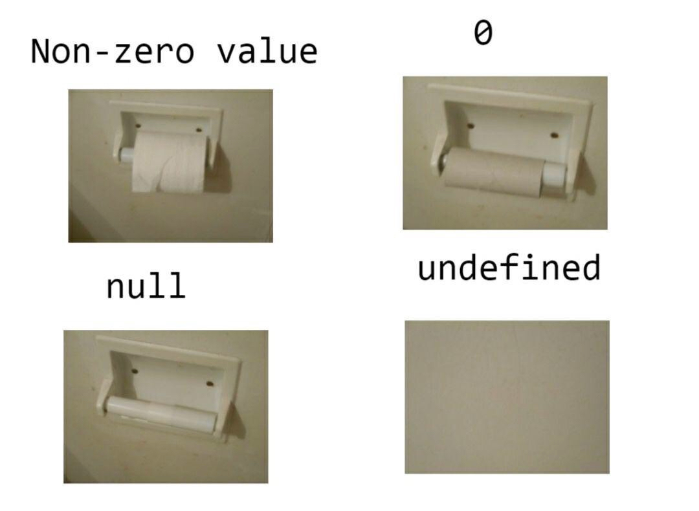

## 2020-04 WG21 mailing is out

* [Mailing](http://www.open-std.org/jtc1/sc22/wg21/docs/papers/2020/#mailing2020-04)
  * [Reddit](https://www.reddit.com/r/cpp/comments/g75uab/202004_wg21_mailing_is_out/)
  * [P1654R1 ABI breakage - summary of initial comments](http://www.open-std.org/jtc1/sc22/wg21/docs/papers/2020/p1654r1.html)
  * [P1949R3 C++ Identifier Syntax using Unicode Standard Annex 31](http://www.open-std.org/jtc1/sc22/wg21/docs/papers/2020/p1949r3.html)
  * [P2011R1 A pipeline-rewrite operator](http://www.open-std.org/jtc1/sc22/wg21/docs/papers/2020/p2011r1.html)
    * This paper proposes a new non-overloadable operator `|>` such that the expression `x |> f(y)`  evaluates exactly as `f(x, y)`. There would be no intermediate subexpression `f(y)`.

## How to Pass Class Member Functions to STL Algorithms

* [Article by Jonathan Boccara](https://www.fluentcpp.com/2020/03/06/how-to-pass-class-member-functions-to-stl-algorithms/)
* [Reddit](https://www.reddit.com/r/cpp/comments/febn53/fluent_c_how_to_pass_class_member_functions_to/)

[STL writes](https://www.reddit.com/r/cpp/comments/febn53/fluent_c_how_to_pass_class_member_functions_to/fjn009x?utm_source=share&utm_medium=web2x):

> `mem_fn` is less typing, but lambdas are higher performance (MSVC’s optimizer can’t see through `mem_fn`’s data member) and can handle overloaded/templated member functions much more easily.

## Parameter passing, by Raymond Chen, Microsoft

* [If you plan on keeping the parameter anyway, then there’s no need to have separate `T const&` and `T&&` overloads](https://devblogs.microsoft.com/oldnewthing/20200219-00/?p=103452)
* [If you’re not keeping the parameter, then you still want to have separate `T const&` and `T&&` overloads](https://devblogs.microsoft.com/oldnewthing/20200220-00/?p=103463)
* [Reddit](https://www.reddit.com/r/cpp/comments/f73g4a/if_youre_not_keeping_the_parameter_then_you_still/)

## Modern std::byte stream IO for C++

* [Reddit](https://www.reddit.com/r/cpp/comments/fe72kp/modern_stdbyte_stream_io_for_c/)
* [Paper PDF](https://github.com/Lyberta/cpp-io/raw/master/generated/Paper.pdf)
* [Paper GitHub](https://github.com/Lyberta/cpp-io)
* [Reference implementation](https://github.com/Lyberta/cpp-io-impl)

## High performance SQLite, PostgreSQL, MySQL sync & async drivers

* [Lithium](https://github.com/matt-42/lithium/tree/master/libraries/sql)
* [Reddit](https://www.reddit.com/r/cpp/comments/fn31cp/high_performance_sqlite_postgresql_mysql_sync/)

## MSVC Backend Updates in Visual Studio 2019 Version 16.5

* [Microsoft](https://devblogs.microsoft.com/cppblog/msvc-backend-updates-in-visual-studio-2019-version-16-5/)
* [Reddit](https://www.reddit.com/r/cpp/comments/g2snnt/msvc_backend_updates_in_visual_studio_2019/)

## Announcing full support for a C/C++ conformant preprocessor in MSVC

* [Microsoft](https://devblogs.microsoft.com/cppblog/announcing-full-support-for-a-c-c-conformant-preprocessor-in-msvc/)
* [Reddit](https://www.reddit.com/r/cpp/comments/g3srxt/announcing_full_support_for_a_cc_conformant/)

## GSL 3.0.0 Release

The Guidelines Support Library (GSL) contains functions and types that are suggested for use by the C++ Core Guidelines maintained by the Standard C++ Foundation.

* [Microsoft](https://devblogs.microsoft.com/cppblog/gsl-3-0-0-release/)
* [GitHub](https://github.com/microsoft/GSL/releases/tag/v3.0.0)

Changes:

* New implementations of `gsl::span` and `gsl::span_iterator` that align to the C++20 standard.
* Changes to contract violation behavior.
* Additional CMake support.
* Deprecation of `gsl::multi_span` and `gsl::strided_span`.

## DeepCode adds AI-based static code analysis support for C and C++

* [Announcement](https://medium.com/deepcode-ai/deepcode-adds-ai-based-static-code-analysis-support-for-c-and-c-83128ecee90f)
* [DeepCode](https://www.deepcode.ai)

## Modern CMake is like inheritance

* [Kuba Sejdak](https://kubasejdak.com/modern-cmake-is-like-inheritance)
* [Reddit](https://www.reddit.com/r/cpp/comments/erbkrk/modern_cmake_is_like_inheritance/)

> If only the CMake website featured such a beginner-friendly description as found here, people would switch over to Modern CMake much faster.

## CMake links

* [C++ Weekly: Intro to CMake](https://www.youtube.com/watch?v=HPMvU64RUTY)
* [C++Now 2017: Effective CMake](https://www.youtube.com/watch?v=bsXLMQ6WgIk)
* [CLion: Quick CMake Tutorial](https://www.jetbrains.com/help/clion/quick-cmake-tutorial.html)
* [Programming C++ with the "4 C's"](https://blog.conan.io/2016/05/10/Programming-C++-with-the-4-Cs-Clang,-CMake,-CLion-and-Conan.html)
* [Florent Castelli: Introduction to CMake](https://www.youtube.com/watch?v=jt3meXdP-QI)
* Siliceum CMake articles:
  * [Basics](https://www.siliceum.com/en/blog/post/cmake_01_cmake-basics)
  * [Customisation points](https://www.siliceum.com/en/blog/post/cmake_02_customization-points)

## On C++ exceptions

* [H. Dembinski](https://github.com/HDembinski/essays/blob/master/exceptions.md)
* [Reddit](https://www.reddit.com/r/cpp/comments/fw882x/things_i_learned_about_c_exceptions_from_boost/)

## 2 Lines Of Code and 3 C++17 Features - The overload Pattern

* [B. Filipek](https://www.bfilipek.com/2019/02/2lines3featuresoverload.html)
* [Reddit](https://www.reddit.com/r/cpp/comments/ep7gjm/2_lines_of_code_and_3_c17_features_the_overload/)

```c++
template<class... Ts> struct overload : Ts... { using Ts::operator()...; };
template<class... Ts> overload(Ts...) -> overload<Ts...>;
```

## C++ Compile Health Watchdog

* [Link](https://artificial-mind.net/projects/compile-health/)
* [Reddit](https://www.reddit.com/r/cpp/comments/g2acf3/c_compile_health_comparison_of_various_headers_on/)

## Activity Indicators for Modern C++

* [GitHub](https://github.com/p-ranav/indicators) (header-only, C++11, MIT)
* [Reddit](https://www.reddit.com/r/cpp/comments/e6he16/indicators_activity_indicators_for_modern_c/)

## Table Maker for Modern C++

* [GitHub](https://github.com/p-ranav/tabulate) (header-only, C++17, MIT)

## Makefiles from the ground up

* [Reddit](https://www.reddit.com/r/cpp/comments/ebik94/makefiles_from_the_ground_up/)
* [Makefiles from the ground up](https://avikdas.com/2019/11/18/makefiles-from-the-ground-up.html)
* [Makefiles for C/C++ projects](https://avikdas.com/2019/12/16/makefiles-for-c-cpp-projects.html)

## Why you use/don't use Boost

* [Why you don't use Boost](https://www.reddit.com/r/cpp/comments/gfowpq/why_you_dont_use_boost/)
* [Why you trust in Boost](https://www.reddit.com/r/cpp/comments/gfr46l/why_you_trust_in_boost/)
* [Proposal for an epoch-based organization of Boost libraries](https://github.com/joaquintides/boost_epoch/blob/master/README.md)
  * [Reddit](https://www.reddit.com/r/cpp/comments/giu6xg/proposal_for_an_epochbased_organization_of_boost/)

## Values

From Twitter:


