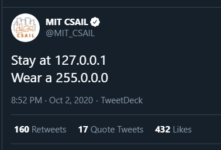

## September 2020 mailing

[September 2020 mailing](http://www.open-std.org/jtc1/sc22/wg21/docs/papers/2020/#mailing2020-09)

### Select papers

* [P2216R0 `std::format` improvements](http://www.open-std.org/jtc1/sc22/wg21/docs/papers/2020/p2216r0.html)
* [P2218R0 More flexible `optional::value_or()`](http://www.open-std.org/jtc1/sc22/wg21/docs/papers/2020/p2218r0.pdf)
* [P2219R0 Executors Issues Needing Resolution](http://www.open-std.org/jtc1/sc22/wg21/docs/papers/2020/p2219r0.pdf)

## Bjarne Stroustrup on "dead bodies of type theorists"

[Reddit](https://www.reddit.com/r/cpp/comments/j90thn/bjarne_stroustrup_on_dead_bodies_of_type_theorists/)

> I can't produce a link off the top of my head, but I remember Bjarne Stroustrup saying (on a few occasions, in a talk or a panel) that "non-type template parameters were introduced in C++ over the dead bodies of some type theorists" (quote from memory). This surprises me since types depending on values is a fundamental concept in Martin-Löf type theory which is older than C++. Does anyone have any knowledge on what feedback Bjarne Stroustrup received from type theorists?

## Clang 11 released

* [Release Notes](https://releases.llvm.org/11.0.0/tools/clang/docs/ReleaseNotes.html)
* [Reddit](https://www.reddit.com/r/cpp/comments/j9rq0y/clang_1100_is_out/)
* [LLVM 11.0.0 Released - Here are some highlights for C/C++ developers](https://tobias.hieta.se/llvm11-release)

## New C++ features in GCC 10

[RedHat](https://developers.redhat.com/blog/2020/09/24/new-c-features-in-gcc-10/) :: [Reddit](https://www.reddit.com/r/cpp/comments/iyvgge/new_c_features_in_gcc_10/)

* Concepts
* Coroutines
* Unevaluated inline-assembly in `constexpr` functions
* Warning on deprecated comma expression in array subscript expressions
* Static structured bindings
* `constinit`
* Deprecated `volatile`
* Conversions to arrays of unknown bound
* `constexpr` `new` and `dynamic_cast`
* The `[[nodiscard]]` attribute now supports an optional argument
* CTAD extensions
* Parenthesized initialization of aggregates
* **Modules are not yet supported, aiming for GCC 11**

## Do you enforce Core Guidelines and/or use the Guidelines Support Library (GSL)?

[Reddit](https://www.reddit.com/r/cpp/comments/j3752j/do_you_enforce_core_guidelines_andor_use_the/)

* [C++ Core Guidelines](https://isocpp.github.io/CppCoreGuidelines/CppCoreGuidelines)
* [Microsoft GSL](https://github.com/microsoft/GSL)
* [GSL-Lite](https://github.com/gsl-lite/gsl-lite)
* [How to use the Core Guidelines checker in Visual Studio](https://docs.microsoft.com/en-us/cpp/code-quality/using-the-cpp-core-guidelines-checkers?view=vs-2019)
* [Reddit comment on VS2019 checker usage](https://www.reddit.com/r/cpp/comments/j3752j/do_you_enforce_core_guidelines_andor_use_the/g7c7tsv/)
* [Thoughts on applying static analysis to a large code base (Reddit)](https://www.reddit.com/r/cpp/comments/e2r14c/thoughts_on_applying_static_analysis_to_a_large/)
  * [Thread on `[]` vs. `at()`, started by STL himself](https://www.reddit.com/r/cpp/comments/e2r14c/thoughts_on_applying_static_analysis_to_a_large/f8xdoet/)

## CppCon2020

* [Videos](https://www.youtube.com/playlist?list=PLHTh1InhhwT6VxYHtoWIvOup9gz0p95Qr)
* [Presentation materials (GitHub)](https://github.com/CppCon/CppCon2020)

## The Little Things: Speeding up C++ compilation

[Article by Martin Hořeňovský](https://codingnest.com/the-little-things-speeding-up-c-compilation/)

* [Reddit](https://www.reddit.com/r/cpp/comments/iwkcxp/some_sourcelevel_techniques_for_speeding_up_c/)
* [HackerNews](https://news.ycombinator.com/item?id=24537231)

### Techniques

* Include less
* Forward declarations (_hmmm_ -- _GD_)
* Explicit outlining
* Hidden friends
* Link less
* Extern template
* **Modules** (_not mentioned..._ -- _GD_)

### Tools

* [Include What You Use (IWYU)](https://include-what-you-use.org/)
* [Ninja](https://ninja-build.org)
* [LLD](https://lld.llvm.org)

## std::list::sort() vs. std::sort()

[Reddit](https://www.reddit.com/r/cpp/comments/j3fjh8/stdlistsort_vs_stdsort/)

* [Answer](https://www.reddit.com/r/cpp/comments/j3fjh8/stdlistsort_vs_stdsort/g7bvx7d/)

Scott Meyers, [Effective STL](https://www.aristeia.com/books.html):

> Item 44: Prefer member functions to algorithms with the same name.

## COVID-19 Public Service Announcement

