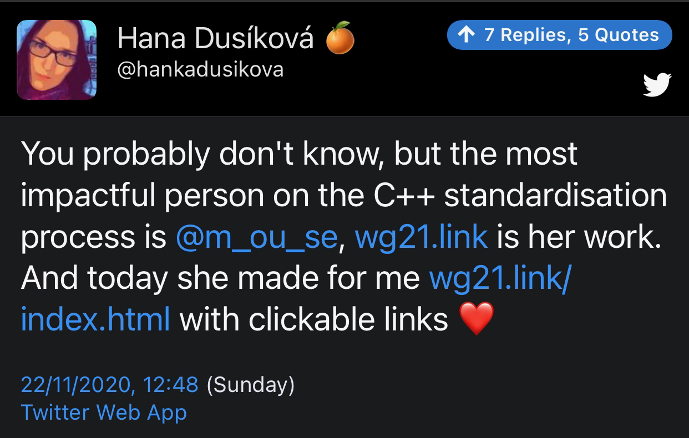

## Beman Dawes

{width=60%}

[Remembering Beman Dawes, by Bjarne Stroustrup and Herb Sutter](https://isocpp.org/blog/2020/12/remembering-beman-dawes)

[Reddit](https://www.reddit.com/r/cpp/comments/k58a2u/beman_dawes_has_passed_away_boost_filesystem_wg21/)

## WG21 Index

[https://wg21.link/index.html](https://wg21.link/index.html)



[twitter.com/m_ou_se](https://twitter.com/m_ou_se)

## Trip report: Autumn ISO C++ standards meeting (virtual)

* [Herb Sutter](https://herbsutter.com/2020/11/13/trip-report-autumn-iso-c-standards-meeting-virtual/)

## C++ programming language: How it became the invisible foundation for everything, and what's next

* [TechRepublic](https://www.techrepublic.com/article/c-programming-language-how-it-became-the-invisible-foundation-for-everything-and-whats-next/)

## Remember the Vasa and Mary Rose

{width=75%}

## C++ rules of initialization

* [N. Josuttis](http://josuttis.com/cpp/c++initialization.pdf)
  * [Reddit](https://www.reddit.com/r/cpp/comments/jvc8s9/a_summary_of_c_initialization_syntax_by_n_jossutis/)

## The C++ 20 initialization flowchart

* [Reddit](https://www.reddit.com/r/cpp/comments/k2cozv/the_c_20_initialization_flowchart/)
  * [GitHub](https://github.com/randomnetcat/cpp_initialization)
  * [PNG](http://randomcat.org/cpp_initialization/initialization.png)

## Detecting Uninitialized Variables in C++ with the Clang Static Analyzer

* [Acta Cybernetica](https://cyber.bibl.u-szeged.hu/index.php/actcybern/article/view/4100)
  * [PDF](https://cyber.bibl.u-szeged.hu/index.php/actcybern/article/view/4100/4014)
  * [Reddit](https://www.reddit.com/r/cpp/comments/k24p3v/detecting_uninitialized_variables_in_c_with_the/)

## The most evil C++ code

Reddit: [What was the most evil C++ code you have seen in a production environment?](https://www.reddit.com/r/cpp/comments/jvdwxp/what_was_the_most_evil_c_code_you_have_seen_in_a/)

## Error codes are far slower than exceptions

* [Lords of Tech](https://lordsoftech.com/programming/error-codes-are-far-slower-than-exceptions/)
  * [Reddit](https://www.reddit.com/r/cpp/comments/k08g89/in_realistic_scenarios_exceptions_are_a_much/)

## C#-like events in C++

[Reddit](https://www.reddit.com/r/cpp/comments/j2dfmi/clike_events_in_c/)

(Unrelated: [Variable name prefixes](https://www.reddit.com/r/cpp/comments/j2dfmi/clike_events_in_c/g75e65w/))

* [Code on Pastebin](https://pastebin.com/RjK6nLgM)
* [Signal-Slot library benchmarks](https://github.com/NoAvailableAlias/signal-slot-benchmarks/blob/master/results/benchmarks_msvc/README.md)
* [Boost.Signals2](https://www.boost.org/doc/libs/1_61_0/doc/html/signals2.html)

## Uses of immediately invoked function expressions (IIFE) in C++

* [Erik Rigtorp](https://rigtorp.se/iife/)
* [Jonathan Müller](https://foonathan.net/2020/10/iife-metaprogramming/)

## Overloading by Return Type in C++

[Philip Trettner](https://artificial-mind.net/blog/2020/10/10/return-type-overloading)

* [Reddit](https://www.reddit.com/r/cpp/comments/j94jd8/overloading_by_return_type_in_c/)

```cpp
struct to_string_t {
  std::string_view s;

  // int  from_string(std::string_view s);
  operator int() const;
  // bool from_string(std::string_view s);
  operator bool() const;
};

int i = to_string_t{"7"};
bool b = to_string_t{"true"};
```

## The Defold game engine code style

[Article](https://defold.com/2020/05/31/The-Defold-engine-code-style/)

### Code style

* C-like C++
* No classes (_huh?_ -- _GD_)
* No exceptions
* No STL
  * Custom containers
* Data ownership tracking
* C++98

(_It's the end of 2020, by the way. -- GD_)

## A Buffers Library for C++20

[Colby Pike](https://vector-of-bool.github.io/2020/08/29/buffers-1.html)

## vcpkg: Accelerate your team development environment with binary caching and manifests

[Microsoft](https://devblogs.microsoft.com/cppblog/vcpkg-accelerate-your-team-development-environment-with-binary-caching-and-manifests/)

* [Reddit](https://www.reddit.com/r/cpp/comments/ix090v/vcpkg_accelerate_your_team_development/)

### Related

[Why is it such an abysmal pain to use libraries in C++ compared to pretty much anything else?](https://www.reddit.com/r/cpp/comments/ix9n1u/why_is_it_such_an_abysmal_pain_to_use_libraries/)

## Raymond Chen on structured bindings

* [Structured binding may be the new hotness, but we’ll always have `std::tie`](https://devblogs.microsoft.com/oldnewthing/20200925-00/?p=104297)
  * [Reddit](https://www.reddit.com/r/cpp/comments/izr5pf/structured_binding_may_be_the_new_hotness_but/)
* [How to add C++ structured binding support to your own types](https://devblogs.microsoft.com/oldnewthing/20201015-00/?p=104369)
  * [Reddit](https://www.reddit.com/r/cpp/comments/jbwkiy/how_to_add_c_structured_binding_support_to_your/)

## Twitter on editor themes


