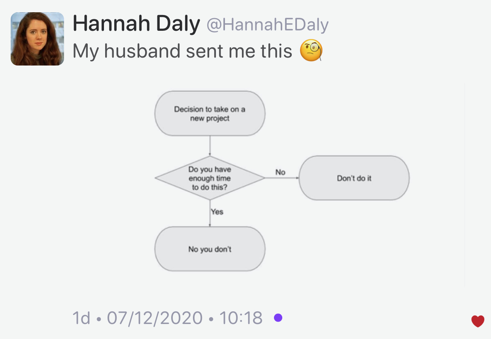

## Visual Studio 2019 update

* [Address Sanitizer for MSVC](https://devblogs.microsoft.com/cppblog/address-sanitizer-for-msvc-now-generally-available/)
  * [Reddit](https://www.reddit.com/r/cpp/comments/m13fej/address_sanitizer_for_msvc_now_generally/)
* [IntelliSense Improvements](https://devblogs.microsoft.com/cppblog/intellisense-improvements-in-visual-studio-2019/)
  * [Reddit](https://www.reddit.com/r/cpp/comments/m25grs/intellisense_improvements_in_visual_studio_2019_c/)

## How does Modern C++ (C++20) compare with Rust?

* [Reddit](https://www.reddit.com/r/cpp/comments/m0cxfn/how_does_modern_c_c20_compare_with_rust/)

> Even if you don't use Rust learn it. It will make you a better C++ programmer. [#](https://www.reddit.com/r/cpp/comments/m0cxfn/how_does_modern_c_c20_compare_with_rust/gq8klzq/)

## LIEF: Library to Instrument Executable Formats

This project aims to provide a cross platform library to parse, modify and abstract ELF, PE and MachO formats.

* [Website](https://lief.quarkslab.com/)
* [Docs](https://lief.quarkslab.com//doc/latest/)
* [GitHub](https://github.com/lief-project/LIEF) (Apache 2 Licence)
* [Profiling C++ code with Frida](https://lief.quarkslab.com/blog/2021-03-10-profiling-cpp-code-with-frida/)
  * [Frida website](https://frida.re/)
  * [Frida on GitHub](https://github.com/frida/frida)
  * [Frida Profiler](https://github.com/lief-project/frida-profiler)

## Enforcing Signatures On Templated Callbacks

* [Philippe M. Groarke](https://philippegroarke.com/posts/2021/enforcing_signatures_on_templated_callbacks/)
  * [Reddit](https://www.reddit.com/r/cpp/comments/lzx0ia/enforcing_signatures_on_templated_callbacks/)

## Improving Print Logging with Line Pos Info & Modern C++

* [B. Filipek](https://www.cppstories.com/2019/04/file-pos-log/)
  * [Reddit](https://www.cppstories.com/2019/04/file-pos-log/)

## The perils of the accidental C++ conversion constructor

* [Raymond Chen](https://devblogs.microsoft.com/oldnewthing/20210115-00/?p=104719)
  * [Reddit](https://www.reddit.com/r/cpp/comments/ky691b/the_perils_of_the_accidental_c_conversion/)

> No one hates C++ more than the people who love C++. [#](https://www.reddit.com/r/cpp/comments/ky691b/the_perils_of_the_accidental_c_conversion/gjfbed4/)

## Making Win32 APIs More Accessible to More Languages

* [Microsoft](https://blogs.windows.com/windowsdeveloper/2021/01/21/making-win32-apis-more-accessible-to-more-languages/)
  * [C++/WinRT](https://github.com/microsoft/cppwinrt)
  * [cppwin32](https://github.com/microsoft/cppwin32)

## C++ and game engines

* [Reddit](https://www.reddit.com/r/cpp/comments/l1vfz5/c_and_game_engines/)

> Hey, I started out with C++ 3 months ago and really love it. I already have some experience in Unity, but I'd like to use C++. Is there any engine you would recommend me to try out? I know about Unreal Engine but I can't find any good tutorials for how to use C++ with Unreal Engine. Is there any other option or a tutorial series or anything you could recommend me?

## Game developers, what compiler optimization setting do you use?

* [Reddit](https://www.reddit.com/r/cpp/comments/kyeid1/game_developers_what_compiler_optimization/?ref=share&ref_source=link)

## EnTT 3.6.0

Gaming meets modern C++ - a fast and reliable entity component system (ECS) and much more.

* [Announcement on Reddit](https://www.reddit.com/r/gamedev/comments/kttqxm/entt_v360_is_out_gaming_meets_modern_c/)
  * [GitHub](https://github.com/skypjack/entt) (C++17, MIT)

## Better CMake

* [Videos by Jefferson Amstutz](https://www.youtube.com/playlist?list=PL8i3OhJb4FNV10aIZ8oF0AA46HgA2ed8g)

## Solving differential equations with LLVM

Heyoka is a C++ library for the integration of ordinary differential equations (ODEs) via Taylor’s method. Notable features include:

* support for both double-precision and extended-precision floating-point types (80-bit and 28-bit),
* the ability to maintain machine precision accuracy over tens of billions of timesteps, batch mode integration to harness the power of modern SIMD instruction sets,
* a high-performance implementation of Taylor’s method based on automatic differentiation techniques and aggressive just-in-time compilation via LLVM.

### Links

* [GitHub](https://github.com/bluescarni/heyoka) (C++17, MPL-2.0)
  * [Docs](https://bluescarni.github.io/heyoka/)
  * [Reddit](https://www.reddit.com/r/cpp/comments/lkcjki/solving_differential_equations_with_llvm/?ref=share&ref_source=link)

## TTauri: modern retained-mode GUI library in C++20

* [GitHub](https://github.com/ttauri-project/ttauri)
  * [Reddit](https://www.reddit.com/r/cpp/comments/llq4z7/ttauri_modern_retainedmode_gui_library_in_c20/)

## C++20 Coroutines: sketching a minimal async framework

* [Jeremy Ong](https://www.jeremyong.com/cpp/2021/01/04/cpp20-coroutines-a-minimal-async-framework/)
  * [Reddit](https://www.reddit.com/r/cpp/comments/ll3mdw/c20_coroutines_sketching_a_minimal_async_framework/)

## New project flowchart

