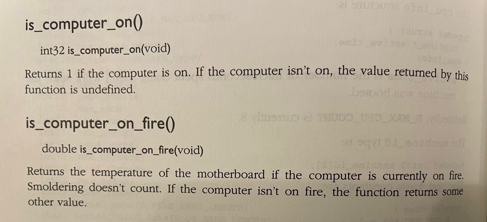
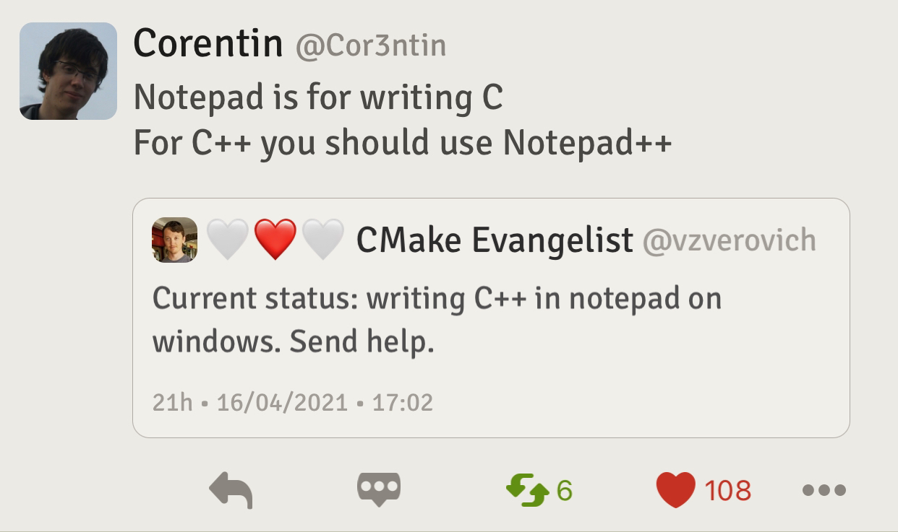

## C++23 progress

You can see all papers targeted for C++23 in the [cplusplus/papers issue tracker](https://github.com/cplusplus/papers/issues?q=is%3Aissue+is%3Aopen+label%3AC%2B%2B23).

### P2465 Standard Library Modules std and std.all

The paper [P2465](https://wg21.link/P2465) got voted on in November and achieved consensus in favour. The poll was:

> Send P2465R1 to Library Working Group for C++23, classified as a focus (bucket 1 item).

The results were:

| SF  | F   | N   | A   | SA  |
| --: | --: | --: | --: | --: |
|  20 |   9 |   1 |   2 |   1 |

I wonder who was strongly against it and what were their motives.

The paper is currently targeted for C++23, according to the [issue tracker](https://github.com/cplusplus/papers/issues/1115).

### P2300 `std::execution`

The paper [P2300](https://wg21.link/P2300) was discussed in a super-telecon over several days in December. It is currently [targeted for C++23](https://github.com/cplusplus/papers/issues/1054).

## mold: A Modern Linker

Now this is some big news. Yesterday the original author of the currently fastest **lld** LLVM linker, Rui Ueyama from Tokyo, has released the first stable and production-ready version 1.0 of [mold](https://github.com/rui314/mold), his modern linker. It's a drop-in replacement for existing Unix linkers, and it is _several times faster_ than lld.


[Mold benchmarks](https://github.com/rui314/mold/blob/main/docs/comparison.png) look completely crazy. Why is it so fast?

> One reason is because it simply uses faster algorithms and efficient data structures than other linkers do. The other reason is that the new linker is highly parallelized.

The plans are to release v2 for macOS and v3 for Windows. In the [Reddit thread](https://www.reddit.com/r/cpp/comments/rh3hue/mold_10_the_first_stable_and_productionready/) even [STL himself is excited](https://www.reddit.com/r/cpp/comments/rh3hue/mold_10_the_first_stable_and_productionready/hopyuje/).

I'm really looking forward to trying mold. It's not often that a new linker appears, don't mind the fastest one. Exciting times!


## Will Rust replace C++?

Here is a good example of the [Betteridge's Law](https://en.wikipedia.org/wiki/Betteridge's_law_of_headlines). A redditor [asks](https://www.reddit.com/r/cpp/comments/ravjxp/will_rust_replace_c/), "Will Rust replace C++?" The thread has some entertaining replies, of which the first one conforms to the above mentioned law of headlines:

> No.

There is a reply from a [rustacean](https://www.reddit.com/r/cpp/comments/ravjxp/will_rust_replace_c/hnktj2h/):

> In all seriousness, Rust isn't (nor does it pretend to be) a C++ killer. If anything, it's better positioned as an alternative to C, but even then it's not a threat so much as a complementary tool.

Another [reply](https://www.reddit.com/r/cpp/comments/ravjxp/will_rust_replace_c/hnktbqe/):

> You mean like every competitor to C/C++ successfully replaced it during the past 30-40 years? I don't think so.

And [another](https://www.reddit.com/r/cpp/comments/ravjxp/will_rust_replace_c/hnly9pf/):

> Without exceptions, templates, inheritance? Good luck with that.

More:

> Probably not.

And:

> I hope not.

Looks like C++ is safe from Rust for now. Phew!

## Choosing the appropriate container

A redditor involved in the `std::hive` paper posted [a brief and incomplete guide for selecting the appropriate container from inside/outside the C++ standard library, based on performance characteristics, functionality and benchmark results](https://www.reddit.com/r/cpp/comments/rearao/a_brief_and_incomplete_guide_for_selecting_the/). The benchmarks the guide is based on are:

- [`plf::colony`](https://plflib.org/colony.htm)
- [Hashmap Benchmarks](https://martin.ankerl.com/2019/04/01/hashmap-benchmarks-01-overview/)

The selection guide doesn't cover all scenarios, multithreading, or technical nuance (like CPU architecture differences). The guide is in the form of human-readable algorithm and looks like a very valuable resource.

## A curious compiler bug

A redditor [posted](https://www.reddit.com/r/cpp/comments/rg882y/gcc_msvc_and_icc_bug_virtual_base_destroyed_twice/) a code snippet which causes ICC, GCC and MSVC to generate incorrect code. In this contrived example the virtual base is destroyed twice instead of once because of an exception thrown from a constructor of a derived class that uses a delegating constructor.

The original poster and the commenters filed bugs for [MSVC](https://developercommunity.visualstudio.com/t/Virtual-base-destroyed-twice-when-an-exc/1612713), [GCC](https://gcc.gnu.org/bugzilla/show_bug.cgi?id=103711) and [ICC](https://www.reddit.com/r/cpp/comments/rg882y/gcc_msvc_and_icc_bug_virtual_base_destroyed_twice/hokagfy/).

Someone [asked](https://www.reddit.com/r/cpp/comments/rg882y/gcc_msvc_and_icc_bug_virtual_base_destroyed_twice/hoirvcl/) in the thread if there was a chance that this was an expected behaviour, given that only Clang generates "correct" code.

A useful [tidbit](https://www.reddit.com/r/cpp/comments/rg882y/gcc_msvc_and_icc_bug_virtual_base_destroyed_twice/hokcibp/) from the thread:

> The delegating constructor is significant because delegating constructors have a special behaviour: when the body of the target constructor has finished executing `(B(int))`, the `B` object is now considered fully constructed, so any exception thrown in the delegating constructor `(B())` will cause the destructor `(~B())` to be called.

## C++ links

Here is another [set of curated C++ and related links](https://github.com/MattPD/cpplinks) by MattPD. A huge hierarchical list of really interesting stuff there.

## PLF C++ Library

[This library](https://plflib.org) by Matt Bentley provides alternatives to Standard Library's containers and offers some additional utilities and data types, like `plf::colony` (which apparently is not coming to C++23 as `std::hive` -- maybe C++26 will get it). The library is header-only and comes under a permissive [ZLib licence](https://en.wikipedia.org/wiki/Zlib_License). It supports C++ standards from C++03 to C++20 and builds with MSVC, Clang and GCC. There are links to talks that the author gave at various C++ conferences, on the colony data type and how to design a faster list data structure.

## When to use PIMPL

[This post on Reddit](https://www.reddit.com/r/cpp/comments/r4atq2/when_to_use_the_pimpl_idiom/) is asking when to use the Pointer-to-Implementation ([PIMPL](https://en.cppreference.com/w/cpp/language/pimpl)) idiom. It used to be recommended to break dependencies between components in big systems, to decrease the number of files to recompile when a header changes, and to guard against ABI breaks to a degree. Reddit also says that a separate use case for PIMPL is to prevent inclusuon of the `Windows.h` header, or to act as a wrapper for a large library used in implementation that client code doesn't need to know about. It is also used widely in [Qt](https://code.woboq.org/qt5/).

However, if you are compiling everything together or use static linking, PIMPL doesn't add anything except an unnecessary level of indirection and heap allocation overhead. The added indirection can harm optimization. In large codebases it can have a detrimental effect of complicating class hierarchies and relationships.

There is one other thing that will make PIMPL obsolete: modules.

## Bad C++ habits

[A redditor asks](https://www.reddit.com/r/cpp/comments/r4kkcd/what_are_some_bad_c_habits_you_know_or_have_seen/) what bad habits developers have seen in C++ code. The replies include:

- Abuse of `std::shared_ptr` where every non-scalar function parameter is a `shared_ptr`. I'm working on several codebases like this. As they say, you can write Java in any language.
- [STL says](https://www.reddit.com/r/cpp/comments/r4kkcd/what_are_some_bad_c_habits_you_know_or_have_seen/hmhdvdd/):
  - Working around a bug without reporting it
  - Not commenting the workaround
  - Not citing the bug database and number in the comment
  - Not using a uniform pattern for such commented workarounds, so that they can be found and re-evaluated/removed later.
  - Good habits: In MSVC's STL, we use `// TRANSITION, BugDatabase-NNNN` for this purpose.

Of course, another redditor grepped the Microsoft STL code for this and found 667 instances!

Other bad habits included:

- overcomplicated logical expressions: `if (a == b) return true; else return false;`
- throwing exceptions on logic errors instead of terminating the program (this one occurs often in our code, and I'm not sure what to do in case a library must absolutely not crash even when the programmer screwed up).
- unnecessarily complex template frameworks without documentation
- unnecessarily complicated class hierarchies (I can physically feel this one)
- union-based type punning (legal in C, not so in C++)
- two-step class initialization (hello Symbian OS!)

[This redditor](https://www.reddit.com/r/cpp/comments/r4kkcd/what_are_some_bad_c_habits_you_know_or_have_seen/hmifyrk/) gives us some more:

- Using `unique_ptr` when a simple composition would suffice.
- Using `shared_ptr` when a `unique_ptr` would suffice.
- Mocking everything and creating a maintenance nightmare.
- Taking test coverage to an extreme, letting it damage the design and clarity just to make it unit-testable to an extreme degree (>%98 coverage).

[A sad reply](https://www.reddit.com/r/cpp/comments/r4kkcd/what_are_some_bad_c_habits_you_know_or_have_seen/hmipdzq/):

> You just described the code base I work on everyday!

[Another good list](https://www.reddit.com/r/cpp/comments/r4kkcd/what_are_some_bad_c_habits_you_know_or_have_seen/hmi7s8r/):

- C strings and arrays, with enough pointer arithmetic
- Macros everywhere instead of templates
- Disabling exceptions, but then not being consistent checking error returns codes from every call
- Using pointers instead of references for out parameters
- The new fashion of header only libraries
- Being too clever with SFINAE and template metaprogramming

Even more:

- Defining functions in headers (ouch, can feel that too!)
- Writing everything as a template, just because someone might one day want to customize something
- Using `std::endl` -- this adds unnecessary overhead to the already slow stream IO
- Not using the correct include format (`""` vs `<>`)
- Fixing problem code while failing to find and inform author (and reviewer), which deprives them of the opportunity to improve
- Minimal or no use of `const`
- Speculatively or unnecessarily defensive code (instead of assertive code)
- Including pointers in a typedef or macro (`using T = *myclass`) -- the 'handle' pattern. Looking at you, CUDA and OpenCascade
- Using `std::map` for anything but huge runtime maps
- Uninitialized variables

I'm sure everyone can add to this list. A large part of my work is dealing with technical debt, which is all the above and more.

## Apple Metal C++ bindings

Apple published [C++ bindings for Metal](https://developer.apple.com/metal/cpp/). [Metal](https://developer.apple.com/metal/) is Apple's high-level graphics and general acceleration API (Vulcan anyone?). I guess if you control both your hardware and software stacks, you'd want to have something of your own in the high-performance graphics department, so that you can tune your silicon accordingly. [And oh boy did they tune it](https://www.tomsguide.com/uk/news/macbook-pro-m1x-benchmarks-just-leaked-and-intel-should-be-scared) -- are you feeling OK Intel?

It's nice though that Apple now allows using C++ to write Metal code, given that their main language is Swift (Objective-C is legacy tech now).

## JUCE coding standards

For a sane set of coding standards you can refer to [JUCE](https://juce.com/discover/stories/coding-standards). I only skimmed the article, but nothing jumps out as obviously wrong, or weird, or outdated. A good point of reference if you must come up with your own (none of that Google or a random game company weirdness).

## How is `constexpr` implemented in the compiler

This is what a redditor [asked](https://www.reddit.com/r/cpp/comments/n8pq3z/how_is_constexpr_implemented_in_the_compiler/):

> I know that `constexpr` means that something can be evaluated at compile time. But this obviously means that `constexpr` code must somehow be interpreted, since it must be executed before compilation. Do modern C++ compilers come equipped with full blown C++ interpreters? Or is the `constexpr` code compiled to LLVM and then the resulting bytecode is run on a virtual machine?

The replies shed light on this:

> Not full-blown; it's a significantly-simplified subset of the runtime, and the AST can be reused.

> There's an experiment going on with Clang to replace the AST walking interpreter with a proper byte-code VM.

[Erich Keane](https://www.linkedin.com/in/erichkeane/) of Intel [says](https://www.reddit.com/r/cpp/comments/n8pq3z/how_is_constexpr_implemented_in_the_compiler/gxk8kcc/):

> It's not so much an interpreter as an AST evaluator. The constant evaluator happens after the code has been parsed/lexed/semantically analyzed, and formed into the Abstract Syntax Tree.

> When the compiler evaluates a constant expression, it goes through the AST and evaluates each node to get the answer.

> There IS an effort that is ongoing (though slowly) to replace this with an AST->byte-code type compilation, which can then just be evaluated immediately. My understanding is it is quite a bit faster, particularly when the same code is evaluated multiple times.

[Cling](https://root.cern/cling/) gets a [mention](https://www.reddit.com/r/cpp/comments/n8pq3z/how_is_constexpr_implemented_in_the_compiler/gxln7h2/):

> CERN has developed a C++ interpreter with a REPL called Cling. It is amazing. It is built on top of Clang and LLVM and JITs the code. There is even a Jupyter extension for it so you can use it in a notebook.

> It’s kind of a solution in search of a problem outside of CERN, but man, what a cool solution it is!

MSVC [didn't have an AST](https://devblogs.microsoft.com/cppblog/thoughts-on-the-visual-c-abstract-syntax-tree-ast/) until at least [2015](https://devblogs.microsoft.com/cppblog/rejuvenating-the-microsoft-cc-compiler/) and used a 'token stream' instead (this allowed compilation on some really memory-restricted machines). I'm wondering how that affected the processing of `constexpr` --- or did Microsoft switch to the new compiler front-end by the time `constexpr` support was added?

## Collin Moon's C++20 libraries

Collin Moon [posted](https://www.reddit.com/r/cpp/comments/rdtdf7/finally_sharing_my_c_stuff_small_metaprogramming/) links to his libraries on Reddit. These include a [nice and clean metaprogramming library](https://mooncollin.github.io/C_plus_plus-Helpful-Libraries/index.html) using modules, an [implementation](https://github.com/mooncollin/C_plus_plus-Helpful-Libraries/tree/master/src/cmoon/execution) of [P2300 `std::execution`](https://wg21.link/P2300), and a [testing library](https://github.com/mooncollin/C_plus_plus-Helpful-Libraries/tree/master/src/cmoon/test) that doesn't require macros but uses `std::source_location` instead. All libraries are well-documented, and the documentation looks really nice too.

## Compile Time Parser Generator

Polish C++ developer [Piotr Winter](https://peter-winter.com/) has released a new version of his [Compile Time Parser Generator](https://github.com/peter-winter/ctpg) library.

> C++ single header library which takes a language description as a C++ code and turns it into a LR1 table parser with a deterministic finite automaton lexical analyzer, all in compile time. What's more, the generated parser is actually itself capable of parsing at compile time. All it needs is a C++17 compiler!

The parsing rules are defined in a declarative functional way. This is the rule for parsing a list of integers:

```cpp
rules(
  list(number)
    >= to_int
  list(list, ',', number)
    >= [](int sum, char, const auto& n)
    { return sum + to_int(n); }
  )
```

The first rule `list(number)` indicates that the list nonterm can be parsed using a single number regex term. The second rule uses what's know as a left recurrence. In other words, a list can be parsed as a list followed by a comma and a number.

Patterns supported are character, string and regex.

> CTPG uses a LR(1) parser. This is short from left-to-right and 1 lookahead symbol.

The library offers optional verbose output and state machine diagnostics for debugging purposes. It requires C++17 and is distributed under MIT license.

## BeOS API



## Twitter


