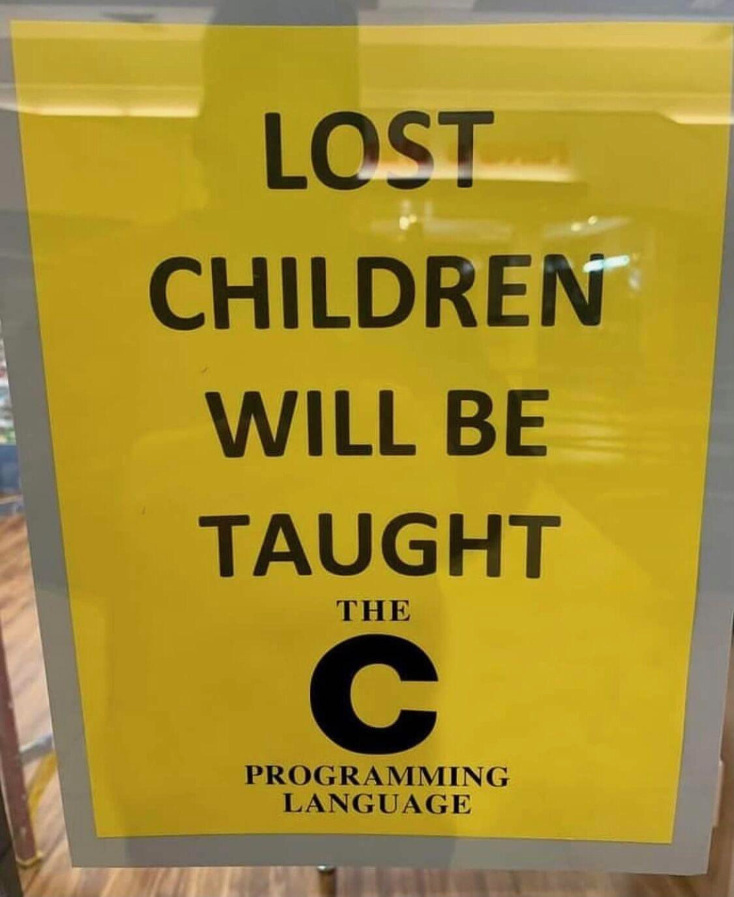

# Stash

## Video: Secure Programming Practices in C++ - NDC Security 2018

[YouTube](https://www.youtube.com/watch?v=Jh0G_A7iRac)

## Video: C++ Performance and Optimisation - NDC Techtown 2017

[YouTube](https://www.youtube.com/watch?v=eICYHA-eyXM)

## Video: Concurrent Programming in C++ - NDC Techtown 2017

[YouTube](https://www.youtube.com/watch?v=O7gUNNYjmsM)

## Video: CppCon 2016: "C++14 Reflections Without Macros, Markup nor External Tooling"

[YouTube](https://www.youtube.com/watch?v=abdeAew3gmQ)

## How to Adopt Modern C++17 into Your C++ Code, by Herb Sutter

* [YouTube](https://www.youtube.com/watch?v=UsrHQAzSXkA)

## Using metaprogramming for PIMPL idiom

* [Reddit](https://www.reddit.com/r/cpp/comments/7971ws/using_metaprogramming_for_pimpl_idiom/)

## Your own type predicate

* [Part 1](https://akrzemi1.wordpress.com/2017/12/02/your-own-type-predicate/)
* [Part 2](https://akrzemi1.wordpress.com/2017/12/20/a-friendly-type-predicate/)

## Tick: Trait introspection and concept creator for C++11

* [GitHub](https://github.com/pfultz2/Tick)

## Converting enum classes to strings and back in C++

* [Article](https://sheep.horse/2018/5/converting_enum_classes_to_strings_and_back_in_c++.html)
* [Reddit](https://www.reddit.com/r/cpp/comments/8hwk91/converting_enum_classes_to_strings_and_back_in_c/)

## Rvalues redefined

* [Post](https://akrzemi1.wordpress.com/2018/05/16/rvalues-redefined/)

## eventpp -- C++ library for event dispatcher and callback list

* [GitHub](https://github.com/wqking/eventpp)

## Multifunction: Generalization of `std::function` for any number of signatures

* [Code](https://github.com/fgoujeon/multifunction)

## How to Use Tag Dispatching In Your Code Effectively

* [Post](http://www.fluentcpp.com/2018/04/27/tag-dispatching/)

## Embracing Algorithms, by Dave Abrahams (WWDC2018)

* [Video](https://developer.apple.com/videos/play/wwdc2018/223/)
* [Reddit](https://www.reddit.com/r/cpp/comments/8pqtr1/dave_abrahams_on_embracing_algorithms_at_wwdc_2018/)

> I guess most of you know who Dave Abrahams is and what he has done in the C++ community. He
> switched gears a little and is now working at Apple focusing mostly on the development of the
> Swift language and its library. However, yesterday he gave an excellent talk at their Developer
> Conference entitled Embracing Algorithms, which IMHO is general enough to be of interest for C++
> developers as well. The link has a video of that 40 minutes long talk as well as the slides.

## Matt Godbolt (2017-06-27) - Memory and Caches

* [Video](https://www.youtube.com/watch?v=vDns3Um39l0)

## David Friberg - Three interesting minor features of C++20

* [YouTube](https://youtube.com/watch?v=4AQulaRJGMc)
* [Slides](https://dfrib.github.io/presentations/2020cw50_Gbgcpp_MinorCpp20Features.html)

## Video: Timur Doumler - How C++20 changes the way we write code - Meeting C++ 2020

* [YouTube](https://youtu.be/VK-16tpFQVI)
  * [Reddit](https://www.reddit.com/r/cpp/comments/lo4z89/timur_doumler_how_c20_changes_the_way_we_write/?ref=share&ref_source=link)

## A tutorial and take on C++20 coroutines

* [David Mazières](https://www.scs.stanford.edu/~dm/blog/c++-coroutines.html)
  * [Reddit](https://www.reddit.com/r/cpp/comments/lpo9qa/my_tutorial_and_take_on_c20_coroutines_david/)

## CppBooks

There is a huge list of C++ books on github, in a repo creatively called [CppBooks](https://github.com/yuchdev/CppBooks). Most are paid, but some are freely downloadable. A very useful resource.

## Using `constexpr` `std::vector` and `std::string`

[B. Filipek writes](https://www.cppstories.com/2021/constexpr-vecstr-cpp20/):

> `constexpr` started small in C++11 but then, with each Standard revision, improved considerably. In C++20, we can say that there’s a culmination point as you can even use `std::vector` and `std::string` in constant expressions!

In addition to this, in C++20 there are `constexpr` algorithms to use with vectors and strings.

For this to work, the C++ Committee had to allow the following changes:

- `constexpr` destructors;
- `constexpr` dynamic memory allocation;
- in-place construction using placement `new`;
- `constexpr` `try`/`catch` blocks;
- new type traits, like `pointer_traits` and `char_traits`.

The main limitation is that newly constructed vectors and strings cannot leave the `constexpr` function:

> Because vectors and strings use dynamic memory allocations, and currently, compilers don’t support so-called “non-transient” memory allocations. That would mean that the memory is allocated at compile-time but then somehow “passed” into runtime and deallocated. For now, we can use memory allocations in one constexpr context, and all of them must be deallocated before we leave the context/function.

## Bad practices in industrial projects

[The article](https://belaycpp.com/2021/06/01/a-list-of-bad-practices-commonly-seen-in-industrial-projects/) on the [Belay the C++](https://belaycpp.com/) blog discusses bad practices in C++ projects. The list includes:

- Overly long functions
- Creating classes unnecessarily (fully static classes instead of free functions in a namespace, publicly accessible classes instead of `struct`)
- Implementing undefiuned behaviour (the list of UB is too long)
- Comparing signed and unsigned integers
- Premature optimization
- Premature pessimization
- "Just-in-case" programming (_YAGNI_ - _You Ain't Gonna Need It_)

The [Reddit thread](https://www.reddit.com/r/cpp/comments/npq1tb/belay_the_c_a_list_of_bad_practices_commonly_seen/) has some more discussion on the raised topics. The winner is the [following comment](https://www.reddit.com/r/cpp/comments/npq1tb/belay_the_c_a_list_of_bad_practices_commonly_seen/h07iis0/):

> I'm a Python user and I have no clue what I just read but it sounds cool

Regarding classes vs. free functions, the user **staletic** replies to the author's point "_Why would you use class at all, where a namespace suffices?_" with this:

> To shut down ADL and not have users of your library "steal" function calls with their functions.

Apparently Bloomberg C++ guidelines prohibit free functions altogether because of this. Hmmm... Free functions, what a concept. Well, I'm sure they'll be OK with modules and contracts.

## FoundationDB

A seriously impressive open source distributed database from Apple:

> FoundationDB is a distributed database designed to handle large volumes of structured data across clusters of commodity servers. It organizes data as an ordered key-value store and employs ACID transactions for all operations.

FoundationDB links:

* [Home page](https://www.foundationdb.org/)
* [Code](https://github.com/apple/foundationdb) - Apache licence, portable C++, language bindings
* [Documentation](https://apple.github.io/foundationdb/)
* [Downloads](https://www.foundationdb.org/download/)
* [Forums](https://forums.foundationdb.org/)

[This](https://news.ycombinator.com/item?id=16877401) was the reaction on HackerNews to Apple open-sourcing FoundationDB after acquiring it:

> This is INCREDIBLE news! FoundationDB is the greatest piece of software I’ve ever worked on or used, and an amazing primitive for anybody who’s building distributed systems.

> The short version is that FDB is a massively scalable and fast transactional distributed database with some of the best testing and fault-tolerance on earth. It’s in widespread production use at Apple and several other major companies.

> But the really interesting part is that it provides an extremely efficient and low-level interface for any other system that needs to scalably store consistent state. At FoundationDB (the company) our initial push was to use this to write multiple different database frontends with different data models and query languages (a SQL database, a document database, etc.) which all stored their data in the same underlying system. A customer could then pick whichever one they wanted, or even pick a bunch of them and only have to worry about operating one distributed stateful thing.

The thread contains more interesting replies from developers and users of FoundationDB. If you are into databases, give it a read.

## Library: Neither

A functional implementation of Either in C++14 as a way to handle errors returned from functions. A bit like `std::expected` or Boost.Outcome with a functional interface.

[GitHub](https://github.com/LoopPerfect/neither) - MIT License, C++14, uses Buckaroo build system, which seems to use [TOML](https://github.com/toml-lang/toml) for its configuration files.

```cpp
// a function that throws, sometimes we can't avoid it...
auto unsafe = [] {
  if (true) {
    throw std::runtime_error("error");
  }
  return 1;
}

// let's lift the exception into the typesystem
Either<std::exception, int> e = Try<std::exception>(unsafe);

e.left()
  .map([](auto const& e) {
    return std::cerr << e.what() << '\n';
  }); // print error if available

int result = e
  .leftMap([](auto) { return 42; })
  // ^ do nothing with exception and map to 42
  .rightMap([](auto x) { return x * 2; })
  // ^ do further computation if value available
  .join()
  // ^ join both sides of either

ASSERT_TRUE(result == 42);
```

The motivation section talks about how bad C++ exceptions are (_they aren't actually_). If you can't or won't use exceptions in your code, I suppose you could check this library out.

## Video: C++ exception handling is a billion-dollar historical mistake

It's not often that I suggest you don't watch something, but here we are. This angry [video](https://youtu.be/I_ffAFzi-7M) lists the C++ things to not use: exceptions (which apparently were added to C++ by Hewlett Packard, which the author thinks doesn't exist anymore, and that makes him happy for some reason), iostream, filesystem, charconv, format, etc. Oh, and unique_ptr. Is there anything in C++ we can use?

The committee also gets its share of abuse. Stupid gamedevs, the lot of them.

But seriously, I wish I could unsee this video. It's 25 min of my life I'm not getting back. An uninformed incoherent angry rant full of abuse and expletives, with a title that suggests a serious opinion. Just no. Give it a pass.

## STL Visualizers on GitHub

The Visual Studio debugger has this neat feature where you can show the data in a custom human-readable format, defining the actual formatting rules in XML files called visualizers. Some 3rd-party libraries also have their own visualizers, often supported by the community (Eigen, Boost). And now Microsoft has [open-sourced all the STL visualizers on GitHub](https://github.com/microsoft/STL/blob/main/stl/debugger/STL.natvis), to allow everyone to contribute, so that they stay updated. They [announced it](https://devblogs.microsoft.com/cppblog/stl-visualizers-on-github/) on the Visual Studio blog.

Using visualizers has become much simpler in VS2017 and VS2019. Previously you had to put them in a certain directory in your Documents folder, of all places. Now you can include the XML files in a dummy container project in your solution, and the debugger will automagically use them to display the appropriate data. Very neat!

## Twitter

Someone saw a poster in a mall that read:

> Lost children will be taught the C programming language



## Bungie coding guidelines

This is a perfect analogy because, as we all know, Mona Lisa was famously painted by a bunch of guys with really good guidelines.

